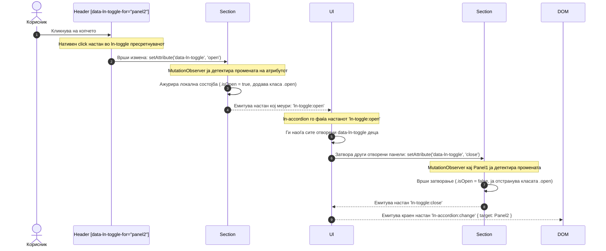
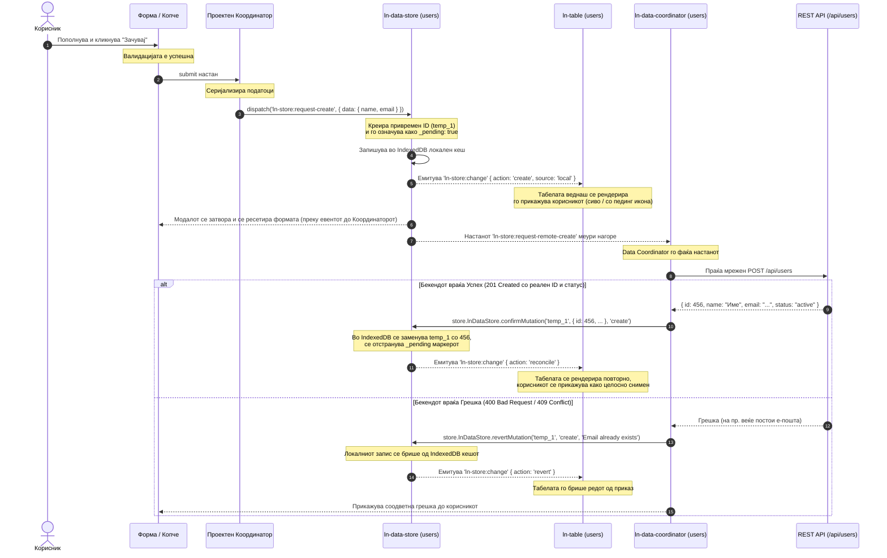

# 🏛️ Архитектура на ln-ashlar: Системски дијаграм и концепт

Овој документ дава детален и прегледен приказ на архитектурата на `ln-ashlar` библиотеката, нејзините слоеви на интеракција, како и филозофијата на координација на настани (events) и атрибути (attributes).

---

## 1. Концепт: Едноставни Компоненти наспроти Координатори

Во `ln-ashlar`, компонентите и интерактивноста се строго поделени според нивната одговорност:

1. **Едноставна Компонента (на пр. `ln-toggle`, `ln-modal`, `ln-toast`):**
   * Таа е изолирана и **работи сама за себе**.
   * Таа управува само со својата бинарна состојба во DOM-от (на пр. дали панелот е отворен или затворен) и сопствените ARIA атрибути за пристапност.
   * Таа е **целосно несвесна за постоењето на други такви компоненти** околу неа или за контекстот на страницата во која се наоѓа.
2. **Координатор (на пр. `ln-accordion` или Проектен Координатор во JS):**
   * Тој претставува „мозок“ кој **координира повеќе компоненти**.
   * Тој нема своја визуелна логика. Наместо тоа, ги слуша настаните (events) кои меурат од едноставните компоненти нагоре во DOM дрвото и применува одредени правила (на пр. „ако се отвори панел А, тогаш затвори го панелот Б“).
   * Комуникацијата ја врши преку менување на атрибутите на компонентите (`setAttribute`), оставајќи ги самите компоненти да си ја завршат својата внатрешна работа.

> [!IMPORTANT]
> **Филозофија на развој по проект:**  
> Развојниот инженер не треба да креира комплексни, тешки и монолитни компоненти. Сите внатрешни `ln-ashlar` компоненти се едноставни градивни блокови. Корисникот/програмерот е должен **сам да ја следи оваа логика и сам да си пишува сопствени координатори во својот проектен JS код** кои ќе ги поврзат овие блокови во комплексни кориснички текови.

---

## 2. Пример 1: Илустрација на Координатор (ln-toggle + ln-accordion)

Овој пример ја прикажува нативната координација каде `ln-accordion` делува како вграден координатор кој менаџира повеќе независни `ln-toggle` компоненти, обезбедувајќи дека само еден панел е отворен во даден момент.

### HTML Маркап (Реална структура)

```html
<!-- Контејнерот кој ја оркестрира координацијата -->
<ul data-ln-accordion id="my-accordion">
    <li>
        <!-- Копче кое го активира отворањето -->
        <header data-ln-toggle-for="panel1" class="accordion-header">
            Секција 1
        </header>
        <!-- Панелот чија состојба се менаџира -->
        <section id="panel1" data-ln-toggle="open" class="collapsible">
            <article class="collapsible-body">
                <p>Содржина за Секција 1.</p>
            </article>
        </section>
    </li>
    <li>
        <header data-ln-toggle-for="panel2" class="accordion-header">
            Секција 2
        </header>
        <section id="panel2" data-ln-toggle="close" class="collapsible">
            <article class="collapsible-body">
                <p>Содржина за Секција 2.</p>
            </article>
        </section>
    </li>
</ul>
```

### Дијаграм на текот на евенти и атрибути

Кога корисникот ќе кликне на Секција 2, се активира следниов циклус:



---

## 3. Пример 2: Комплексен Проектен Координатор (Креирање Корисник и Приказ во Табела)

Овој пример покажува како се врзуваат формата (`ln-form`), полето за валидација (`ln-validate`), базата/кеш продавницата (`ln-data-store`) и табелата (`ln-table`) преку ваш, проектно-специфичен **JS Координатор** кој ги применува правилата на проектот.

### HTML Маркап (Реална структура)

```html
<!-- Локален кеш продавница и API Конектор под капа на Data Coordinator -->
<div data-ln-data-coordinator="users" id="users-coordinator">
    <div data-ln-data-store="users" 
         data-ln-data-store-indexes="email" 
         data-ln-data-store-search-fields="name,email"
         id="users-store"></div>
    <div data-ln-api-connector="/api/users" id="users-connector"></div>
</div>

<!-- Модална форма за креирање корисник -->
<dialog id="user-modal" data-ln-modal>
    <form id="create-user-form" data-ln-form action="/api/users" method="POST">
        <div class="form-field">
            <label for="user-name">Име:</label>
            <input type="text" id="user-name" name="name" required data-ln-validate />
        </div>
        <div class="form-field">
            <label for="user-email">Е-пошта:</label>
            <input type="email" id="user-email" name="email" required data-ln-validate />
        </div>
        <button type="submit">Зачувај</button>
        <button type="button" data-ln-modal-close>Откажи</button>
    </form>
</dialog>

<!-- Динамичка табела која автоматски реагира на промени во продавницата "users" -->
<div data-ln-table="users" data-ln-table-source="users" id="users-table">
    <table>
        <thead>
            <tr>
                <th data-ln-table-col="name">Име</th>
                <th data-ln-table-col="email">Е-пошта</th>
                <th data-ln-table-col="status">Статус</th>
            </tr>
        </thead>
        <tbody data-ln-table-body>
            <!-- Тука се рендерираат редовите -->
        </tbody>
    </table>

    <template data-ln-template="users-row">
        <tr data-ln-table-row>
            <td>{{ name }}</td>
            <td>{{ email }}</td>
            <td data-ln-table-cell-attr="status_class:class">{{ status_label }}</td>
        </tr>
    </template>
</div>
```

### JS Координатор на Проектот (`app-coordinator.js`)

Проектниот координатор ги слуша настаните и ја врши потребната оркестрација:

```javascript
// app-coordinator.js
document.addEventListener('DOMContentLoaded', () => {
    const form = document.getElementById('create-user-form');
    const store = document.getElementById('users-store');
    const modal = document.getElementById('user-modal');

    // 1. Пресретнување на испраќањето на формата
    form.addEventListener('submit', (e) => {
        // Дозволи на вградениот ln-validate да ја провери валидноста.
        // Доколку има невалидни полиња во формата, прекини.
        if (!form.checkValidity()) return;

        e.preventDefault(); // Го спречуваме реалното релоадирање на страницата

        // Серијализација на податоците од формата
        const formData = new FormData(form);
        const userData = {
            name: formData.get('name'),
            email: formData.get('email')
        };

        // Испраќање на налог до локалниот Store за оптимистичко креирање
        store.dispatchEvent(new CustomEvent('ln-store:request-create', {
            detail: { data: userData }
        }));
    });

    // 2. Слушање за успешна локална мутација за затворање на модалот
    store.addEventListener('ln-store:change', (e) => {
        // Доколку имало успешна локална мутација од типот 'create' од локален извор
        if (e.detail.action === 'create' && e.detail.source === 'local') {
            // Преку координаторот му кажуваме на модалот да се затвори
            modal.setAttribute('data-ln-modal', 'close');
            form.reset(); // Ја ресетираме формата
        }
    });
});
```

### Дијаграм на секвенци на податоци (Data Sync Sequence)



---

## 4. Конвенција на Компоненти: Преку Атрибути до Логика (Attribute Bridge)

Односот на еден DOM елемент со неговата JS компонента секогаш е дефиниран преку атрибутот во HTML. 

* **Промена на состојба од надвор:** Секогаш преку `setAttribute(атрибут, вредност)`.
* **Внатрешна реакција:** `MutationObserver` ја слуша промената, повикува `_syncAttribute()`, ја менува внатрешната состојба во JS, додава/брише класи и емитува CustomEvent за да извести други заинтересирани страни.
