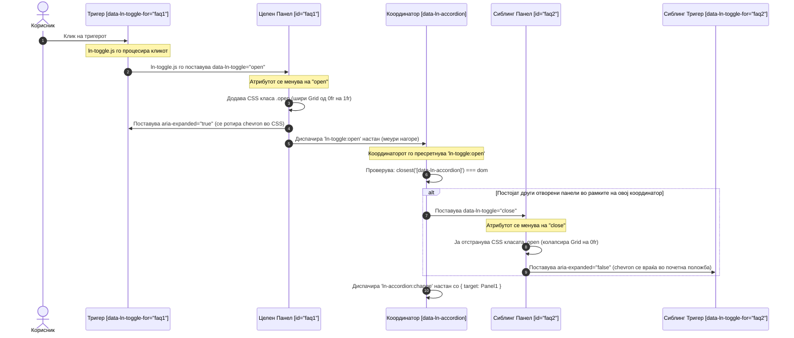

# 📂 ln-accordion

> **Класификација:** ⚙️ Координатор (Coordinator)

---

## 1. Заднинско дејство и одговорност

- **Краток опис:**
  `ln-accordion` е DOM координатор чија единствена одговорност е да обезбеди мутуална ексклузивност („single-open“ однесување) помеѓу група [`ln-toggle`](./ln-toggle.md) панели. Тој не управува директно со состојбата на поединечните панели, туку го прислушува настанот `ln-toggle:open` кој меури (bubbles) низ DOM дрвото и декларативно ги затвора сите останати отворени сиблинг-панели во истата аккордион група.

- **Ортогоналност (Што компонентата НЕ прави):**
  - **НЕ управува со поединечната бинарна состојба или ARIA атрибутите на тригерите** — поединечниот статус (`open`/`close`), ARIA атрибутите (`aria-expanded`, `aria-controls`) и тригер-врските се исклучива одговорност на `ln-toggle`.
  - **НЕ врши inline пресметки на висина или JS анимации** — мазното ширење и собирање е целосно препуштено на CSS преку Grid транзиција (`0fr` ↔ `1fr`) на класата `.collapsible`.
  - **НЕ манипулира со JS мемориски објекти за затворање** — координаторот комуницира со панелите исклучиво преку стандардниот HTML DOM атрибут, поставувајќи `el.setAttribute('data-ln-toggle', 'close')`.
  - **НЕ управува со перзистирање на состојбата во `localStorage`** — за реставрација и зачувување е задолжена компонентата [`ln-persist`](./ln-persist.md).
  - **НЕ се судира со гнездени (nested) аккордиони** — со помош на DOM проверката `closest('[data-ln-accordion]') === dom`, координаторот ја ограничува својата одговорност исклучиво на сопствениот DOM подграф.

---

## 2. Минимален HTML Маркап и Варијанти на Употреба

### Базен (Каноничен) HTML Маркап

Стандардниот приказ користи листа `<ul>` со атрибут `data-ln-accordion` како координациски обвивач:

```html
<ul data-ln-accordion id="faq-accordion">
    <li>
        <!-- Тригер за првиот панел -->
        <header data-ln-toggle-for="faq-panel-1" class="accordion-trigger">
            <span>Што е Ashlar?</span>
            <svg class="ln-icon ln-chevron" aria-hidden="true">
                <use href="#ln-arrow-down"></use>
            </svg>
        </header>
        <!-- Прв колапсирачки панел -->
        <section id="faq-panel-1" data-ln-toggle class="collapsible">
            <div class="collapsible-body">
                <p>Ashlar е лесен фронтенд систем изграден врз чисти веб-стандарди и изолирани компоненти.</p>
            </div>
        </section>
    </li>
    <li>
        <!-- Тригер за вториот панел -->
        <header data-ln-toggle-for="faq-panel-2" class="accordion-trigger">
            <span>Што е улогата на координаторот?</span>
            <svg class="ln-icon ln-chevron" aria-hidden="true">
                <use href="#ln-arrow-down"></use>
            </svg>
        </header>
        <!-- Втор колапсирачки панел -->
        <section id="faq-panel-2" data-ln-toggle class="collapsible">
            <div class="collapsible-body">
                <p>Координаторите ја набљудуваат состојбата на DOM-от и оркестрираат однесувања преку промена на атрибути.</p>
            </div>
        </section>
    </li>
</ul>
```

### Варијанти на Употреба

#### 1. Сите панели затворени по дифолт (All-Closed)
Доколку сакате аккордионот при иницијализација да биде целосно затворен, изоставете ја вредноста `"open"` од атрибутот `data-ln-toggle`:
```html
<section id="faq-panel-1" data-ln-toggle class="collapsible">...</section>
<section id="faq-panel-2" data-ln-toggle class="collapsible">...</section>
```

#### 2. Еден панел однапред отворен (Pre-Opened)
Поставете ја вредноста `data-ln-toggle="open"` на саканиот панел. При иницијализација, тој панел веднаш ќе биде отворен:
```html
<section id="faq-panel-1" data-ln-toggle="open" class="collapsible">...</section>
<section id="faq-panel-2" data-ln-toggle class="collapsible">...</section>
```

#### 3. Перзистиран аккордион (`data-ln-persist`)
Додадете го атрибутот `data-ln-persist` на соодветните панели за сочувување и реставрирање на состојбата во `localStorage`:
```html
<ul data-ln-accordion>
    <li>
        <header data-ln-toggle-for="faq-p1">Секција 1</header>
        <section id="faq-p1" data-ln-toggle data-ln-persist class="collapsible">
            <div class="collapsible-body"><p>Содржина...</p></div>
        </section>
    </li>
    <li>
        <header data-ln-toggle-for="faq-p2">Секција 2</header>
        <section id="faq-p2" data-ln-toggle data-ln-persist class="collapsible">
            <div class="collapsible-body"><p>Содржина...</p></div>
        </section>
    </li>
</ul>
```

#### 4. Гнездени (Nested) Аккордиони
Благодарение на проверката `closest('[data-ln-accordion]') !== dom`, внатрешен аккордион функционира независно од надворешниот:
```html
<ul data-ln-accordion id="outer-accordion">
    <li>
        <header data-ln-toggle-for="outer-p1">Надворешна категорија</header>
        <section id="outer-p1" data-ln-toggle class="collapsible">
            <div class="collapsible-body">
                <!-- Внатрешен координатор -->
                <ul data-ln-accordion id="inner-accordion">
                    <li>
                        <header data-ln-toggle-for="inner-p1">Под-категорија 1</header>
                        <section id="inner-p1" data-ln-toggle class="collapsible">
                            <div class="collapsible-body"><p>Под-содржина...</p></div>
                        </section>
                    </li>
                </ul>
            </div>
        </section>
    </li>
</ul>
```

#### 5. Мулти-отворен режим (Multi-Open Mode)
За овозможување на истовремено отворање повеќе панели, не е потребна промена во JS. Едноставно отстранете го атрибутот `data-ln-accordion` од обвивачот.

---

## 3. Декларативен API Договор (Атрибути и Настани)

### Атрибути и Инстанца API

| Атрибут / Својство | Тип / Локација | Стандардна вредност | Опис |
|---|---|---|---|
| `data-ln-accordion` | HTML атрибут (`<ul>`, `<div>`) | (нема) | Маркер кој го активира координаторот `ln-accordion` на родителскиот елемент. |
| `dom.lnAccordion` | JS Инстанца својство | `_component` object | Директен пристап до JS инстанцата на координаторот закачена на DOM елементот. |
| `dom.lnAccordion.destroy()` | JS Метод | (function) | Го чисти слушателот на настани, диспачира `ln-accordion:destroyed` и ја брише инстанцата од DOM елементот. |

### Настани (Events API)

| Настан | Насока | Целен Елемент (`event.target`) | `event.detail` | Опис |
|---|---|---|---|---|
| `ln-toggle:open` | Слуша | Панел / Тригер | `{ target: panelElement }` | Прифаќа настан што меури од `ln-toggle` кога одреден панел ќе се отвори. |
| `ln-accordion:change` | Емитува | Родителски обвивач (`data-ln-accordion`) | `{ target: openPanelElement }` | Се испалува откако координаторот ги затворил останатите сиблинг-панели и промената завршила. |
| `ln-accordion:destroyed` | Емитува | Родителски обвивач (`data-ln-accordion`) | `{ target: dom }` | Се испалува при повикување на методот `.destroy()`. |

#### Пример за слушање на настанот `ln-accordion:change`:
```js
const accordion = document.getElementById('faq-accordion');
accordion.addEventListener('ln-accordion:change', (event) => {
    console.log('Ново отворениот панел е:', event.detail.target);
});
```

---

## 4. CSS Стилизирање и Поведенски Концепт

### SCSS Миксини и Селектори

Библиотеката обезбедува SCSS миксин `@mixin accordion` во `scss/config/mixins/_accordion.scss` и каноничен селектор `[data-ln-accordion]` во `scss/components/_accordion.scss`.

#### 1. Општ Миксин (`scss/config/mixins/_accordion.scss`):
```scss
@mixin accordion {
	@include border;
	--radius: var(--radius-lg);
	border-radius: var(--radius);
	overflow: hidden;

	> li {
		border-block-end: var(--border-block-end, var(--border-width) solid var(--color-border));

		&:last-child { border-block-end: none; }

		// Trigger
		> [data-ln-toggle-for] {
			@include flex;
			@include justify-between;
			@include items-center;
			--padding-y: var(--size-md);
			--padding-x: var(--size-md);
			padding: var(--padding-y) var(--padding-x);
			@include cursor-pointer;
		}
	}
}
```

#### 2. Каноничен Стил за Декларативен Атрибут (`scss/components/_accordion.scss`):
```scss
[data-ln-accordion] {
	@include accordion;

	> li {
		> [data-ln-toggle-for] {
			@include font-medium;
			color: var(--color-fg);
			@include transition;

			&:hover {
				--color-bg: var(--bg-sunken);
				background: var(--color-bg);
			}

			.ln-chevron {
				--color-fg: var(--fg-subtle);
				color: var(--color-fg);
			}
		}
	}
}
```

### Поведенски Концепт

1. **Декларативна Оркестрација:** Координаторот не повикува приватни JS методи на `ln-toggle`. Наместо тоа, за секој сиблинг-панел кој е отворен (`data-ln-toggle="open"`), координаторот извршува:
   ```js
   el.setAttribute('data-ln-toggle', 'close');
   ```
2. **Event Bubbling & Scoping:** Координаторот се потпира на меурињето (bubbling) на `ln-toggle:open` настанот. За да не затвора надворешни или соседни панели во сложени распореди, секогаш пресметува:
   ```js
   if (e.detail.target.closest('[data-ln-accordion]') !== dom) return;
   ```
3. **Визуелна Изолација:** Анимацијата на содржината е исклучиво во надлежност на `.collapsible` (управувана од `ln-toggle` и CSS Grid). Координаторот нема ниту една линија код што менува CSS класи или inline styles.

---

## 5. Пристапност (ARIA) и Чести Грешки

### ARIA и Тастатурна Навигација

- **Делегирана ARIA Одговорност:** Координаторот `ln-accordion` не модифицира ARIA атрибути директно. Пристапноста се одржува од `ln-toggle`:
  - Тригерот добива `aria-expanded="true"` кога соодветниот панел е отворен, односно `aria-expanded="false"` кога е затворен.
  - Поврзувањето меѓу тригерот и панелот се остварува со `aria-controls="panel-id"`.
- **Тастатура:** Корисниците можат флуидно да навигираат низ сите тригери во аккордионот користејќи `Tab` / `Shift+Tab`, и да ги активираат/деактивираат со `Enter` или `Space`.

### Анти-патерни (Common Pitfalls)

#### 1. Поставување на Padding директно на `.collapsible` панелот
Ако на елементот со класа `.collapsible` му се постави padding, тој не може целосно да се собере до `0px` бидејќи padding димензиите не се дел од `grid-template-rows` пресметката на прелистувачот.
- ❌ **Грешка:** `section.collapsible { padding: 1rem; }`
- ✅ **Решение:** Поставете нула padding на `.collapsible`, а внатрешните растојанија дефинирајте ги на неговото дете `.collapsible-body`.

#### 2. Заборавање на `id` атрибутот на панелот
Изоставување на `id` на некој од колапсирачките панели.
- ❌ **Грешка:** `<section data-ln-toggle class="collapsible">...</section>`
- ✅ **Решение:** Секој `data-ln-toggle` панел мора да има уникатен `id`, за `data-ln-toggle-for` тригерот и ARIA поврзувањето да можат да го идентификуваат.

#### 3. Дуплирање на одговорности на еден елемент
Поставување на `data-ln-toggle` и `data-ln-toggle-for` на ист HTML елемент.
- ❌ **Грешка:** `<button data-ln-toggle data-ln-toggle-for="panel-1">Trigger</button>`
- ✅ **Решение:** Секогаш раздвојувајте го тригерот (`data-ln-toggle-for`) од содржинскиот панел (`data-ln-toggle`).

#### 4. Директно повикување на JS методи за затворање
Обид рачно да се менуваат мемориски JS состојби наместо декларативна промена на HTML атрибутите.
- ❌ **Грешка:** Повикување на приватни методи на компонентите.
- ✅ **Решение:** Секогаш користете `panelEl.setAttribute('data-ln-toggle', 'close')`.

---

## 6. Дијаграм на Текот и Животен Циклус

Следниот Mermaid sequence diagram ја прикажува целосната интеракција помеѓу корисникот, тригерот, целниот панел, координаторот `ln-accordion` и сиблинг-панелите:



---

## 7. Поврзани Компоненти

- **[ln-toggle](./ln-toggle.md)** — Едноставна бинарна компонента која управува со поединечната состојба, ARIA атрибутите и колапсирањето на секој панел.
- **[ln-persist](./ln-persist.md)** — Заедничка функционалност за перзистирање на состојбата во `localStorage`.
- **[Изворен JavaScript код](../../js/ln-accordion/src/ln-accordion.js)** — Примарна JS имплементација на координаторот `ln-accordion`.
- **[Изворен SCSS Стил](../../scss/components/_accordion.scss)** — Канонични стилови за `[data-ln-accordion]`.
- **[Изворен SCSS Миксин](../../scss/config/mixins/_accordion.scss)** — Општ миксин `@mixin accordion`.
