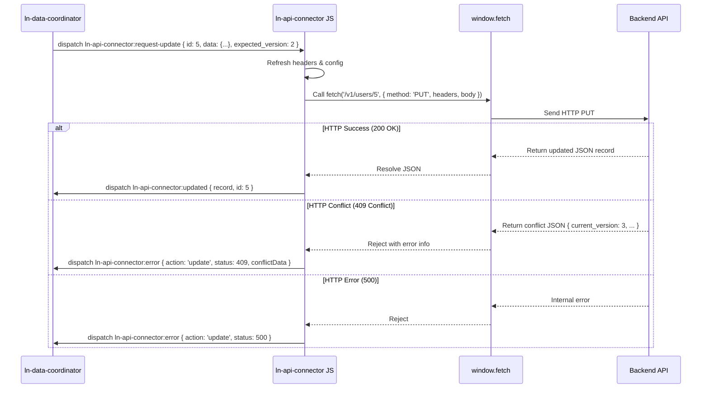

# 🔗 ln-api-connector
> **Класификација:** 🌐 Инфраструктурна компонента (Layer 1 - Network/API Client)

---

## 1. Заднинско дејство и одговорност
`ln-api-connector` (со соодветен алијас `lnConnector`) е раздвоена инфраструктурна компонента одговорна за извршување на стандардни RESTful барања кон бекенд сервери преку мрежа.

*   **Главна Одговорност:** Како изолиран мрежен драјвер (REST Client), компонентата нема сопствено познавање за состојбата на формата, табелата или локалниот IndexedDB кеш. Нејзината единствена задача е да прими насочен CustomEvent за мрежна операција, да ја преточи во соодветен `fetch()` повик со правилни параметри и на крај да го емитува одговорот или грешката назад во DOM стеблото.
*   **RESTful операциски стандард:** Поддржува 5 примарни мрежни дејства:
    *   **Sync / FetchDelta:** Преземање разлика на податоци (`GET` со параметар `since` за делта синхронизација; `since` е опционален — без него се влече целиот сет).
    *   **Create:** Креирање нов запис (`POST`).
    *   **Update:** Измена на постоечки запис (`PUT` со поддршка за верзионирање `expected_version`).
    *   **Delete:** Бришење запис (`DELETE`).
    *   **Bulk Delete:** Масовно бришење на низа записи (`DELETE` до `/bulk-delete` патека).
*   **Заглавија (Headers):** Секое барање автоматски носи `Content-Type: application/json`, `Accept: application/json` и специјалното заглавие `X-LN-Response: data` — сигнал до бекендот дека се очекува чист JSON одговор без HTML декор. Врз нив се спојуваат заглавијата од `data-ln-api-headers`. Компонентата **не** додава CSRF токен ниту авторизациско заглавие сама од себе — авторизацијата е одговорност на развивачот (најдобро преку `HttpOnly` колачиња, види §5). Ако во `data-ln-api-headers` се детектира `Authorization` / `Bearer` / `Basic`, компонентата емитува `console.warn` безбедносно предупредување.
*   **Credentials:** `fetch()` повиците се хардкодирани на `credentials: 'same-origin'` и тоа не е конфигурабилно. Колачињата се испраќаат само кон истиот origin — cookie-базирана авторизација **не работи** кон cross-origin API (види §5, честа грешка 3).

---

## 2. Минимален HTML Маркап и Варијанти на Употреба

Се поставува како невидлив елемент во рамките на страницата и ги дефинира своите мрежни патеки во DOM атрибутите.

```html
<!-- Конфигурација за мрежен конектор на Продукти (same-origin API) -->
<div data-ln-api-connector="products"
     data-ln-api-base-url=""
     data-ln-api-path="/api/v1/products"
     data-ln-api-headers="X-Client-Type: Web, Accept-Language: mk"
     id="products-connector">
</div>
```

> Празен `data-ln-api-base-url` значи барања кон сопствениот origin. Cross-origin base URL (на пр. `https://api.site.com`) е возможен, но тогаш cookie авторизацијата отпаѓа поради `credentials: 'same-origin'` (§1).

---

## 3. Декларативен API Договор (Атрибути и Настани)

| Атрибут | Тип | Опис |
| :--- | :--- | :--- |
| `data-ln-api-connector` | `String` | Го активира компонентот и го дефинира името на инстанцата. |
| `data-ln-api-base-url` | `String` | Основната URL адреса на бекендот. Празна вредност = сопствениот origin. |
| `data-ln-api-path` | `String` | Рутата на ресурсот на серверот (на пр. `/v1/users`). |
| `data-ln-api-headers` | `String` | Листа на дополнителни HTTP заглавија во формат `Клуч:Вредност, Клуч2:Вредност2`. |

**Жива реконфигурација:** сите три конфигурациски атрибути (`base-url`, `path`, `headers`) се набљудуваат во живо — промена на атрибутот во DOM автоматски повикува `refreshConfig()` и емитува `ln-api-connector:config-changed`. Корисно за менување на base URL при login или tenant switch, без реиницијализација.

**JS API:** инстанцата е достапна на елементот како `el.lnApiConnector` (алијас `el.lnConnector`) и ги нуди истите операции како Promise методи: `fetchDelta(since)`, `create(payload)`, `update(id, payload, expectedVersion)`, `delete(id)`, `bulkDelete(ids)`, плус `refreshConfig()` и `destroy()`. Настанскиот API подолу е тенка обвивка околу нив.

### DOM Барања кон Конекторот (Слуша)
*За компатибилност, компонентата реагира на настани испратени со префикси `ln-api-connector:...` и `ln-rest-connector:...`*
| Настан | Payload `e.detail` | Опис |
| :--- | :--- | :--- |
| `:request-sync` / `:request-fetch` | `{ since?: Timestamp }` | Барање за вчитување на промените од одреден маркер; без `since` се влече сè. |
| `:request-create` | `{ data: Object, tempId: String }` | Барање за креирање нов запис. |
| `:request-update` | `{ id: ID, data: Object, expected_version: Int }` | Барање за измена на запис со одредена верзија. |
| `:request-delete` | `{ id: ID }` | Барање за бришење поединечен запис. |
| `:request-bulk-delete` | `{ ids: Array }` | Барање за масовно бришење. |

### Одговори кон DOM (Емитува)
| Настан | Payload `e.detail` | Опис |
| :--- | :--- | :--- |
| `ln-api-connector:fetched` | `{ data, since }` | Вратени податоци од делта синхронизација. |
| `ln-api-connector:created` | `{ record, tempId }` | Успешно креиран запис, го враќа серверот заедно со привременото ID. |
| `ln-api-connector:updated` | `{ record, id }` | Успешно ажуриран запис. |
| `ln-api-connector:deleted` | `{ response, id }` | Успешно избришан запис на серверот. |
| `ln-api-connector:bulk-deleted` | `{ response, ids }` | Успешно избришани низа на записи. |
| `ln-api-connector:error` | `{ action, error, status, data, ...контекст }` | Грешка при комуникација со серверот (детали подолу). |
| `ln-api-connector:config-changed` | `{ baseUrl, path, headers }` | Емитуван при секој `refreshConfig()` — иницијално и при жива промена на атрибут. |
| `ln-api-connector:destroyed` | `{ target }` | Емитуван при `destroy()` на инстанцата. |

**Структура на `:error`:** покрај заедничките полиња `action`, `error` (порака), `status` и `data` (JSON телото на грешката, ако постои), payload-от носи **контекстуално поле за корелација, зависно од акцијата**: `since` (sync), `tempId` (create), `id` (update и delete), `ids` (bulk-delete). Полето `conflictData` постои **само за `update`** и е не-null единствено при HTTP 409 — тогаш ја содржи моменталната серверска верзија на записот. Мрежна грешка без HTTP одговор (fetch reject) дава `status: 0`.

**Успешни одговори:** HTTP 204 (No Content) се разрешува како `null` — при бришење `response` ќе биде `null` ако серверот не враќа тело.

---

## 4. CSS Стилизирање и Поведенски Концепт
Како логичка компонента без кориснички интерфејс (headless component), `ln-api-connector` нема визуелни стилови.

---

## 5. Пристапност (ARIA) и Чести Грешки
*   **Пристапност:** Бидејќи нема директна интеракција со корисникот и нема визуелен приказ, ARIA улогите и фокусот не се применуваат.
*   **Честа грешка 1 (Security Hazard):** Складирање на Bearer авторизациски токени директно во `data-ln-api-headers` атрибутот во HTML. Доколку се направи ова, секоја XSS ранливост на страницата ќе овозможи кражба на токенот. Секогаш претпочитајте авторизација со `HttpOnly` колачиња (cookies) или користење на Backend Proxy Gateway. Компонентата ова активно го детектира и предупредува во конзола.
*   **Честа грешка 2 (Неисправен HTTP 409 третман):** Игнорирање на `conflictData` при грешки за измени. За правилно разрешување на конфликти при истовремено пишување на двајца корисници, серверот мора да врати статус 409 и моменталната верзија на објектот, за конекторот да може правилно да ја проследи назад во системот.
*   **Честа грешка 3 (Cross-origin + cookie auth):** Насочување на `data-ln-api-base-url` кон друг origin со очекување дека сесиските колачиња ќе патуваат. Нема да патуваат — `credentials` е фиксирано на `same-origin`. За cross-origin API користете Backend Proxy Gateway на сопствениот origin.

---

## 6. Дијаграм на Текот и Животен Циклус

Овој дијаграм го илустрира циклусот на обработка на барање за измена во базата.



---

## 7. Поврзани Компоненти
*   **`ln-data-coordinator`**: Главниот Layer 2 медијатор кој слуша промени од локалниот IndexedDB склад и ги проследува во конекторот за испраќање кон серверот.
*   **`ln-http`**: Доколку `ln-http` е вчитан на страницата, тој глобално го обвиткува `window.fetch`, па и повиците на конекторот минуваат низ неговиот заштитен и дедупликациски слој. Без вчитан `ln-http`, конекторот работи со чист нативен `fetch` — обвивката не е задолжителна зависност.
