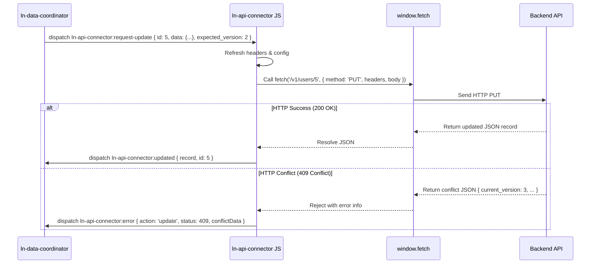

# 🔗 ln-api-connector
> **Класификација:** 🌐 Инфраструктурна компонента (Layer 1 - Network/API Client)

---

## 1. Заднинско дејство и одговорност
`ln-api-connector` (со соодветен алијас `lnConnector`) е раздвоена инфраструктурна компонента дефинирана во [`js/ln-api-connector/src/ln-api-connector.js`](../../js/ln-api-connector/src/ln-api-connector.js) одговорна за извршување на стандардни RESTful барања кон бекенд сервери преку мрежа.

*   **Главна Одговорност:** Како изолиран мрежен драјвер (REST Client), компонентата нема сопствено познавање за состојбата на формата, табелата или локалниот IndexedDB кеш. Неа единствена задача е да прими CustomEvent за мрежна операција, да ја изврши преку `fetch()` и да го врати одговорот или грешката во DOM-от.
*   **RESTful операциски стандард:** Поддржува 5 примарни мрежни дејства:
    *   **Sync / FetchDelta:** Преземање разлика на податоци (`GET` со параметар `since`).
    *   **Create:** Креирање нов запис (`POST`).
    *   **Update:** Измена на запис (`PUT` со `expected_version`).
    *   **Delete:** Бришење запис (`DELETE`).
    *   **Bulk Delete:** Масовно бришење (`DELETE` до `/bulk-delete` патека).
*   **Заглавија (Headers):** Секое барање носи `Content-Type: application/json`, `Accept: application/json` и `X-LN-Response: data` — сигнал до бекендот за чист JSON одговор.

> [!IMPORTANT]
> **Што `ln-api-connector` НЕ прави (Orthogonality Doctrine):**
> * **НЕ чува локална состојба или податоци** — тоа е одговорност на `ln-data-store`.
> * **НЕ управува со кориснички сесии или CSRF** — се потпира на browser-managed HttpOnly cookies.

---

## 2. Минимален HTML Маркап и Варијанти на Употреба

### Базен HTML Маркап
```html
<div data-ln-api-connector="products"
     data-ln-api-base-url=""
     data-ln-api-path="/api/v1/products"
     id="products-connector">
</div>
```

---

## 3. Декларативен API Договор (Атрибути и Настани)

### HTML Атрибути
| Атрибут | Тип | Опис |
| :--- | :--- | :--- |
| `data-ln-api-connector` | `String` | Го активира компонентот и го дефинира името на инстанцата. |
| `data-ln-api-base-url` | `String` | Основната URL адреса на бекендот. Празна вредност = сопствениот origin. |
| `data-ln-api-path` | `String` | Рутата на ресурсот на серверот (на пр. `/v1/users`). |
| `data-ln-api-headers` | `String` | Дополнителни HTTP заглавија во формат `Key:Value, Key2:Value2`. |

### DOM Барања кон Конекторот (Слуша)
*Слуша настани со префикси `ln-api-connector:...` и `ln-rest-connector:...`*
| Настан | Payload `e.detail` | Опис |
| :--- | :--- | :--- |
| `:request-sync` / `:request-fetch` | `{ since?: String, meta?: Object }` | Барање за делта синхронизација. |
| `:request-create` | `{ data: Object, tempId: String, url?: String, meta?: Object }` | Барање за креирање нов запис. |
| `:request-update` | `{ id: ID, data: Object, expected_version: Int, url?: String, meta?: Object }` | Барање за измена на запис. |
| `:request-delete` | `{ id: ID, url?: String, meta?: Object }` | Барање за бришење поединечен запис. |
| `:request-bulk-delete` | `{ ids: Array, url?: String, meta?: Object }` | Барање за масовно бришење. |

### Одговори кон DOM (Емитува)
| Настан | Payload `e.detail` | Опис |
| :--- | :--- | :--- |
| `ln-api-connector:fetched` | `{ data, since, meta }` | Вратени податоци од делта синхронизација. |
| `ln-api-connector:created` | `{ record, tempId, message, meta }` | Успешно креиран запис на серверот. |
| `ln-api-connector:updated` | `{ record, id, message, meta }` | Успешно ажуриран запис. |
| `ln-api-connector:deleted` | `{ response, id, message, meta }` | Успешно избришан запис на серверот. |
| `ln-api-connector:bulk-deleted` | `{ response, ids, message, meta }` | Успешно избришани низа записи. |
| `ln-api-connector:error` | `{ action, error, status, data, conflictData, meta, ...контекст }` | Грешка при комуникација со серверот. |

---

## 4. CSS Стилизирање и Поведенски Концепт
Како чисто логичка компонента без визуелен кориснички интерфејс (headless component), `ln-api-connector` нема свои CSS класи или стилови.

---

## 5. Пристапност (ARIA) и Чести Грешки
- **Пристапност:** Бидејќи нема директна интеракција со корисникот и нема визуелен приказ, ARIA улогите и фокусот не се применуваат.
- **Анти-патерни:**
  > [!WARNING]
  > **1. Складирање токени во HTML:**
  > Чување на Bearer или API токени во `data-ln-api-headers` е безбедносен ризик (ранливост на XSS). Секогаш претпочитајте HttpOnly cookies.
  
  > [!WARNING]
  > **2. Сесиски колачиња со Cross-Origin:**
  > Бидејќи `credentials` е фиксирано на `same-origin`, сесиските колачиња нема да се праќаат кон надворешни домени. Секогаш користете Backend Proxy за cross-origin потреби.

---

## 6. Дијаграм на Текот и Животен Циклус



---

## 7. Поврзани Компоненти
- [`ln-data-coordinator.md`](./ln-data-coordinator.md) — Главниот координатор кој ги поврзува складиштето и конекторот.
- [`ln-form.md`](./ln-form.md) — Овозможува RESTful action преку scoped форми.
