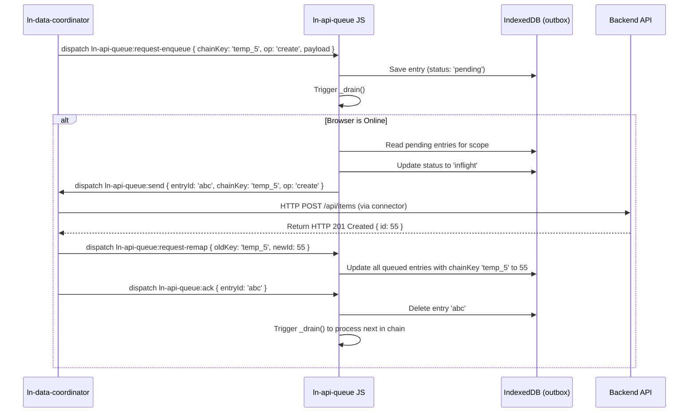

# 📥 ln-api-queue
> **Класификација:** 🌐 Инфраструктурна компонента (Layer 1 - Offline Outbox Queue)

---

## 1. Заднинско дејство и одговорност
`ln-api-queue` е инфраструктурна компонента која овозможува сигурен опремен систем за трансакции во офлајн режим (Offline Outbox Pattern) преку наменски организирана редица во `IndexedDB`.

*   **Главна Одговорност:** Обезбедува гарантирано пристигнување на пораките до серверот. Доколку корисникот нема мрежна врска, сите мрежни мутации (креирање, измена, бришење) се запишуваат во локалната IndexedDB база (`ln_api_queue`) со привремени UUID-а и статус `pending`.
*   **Секвенцијален FIFO по клуч (FIFO Chain Integrity):** За да се спречи конфликт во редоследот (на пр. испраќање на измена на некој објект пред тој да биде креиран на серверот), редицата ги групира трансакциите по `chainKey` (обично ID-то на објектот) и ги извршува строго една по една, по хронолошки редослед.
*   **Автоматско прилагодување и повторување (Exponential Backoff):** Доколку некое барање пропадне поради мрежен прекин, компонентата применува експоненцијален тајминг за повторно испраќање (Backoff Ladder: `2s, 5s, 15s, 60s, 300s`) со максимум 8 обиди. Доколку ги надмине, барањето се означува како `failed` и се запира обработката за тој `chainKey`.
*   **Ремапирање на клуч (ID Remapping):** Ова е клучна функционалност: ако објектот е креиран офлајн и добил привремено локално ID `_temp_123`, а корисникот потоа го изменил истиот објект додека сè уште е офлајн (креирајќи нова ставка за измена во редицата насочена кон `_temp_123`), при успешно креирање на серверот (кој ќе врати вистинско ID `55`), редицата динамички ги пребарува сите преостанати ставки во outbox-от кои референцираат на `_temp_123` и ги ажурира да користат `55` за да се обезбеди правилно понатамошно синхронизирање на серверот.
*   **Следење на конекција:** Го слуша нативниот `online` настан на прелистувачот за автоматско отпочнување на празнење на редицата (`_drain`).

---

## 2. Минимален HTML Маркап и Варијанти на Употреба

Се поставува како невидлив елемент во DOM-от, најчесто закачен веднаш до соодветниот дата координатор.

```html
<!-- Конфигурација на офлајн редица за Продукти -->
<div data-ln-api-queue="products"
     data-ln-api-queue-online="auto"
     id="products-queue"
     class="hidden">
</div>

<!-- Пример за UI индикатор кој ја покажува состојбата на редицата -->
<div class="sync-badge hidden" id="sync-indicator" data-ln-fillable>
    Има <span data-ln-field="count">0</span> несинхронизирани промени во позадина...
</div>
```

---

## 3. Декларативен API Договор (Атрибути и Настани)

| Атрибут | Тип | Опис |
| :--- | :--- | :--- |
| `data-ln-api-queue` | `String` | Го активира компонентот. Вредноста го означува опсегот (scope) на редицата. Доколку се изостави, се обидува да го преземе опсегот од родителскиот координатор. |
| `data-ln-api-queue-online` | `String` | Контрола за онлајн статус. Може да биде `auto` (го следи navigator.onLine), `true` (секогаш онлајн за тестирање) или `false`. |

### DOM Инструкции кон Редицата (Слуша)
| Настан | Payload `e.detail` | Опис |
| :--- | :--- | :--- |
| `ln-api-queue:request-enqueue` | `{ chainKey, op, targetId, payload, expectedVersion, meta }` | Барање за внесување нова трансакција во outbox. |
| `ln-api-queue:ack` | `{ entryId }` | Успешно потврдено мрежно извршување. Го брише записот од редицата. |
| `ln-api-queue:nack` | `{ entryId, reason }` | Неуспешно мрежно извршување. `reason` може да биде: `retry` (повторен обид со backoff), `drop` (бришење од редица), или `auth` (паузирање на цела редица поради неавторизиран пристап). |
| `ln-api-queue:request-remap` | `{ oldKey, newId }` | Инструкција за пресликување на привремени Идентификатори со реални серверски вредности во редицата. |
| `ln-api-queue:request-resume` | `{}` | Го одблокира испраќањето на редицата по успешна ре-авторизација. |
| `ln-api-queue:request-clear` | `{}` | Ја празни целата локална редица за тековниот опсег. |

### Сигнали кон Координаторот (Емитува)
| Настан | Payload `e.detail` | Опис |
| :--- | :--- | :--- |
| `ln-api-queue:send` | `{ entryId, chainKey, op, targetId, payload, expectedVersion, meta }` | Се емитува кон координаторот за тој да го изврши соодветниот повик кон конекторот во мрежа. |
| `ln-api-queue:enqueued` | `{ entryId, chainKey, count }` | Се емитува кога нова ставка е зачувана во базата. |
| `ln-api-queue:pending-count`| `{ count, scope }` | Се испраќа по секоја промена за ажурирање на бројот на преостанати ставки во UI-от. |
| `ln-api-queue:drained` | `{ scope }` | Се емитува кога нема преостанати ставки за синхронизација во outbox-от. |
| `ln-api-queue:failed` | `{ entryId, chainKey, attempts }` | Се активира кога ставката ќе го надмине лимитот од 8 обиди. |
| `ln-api-queue:auth-required` | `{ entryId, chainKey }` | Се испраќа кога е потребно повторно логирање на корисникот (HTTP 401/403). |

---

## 4. CSS Стилизирање и Поведенски Концепт
Како логичка инфраструктура, нема визуелни стилови, но се препорачува приклучување на стилови за визуелниот индикатор (Sync Badge) кој ја слуша статистика за преостанати ставки.

```scss
// Пример SCSS за Sync Badge индикаторот
#sync-indicator {
    position: fixed;
    bottom: 1rem;
    right: 1rem;
    padding: 0.75rem 1rem;
    background-color: var(--color-warning-light, #fef3c7);
    border: 1px solid var(--color-warning, #f59e0b);
    color: var(--color-warning-dark, #78350f);
    border-radius: 8px;
    box-shadow: 0 4px 6px -1px rgba(0,0,0,0.1);
    z-index: 1000;
    
    &.hidden {
        display: none;
    }
}
```

---

## 5. Пристапност (ARIA) и Чести Грешки
*   **Пристапност:** Доколку користите Sync Badge во корисничкиот интерфејс, поставете му `role="status"` и `aria-live="polite"` за корисниците со екрански читачи автоматски да бидат известени кога апликацијата започнува синхронизација во позадина и кога истата ќе заврши.
*   **Честа грешка 1 (Deadlock):** Неиспраќање на `ln-api-queue:ack` или `ln-api-queue:nack` настани од страна на координаторот. Доколку координаторот го прими `ln-api-queue:send` настанот, го изврши мрежниот повик и заборави да врати потврда, ставката ќе остане во статус `inflight` засекогаш, блокирајќи ги сите наредни ставки за тој `chainKey`.
*   **Честа грешка 2 (Игнорирање на ремапирање):** Креирање нови записи во офлајн режим без соодветен координатор кој ќе го испрати `ln-api-queue:request-remap` настанот по добивање на вистинското серверско ID. Доколку не го испратите овој настан, наредните измени за тој објект ќе се обидат да се извршат на серверот користејќи го непостоечкото привремено локално ID.

---

## 6. Дијаграм на Текот и Животен Циклус (Секвенцијално FIFO со АСК)



---

## 7. Поврзани Компоненти
*   **`ln-data-coordinator`**: Layer 2 координатор кој посредува меѓу базата, конекторот и оваа редица.
*   **`ln-api-connector`**: Ја врши реалната испорака во мрежата по налог на координаторот.
*   **`ln-data-store`**: Локалниот IndexedDB кеш кој веднаш ги рефлектира промените оптимистички додека тие сè уште чекаат во редицата за испраќање.
