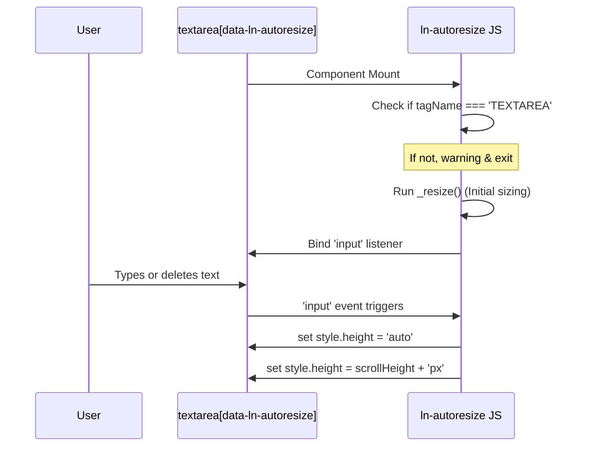

# ↕️ ln-autoresize
> **Класификација:** 🟢 Едноставна компонента (Layer 1 - UI Utility)

---

## 1. Заднинско дејство и одговорност
`ln-autoresize` е едноставна помошна компонента наменета за автоматско прилагодување на висината на `<textarea>` елементите врз основа на содржината внесена во нив.

*   **Главна Одговорност:** Го набљудува нативниот `input` настан на `<textarea>` и динамички ја ажурира неговата CSS висина (`height`) соодветно на неговиот `scrollHeight` со цел да спречи појава на непотребен внатрешен скрол бар.
*   **Иницијална пресметка:** Се активира веднаш по иницијализацијата во случај textarea-та да има претходно пополнета содржина (на пр. при уредување на запис со подолг опис).
*   **Чистење (Cleanup):** При уништување (`destroy`), го отстранува слушателот за настан и ја враќа висината на нејзината почетна CSS состојба.

---

## 2. Минимален HTML Маркап и Варијанти на Употреба

```html
<!-- Стандардна употреба на textarea за опис во форма -->
<div class="form-element">
    <label for="description">Детален опис:</label>
    <textarea id="description" 
              name="description" 
              data-ln-autoresize
              rows="3"
              placeholder="Внесете опис на проектот..."></textarea>
</div>
```

---

## 3. Декларативен API Договор (Атрибути и Настани)

| Атрибут | Тип | Опис |
| :--- | :--- | :--- |
| `data-ln-autoresize` | `Flag` | Го активира автоматското прилагодување на висината врз соодветниот `<textarea>`. |

### Настани
Компонентата нема сопствени CustomEvents. Работи исклучиво преку прислушување на нативниот `input` настан на самиот прелистувач.

---

## 4. CSS Стилизирање и Поведенски Концепт
За најдобро визуелно искуство, се препорачува оневозможување на рачното влечење (`resize: none`) и криење на вертикалниот скрол бар, бидејќи висината е контролирана од скриптата.

```scss
// Препорачано SCSS стилизирање во дизајн системот
textarea[data-ln-autoresize] {
    resize: none; // Спречува рачно влечење од корисникот кое ја крши логиката
    overflow-y: hidden; // Го крие вертикалниот скрол бидејќи висината се шири
    min-height: 80px; // Обезбедува почетна пристојна висина
    transition: height 0.1s ease-out; // Мазна транзиција при промена на редови
}
```

---

## 5. Пристапност (ARIA) и Чести Грешки
*   **Пристапност:** Автоматското зголемување на висината ја подобрува пристапноста за сите корисници (особено оние со когнитивни попречености) бидејќи целиот внесен текст е целосно видлив без потреба од користење на скролање во мал простор.
*   **Честа грешка 1:** Примена на `data-ln-autoresize` врз обичен текстуален `<input>` или `<div>`. Во овој случај, компонентата ќе фрли предупредување (`console.warn`) во конзолата на прелистувачот и ќе прекине со извршување.
*   **Честа грешка 2 (Почетна невидливост):** Доколку textarea елементот е иницијално скриен во неактивен таб или колапс, неговиот `scrollHeight` ќе се пресмета како `0`. По прикажувањето, елементот ќе изгледа како колабиран додека корисникот не почне да пишува. За да го надминете ова, рачно активирајте го `input` настанот откако елементот ќе стане видлив: `textarea.dispatchEvent(new Event('input'))`.

---

## 6. Дијаграм на Текот и Животен Циклус



---

## 7. Поврзани Компоненти
Нема директни функционални зависности од други компоненти, но најчесто се користи во комбинација со:
*   **`ln-form`**: Како дел од корисничките контроли за внесување долги форми/коментари.
*   **`ln-modal`**: Во дијалози каде просторот е драгоцен, за компактен приказ на празните форми.
