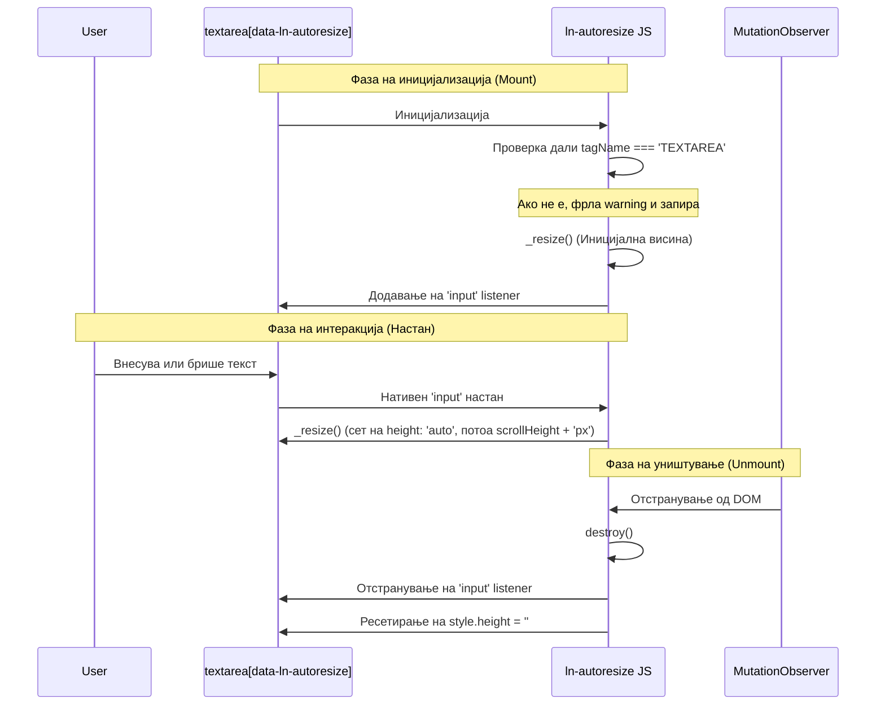

# ↕️ ln-autoresize

> **Класификација:** 🟢 Едноставна компонента (Layer 1 - UI Utility)

---

## 1. Заднинско дејство и одговорност

`ln-autoresize` е едноставна помошна компонента наменета за автоматско прилагодување на висината на `<textarea>` елементите врз основа на нивната содржина.

*   **Главна Одговорност:** Го набљудува нативниот `input` настан на `<textarea>` и динамички ја ажурира неговата CSS висина (`height`) соодветно на `scrollHeight` за да спречи појава на непотребен вертикален скрол бар.
*   **Иницијална пресметка:** Се активира веднаш по иницијализацијата во случај textarea-та да има претходно пополнета содржина (на пр. при уредување на запис).
*   **Чистење (Cleanup):** При уништување (`destroy`), го отстранува слушателот за настан и ја враќа висината на нејзината почетна CSS состојба.
*   **Ортогоналност (Што компонентата НЕ прави):**
    *   Не се занимава со валидација на внесениот текст (за тоа се користи [ln-validate](./ln-validate.md)).
    *   Не управува со зачувување на податоците во локална меморија или база на податоци (тоа е задача на [ln-persist](./ln-persist.md) или соодветниот API слој).
    *   Не управува со испраќање форми (за тоа се користи [ln-form](./ln-form.md)).
    *   Не содржи никаков хардкодиран јазичен текст или преводи.

---

## 2. Минимален HTML Маркап и Варијанти на Употреба

### А. Базен HTML маркап
Наједноставна примена на секоја стандардна `<textarea>` со додавање на активирачкиот атрибут:

```html
<textarea data-ln-autoresize placeholder="Внесете текст..."></textarea>
```

### Б. Употреба со претходно пополнета вредност (SSR / Уредување)
Бидејќи компонентата ја пресметува висината при иницијализација, претходно пополнетата содржина веднаш ќе ја зголеми висината на соодветното ниво:

```html
<div class="form-element">
    <label for="description">Детален опис:</label>
    <textarea id="description" 
              name="description" 
              data-ln-autoresize
              rows="3">Ова е подолг текст кој е претходно пополнет од серверот или базата на податоци, па затоа textarea-та автоматски ќе се рашири соодветно.</textarea>
</div>
```

---

## 3. Декларативен API Договор (Атрибути и Настани)

| Атрибут | Тип | Стандардна вредност | Опис |
| :--- | :--- | :--- | :--- |
| `data-ln-autoresize` | `Flag` | `n/a` | Активирачки атрибут кој го стартува автоматското прилагодување на висината врз соодветниот `<textarea>`. |

### Настани (Events API)
Компонентата нема сопствени CustomEvents. Работи исклучиво преку прислушување на нативниот `input` настан на самите `<textarea>` елементи.

---

## 4. CSS Стилизирање и Поведенски Концепт

За најдобар поведенски и визуелен ефект, се препорачува оневозможување на рачното влечење (`resize: none`) и прикривање на скрол барот во вашиот дизајн систем:

```scss
// Препорачано SCSS стилизирање во дизајн системот
textarea[data-ln-autoresize] {
    resize: none;         // Спречува рачно влечење од корисникот кое го крши автоматското мерење
    overflow-y: hidden;   // Го крие вертикалниот скрол бидејќи висината е динамичка
    min-height: 80px;     // Обезбедува почетна минимална висина
}
```

### Поведенски концепт на пресметката:
При секој настан, висината прво се поставува на `auto` (за да се исчисти претходно зададената висина и правилно да се измери реалниот `scrollHeight`), а потоа се поставува на `scrollHeight` во пиксели:
1. `this.dom.style.height = 'auto';`
2. `this.dom.style.height = this.dom.scrollHeight + 'px';`

> [!NOTE]
> Избегнувајте долги CSS транзиции (`transition: height ...`) на висината при пишување, бидејќи тие можат да предизвикаат лаг или треперење на курсорот додека корисникот пишува брзо.

---

## 5. Пристапност (ARIA) и Чести Грешки

### А. Пристапност (ARIA) & Тастатура
*   Бидејќи се користи нативен `<textarea>` елемент, пристапноста е целосно поддржана од прелистувачот. Сите нативни однесувања на тастатурата (`Tab` за фокус, внесување текст, селекција, итн.) се зачувани.
*   Не се потребни дополнителни ARIA улоги или атрибути за однесувањето на авто-големината.

### Б. Чести Грешки и Анти-патерни
*   **Грешка со погрешен елемент:** Примена на `data-ln-autoresize` врз обичен текстуален `<input>` или `<div>`. Во ваков случај, компонентата ќе фрли предупредување (`console.warn`) во конзолата и нема да се иницијализира.
*   **Грешка при иницијална невидливост:** Доколку textarea елементот се наоѓа во скриен таб, колапс или контејнер кој е иницијално невидлив (`display: none`), неговиот `scrollHeight` ќе се измери како `0`. За да се надмине ова, откако контејнерот ќе стане видлив:
    *   **Опција 1:** Испратете нативен настан: `textarea.dispatchEvent(new Event('input'))`
    *   **Опција 2 (Препорачано преку JS API):** Повикајте ја внатрешната метода за промена на големината директно на инстанцата:
        ```javascript
        textarea.lnAutoresize._resize();
        ```

---

## 6. Дијаграм на Текот и Животен Циклус



---

## 7. Поврзани Компоненти

*   **[ln-autoresize.js](../../js/ln-autoresize/src/ln-autoresize.js)** — Изворен код на самата компонента.
*   **[ln-form](./ln-form.md)** — Главна компонента за форми во која најчесто се користи оваа помошна функција.
*   **[ln-modal](./ln-modal.md)** — Прозорци каде што заштедата на простор е клучна и се користи авто-големина за описни полиња.

