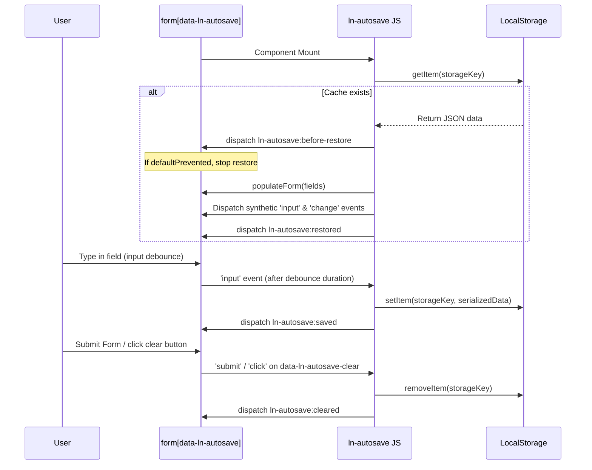

# 💾 ln-autosave

> **Класификација:** 🟢 Едноставна компонента (Layer 1 - Form Helper)

---

## 1. Заднинско дејство и одговорност

`ln-autosave` е помошна компонента која автоматски ја зачувува привремената состојба на HTML формите во локалното складиште на прелистувачот (`localStorage`). Нејзината цел е да спречи случајно губење на внесените податоци при ненадејно освежување на страницата или затворање на табот.

*   **Главна Одговорност:** Го набљудува внесот во формата (настани `change` и `focusout`, како и опционално дебаунсиран `input` додека корисникот пишува), ја сериализира целата форма и ја запишува во `localStorage`.
*   **Автоматско Враќање (Restore):** При вчитување на страницата, компонентата автоматски ги презема зачуваните податоци од `localStorage` и ги пополнува во соодветните полиња. За да се осигура дека останатите компоненти (пр. `ln-validate` или `ln-autoresize`) се известени за новите вредности, `ln-autosave` емитува нативни `input` и `change` настани на секое пополнето поле.
*   **Безбедносен Клуч (Storage Key):** Клучот се генерира како: `ln-autosave:{window.location.pathname}:{идентификатор}`, каде `{идентификатор}` е вредноста на `data-ln-autosave` (доколку постои и не е празна) или `id` атрибутот на формата.
*   **Чистење на Кешот:** Локалната копија автоматски се брише кога формата успешно ќе се испрати (`submit`), ќе се ресетира (`reset`) или кога корисникот експлицитно ќе кликне на означено копче за чистење (`data-ln-autosave-clear`).
*   **Ортогоналност (Што компонентата НЕ прави):**
    *   Не ги испраќа податоците до оддалечен сервер (тоа е задача на [ln-form](./ln-form.md) или [ln-api-connector](./ln-api-connector.md)).
    *   Не врши валидација на внесените вредности (за тоа се користи [ln-validate](./ln-validate.md)).
    *   Не ги зачувува вредностите на полињата означени со `data-ln-autosave-exclude` (лозинки, картички, матични броеви и сл.), полињата без `name` атрибут, како и оние од тип `file` со цел да се заштити приватноста.
    *   Не користи колачиња (`cookies`) или асинхрони бази (IndexedDB) за да избегне трки во состојбата (race conditions) при навигација.

---

## 2. Минимален HTML Маркап и Варијанти на Употреба

### А. Базен HTML маркап
Наједноставна примена со автоматско зачувување на промени при напуштање на полињата (`focusout` и `change` настани):

```html
<form id="profile-form" data-ln-autosave>
    <div class="form-element">
        <label for="username">Корисничко име:</label>
        <input type="text" id="username" name="username" required />
    </div>
    
    <button type="submit">Зачувај</button>
</form>
```

### Б. Варијанти на употреба (Напредно зачувување)
Софистицирана конфигурација со овозможено инстант зачувување додека корисникот пишува (дебаунсиран `input`) и соодветно копче за рачно чистење на нацртот:

```html
<form id="post-editor" 
      data-ln-autosave="blog-post" 
      data-ln-autosave-debounce-input="1500">
      
    <div class="form-element">
        <label for="post-title">Наслов:</label>
        <input type="text" id="post-title" name="title" />
    </div>
    
    <div class="form-element">
        <label for="post-body">Содржина:</label>
        <textarea id="post-body" name="body" data-ln-autoresize></textarea>
    </div>

    <div class="form-actions">
        <button type="submit">Објави</button>
        <!-- Експлицитно чистење на привремената копија -->
        <button type="button" data-ln-autosave-clear>Исчисти нацрт</button>
    </div>
</form>
```

---

## 3. Декларативен API Договор (Атрибути и Настани)

| Атрибут | Тип | Стандардна вредност | Опис |
| :--- | :--- | :--- | :--- |
| `data-ln-autosave` | `String\|Flag` | `n/a` | Го активира компонентот врз `<form>`. Вредноста служи како клуч за `localStorage`; доколку е празна, се зема `id` атрибутот на формата. |
| `data-ln-autosave-debounce-input` | `Integer` | `1000` | Овозможува дебаунсирано зачувување при нативниот `input` настан во милисекунди додека се пишува. |
| `data-ln-autosave-clear` | `Flag` | `n/a` | Се поставува на елементи (најчесто копчиња) во формата за брзо чистење на нацртот од `localStorage` при клик. |
| `data-ln-autosave-exclude` | `Flag` | `n/a` | Се поставува на поединечни внесни елементи (лозинки, кредитни картички, матични броеви) кои треба да се исклучат од зачувување во `localStorage`. |

### Настани (Events API)

#### Емитува (Emits)
Сите Custom настани се меурат (`bubbles: true`).

| Настан | Payload `e.detail` | Опис |
| :--- | :--- | :--- |
| `ln-autosave:before-restore` | `{ target: Node, data: Object }` | Се емитува пред да се пополнат полињата. Може да биде откажан со `e.preventDefault()`. |
| `ln-autosave:restored` | `{ target: Node, data: Object }` | Се емитува откако сите полиња се пополнети и се испратени синтетичките настани. |
| `ln-autosave:saved` | `{ target: Node, data: Object }` | Се емитува по секое успешно запишување на податоци во `localStorage`. |
| `ln-autosave:cleared` | `{ target: Node }` | Се емитува откако нацртот ќе се избрише од `localStorage`. |
| `ln-autosave:destroyed` | `{ target: Node }` | Се емитува при уништување на компонентата со `destroy()`. |

#### Слуша (Listens to)
Компонентата реагира на следниве нативни настани на самата форма:
*   `focusout` и `change` — за зачувување на состојбата при промена на фокусот/вредноста.
*   `submit` и `reset` — за бришење на зачуваниот нацрт.
*   `click` — го пресретнува кликот на елементи со `data-ln-autosave-clear`.
*   `input` (опционално) — дебаунсиран настан за континуиран внес.

### JS API
До инстанцата на компонентата може да се пристапи преку `el.lnAutosave`:

```javascript
const form = document.getElementById('profile-form');
const autosaveInstance = form.lnAutosave;

// Пристап до уникатниот клуч
console.log(autosaveInstance.key); // "ln-autosave:/profile:profile-form"

// Рачно отстранување на слушателите на настани (без бришење на зачуваниот нацрт)
autosaveInstance.destroy();
```

---

## 4. CSS Стилизирање и Поведенски Концепт

### А. CSS / SCSS Стилизирање
*   **Headless Дизајн:** Ова е чисто логичка компонента која работи во позадина и нема придружени CSS/SCSS датотеки или класи.

### Б. Поведенски Концепт (Синхронизација)
*   **Синхронизација на Вредности со Сродни Компоненти:** При реставрирање на податоците, компонентата повикува `populateForm` од јадрото и веднаш диспачира синтетички нативни настани:
    ```javascript
    field.dispatchEvent(new Event('input', { bubbles: true }));
    field.dispatchEvent(new Event('change', { bubbles: true }));
    ```
    Ова гарантира дека сите останати поврзани библиотеки или компоненти (како `ln-validate` за ре-валидација или `ln-autoresize` за прилагодување на висината) автоматски ќе ги синхронизираат своите состојби.


---

## 5. Пристапност (ARIA) и Чести Грешки

### А. Пристапност (ARIA) & Тастатура
*   Бидејќи се потпира на нативни форми, не е потребна дополнителна ARIA конфигурација. Се препорачува стандардно обележување на контролите со соодветни лејбли и ARIA атрибути (пр. `aria-describedby` за грешки) кои ќе ги читаат екранските читачи.
*   Нативната тастатурна навигација останува непроменета.

### Б. Чести Грешки и Анти-патерни
*   **Непоставување на идентификатор:** Доколку формата нема ниту `id` ниту вредност во `data-ln-autosave`, компонентата ќе фрли предупредување (`console.warn`) и нема да се иницијализира.
*   **Полиња без `name` атрибут:** Серијализаторот на формата целосно ги игнорира полињата кои немаат соодветен `name` атрибут.
*   **Зачувување чувствителни податоци:** Никогаш не зачувувајте лозинки, броеви од кредитни картички или матични броеви во `localStorage` бидејќи тој е изложен на XSS напади и податоците се чуваат во чист текстуален формат. Секогаш користете го атрибутот `data-ln-autosave-exclude` на таквите полиња за да ги исклучите од зачувување.
*   **Препишување на понови серверски податоци:** Ако серверот веќе изгенерирал понови податоци, спречете го автоматското враќање на стариот нацрт користејќи ја следната шема:
    ```javascript
    document.addEventListener('ln-autosave:before-restore', function (e) {
        if (e.target.dataset.hasServerData === 'true') {
            e.preventDefault();
            localStorage.removeItem(e.target.lnAutosave.key);
        }
    });
    ```

---

## 6. Дијаграм на Текот и Животен Циклус



---

## 7. Поврзани Компоненти

*   **[ln-autosave.js](../../js/ln-autosave/src/ln-autosave.js)** — Изворен код на самата компонента.
*   **[ln-form](./ln-form.md)** — Главната обвивка за форми во која се користи оваа примитива.
*   **[ln-validate](./ln-validate.md)** — Ја користи пополнетата состојба и синтетичките настани за автоматска валидација на вратените полиња.
