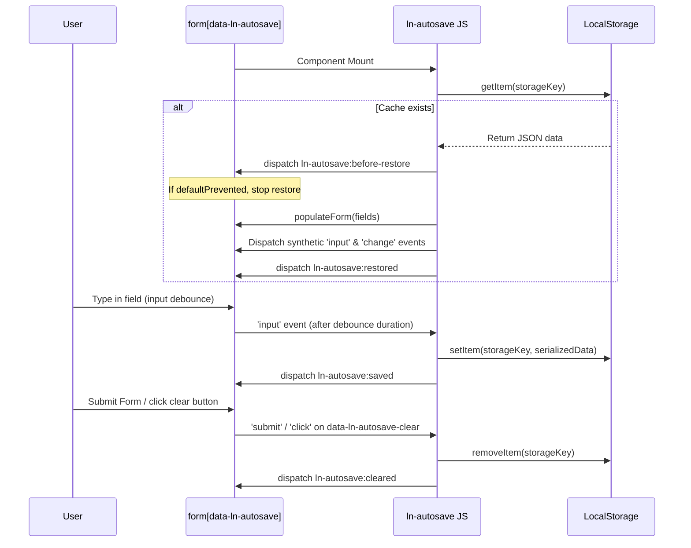

# 💾 ln-autosave
> **Класификација:** 🟢 Едноставна компонента (Layer 1 - Form Helper)

---

## 1. Заднинско дејство и одговорност
`ln-autosave` е едноставна помошна компонента која автоматски ја зачувува состојбата на HTML формите во локалното складиште на прелистувачот (`localStorage`) со цел да спречи губење на внесените податоци при случајно освежување на страницата или затворање на табот.

*   **Главна Одговорност:** Го набљудува внесот во формата (настани `change` и `focusout`, како и опционално дебаунсиран `input` за време на пишување), ја сериализира целата форма и ја зачувува во `localStorage`.
*   **Автоматско Враќање (Restore):** При вчитавање на страницата, компонентата иницијално ги презема зачуваните податоци од `localStorage` и ги пополнува во соодветните полиња. За да се осигура дека другите компоненти (пр. `ln-validate` или custom реактивни скрипти) знаат за новите вредности, `ln-autosave` емитува нативни `input` и `change` настани на секое пополнето поле.
*   **Безбедносен Клуч (Storage Key):** Клучот под кој се зачувуваат податоците е строго изолиран по страница и по ID на формата: `ln-autosave:{window.location.pathname}:{formId}`.
*   **Чистење на Кешот:** Локалната копија автоматски се брише кога формата успешно ќе се испрати (`submit`), ќе се ресетира (`reset`) или кога корисникот експлицитно ќе кликне на означено копче за чистење (`data-ln-autosave-clear`).

---

## 2. Минимален HTML Маркап и Варијанти на Употреба

```html
<!-- Стандардно зачувување (со реакција само на focusout и change) -->
<form id="profile-form" data-ln-autosave>
    <div class="form-element">
        <label for="username">Корисничко име:</label>
        <input type="text" id="username" name="username" required />
    </div>
    
    <button type="submit">Зачувај</button>
</form>

<!-- Напредна употреба (со дебаунс на пишување и копче за чистење) -->
<form id="post-editor" 
      data-ln-autosave="blog-post" 
      data-ln-autosave-debounce-input="1500">
      
    <div class="form-element">
        <label for="post-title">Наслов:</label>
        <input type="text" id="post-title" name="title" />
    </div>
    
    <div class="form-element">
        <label for="post-body">Содржина:</label>
        <textarea id="post-body" name="body" data-ln-autoresize></textarea>
    </div>

    <div class="form-actions">
        <button type="submit">Објави</button>
        <!-- Експлицитно чистење на привремената копија -->
        <button type="button" data-ln-autosave-clear>Исчисти нацрт</button>
    </div>
</form>
```

---

## 3. Декларативен API Договор (Атрибути и Настани)

| Атрибут | Тип | Опис |
| :--- | :--- | :--- |
| `data-ln-autosave` | `String\|Flag` | Го активира компонентот врз `<form>`. Доколку се наведе вредност, таа се користи за клучот во `localStorage`, во спротивно се зема `id` атрибутот на формата. |
| `data-ln-autosave-debounce-input` | `Integer` | Овозможува дебаунсирано зачувување при нативниот `input` настан (додека корисникот пишува). Бројката ги означува милисекундите (default: 1000). |
| `data-ln-autosave-clear` | `Flag` | Се поставува на било кое копче внатре во формата. Кликнувањето врз него веднаш го брише зачуваниот кеш од `localStorage`. |

### Настани (Емитува)
| Настан | Payload `e.detail` | Опис |
| :--- | :--- | :--- |
| `ln-autosave:before-restore` | `{ target: Node, data: Object }` | Се емитува пред да се пополнат полињата со зачуваните податоци. Може да биде откажан (`e.preventDefault()`). |
| `ln-autosave:restored` | `{ target: Node, data: Object }` | Се емитува откако сите полиња се успешно вратени во последната зачувана состојба. |
| `ln-autosave:saved` | `{ target: Node, data: Object }` | Се емитува по секое успешно запишување во `localStorage`. |
| `ln-autosave:cleared` | `{ target: Node }` | Се емитува кога привремениот кеш е избришан од `localStorage`. |

---

## 4. CSS Стилизирање и Поведенски Концепт
Ова е логичка (headless) компонента која работи во позадина и нема директни CSS класи или визуелни стилови.

---

## 5. Пристапност (ARIA) и Чести Грешки
*   **Пристапност:** Враќањето на податоците при отворање на страницата е исклучително корисно. Сепак, доколку формата се пополни со многу стари податоци, екранските читачи можеби нема веднаш да ја најават промената. Не е потребна посебна ARIA конфигурација бидејќи стандардните контроли ги задржуваат своите лејбли и улоги.
*   **Честа грешка 1:** Непоставување ниту на `id` на формата, ниту на вредност во `data-ln-autosave`. Во овој случај, компонентата ќе фрли предупредување (`console.warn`) бидејќи нема уникатен клуч под кој ќе ги зачува податоците во `localStorage`.
*   **Честа грешка 2:** Непоставување на `name` атрибут на полињата во формата. Функцијата за сериализација (`serializeForm`) целосно ги игнорира полињата кои немаат соодветен `name` атрибут.
*   **Честа грешка 3:** Вредности од осетлив карактер (лозинки, кредитни картички). Никогаш не користете `ln-autosave` на форми кои содржат доверливи податоци, бидејќи `localStorage` е ранлив на XSS напади и податоците се зачувуваат во чист текстуален формат.

---

## 6. Дијаграм на Текот и Животен Циклус



---

## 7. Поврзани Компоненти
*   **`ln-form`**: Главната обвивка со која најчесто соработува.
*   **`ln-validate`**: Добива реактивни `input` и `change` настани од `ln-autosave` при враќање на состојбата за да може автоматски да ги провери реставрираните вредности и да го ажурира визуелниот статус на полињата.
