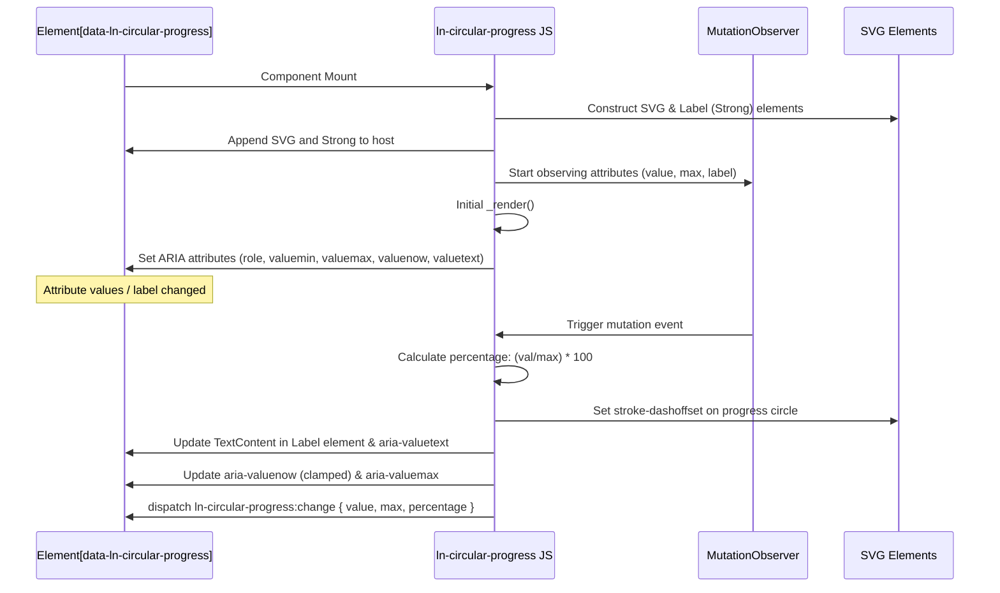

# ⭕ ln-circular-progress
> **Класификација:** 🟢 Едноставна компонента (Layer 1 - Data Visualization)

---

## 1. Заднинско дејство и одговорност
`ln-circular-progress` е едноставна визуелна компонента која овозможува прикажување на прогрес или статистички проценти во форма на динамички SVG круг.

*   **Главна Одговорност:** Динамички генерира и управува со внатрешен SVG елемент кој содржи патека за кругот (`track`) и активен исполнувачки дел (`fill`), прилагодувајќи го соодносот на исполнетост врз основа на математички пресметаниот `stroke-dashoffset`.
*   **Декларативно Врзување (Attribute Bridge Pattern):** Во согласност со архитектурните доктрини, компонентата користи `MutationObserver` кој ги следи измените на атрибутите `data-ln-circular-progress` (вредност), `data-ln-circular-progress-max` (максимум) и `data-ln-circular-progress-label` (етикета). Секоја промена на овие вредности во DOM-от инстантно ја ре-пресметува состојбата и го ажурира визуелниот дел.
*   **Динамичка Лабела:** Во центарот на кругот генерира `<strong>` етикета во која го прикажува процентот (на пр. `75%`) или сопствен текст конфигуриран преку атрибутот за лабела.
*   **Автоматска Пристапност (Native ARIA Reflection):** Компонентата нативно управува со сопствените ARIA својства (`role="progressbar"`, `aria-valuenow`, `aria-valuemin`, `aria-valuemax`, `aria-valuetext`), овозможувајќи правилно толкување од читачите на екран.
*   **Изолација:** Работи исклучиво во својата DOM рамка и не комуницира директно со надворешни мрежи или складови.
*   **Што компонентата НЕ прави (Ортогоналност):**
    *   Не врши преземање или обработка на податоци од API (нема мрежна/AJAX логика).
    *   Не содржи внатрешна логика за тајмери или интервали (ажурирањето мора да дојде однадвор).
    *   Нема вграден неопределен („indeterminate“) режим за анимација на вчитавање (за тоа се користи `@mixin loader`).

Изворен код: [ln-circular-progress.js](../../js/ln-circular-progress/src/ln-circular-progress.js)

---

## 2. Минимален HTML Маркап и Варијанти на Употреба

```html
<!-- Стандарден процентен приказ (0-100) -->
<div data-ln-circular-progress="45" id="task-progress"></div>

<!-- Сопствен максимум и прилагодена етикета (label) -->
<div data-ln-circular-progress="8" 
     data-ln-circular-progress-max="10" 
     data-ln-circular-progress-label="8 од 10"
     id="custom-progress"></div>
```

---

## 3. Декларативен API Договор (Атрибути и Настани)

| Атрибут | Тип | Опис |
| :--- | :--- | :--- |
| `data-ln-circular-progress` | `Float` | Тековна вредност на прогресот. Менувањето на овој атрибут го ажурира кругот. |
| `data-ln-circular-progress-max` | `Float` | Максимална можна вредност (default: 100). |
| `data-ln-circular-progress-label` | `String` | Опционална етикета која се прикажува во центарот на кругот и се рефлектира во `aria-valuetext`. |

### Настани (Емитува)
| Настан | Payload `e.detail` | Опис |
| :--- | :--- | :--- |
| `ln-circular-progress:change` | `{ target: Node, value: Float, max: Float, percentage: Float }` | Се емитува по секоја промена на вредноста, максимумот или етикетата, откако визуелниот круг е ажуриран. |

---

## 4. CSS Стилизирање и Поведенски Концепт
За правилен приказ, компонентата бара дефиниран размер на димензии во CSS и позиционирање на центарот.

```scss
// SCSS стилови за кружниот прогрес
[data-ln-circular-progress] {
    position: relative;
    display: inline-flex;
    align-items: center;
    justify-content: center;
    width: 64px;  // Контролирајте ја димензијата на кругот од тука
    height: 64px;
    
    svg {
        width: 100%;
        height: 100%;
    }

    // Позадински круг
    .ln-circular-progress__track {
        stroke: var(--color-gray-light, #e2e8f0);
    }

    // Исполнувачки круг
    .ln-circular-progress__fill {
        stroke: var(--color-primary, #3b82f6);
        transition: stroke-dashoffset 0.3s ease; // Мазна анимација на полнење
    }

    // Текстот во средината
    .ln-circular-progress__label {
        position: absolute;
        font-size: 0.75rem;
        color: var(--color-text, #1e293b);
        text-align: center;
        pointer-events: none;
    }
}
```

---

## 5. Пристапност (ARIA) и Чести Грешки
*   **Пристапност:** Компонентата автоматски ги инсталира и ажурира соодветните ARIA атрибути (`role="progressbar"`, `aria-valuemin="0"`, `aria-valuemax`, `aria-valuenow` и `aria-valuetext`). Прогрес вредноста во `aria-valuenow` е безбедно ограничена во границите од `0` до `max`. За подобрување на контекстот за екранските читачи, развивачот може рачно да додаде `aria-label` or `aria-labelledby`:
    ```html
    <div data-ln-circular-progress="70" 
         aria-label="Напредок на преземање датотека">
    </div>
    ```
*   **Честа грешка 1:** Недодавање на CSS димензии (width/height) на коренскиот контејнер. Поради природата на SVG, без експлицитна висина и ширина кругот може да се рашири низ целиот екран или целосно да колабира.
*   **Честа грешка 2:** Менување на вредностите директно во JS преку својства наместо преку `setAttribute`. Компонентата користи `MutationObserver` кој реагира исклучиво на DOM промени во атрибутите.

---

## 6. Дијаграм на Текот и Животен Циклус



---

## 7. Поврзани Компоненти
*   **[ln-progress](./ln-progress.md)**: Линеарен прогрес индикатор кој се користи кога е потребна класична линеарна прогрес лента.
