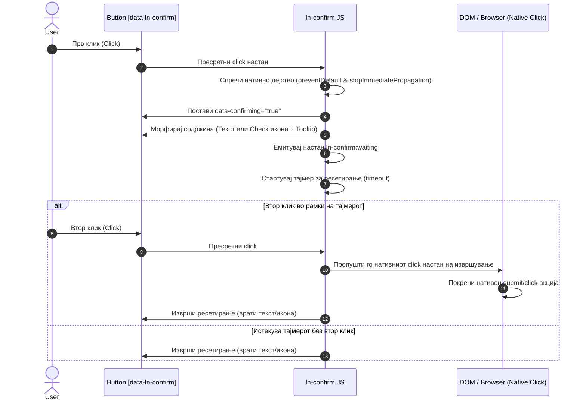

# 🛡️ ln-confirm

> **Класификација:** 🟢 Едноставна компонента / Влезен заштитник (Simple Component / Interaction Gate Primitive)

---

## 1. Заднинско дејство и одговорност
`ln-confirm` е ултра-лесен, изолиран **влезен заштитник за деструктивни акции** (~143 линии JavaScript во [`js/ln-confirm/src/ln-confirm.js`](../../js/ln-confirm/src/ln-confirm.js)) кој овозможува потврда со два клика директно на самите копчиња, без потреба од тешки модални дијалози или блокирачки `window.confirm()` повици.

Компонентата функционира според принципите на **морфирање во место (in-place morphing)** и **пропуштање на нативни platform настани**:
* **Морфирање во место (In-Place Morphing)**: При првиот клик, копчето не отвора нов прозорец, туку ја менува сопствената содржина. Текстуалните копчиња го заменуваат натписот со пораката за потврда (`data-ln-confirm`), додека иконските копчиња ја заменуваат иконата со `#ln-check` и прикажуваат контекстуално tooltip балонче со пораката.
* **Пропуштање на нативни настани (Platform Event Release)**: `ln-confirm` **не дефинира сопствен `accept` настан**. Неговата единствена задача е да го пресретне и блокира *првиот* клик. На вториот клик, компонентата целосно се трга од патот и го пропушта стандардниот браузерски `click` или `submit` настан на извршување.
* **Автоматско враќање во почетна состојба (Graceful Auto-Revert)**: Доколку корисникот не кликне повторно во дефинираниот временски прозорец (`data-ln-confirm-timeout`, стандардно 3 секунди), тајмерот автоматски ја враќа оригиналната текст/икона содржина и го онеспособува заштитникот.

> [!IMPORTANT]
> **Што `ln-confirm` НЕ прави (Orthogonality Doctrine):**
> * **НЕ генерира сопствени настани за потврда (`accept`)** — деструктивната бизнис логика (AJAX повици, HTTP POST) се запишува во стандардниот `click` или `submit` handler на копчето/формата.
> * **НЕ спречува двојни кликови по прифаќањето** — откако вториот клик ќе го покрене нативниот настан, `ln-confirm` се ресетира. Заштитата од повеќекратни AJAX барања е одговорност на развивачот (на пр. со `button.disabled = true`).
> * **НЕ управува со бизнис логика** — не знае кој ресурс се брише или модифицира и не комуницира со бекендот.

---

## 2. Минимален HTML Маркап и Варијанти на Употреба

### Базен HTML Маркап
```html
<form action="/account/delete" method="POST">
    <button type="submit" 
            class="btn btn-danger" 
            data-ln-confirm="Дали сте сигурни?" 
            data-ln-confirm-timeout="4">
        Бриши профил
    </button>
</form>
```

### Варијанта 1: Иконско копче со Tooltip и Screen-Reader поддршка (Icon-Only Button)
Кај компактните иконски копчиња, `ln-confirm` автоматски детектира кога копчето содржи икона без текстуална содржина и го менува постоечкиот SVG со `#ln-check`, додавајќи CSS класа `.ln-confirm-tooltip` со атрибут `data-tooltip-text` и динамички анонсер со `role="alert"` за читачите на екран:
```html
<button type="button" 
        class="btn btn-icon" 
        aria-label="Избриши ставка" 
        data-ln-confirm="Потврди бришење?">
    <svg class="ln-icon" aria-hidden="true">
        <use href="#ln-trash"></use>
    </svg>
</button>
```

### Варијанта 2: Препорачана дво-елементна употреба (Two-Element Mode)
Се дефинираат два внатрешни спанови: еден за почетна состојба (`data-ln-confirm-idle`) и еден за потврда (`data-ln-confirm-active`), овозможувајќи посложена DOM содржина:
```html
<button type="button" 
        class="btn btn-danger" 
        data-ln-confirm
        data-ln-confirm-timeout="4">
    <span data-ln-confirm-idle>
        <svg class="ln-icon" aria-hidden="true"><use href="#ln-trash"></use></svg>
        Избриши селектирани (<span data-ln-table-selected></span>)
    </span>
    <span data-ln-confirm-active hidden>
        Дали сте сигурни?
    </span>
</button>
```

---

## 3. Декларативен API Договор (Атрибути и Настани)

### HTML Атрибути
| Атрибут | Елементи | Тип | Опис |
| :--- | :--- | :--- | :--- |
| `data-ln-confirm` | `<button>`, `<a>` | `String` | Означувач за заштитник на акција. Вредноста е пораката за потврда. Ако се користи Two-Element режим, се остава празна. |
| `data-ln-confirm-timeout` | `<button>`, `<a>` | `Number` | Време во секунди за автоматско ресетирање (стандардно: `3`). |
| `data-confirming` | `<button>`, `<a>` | `Boolean` (авто) | Се поставува на `"true"` за време на активна потврда. Се користи како CSS hook. |
| `data-tooltip-text` | `<button>`, `<a>` | `String` (авто) | Натписот во tooltip балончето при легаси иконски режим. |
| `data-ln-confirm-idle` | Било кој | `Element` | Детски елемент за почетна состојба. |
| `data-ln-confirm-active` | Било кој | `Element` | Детски елемент за состојба на потврда (стандардно скриен со `hidden`). |

### JavaScript API (`element.lnConfirm`)
* **`element.lnConfirm.confirming`** *(Boolean)*: Дали копчето е во активна состојба на потврдување.
* **`element.lnConfirm.destroy()`**: Рачно чистење и ресетирање на инстанцата.

### DOM Настани (DOM Events)
* **Емитува:**
  * `ln-confirm:waiting` (`bubbles: true`): Се емитува на првиот клик, кога копчето бара потврда.
* **Не постои `ln-confirm:accept` настан!** Прифаќањето на акцијата е нативниот `click` или `submit` настан на самиот елемент.

---

## 4. CSS Стилизирање и Поведенски Концепт
Стајлингот за иконскиот режим се базира на SCSS миксинот `confirm-tooltip` кој ја прикажува пораката како псевдо-елемент `::after`.

### SCSS Миксин Имплементација (`scss/config/mixins/_confirm.scss`)
```scss
@use 'tooltip' as *;

@mixin confirm-tooltip {
    position: relative;
    overflow: visible !important;
    color: hsl(var(--color-error)) !important;

    &::after {
        @include tooltip-bubble;
        content: attr(data-tooltip-text);
        position: absolute;
        bottom: 100%;
        left: 50%;
        transform: translateX(-50%);
        --margin-block: var(--size-sm);
        margin-bottom: var(--margin-block);
    }
}
```

---

## 5. Пристапност (ARIA) и Чести Грешки

### Пристапност (ARIA) & Тастатура
1. **Динамична замена на `aria-label`**: Во иконски режим, `aria-label` се менува со пораката за потврда, а по ресетирање оригиналниот лабел се враќа.
2. **Динамички анонсер (`role="alert"`)**: Се креира привремен `<span class="sr-only" role="alert">` за да се принудат асистивните технологии веднаш да ја изговорат пораката.
3. **Фокус менаџмент**: Фокусот останува на самото копче, овозможувајќи лесен потврден клик со `Space` или `Enter`.

### Чести Грешки & Анти-патерни
> [!CAUTION]
> **1. Забрана за масовни или високоризични акции (Strict Execution Limit):**
> `ln-confirm` е наменет **исклучиво за поединечни, ниско-влијателни акциски копчиња** (на пр. бришење еден ред во табела). За групни деструктивни акции (Bulk Actions) или акции со висок ризик, користењето на `ln-confirm` е строго забрането. Во тие случаи секогаш мора да се прикаже потврден модал (`ln-modal`) со преглед на сите засегнати ресурси.

> [!WARNING]
> **2. Спречување на повеќекратни кликови при бавни AJAX повици:**
> Оневозможувајте го копчето во координаторот по вториот клик за да спречите повеќекратни AJAX барања (`button.disabled = true`).

---

## 6. Дијаграм на Текот и Животен Циклус



---

## 7. Поврзани Компоненти
- [`ln-modal.md`](./ln-modal.md) — Задолжителен за потврда на масовни или високоризични деструктивни операции.
- [`ln-table.md`](./ln-table.md) — Чест домаќин на поединечни акциски копчиња заштитени со `ln-confirm`.
- [`ln-toast.md`](./ln-toast.md) — Прикажува нотификации по успешното извршување на акцијата.
