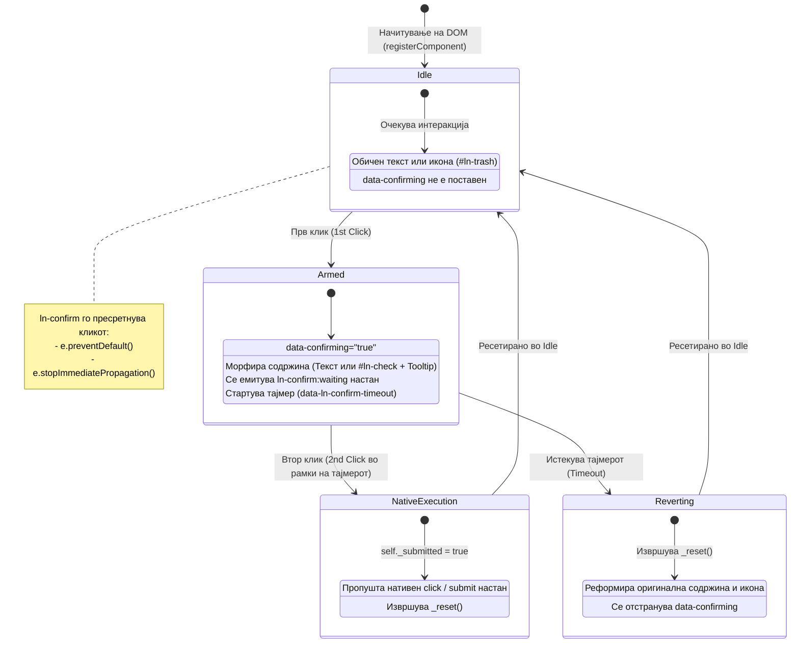

# 🛡️ ln-confirm

> **Класификација:** 🟢 Едноставна компонента / Влезен заштитник (Simple Component / Interaction Gate Primitive)

---

## 1. Заднинско дејство и одговорност

`ln-confirm` е ултра-лесен, изолиран **влезен заштитник за деструктивни акции** (~143 линии JavaScript во [`js/ln-confirm/src/ln-confirm.js`](file:///c:/laragon/www/ln-ashlar/js/ln-confirm/src/ln-confirm.js)) кој овозможува потврда со два клика директно на самите копчиња, без потреба од тешки модални дијалози или блокирачки `window.confirm()` скрипти.

Компонентата функционира според принципите на **морфирање во место (in-place morphing)** и **пропуштање на нативни platform настани**:

* **Морфирање во место (In-Place Morphing)**: При првиот клик, копчето не отвора нов прозорец, туку ја менува сопствената содржина. Текстуалните копчиња го заменуваат натписот со пораката за потврда (`data-ln-confirm`), додека иконските копчиња ја заменуваат иконата со `#ln-check` и прикажуваат контекстуално tooltip балонче со пораката.
* **Пропуштање на нативни настани (Platform Event Release)**: `ln-confirm` **не дефинира сопствен `accept` настан**. Неговата единствена задача е да го пресретне и блокира *првиот* клик. На вториот клик, компонентата целосно се трга од патот и го пропушта стандардниот браузерски `click` или `submit` настан на извршување.
* **Автоматско враќање во почетна состојба (Graceful Auto-Revert)**: Доколку корисникот не кликне повторно во дефинираниот временски прозорец (`data-ln-confirm-timeout`, стандардно 3 секунди), тајмерот автоматски ја враќа оригиналната текст/икона содржина и го онеспособува заштитникот.

> [!IMPORTANT]
> **Што `ln-confirm` НЕ прави (Orthogonality Doctrine):**
> * **НЕ генерира сопствени настани за потврда (`accept`)** — деструктивната бизнис логика (AJAX повици, HTTP POST) се запишува во стандардниот `click` или `submit` handler на копчето/формата.
> * **НЕ спречува двојни кликови по прифаќањето** — откако вториот клик ќе го покрене нативниот настан, `ln-confirm` се ресетира. Заштитата од повеќекратни AJAX барања е одговорност на развивачот (на пр. со `button.disabled = true`).
> * **НЕ управува со бизнис логика** — не знае кој ресурс се брише или модифицира и не комуницира со бекендот.

---

## 2. Минимален HTML Маркап и Варијанти на Употреба

`ln-confirm` може да се примени на секој HTML елемент кој генерира клик (`<button>`, `<a>`), овозможувајќи чиста декларативна употреба без потреба од пишување boilerplate JavaScript код.

---

### Варијанта 1: Текстуално копче (Text Button Confirmation)

Се користи за стандардни копчиња со текст во форми или картички. При првиот клик, текстот во копчето се менува со пораката за потврда, а атрибутот `data-confirming="true"` овозможува визуелна промена преку CSS (на пр. црвена рамка или позадина).

#### HTML Маркап
```html
<!-- Форма за бришење кориснички профил -->
<form action="/account/delete" method="POST">
    <button type="submit" 
            class="btn btn-danger" 
            data-ln-confirm="Дали сте сигурни?" 
            data-ln-confirm-timeout="4">
        Бриши профил
    </button>
</form>
```

#### Визуелни Состојби и CSS Стилизирање
```scss
/* scss/components/_confirm.scss & custom styles */
button[data-confirming="true"] {
    background-color: hsl(var(--color-error)) !important;
    color: hsl(var(--color-on-error)) !important;
    border-color: hsl(var(--color-error)) !important;
    animation: pulse-danger 0.3s ease-in-out;
}
```

---

### Варијанта 2: Иконско копче со Tooltip и Screen-Reader поддршка (Icon-Only Button)

Кај компактните иконски копчиња (на пр. во табели или алатки), нема простор за замена на текстот. `ln-confirm` автоматски детектира кога копчето содржи икона без текстуална содржина и primenuva посебен режим:
1. Ја менува постоечката SVG икона (на пр. `#ln-trash`) со иконата за потврда `#ln-check`.
2. Додава CSS класа `.ln-confirm-tooltip` и атрибут `data-tooltip-text="Потврди бришење?"` кои го прикажуваат tooltip балончето погоре.
3. Додава динамички анонсер `<span class="sr-only" role="alert">...</span>` за читачите на екран.

#### HTML Маркап
```html
<button type="button" 
        class="btn btn-icon" 
        aria-label="Избриши ставка" 
        data-ln-confirm="Потврди бришење?">
    <svg class="ln-icon" aria-hidden="true">
        <use href="#ln-trash"></use>
    </svg>
</button>
```

#### Генериран DOM во активна потврдувачка состојба (`data-confirming="true"`)
```html
<button type="button" 
        class="btn btn-icon ln-confirm-tooltip" 
        aria-label="Потврди бришење?" 
        data-ln-confirm="Потврди бришење?" 
        data-confirming="true" 
        data-tooltip-text="Потврди бришење?">
    <svg class="ln-icon" aria-hidden="true">
        <use href="#ln-check"></use> <!-- Автоматски сменета икона -->
    </svg>
    <span class="sr-only" role="alert">Потврди бришење?</span> <!-- Динамички анонсер -->
</button>
```

---

## 3. Координација и Интеграција со други Компоненти

Според **Simple Components vs. Coordinators** доктрината, `ln-confirm` не содржи одделна бизнис логика за бришење на податоци. Неговата единствена задача е да го заштити настанот `click`. Проектниот координатор ги слуша нативните настани кои преродуваат по вториот потврден клик.

---

### Координација 1: Интеграција на `ln-confirm` со Табела и AJAX Координатор (`ln-table` + `ln-toast`)

Во следниот пример, копчето за бришење ред во табела е заштитено со `ln-confirm`. Кога корисникот ќе потврди со втор клик, нативниот `click` настан се меурчува (bubbles) до проектниот координатор `app-coordinator.js`, кој извршува AJAX барање, го отстранува редот од табелата и прикажува нотификација преку `ln-toast`.

#### HTML Структура (Табела со заштитени копчиња)
```html
<table class="table" id="users-table">
    <thead>
        <tr>
            <th>Име</th>
            <th>Е-пошта</th>
            <th>Акции</th>
        </tr>
    </thead>
    <tbody>
        <tr data-user-id="101">
            <td>Петар Петровски</td>
            <td>petar@example.com</td>
            <td>
                <button type="button" 
                        class="btn btn-icon btn-ghost-danger js-delete-user" 
                        aria-label="Избриши корисник" 
                        data-ln-confirm="Потврди бришење на корисникот?" 
                        data-ln-confirm-timeout="5">
                    <svg class="ln-icon"><use href="#ln-trash"></use></svg>
                </button>
            </td>
        </tr>
    </tbody>
</table>
```

#### Проектен Координатор (`js/app-coordinator.js`)
```javascript
// Проектен координатор кој ги обработува потврдените деструктивни акции
document.addEventListener('click', async function (e) {
    const deleteBtn = e.target.closest('.js-delete-user');
    if (!deleteBtn) return;

    // ЗАБЕЛЕШКА: Ажурирањето пристигнува овде САМО кога корисникот направил ВТОР клик!
    // Првиот клик беше пресретнат и блокиран од ln-confirm.
    
    const row = deleteBtn.closest('tr');
    const userId = row.getAttribute('data-user-id');

    // Оневозможи го копчето за да се спречи повторено кликање за време на AJAX барањето
    deleteBtn.disabled = true;

    try {
        const response = await fetch(`/api/users/${userId}`, { method: 'DELETE' });
        if (!response.ok) throw new Error('Грешка при бришење');

        // Отстрани го редот со анимација
        row.remove();

        // Нотифицирај го корисникот преку ln-toast
        if (window.lnToast) {
            window.lnToast.show({
                type: 'success',
                title: 'Успешно бришење',
                body: `Корисникот ID ${userId} е успешно отстранет.`
            });
        }
    } catch (err) {
        deleteBtn.disabled = false;
        if (window.lnToast) {
            window.lnToast.show({
                type: 'error',
                title: 'Грешка',
                body: err.message
            });
        }
    }
});
```

---

### Координација 2: Телеметрија и Мониторинг преку `ln-confirm:waiting` Настан

Кога корисникот ќе го направи првиот клик и копчето ќе премине во состојба на чекање потврда, `ln-confirm` емитува прилагоден настан `ln-confirm:waiting`. Проектниот аналитички координатор може да го слуша овој настан за да следи колку пати корисниците ја започнале деструктивната акција но се откажале (истекол тајмерот).

```javascript
// Следење на кориснички опити за бришење (Analytics Telemetry)
document.addEventListener('ln-confirm:waiting', function (e) {
    const trigger = e.detail.target;
    console.log('[Telemetry] Корисникот ја иницираше акцијата за потврда на:', trigger);
});
```

---

## 4. CSS / SCSS Архитектура и Икони

Стајлингот за иконскиот режим на `ln-confirm` се базира на SCSS миксинот [`confirm-tooltip`](file:///c:/laragon/www/ln-ashlar/scss/config/mixins/_confirm.scss#L14-L31) кој го користи општото системско tooltip балонче [`tooltip-bubble`](file:///c:/laragon/www/ln-ashlar/scss/config/mixins/_tooltip.scss).

### SCSS Миксин Имплементација (`scss/config/mixins/_confirm.scss`)
```scss
@use 'spacing' as *;
@use 'typography' as *;
@use 'shadows' as *;
@use 'tooltip' as *;

// Confirm tooltip — визуелен tooltip за иконски confirm копчиња.
@mixin confirm-tooltip {
    position: relative;
    overflow: visible !important;

    // Иконата ја наследува оваа црвена боја за грешка/опасност
    color: hsl(var(--color-error)) !important;

    &::after {
        @include tooltip-bubble;
        content: attr(data-tooltip-text);
        position: absolute;
        bottom: 100%;
        left: 50%;
        transform: translateX(-50%);
        --margin-block: var(--size-sm);
        margin-bottom: var(--margin-block);
    }
}
```

### SCSS Компонента Класа (`scss/components/_confirm.scss`)
```scss
@use '../config/mixins' as *;

.ln-confirm-tooltip {
    @include confirm-tooltip;
}
```

---

## 5. Декларативна Спецификација

### HTML Атрибути

| Атрибут | Елементи | Тип | Опис |
| :--- | :--- | :--- | :--- |
| `data-ln-confirm` | `<button>`, `<a>` | `String` | Означувач за заштитник на акција. Вредноста е пораката за потврда. Ако е празно, стандардно е `"Confirm?"`. |
| `data-ln-confirm-timeout` | `<button>`, `<a>` | `Number` | Време во секунди за автоматско ресетирање доколку не следи втор клик (стандардно: `3`). |
| `data-confirming` | `<button>`, `<a>` | `Boolean` (авто) | Управувана состојба од JS. Се поставува на `"true"` за време на активна потврда. Се користи како CSS hook. |
| `data-tooltip-text` | `<button>`, `<a>` | `String` (авто) | Управувана состојба од JS. Го прикажува натписот во tooltip балончето при иконски режим. |

---

### JavaScript Инстанца API (`element.lnConfirm`)

Секој иницијализиран DOM елемент со `data-ln-confirm` добива директна референца до компонентата преку својството `element.lnConfirm`:

```javascript
const deleteBtn = document.getElementById('delete-btn');

// 1. Проверка дали копчето е во активна состојба на потврдување (Boolean)
if (deleteBtn.lnConfirm && deleteBtn.lnConfirm.confirming) {
    console.log('Копчето чека втор клик за потврда!');
}

// 2. Рачно уништување и ресетирање на инстанцата
deleteBtn.lnConfirm.destroy();
```

---

### DOM Настани (DOM Events)

`ln-confirm` емитува исклучиво еден телеметриски настан за време на својот животен циклус:

| Настан | Bubbles | Payload (`e.detail`) | Опис |
| :--- | :--- | :--- | :--- |
| `ln-confirm:waiting` | Да | `{ target: HTMLElement }` | Се емитува на првиот клик, веднаш откако копчето ќе се вооружи со пораката за потврда. |

> [!CAUTION]
> **Не постои `ln-confirm:accept` настан!**
> `ln-confirm` не е прокси за сопствени настани. Прифаќањето на акцијата на вториот клик е нативниот `click` или `submit` настан на самиот елемент.

---

## 6. Пристапност (Accessibility & ARIA)

`ln-confirm` ги исполнува сите WCAG 2.1 стандарди за пристапност при динамичка промена на интерактивни елементи:

1. **Динамична замена на `aria-label`**: При влегување во иконски режим на потврда, оригиналната вредност на `aria-label` се зачувува во меморија, а атрибутот динамички се ажурира со пораката за потврда (`confirmText`). При ресетирање, оригиналната вредност целосно се обновува.
2. **Привремен анонсер за читачи на екран (`role="alert"`)**: Бидејќи самото менување на `aria-label` на веќе фокусиран елемент понекогаш не се изговара веднаш од одредени читачи на екран (Screen Readers), `ln-confirm` создава привремен скриен елемент `<span class="sr-only" role="alert">ConfirmText</span>` внатре во копчето, принудувајќи ги асистивните технологии веднаш да ја изговорат пораката за потврда. При ресетирање, овој елемент безбедно се отстранува од DOM дрвото.
3. **Фокус менаџмент**: Фокусот останува на самото копче во текот на целиот процес, што му овозможува на корисникот кој користи тастатура да притисне `Space` или `Enter` вторпат за да ја изврши акцијата.

---

## 7. Вообичаени Замки и Најдобри Пракси

> [!WARNING]
> **1. Грешка: Слушање за непостоечки `ln-confirm:accept` настан**
> Не обидувајте се да додадете `addEventListener('ln-confirm:accept', ...)` бидејќи таков настан не постои. Вашата бизнис логика треба да биде регистрирана на стандардниот `click` настан или `submit` настан на формата.

> [!IMPORTANT]
> **2. Спречување на повеќекратни кликови при бавни AJAX барања**
> Односот на `ln-confirm` завршува оној момент кога ќе се случи вториот клик и ќе се ресетирал заштитникот. Доколку вашиот AJAX повик трае 2 секунди, корисникот може повторно да кликне. Секогаш оневозможувајте го копчето во координаторот:
> ```javascript
> button.addEventListener('click', () => {
>     button.disabled = true; // Спречи повеќекратно испраќање
> });
> ```

> [!CAUTION]
> **3. Избегнувајте користење на `<a>` за деструктивни HTTP GET акции**
> Иако `ln-confirm` работи на линкови (`<a data-ln-confirm="...">`), извршување на деструктивни акции (бришење) преку HTTP GET линкови претставува безбедносен ризик (crawlers и pre-fetchers може да го покренат линкот). Секогаш користете `<form method="POST">` со `<button type="submit">`.

---

## 8. Архитектурен Дијаграм и Животен Циклус

Следниот Mermaid дијаграм го прикажува комплетниот животен циклус на состојбите на `ln-confirm`:


