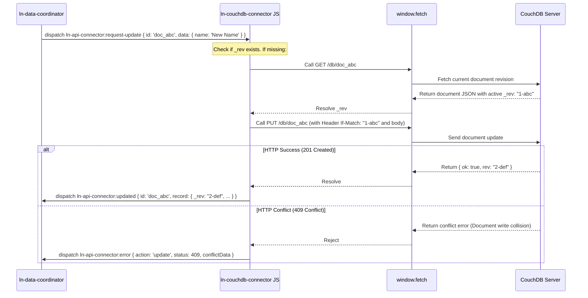

# 🔗 ln-couchdb-connector
> **Класификација:** 🌐 Инфраструктурна компонента (Layer 1 - Network/CouchDB Client)

---

## 1. Заднинско дејство и одговорност
`ln-couchdb-connector` (со алијас `lnConnector` за 3-слојна компатибилност) е специјализирана мрежна компонента дефинирана во [`js/ln-couchdb-connector/src/ln-couchdb-connector.js`](../../js/ln-couchdb-connector/src/ln-couchdb-connector.js) наменета за директна комуникација со **CouchDB** NoSQL бази на податоци преку нивниот нативен REST API интерфејс.

*   **Главна Одговорност:** Делува како мрежен драјвер кој ги преведува CustomEvents барањата во CouchDB-специфични HTTP повици. Нема сопствена база или кориснички интерфејс.
*   **Усогласување на NoSQL шема:** CouchDB ги идентификува записите преку `_id` и `_rev`. Конекторот автоматски ги нормализира во рамни својства `id` за усогласување со останатите компоненти во системот.
*   **Делта синхронизација (Changes Feed):** Нативно се поврзува со CouchDB настански тек `/{db}/_changes?include_docs=true` користејќи ја последната секвенцијална вредност (`last_seq`) како `since` параметри.
*   **Автоматско разрешување ревизии:** При PUT или DELETE, доколку во објектот недостига моменталната ревизија `_rev`, конекторот автоматски прави претходен GET повик во позадина за да ја преземе последната ревизија од серверот.
*   **Унифицирана обвивка (Response Envelope unwrap):** Поддржува препознавање на `{message, content}` обвивката, доколку постои proxy/gateway кој ги пакува одговорите.

> [!IMPORTANT]
> **Што `ln-couchdb-connector` НЕ прави (Orthogonality Doctrine):**
> * **НЕ зачувува локална состојба** — тоа е одговорност на `ln-data-store`.
> * **НЕ спроведува бизнис логика** — не знае кој ресурс се брише или модифицира.

---

## 2. Минимален HTML Маркап и Варијанти на Употреба

### Базен HTML Маркап
```html
<div data-ln-couchdb-connector="users"
     data-ln-couchdb-url="http://127.0.0.1:5984"
     data-ln-couchdb-db="app_users"
     id="users-connector">
</div>
```

---

## 3. Декларативен API Договор (Атрибути и Настани)

### HTML Атрибути
| Атрибут | Тип | Опис |
| :--- | :--- | :--- |
| `data-ln-couchdb-connector` | `String` | Го активира компонентот и го дефинира името на конекторот. |
| `data-ln-couchdb-url` | `String` | Основната URL адреса на CouchDB серверот (на пр. `http://localhost:5984`). |
| `data-ln-couchdb-db` | `String` | Името на CouchDB базата на податоци. |
| `data-ln-couchdb-auth` | `String` | Токен за Basic Authentication во Base64 формат (дискурабилно поради безбедност). |
| `data-ln-couchdb-headers` | `String` | Запирка-одделени HTTP заглавија за сите повици. |

### DOM Барања (Слуша)
*Слуша настани со префикси `ln-couchdb-connector:...`, `ln-api-connector:...` и `ln-rest-connector:...`*
| Настан | Payload `e.detail` | Опис |
| :--- | :--- | :--- |
| `:request-sync` / `:request-fetch` | `{ since: String, meta: Object }` | Вчитување на промените од changes feed. |
| `:request-create` | `{ data: Object, tempId: String, meta: Object }` | Креирање документ преку `POST /{db}`. |
| `:request-update` | `{ id: ID, data: Object, expected_version: String, meta: Object }` | Измена на документ преку `PUT /{db}/{id}`. |
| `:request-delete` | `{ id: ID, rev: String, meta: Object }` | Бришење документ преку `DELETE /{db}/{id}?rev={rev}`. |
| `:request-bulk-delete` | `{ ids: Array, meta: Object }` | Групно бришење на документи преку `_bulk_docs`. |

### Одговори кон DOM (Емитува)
| Настан | Payload `e.detail` | Опис |
| :--- | :--- | :--- |
| `ln-couchdb-connector:fetched` | `{ data, since, meta }` | Вратени документи и избришани IDs од changes feed. |
| `ln-couchdb-connector:created` | `{ record, tempId, message, meta }` | Успешно зачуван нов документ. |
| `ln-couchdb-connector:updated` | `{ record, id, message, meta }` | Успешно изменет документ. |
| `ln-couchdb-connector:deleted` | `{ response, id, message, meta }` | Успешно избришан документ. |
| `ln-couchdb-connector:bulk-deleted` | `{ response, ids, message, meta }` | Успешно избришани низа документи. |
| `ln-couchdb-connector:error` | `{ action, error, status, data, conflictData, meta }` | Мрежна грешка или конфликт при измена (HTTP 409). |

---

## 4. CSS Стилизирање и Поведенски Концепт
Како чисто логичка компонента без визуелен кориснички интерфејс (headless component), `ln-couchdb-connector` нема свои CSS класи или стилови.

---

## 5. Пристапност (ARIA) и Чести Грешки
- **Пристапност:** Бидејќи нема директна интеракција со корисникот и нема визуелен приказ, ARIA улогите и фокусот не се применуваат.
- **Анти-патерни:**
  > [!WARNING]
  > **1. Basic Auth во HTML:**
  > Чување на Basic Auth лозинки во `data-ln-couchdb-auth` е ранливо на XSS. Се препорачува користење на HttpOnly Cookie сесии или Backend Proxy.
  
  > [!WARNING]
  > **2. Игнорирање на CORS:**
  > CouchDB мора да има овозможено CORS за домените на Вашата апликација во `local.ini`.

---

## 6. Дијаграм на Текот и Животен Циклус



---

## 7. Поврзани Компоненти
- [`ln-data-coordinator.md`](./ln-data-coordinator.md) — Layer 2 координатор кој ги поврзува складиштето и овој конектор.
- [`ln-http.md`](./ln-http.md) — Мрежен слој за извршување на fetch трансакции.
