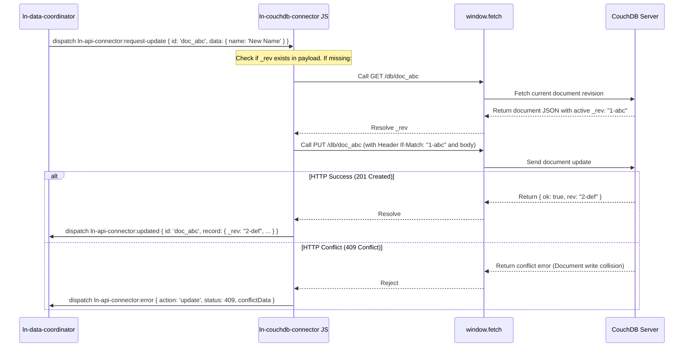

# 🔗 ln-couchdb-connector
> **Класификација:** 🌐 Инфраструктурна компонента (Layer 1 - Network/CouchDB Client)

---

## 1. Заднинско дејство и одговорност
`ln-couchdb-connector` (со алијас `lnConnector` за 3-слојна компатибилност) е специјализирана мрежна компонента наменета за директна комуникација со **CouchDB** NoSQL бази на податоци преку нивниот нативен REST API интерфејс.

*   **Главна Одговорност:** Делува како мрежен драјвер кој ги преведува генеричките CustomEvents барања за зачувување во CouchDB-специфични HTTP повици. Нема сопствена база на податоци или кориснички интерфејс.
*   **Усогласување на NoSQL шема (Document Mapping):** CouchDB ги идентификува записите преку внатрешните полиња `_id` (уникатен клуч) и `_rev` (ревизија на објектот). Конекторот автоматски ги нормализира овие полиња во рамни својства `id` за усогласување со останатите компоненти во системот.
*   **Делта синхронизација (Changes Feed):** За разлика од конвенционалните API конектори кои бараат прилагодени бекенд рути за делта-синхронизација, `ln-couchdb-connector` нативно се поврзува со наменскиот CouchDB настански тек `/{db}/_changes?include_docs=true` користејќи ја последната секвенцијална вредност (`last_seq`) како вредност за `since`.
*   **Автоматско разрешување ревизии (Auto-Revision Resolution):** При наредба за измена (`PUT`) или бришење (`DELETE`), доколку во објектот недостига моменталната ревизија `_rev`, конекторот автоматски прави претходен `GET` повик во позадина за да ја преземе последната ревизија од серверот, по што го испраќа финалното барање со соодветното `If-Match` заглавие. Ова ја штити апликацијата од грешки при истовремен внес без рачна интервенција на развивачот.
*   **Масовно бришење (Bulk Delete):** Бидејќи CouchDB нема едноставна рута за бришење низа на записи, конекторот:
    1.  Прави POST барање до `_all_docs` со низа од бараните IDs за да ги преземе моменталните верзии (`_rev`).
    2.  Ја мапира секоја ставка како `_deleted: true`.
    3.  Испраќа едно заедничко барање до `_bulk_docs` за групно бришење.

---

## 2. Минимален HTML Маркап и Варијанти на Употреба

Се поставува како невидлив елемент во DOM-от со конфигурациските патеки до CouchDB серверот.

```html
<!-- Конфигурација на конектор за локална или оддалечена CouchDB база -->
<div data-ln-couchdb-connector="orders"
     data-ln-couchdb-url="http://127.0.0.1:5984"
     data-ln-couchdb-db="app_orders"
     data-ln-couchdb-auth="YWRtaW46cGFzc3dvcmQ=" <!-- Basic Auth Base64: admin:password -->
     id="orders-connector">
</div>
```

---

## 3. Декларативен API Договор (Атрибути и Настани)

| Атрибут | Тип | Опис |
| :--- | :--- | :--- |
| `data-ln-couchdb-connector` | `String` | Го активира компонентот и го дефинира името на конекторот. |
| `data-ln-couchdb-url` | `String` | Основната URL адреса на CouchDB серверот (на пр. `http://localhost:5984`). |
| `data-ln-couchdb-db` | `String` | Името на CouchDB базата на податоци. |
| `data-ln-couchdb-auth` | `String` | Токен за Basic Authentication во Base64 формат. |
| `data-ln-couchdb-headers` | `String` | Запирка-одделени HTTP заглавија за сите повици. |

### DOM Барања (Слуша)
*Со цел целосна компатибилност и заменливост (drop-in replacement), компонентата ги слуша настаните со префикси `ln-couchdb-connector:...`, `ln-api-connector:...` и `ln-rest-connector:...`*
| Настан | Payload `e.detail` | Опис |
| :--- | :--- | :--- |
| `:request-sync` / `:request-fetch` | `{ since: String }` | Вчитување на промените од changes feed (`_changes`). |
| `:request-create` | `{ data: Object, tempId: String }` | Креирање документ преку `POST /{db}`. |
| `:request-update` | `{ id: ID, data: Object, expected_version: String }` | Измена на документ преку `PUT /{db}/{id}` (expected_version го претставува `_rev`). |
| `:request-delete` | `{ id: ID, rev: String }` | Бришење документ преку `DELETE /{db}/{id}?rev={rev}`. |
| `:request-bulk-delete` | `{ ids: Array }` | Групно бришење на документи преку `_bulk_docs`. |

### Одговори кон DOM (Емитува)
| Настан | Payload `e.detail` | Опис |
| :--- | :--- | :--- |
| `ln-couchdb-connector:fetched` | `{ data, since }` | Вратени документи и избришани IDs од changes feed, со последната ревизија `last_seq` како `since`. |
| `ln-couchdb-connector:created` | `{ record, tempId }` | Успешно зачуван нов документ со вратени `id` и `_rev`. |
| `ln-couchdb-connector:updated` | `{ record, id }` | Успешно изменет документ со нова ревизија. |
| `ln-couchdb-connector:deleted` | `{ response, id }` | Успешно избришан документ. |
| `ln-couchdb-connector:bulk-deleted` | `{ response, ids }` | Успешно избришани низа документи. |
| `ln-couchdb-connector:error` | `{ action, error, status, conflictData }` | Мрежна грешка или конфликт при измена (HTTP 409 - Document Update Conflict). |

---

## 4. CSS Стилизирање и Поведенски Концепт
Како чисто логичка компонента без визуелен кориснички интерфејс (headless component), `ln-couchdb-connector` нема свои CSS класи или стилови.

---

## 5. Пристапност (ARIA) и Чести Грешки
*   **Пристапност:** Бидејќи нема директна интеракција со корисникот и нема визуелен приказ, ARIA улогите и фокусот не се применуваат.
*   **Честа грешка 1 (CORS Block):** Доколку апликацијата се вчита од друг домен (на пр. `http://localhost:3000`), а CouchDB серверот работи на `http://localhost:5984`, прелистувачот ќе го блокира барањето поради CORS. Не заборавајте да овозможите CORS во конфигурациската датотека на CouchDB (`local.ini`) за Вашиот домен.
*   **Честа грешка 2 (Basic Auth Exposure):** Зачувување на Base64 авторизацијата во HTML атрибутот `data-ln-couchdb-auth`. Ова е лесно видливо во изворниот код. Во продукциски средини, секогаш користете заштита зад Backend Proxy Gateway кој ќе го врши потпишувањето на барањата, или овозможете Cookie-базирана авторизација на самиот CouchDB сервер.
*   **Честа грешка 3 (Прекумерни мрежни повици):** Испраќање на наредба за измена/бришење без наведена ревизија `_rev`. Иако компонентата е доволно паметна да ја преземе ревизијата со претходен `GET` повик, тоа дуплира мрежен сообраќај и ги забавува перформансите. Секогаш препорачувајте пренесување на `_rev` заедно со податоците.

---

## 6. Дијаграм на Текот и Животен Циклус (Автоматско преземање на ревизија при PUT)



---

## 7. Поврзани Компоненти
*   **`ln-data-coordinator`**: Layer 2 координатор кој може да го користи овој конектор како директна замена за `ln-api-connector` доколку бекендот е базиран на CouchDB.
*   **`ln-http`**: Мрежниот слој преку кој се извршуваат сите `fetch()` трансакции.
