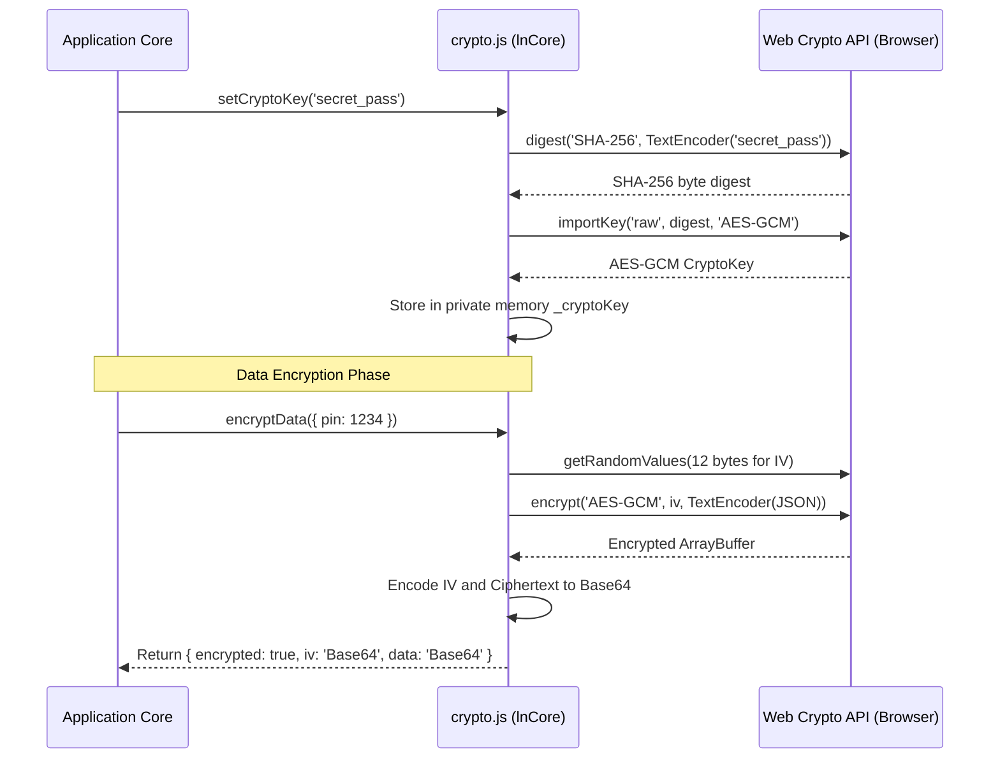

# 🔒 ln-crypto (crypto.js)
> **Класификација:** ⚛️ Core Утилит / Нискобуџетен примитив (Layer 3 - Client-side Encryption Wrapper)

---

## 1. Заднинско дејство и одговорност
`crypto.js` е заедничка нискобуџетна библиотека сместена во јадрото (`ln-core`) која обезбедува обвивка околу модерниот прелистувачки **Web Crypto API** за сигурно шифрирање и дешифрирање на податоци на страната на клиентот.

*   **Главна Одговорност:** Обезбедува едноставни асинхрони методи за симетрично шифрирање на чувствителни структури од податоци пред тие да бидат зачувани во локалните складишта (IndexedDB или LocalStorage).
*   **Стандардизирана криптографија:**
    *   **AES-GCM (Galois/Counter Mode):** Се користи за симетрично шифрирање. Обезбедува висок степен на перформанси и заштита на интегритетот (Authenticated Encryption).
    *   **SHA-256:** Се користи за деривација на криптографскиот клуч преку хаширање на почетната лозинка/тајна (`secretString`).
    *   **Рандомизиран IV (Initialization Vector):** Со секое шифрирање се генерира нов рандомизиран вектор од 12 бајти преку `crypto.getRandomValues()` за да се спречат напади со анализа на повторливи шаблони.
*   **Изолација на клучот во меморија:** Клучот се зачувува во внатрешна затворена променлива на модулот (`_cryptoKey`) која е изолирана од глобалниот опсег на прелистувачот (window), со што се спречува нејзино лесно читање преку конзола од малициозни скрипти.

---

## 2. Минимален HTML Маркап и Варијанти на Употреба

Бидејќи се работи за чисто инфраструктурен логички модул, тој се користи директно во JS компонентите.

```javascript
import { setCryptoKey, encryptData, decryptData } from '../ln-core/crypto.js';

async function testCrypto() {
    // 1. Иницијализирај клуч со тајна
    await setCryptoKey('корисничка-лозинка-123');
    
    const originalData = { secretToken: 'XYZ-ABC', pin: 9942 };
    
    // 2. Шифрирај податоци
    const encrypted = await encryptData(originalData);
    console.log(encrypted);
    // Враќа објект со Base64 текстуален приказ:
    // { encrypted: true, iv: 'abc...', data: 'xyz...' }
    
    // 3. Дешифрирај
    const decrypted = await decryptData(encrypted);
    console.log(decrypted); // Враќа: { secretToken: 'XYZ-ABC', pin: 9942 }
}
```

---

## 3. Декларативен API Договор (Атрибути и Настани)

Скриптата ги извезува следните асинхрони функции:

### `setCryptoKey(secretString)`
*   `secretString` (String): Тајната лозинка од која ќе се деривира AES клучот преку SHA-256. Проследување на `null` или празна вредност го брише активниот клуч.
*   **Враќа:** `Promise<void>`.

### `encryptData(plainData, key)`
*   `plainData` (any): Текст или JSON-серијализиран објект за шифрирање.
*   `key` (CryptoKey): Опционален клуч. Доколку се изостави, го користи клучот во меморијата деривиран со `setCryptoKey`.
*   **Враќа:** `Promise<Object>` во формат `{ encrypted: true, iv: Base64, data: Base64 }`. Доколку нема активен клуч, ги враќа оригиналните податоци недопрени.

### `decryptData(encryptedObject, key)`
*   `encryptedObject` (Object): Објект генериран од `encryptData`.
*   `key` (CryptoKey): Опционален дешифрирачки клуч.
*   **Враќа:** `Promise<any>` со оригиналниот дешифриран текст или автоматски парсиран JSON објект. Доколку клучот е неточен, враќа објект со нанесен маркер за грешка `{ ...encryptedObject, decryptionError: true }`.

---

## 4. CSS Стилизирање и Поведенски Концепт
Како логичка инфраструктура, `ln-crypto` нема визуелен приказ и нема сопствени CSS стилови.

---

## 5. Пристапност (ARIA) и Чести Грешки
*   **Пристапност:** Како чисто логички утилит без DOM манипулации, нема влијание врз пристапноста.
*   **Честа грешка 1 (Ignored Decryption Errors):** Игнорирање на својството `decryptionError`. Доколку се промени клучот за шифрирање (на пр. корисникот ја внесе лозинката погрешно), дешифрирањето ќе пропадне и методот ќе врати објект со нанесен маркер `decryptionError: true`. Доколку развивачот не го провери ова знаменце, апликацијата може да се обиде да ги прикаже шифрираните Base64 текстуални стрингови на екранот.
*   **Честа грешка 2 (Hardcoded secrets):** Чување на почетниот таен клуч (`secretString`) како статичен стринг во изворниот Javascript код. Ова го прави шифрирањето бескорисно бидејќи клучот е јавно достапен. Лозинките треба да бидат деривирани од влезни полиња на корисникот или заштитени со HTTP-only сесии.

---

## 6. Дијаграм на Текот и Животен Циклус



---

## 7. Поврзани Компоненти
*   **`ln-persist`**: Го користи `crypto.js` за шифрирање на зачуваните вредности во `localStorage` доколку е активиран сигурен режим на зачувување (secure storage).
*   **`ln-data-store`**: Може да се интегрира со овој утилит за сигурно локално шифрирање наIndexedDB кешот на апликацијата.
