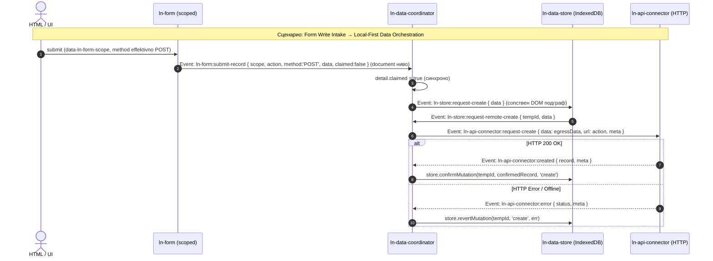

# 🌐 ln-data-coordinator

> **Класификација:** ⚙️ Координатор (Coordinator / Orchestrator)

---

## 1. Заднинско дејство и одговорност

- **Краток опис:**
  `ln-data-coordinator` е централниот координатор дефиниран во модулот [`js/ln-data-coordinator/src/ln-data-coordinator.js`](../../js/ln-data-coordinator/src/ln-data-coordinator.js) задужен за оркестрирање на податочниот слој (Local-First Architecture). Тој нема сопствено локално складиште и не иницира мрежни повици независно; неговата одговорност е **да ги набљудува, поврзува и оркестрира податочните слоеви во сопствениот DOM подграф** (`ln-data-store`, `ln-api-connector` / `ln-couchdb-connector` / `ln-websocket-connector` / `ln-rest-connector`, `ln-api-queue`) и да опслужува view компоненти кои можат да бидат било каде во документот (на пр. `ln-table`, `ln-list`, `ln-stat`, `ln-options`), слушајќи ги нивните барања на document ниво. На `document` ниво слуша и `ln-form:submit-record` — декларативниот write-влез од scoped форми (`data-ln-form-scope`), кои можат исто така да бидат било каде во DOM-от (види §3).

- **Ортогоналност (Што компонентата НЕ прави):**
  - **НЕ складира податоци во меморија или IndexedDB:** За зачувување на податоците е одговорен `ln-data-store`.
  - **НЕ извршува директен HTTP/REST/WS транспорт:** Транспортот на мрежните барања го извршуваат конекторите (препознава `data-ln-api-connector`, `data-ln-couchdb-connector`, `data-ln-rest-connector`, и `data-ln-websocket-connector`).
  - **НЕ управува со офлајн редицата:** За кеширање на барањата при прекината мрежа се грижи `ln-api-queue`.

---

## 2. Минимален HTML Маркап и Варијанти на Употреба

### Базен HTML Маркап (Local-First Data Subtree)
```html
<div data-ln-data-coordinator="users" id="users-coordinator">
    <!-- Локална база (IndexedDB) -->
    <div data-ln-data-store="users" id="users-store"></div>
    
    <!-- Мрежен транспорт (REST API) -->
    <div data-ln-api-connector="/api/users" id="users-connector"></div>
    
    <!-- Офлајн редица (опционално) -->
    <div data-ln-api-queue id="users-queue"></div>
</div>
```

### Варијанти на употреба

#### Пример 1: Обичен Податочен Координатор
Оркестрира автоматска синхронизација меѓу IndexedDB складиштето и REST API конекторот:
```html
<div data-ln-data-coordinator="products">
    <div data-ln-data-store="products"></div>
    <div data-ln-api-connector="/api/v1/products"></div>
</div>
```

#### Пример 2: Поврзување со надворешни View компоненти
View компонентите (како `ln-table`, `ln-list`, `ln-stat`) можат да се наоѓаат било каде во документот, надвор од DOM подграфот на координаторот. Тие комуницираат со координаторот преку `document` настани, поврзувајќи се преку името на store-от (на пр. `data-ln-table-store="users"`).

```html
<!-- Data Layer: Координатор -->
<div data-ln-data-coordinator="users">
    <div data-ln-data-store="users"></div>
    <div data-ln-api-connector="/api/users"></div>
</div>

<!-- View Layer: Компоненти кои го конзумираат "users" складиштето -->
<label class="search">
    <svg class="ln-icon" aria-hidden="true"><use href="#ln-search"></use></svg>
    <input type="search" 
           placeholder="Пребарај..." 
           data-ln-search="users-table" 
           aria-label="Пребарај корисници">
    <button type="button" data-ln-search-clear aria-label="Исчисти го пребарувањето">
        <svg class="ln-icon" aria-hidden="true"><use href="#ln-x"></use></svg>
    </button>
</label>

<div id="users-table" data-ln-table="users" data-ln-table-source="users" data-ln-table-store="users">
    <table>
        <!-- Координаторот ќе одговори на барањата за податоци од оваа табела -->
    </table>
</div>
```

---

## 3. Декларативен API Договор (Атрибути и Настани)

### Табела со атрибути (HTML Attributes & Properties)

| Атрибут / Својство | Елемент | Тип | Стандардна вредност | Опис |
| :--- | :--- | :--- | :--- | :--- |
| `data-ln-data-coordinator` | Обвивач | `String` | Име на складиштето | Маркер за компонентата. Го дефинира просторот за имиња. |
| `data-ln-data-mapper` | Обвивач | `String` | Име на координатор | Регистриран мапер. Реактивен е (при промена тригерира `refreshMapper()`). Ако фали, се бара мапер со името на координаторот. |
| `data-ln-data-coordinator-stale` | Обвивач | `Number/String` | `300` | Време во секунди по кое кешот е застарен. Има fallback на `data-ln-data-store-stale` / `data-ln-store-stale`. |
| `data-ln-data-coordinator-no-autosync` | Обвивач | Marker | / | Спречува автоматска синхронизација. Има fallback на `data-ln-data-store-no-autosync` / `data-ln-store-no-autosync`. |
| `lnDataCoordinator` / `lnCoordinator` | DOM Елемент | `Object` | `instance` | Референци до JS инстанцата на координаторот. |

### Настани (Events API)

#### Примени настани (Слуша од децата и од document ниво)
- `ln-store:initialized` — Иницијализација на складиштето (ако кешот е празен или застарен, прави `forceSync`).
- `ln-store:request-remote-sync` / `create` / `update` / `delete` / `bulk-delete` — Барања за мутации на серверот.
- `ln-store:ready` / `loaded` / `created` / `updated` / `deleted` / `synced` — Тригери за освежување на view компонентите (за `synced` само ако `detail.changed` е true).
- `ln-api-queue:send` — Извршување на барање од офлајн редицата.
- `ln-table:request-data`, `ln-list:request-data`, `ln-options:request-data`, `ln-stat:request-count` — Барања од view компоненти (на ниво на `document`). Се совпаѓаат преку атрибути како `data-ln-table-store`.
- `ln-form:submit-record` — **(document ниво)** Декларативен write-влез од scoped форми (`data-ln-form-scope`). Види „Form Write Intake" подолу.
- `ln-api-connector:fetched` / `:created` / `:updated` / `:deleted` / `:bulk-deleted` / `:error` (исто и под `ln-couchdb-connector:*` namespace) — Одговори од конекторот на претходно испратени `:request-*` барања (види „Транспортна врска" подолу).

#### Диспачирани настани
- `ln-table:set-data`, `ln-list:set-data`, `ln-options:set-data`, `ln-stat:set-count` — Испраќање податоци/бројачи кон view компонентите.
- `ln-table:set-loading` — Диспачиран кога податоците се бараат, но store уште не е вчитан.
- `ln-store:request-create`, `ln-store:request-update` — Кон складиштето (`storeEl`), при преземен `ln-form:submit-record` (POST → create, PUT/PATCH → update).
- `ln-api-connector:request-sync`, `:request-create`, `:request-update`, `:request-delete`, `:request-bulk-delete` — Кон конекторот (`connectorEl`), секогаш со опционален `url` и опаque `meta` (види „Транспортна врска" подолу). Единствен канал за иницирање мрежни операции — нема директни `connector.<method>()` повици.
- `ln-api-queue:request-enqueue`, `ln-api-queue:ack`, `ln-api-queue:nack`, `ln-api-queue:request-remap` — Сигнали кон офлајн редицата (на пр. `request-remap` при `create` низ редицата за менување од `tempId` во серверски id). Единствениот настан во обратната насока е `ln-api-queue:send` (види Примени настани).
- `ln-store:sync-conflict` — Диспачиран при 4xx грешка од редицата (освен 401/419 и 409 при `update`) за отфрлање и реверт.
- `ln-store:online`, `ln-store:offline` — Сигнали за мрежната состојба.

---

### Form Write Intake (`ln-form:submit-record`)

Координаторот слуша `ln-form:submit-record` на `document` ниво (бидејќи scoped форми можат да живеат било каде во DOM-от, надвор од сопствениот подграф). Настанот го презема (claim) доколку важи еден од двата услова:

* `detail.scope === this._name` (именуван override), **или**
* `detail.scope` е празно И `detail.form.closest('[data-ln-data-coordinator]') === this.dom` (containment — формата е DOM потомок на овој координатор).

При преземање, координаторот **синхроно** поставува `detail.claimed = true` (истиот dispatch циклус — `ln-form` веднаш по враќање од `dispatch()` го чита овој флаг). Потоа литерално ги толкува `detail.method` / `detail.data`, без fallback:

| `detail.method` | Дејство |
| :--- | :--- |
| `POST` | `id`/`expected_version` се вадат од `data` (и се бришат од проследениот payload); `action`-от се памети во `WeakMap` клучуван по референцата на `data` објектот; се диспачира `ln-store:request-create { data }`. |
| `PUT` / `PATCH` | `id`/`expected_version` се вадат од `data`; `action`-от се памети во `Map` клучуван по `id`; се диспачира `ln-store:request-update { id, data, expected_version }`. |
| Било кој друг (пр. `GET`) | **Игнорира се — нема дејство.** (Во пракса `ln-form` никогаш не диспачира `ln-form:submit-record` со друг метод — методскиот gate е нејзина одговорност, види [`ln-form.md`](./ln-form.md) §3.) |

Ако форма е преземена, но подграфот на координаторот нема `[data-ln-data-store]` дете, се испишува `console.warn` и настанот не произведува дејство.

Запаметениот `action` (формата на ресурсот, HTML `action` атрибутот — единствен извор на вистина за мутацискиот endpoint) подоцна се прикачува како `url` во барањето кон конекторот, откако мутацијата ќе стигне таму (директно или преку queue, каде патува во опаque-то поле `meta.action` на queue записот).

---

## 4. CSS Стилизирање и Поведенски Концепт

- `ln-data-coordinator` е чист логички координатор кој НЕ инјектира и НЕ бара специфични CSS класи за сопствениот DOM обвивач.
- **Транспортна врска = исклучиво настани, не методи.** Кон конекторот (`data-ln-api-connector` / `ln-couchdb-connector` / итн.) координаторот **никогаш** не повикува JS методи (`connector.create()`, `connector.update()`...) — секое барање е `dispatch()` на `ln-api-connector:request-*` настан, а секој одговор се консумира преку `ln-api-connector:created` / `:updated` / `:deleted` / `:bulk-deleted` / `:error` / `:fetched` (генерализирано и под `ln-couchdb-connector:*` namespace). Ова прави го конекторот заменлив — секој елемент што го зборува истиот евент вокабулар може да биде транспорт.
- Кон **складиштето** (`ln-data-store`), координаторот сепак повикува JS методи директно (`store.applySync()`, `store.confirmMutation()`, `store.revertMutation()`, `store.resolveConflict()`, `store.getById()`, `store.forceSync()`) — оваа врска не е засегната од рефакторот, бидејќи `ln-data-store` е storage-blind и нема сопствен event-driven request/response договор за мутации.
- Корелација без Promise: секое `:request-*` барање кон конекторот носи opaque `meta` поле (содржи `entryId`, `queued: true/false`, `op`, и `tempId`/`id`/`bulkKey` зависно од операцијата); одговорот го echo-ира истото `meta` непроменето. `meta.queued` разликува дали одговорот треба да заврши со `ack`/`nack` кон редицата (queue-присутен пат) или со директно `confirmMutation`/`revertMutation`/`resolveConflict` (queue-отсутен пат) — истата логика која порано живееше во `.then()/.catch()` синхронизациски блокови сега живее во споделени `conn*` слушатели на одговорите.

### Вградени Политики на Однесување (Behaviors)
- **Иницијална Синхронизација:** Координаторот извршува `forceSync` доколку при `ln-store:initialized` кешот е празен ИЛИ застарен.
- **Autosync:** Автоматски се извршува синхронизација на `visibilitychange` на документот (доколку табот стане видлив и кешот е застарен) како и при враќање `online`.
- **Офлајн Queue и Таксономија на Грешки:**
  - `401` / `419` (Auth Errors) → Се диспачира `nack` (паузирање на редицата).
  - `409` (Conflict при update) → Се повикува `resolveConflict(id, remoteRecord, fieldDiffs)` и барањето се отфрла (drop).
  - Останати `4xx` грешки → Се диспачира `ln-store:sync-conflict`, се повикува реверт, барањето се отфрла и се прави `forceSync`.
  - `5xx` или Мрежна грешка → Се диспачира `nack` (повторен обид подоцна).

---

## 5. Пристапност (ARIA) и Чести Грешки

### 5.1 ARIA & Навигација
Координаторот е невидлив, чисто логички елемент — нема сопствени ARIA улоги ниту манипулира со ARIA атрибути. Пристапноста на прикажаните податоци е одговорност на view компонентите (`ln-table`, `ln-list`, `ln-stat`) кои ги примаат неговите `set-data` / `set-count` настани.

### 5.2. Чести Грешки (Anti-Patterns / Common Pitfalls)

> [!CAUTION]
> **1. Мешање на локални и надворешни деца**
> `ln-data-coordinator` ги открива своите основни слоеви (`ln-data-store`, `ln-api-connector`, `ln-api-queue`) исклучиво во својот сопствен DOM подграф. Ако тие се поставени надвор, координацијата нема да работи. Наспроти нив, **view компонентите** (`ln-table`, `ln-list` итн.) **може да се наоѓаат било каде во документот**, бидејќи координаторот слуша за нивните настани на `document` ниво и ги поврзува преку store името (пр. `data-ln-table-store`).

> [!WARNING]
> **2. Користење на депрецирани инлајн мапери `<script data-ln-mapper>`**
> Инлајн скрипт маперите се отстранети поради XSS ранливости (`eval`). Секогаш регистрирајте ги вашите мапери безбедно преку `window.lnCore.registerDataMapper(...)`.

> [!TIP]
> **3. Автоматско управување со грешки (Rollback/Conflict)**
> За разлика од рачните координатори, `ln-data-coordinator` автоматски ги менаџира грешките: при мрежна грешка повикува `revertMutation()`, а при 409 конфликт повикува `resolveConflict()`. Консумерот не треба рачно да имплементира логика за враќање на оригиналната состојба.

---

## 6. Дијаграм на Текот и Животен Циклус



---

## 7. Поврзани Компоненти

- [`ln-data-store.md`](./ln-data-store.md) — Локалното IndexedDB складиште што координаторот го синхронизира со серверот.
- [`ln-table.md`](./ln-table.md) — View компонента за табели; бара податоци со `ln-table:request-data`, прима `ln-table:set-data`.
- [`ln-list.md`](./ln-list.md) — View компонента за листи; истиот договор како табелата (`ln-list:*`).
- [`ln-search.md`](./ln-search.md) — Влез за пребарување поврзан со табела; параметрите за пребарување патуваат во `request-data` барањата.
- [`ln-filter.md`](./ln-filter.md) — Компонента за филтрирање која испраќа барања до податочниот координатор.
- [`ln-form.md`](./ln-form.md) — Извор на `ln-form:submit-record` за scoped форми (`data-ln-form-scope`); координаторот е приемникот што го толкува суровиот payload и го рутира низ write pipeline-от.
