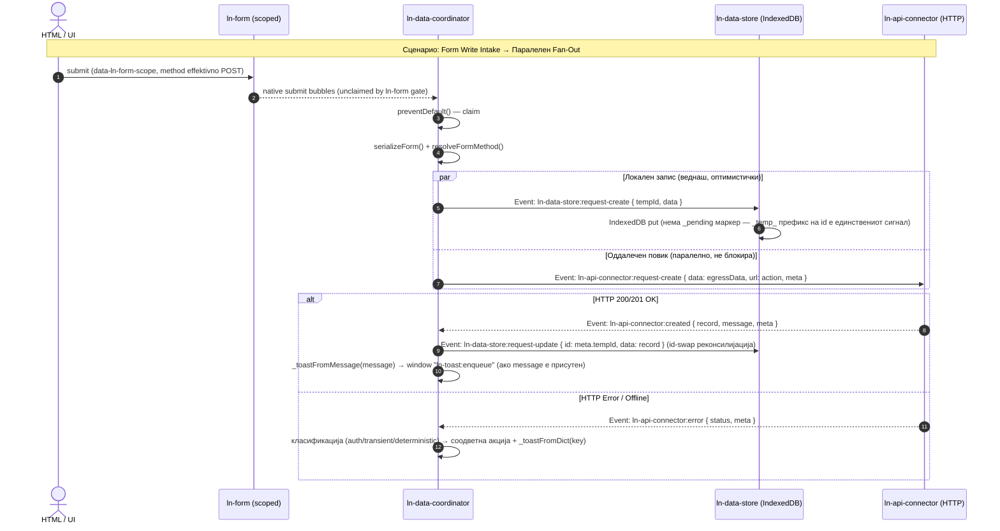

# 🌐 ln-data-coordinator

> **Класификација:** ⚙️ Координатор (Coordinator / Orchestrator)

---

## 1. Заднинско дејство и одговорност

- **Краток опис:**
  `ln-data-coordinator` е централниот координатор дефиниран во модулот [`js/ln-data-coordinator/src/ln-data-coordinator.js`](../../js/ln-data-coordinator/src/ln-data-coordinator.js) задужен за оркестрирање на податочниот слој (Local-First Architecture). Тој нема сопствено локално складиште и не иницира мрежни повици независно; неговата одговорност е **да ги набљудува, поврзува и оркестрира податочните слоеви во сопствениот DOM подграф** (`ln-data-store`, `ln-api-connector` / `ln-couchdb-connector` / `ln-websocket-connector` / `ln-rest-connector`, `ln-api-queue`) и да опслужува view компоненти кои можат да бидат било каде во документот (на пр. `ln-table`, `ln-list`, `ln-stat`, `ln-options`), слушајќи ги нивните барања на document ниво. На `document` ниво слуша и native `submit` (bubble фаза, преземено преку `preventDefault()`) — декларативниот write-влез од scoped форми (`data-ln-form-scope`), кои можат исто така да бидат било каде во DOM-от (види §3).

- **Ортогоналност (Што компонентата НЕ прави):**
  - **НЕ складира податоци во меморија или IndexedDB:** За зачувување на податоците е одговорен `ln-data-store`.
  - **НЕ извршува директен HTTP/REST/WS транспорт:** Транспортот на мрежните барања го извршуваат конекторите (препознава `data-ln-api-connector`, `data-ln-couchdb-connector`, `data-ln-rest-connector`, и `data-ln-websocket-connector`).
  - **НЕ управува со офлајн редицата:** За кеширање на барањата при прекината мрежа се грижи `ln-api-queue`.

---

## 2. Минимален HTML Маркап и Варијанти на Употреба

### Базен HTML Маркап (Local-First Data Subtree)
```html
<ul data-ln-data-coordinator="users" id="users-coordinator" hidden>
    <!-- Локална база (IndexedDB) -->
    <li data-ln-data-store="users" id="users-store"></li>
    
    <!-- Мрежен транспорт (REST API) -->
    <li data-ln-api-connector="/api/users" id="users-connector"></li>
    
    <!-- Офлајн редица (опционално) -->
    <li data-ln-api-queue id="users-queue"></li>
</ul>
```

### Варијанти на употреба

#### Пример 1: Обичен Податочен Координатор
Оркестрира автоматска синхронизација меѓу IndexedDB складиштето и REST API конекторот:
```html
<ul data-ln-data-coordinator="products" hidden>
    <li data-ln-data-store="products"></li>
    <li data-ln-api-connector="/api/v1/products"></li>
</ul>
```

#### Пример 2: Поврзување со надворешни View компоненти
View компонентите (како `ln-table`, `ln-list`, `ln-stat`) можат да се наоѓаат било каде во документот, надвор од DOM подграфот на координаторот. Тие комуницираат со координаторот преку `document` настани, поврзувајќи се преку името на store-от (на пр. `data-ln-table-store="users"`).

```html
<!-- Data Layer: Координатор -->
<ul data-ln-data-coordinator="users" hidden>
    <li data-ln-data-store="users"></li>
    <li data-ln-api-connector="/api/users"></li>
</ul>

<!-- View Layer: Компоненти кои го конзумираат "users" складиштето -->
<label class="search">
    <svg class="ln-icon" aria-hidden="true"><use href="#ln-search"></use></svg>
    <input type="search" 
           placeholder="Пребарај..." 
           data-ln-search="users-table" 
           aria-label="Пребарај корисници">
    <button type="button" data-ln-search-clear aria-label="Исчисти го пребарувањето">
        <svg class="ln-icon" aria-hidden="true"><use href="#ln-x"></use></svg>
    </button>
</label>

<div id="users-table" data-ln-table="users" data-ln-table-source="users" data-ln-table-store="users">
    <table>
        <!-- Координаторот ќе одговори на барањата за податоци од оваа табела -->
    </table>
</div>
```

---

## 3. Декларативен API Договор (Атрибути и Настани)

### Табела со атрибути (HTML Attributes & Properties)

| Атрибут / Својство | Елемент | Тип | Стандардна вредност | Опис |
| :--- | :--- | :--- | :--- | :--- |
| `data-ln-data-coordinator` | Обвивач | `String` | Име на складиштето | Маркер за компонентата. Го дефинира просторот за имиња. |
| `data-ln-data-mapper` | Обвивач | `String` | Име на координатор | Регистриран мапер. Реактивен е (при промена тригерира `refreshMapper()`). Ако фали, се бара мапер со името на координаторот. |
| `data-ln-data-coordinator-stale` | Обвивач | `Number/String` | `300` | Време во секунди по кое кешот е застарен. Има fallback на `data-ln-data-store-stale` / `data-ln-store-stale`. |
| `data-ln-data-coordinator-no-autosync` | Обвивач | Marker | / | Спречува автоматска синхронизација. Има fallback на `data-ln-data-store-no-autosync` / `data-ln-store-no-autosync`. |
| `lnDataCoordinator` / `lnCoordinator` | DOM Елемент | `Object` | `instance` | Референци до JS инстанцата на координаторот. |

### Настани (Events API)

#### Примени настани (Слуша од децата и од document ниво)
- `ln-data-store:initialized` — Иницијализација на складиштето (ако кешот е празен или застарен, прави `forceSync`).
- `ln-data-store:request-remote-sync` — Барање за delta sync кон серверот (единствениот преостанат `request-remote-*` настан; `create`/`update`/`delete`/`bulk-delete` варијантите се избришани во wave-1 — заменети со `ln-data-coordinator:request-*` intake настани, види подолу).
- `ln-data-coordinator:request-create` `{ data, action }` / `:request-update` `{ id, data, expected_version, action }` / `:request-delete` `{ id }` / `:request-bulk-delete` `{ ids }` — **(на `this.dom`)** Јавни intake настани за паралелен fan-out (локален store запис + оддалечен connector/queue повик во ист синхрон handler). Алтернатива на native-submit intake-от за не-форма извори (пр. row-action копче во табела).
- `ln-data-store:ready` / `loaded` / `created` / `updated` / `deleted` / `synced` — Тригери за освежување на view компонентите (за `synced` само ако `detail.changed` е true).
- `ln-api-queue:send` — Извршување на барање од офлајн редицата.
- `ln-table:request-data`, `ln-list:request-data`, `ln-options:request-data`, `ln-stat:request-count` — Барања од view компоненти (на ниво на `document`). Се совпаѓаат преку атрибути како `data-ln-table-store`.
- native `submit` (document ниво, bubble фаза, преземено преку `preventDefault()`) — Декларативен write-влез од scoped форми (`data-ln-form-scope`). Види „Form Write Intake" подолу.
- `ln-api-connector:fetched` / `:created` / `:updated` / `:deleted` / `:bulk-deleted` / `:error` (исто и под `ln-couchdb-connector:*` namespace) — Одговори од конекторот на претходно испратени `:request-*` барања (види „Транспортна врска" подолу).

#### Диспачирани настани
- `ln-table:set-data`, `ln-list:set-data`, `ln-options:set-data`, `ln-stat:set-count` — Испраќање податоци/бројачи кон view компонентите.
- `ln-table:set-loading` — Диспачиран кога податоците се бараат, но store уште не е вчитан.
- `ln-data-store:request-create`, `ln-data-store:request-update`, `ln-data-store:request-delete`, `ln-data-store:request-bulk-delete` — Кон складиштето (`storeEl`), при секој fan-out (form intake, `ln-data-coordinator:request-*`, ИЛИ server-response реконсилијација — id-swap на create, server-wins на 409 update).
- `ln-api-connector:request-sync`, `:request-create`, `:request-update`, `:request-delete`, `:request-bulk-delete` — Кон конекторот (`connectorEl`, генерализирано и под `ln-couchdb-connector:*`), секогаш со опционален `url` и опаque `meta` (види „Транспортна врска" подолу). Единствен канал за иницирање мрежни операции — нема директни `connector.<method>()` повици.
- `ln-api-queue:request-enqueue`, `ln-api-queue:ack`, `ln-api-queue:nack`, `ln-api-queue:request-remap` — Сигнали кон офлајн редицата (на пр. `request-remap` при `create` низ редицата за менување од `tempId` во серверски id). Единствениот настан во обратната насока е `ln-api-queue:send` (види Примени настани).
- `ln-toast:enqueue` (на `window`) — Success toast од серверскиот `{message, content}` envelope (преку `_toastFromMessage`); error toast од `data-ln-data-coordinator-dict` (клучеви: `auth`, `network`, `conflict`, `rejected`, преку `_toastFromDict`). `ln-data-store:sync-conflict` е ИЗБРИШАН во wave-1 — веќе не постои.
- `ln-data-store:online`, `ln-data-store:offline` — Сигнали за мрежната состојба.

---

### Form Write Intake (native `submit`, преземен преку `preventDefault()`)

Координаторот слуша native `submit` на `document` ниво (bubble фаза — никогаш capture, за validation gate-от на `ln-form` секогаш прво да заврши). На секој submit што минува преку bubble:

1. `if (e.defaultPrevented) return` — или `ln-form`-от го блокирал невалидниот submit, или веќе постои друг координатор што го презел.
2. Го чита `data-ln-form-scope` од `e.target` (формата). Отсутен → формата никогаш не се пријавила; native submit-от продолжува непроменето.
3. Го презема доколку важи еден од двата услова: `detail.scope === this._name` (именуван override), **или** scope е празно И формата е DOM потомок на овој координатор (containment) — идентични правила како порано.
4. Сам го чита ефективниот метод (hidden `_method` input ако присутен и непразен, инаку `form.method`) — литерално читање, без fallback, идентично со гејтот на `ln-form`.
5. Метод различен од `POST`/`PUT`/`PATCH` се остава непроменет — native submit-от продолжува (пр. `GET` форма за пребарување вгнездена во координаторот).
6. Дури сега повикува `e.preventDefault()` — ова Е преземањето, нема посебен `claimed` флаг.
7. Сам ја серијализира формата (`serializeForm`, отстранувајќи `_method`/`_token`) и го толкува суровиот `{ action, method, data }` идентично како порано: `id`/`expected_version` се вадат од `data`, `action`-от (моменталниот HTML `action` атрибут, `form.getAttribute('action')`) патува директно како аргумент до fan-out повикот — нема повеќе `WeakMap`/`Map` книговодство.

Ако форма е преземена, но подграфот на координаторот нема `[data-ln-data-store]` дете, се испишува `console.warn` и настанот не произведува дејство.

**Непреземени scoped форми** (погрешно име на scope, или не се содржани во никаков координатор) поминуваат како обичен native submit — нема console warning, нема тивко JS пресретнување. Ова е progressive-enhancement fallback-от.

---

## 4. CSS Стилизирање и Поведенски Концепт

### SCSS Миксини & Класи
- **Невизуелен елемент:** Бидејќи `ln-data-coordinator` е исклучиво логички (headless) координатор со `hidden` атрибут во DOM, тој **нема визуелен слој и нема никаков соодветен SCSS или CSS стил**.

### Поведенски Концепти

- **Комуникација базирана на настани (Event-Driven Architecture):**
  Координаторот не повикува директно JavaScript методи на складиштата или конекторите. Сите мутации на податоци се одвиваат преку стандардни DOM настани:
  - **Кон конекторот:** Мутациите патуваат како `ln-api-connector:request-*` настани, а конекторот враќа соодветни `:created`, `:updated`, `:deleted` одговори. Ова го прави транспортот лесно заменлив (REST API, CouchDB, WebSockets итн.).
  - **Кон складиштето (IndexedDB):** Мутациите се праќаат преку `ln-data-store:request-*` настани. Директните повици кон `store` објектот се користат само за не-мутациски операции (пр. `store.getAll()`, `store.count()`).

- **Асинхрона корелација без Promise:**
  Наместо Promise објекти, координаторот користи **корелација преку метаподатоци (`meta`)**:
  - Секое `:request-*` барање кон конекторот содржи `meta` поле (со `tempId`, `entryId`, `op`).
  - Конекторот го враќа истиот `meta` објект непроменет во својот одговор.
  - Ова му овозможува на координаторот да ја поврзе реакцијата со соодветното локално барање (на пр. за замена на локален `tempId` со серверскиот ID во складиштето или за `ack`/`nack` сигналот кон офлајн редицата).

### Вградени Политики на Однесување (Behaviors)
- **Иницијална Синхронизација:** Координаторот извршува `forceSync` доколку при `ln-data-store:initialized` кешот е празен ИЛИ застарен.
- **Autosync:** Автоматски се извршува синхронизација на `visibilitychange` на документот (доколку табот стане видлив и кешот е застарен) како и при враќање `online`.
- **Офлајн Queue и Таксономија на Грешки:**
  - `401` / `419` (Auth) → `nack` со reason `auth` (паузирање на редицата) + toast од dict (клуч `auth`).
  - `409` (Conflict при update) → server-wins: обична `ln-data-store:request-update` со серверскиот запис (ако одговорот носи `data.remote`), барањето се отфрла (drop) + toast од dict (клуч `conflict`). Нема `resolveConflict` — методот е избришан во wave-1.
  - Останати `4xx` (детерминистички) → никогаш retry: create-reject прави обична `ln-data-store:request-delete` на `tempId`; останатите остануваат локални до следен sync; drop + toast од dict (клуч `rejected`). Нема `ln-data-store:sync-conflict`, нема реверт, нема автоматски `forceSync`.
  - `5xx` / Мрежна грешка (транзиентни) → `nack` со reason `retry` (backoff ladder во `ln-api-queue`); локалните податоци НИКОГАШ не се бришат; toast (dict клуч `network`) само при терминален `ln-api-queue:failed`.

---

## 5. Пристапност (ARIA) и Чести Грешки

### 5.1 ARIA & Навигација
Координаторот е невидлив, чисто логички елемент — нема сопствени ARIA улоги ниту манипулира со ARIA атрибути. Пристапноста на прикажаните податоци е одговорност на view компонентите (`ln-table`, `ln-list`, `ln-stat`) кои ги примаат неговите `set-data` / `set-count` настани.

### 5.2. Чести Грешки (Anti-Patterns / Common Pitfalls)

> [!CAUTION]
> **1. Мешање на локални и надворешни деца**
> `ln-data-coordinator` ги открива своите основни слоеви (`ln-data-store`, `ln-api-connector`, `ln-api-queue`) исклучиво во својот сопствен DOM подграф. Ако тие се поставени надвор, координацијата нема да работи. Наспроти нив, **view компонентите** (`ln-table`, `ln-list` итн.) **може да се наоѓаат било каде во документот**, бидејќи координаторот слуша за нивните настани на `document` ниво и ги поврзува преку store името (пр. `data-ln-table-store`).

> [!WARNING]
> **2. Користење на депрецирани инлајн мапери `<script data-ln-mapper>`**
> Инлајн скрипт маперите се отстранети поради XSS ранливости (`eval`). Секогаш регистрирајте ги вашите мапери безбедно преку `window.lnCore.registerDataMapper(...)`.

> [!TIP]
> **3. Автоматска класификација на грешки (Determinism Policy)**
> `ln-data-coordinator` ги класифицира серверските грешки по `status`: **auth** (401/419) → toast + queue pause; **transient** (0/5xx) → queue retry (ladder), toast само на терминален неуспех (`ln-api-queue:failed`); **deterministic** (4xx/409) → никогаш retry — 409 на update прави server-wins `ln-data-store:request-update` (ако одговорот носи `data.remote`), create-reject прави `ln-data-store:request-delete` на `tempId`, останатите 4xx остануваат локални до следен sync. Секоја гранка завршува со `_toastFromDict(key)` (клучеви: `auth`/`network`/`conflict`/`rejected`). Нема повеќе `revertMutation()`/`resolveConflict()` — тие методи се избришани.

---

## 6. Дијаграм на Текот и Животен Циклус



---

## 7. Поврзани Компоненти

- [`ln-data-store.md`](./ln-data-store.md) — Локалното IndexedDB складиште што координаторот го синхронизира со серверот.
- [`ln-table.md`](./ln-table.md) — View компонента за табели; бара податоци со `ln-table:request-data`, прима `ln-table:set-data`.
- [`ln-list.md`](./ln-list.md) — View компонента за листи; истиот договор како табелата (`ln-list:*`).
- [`ln-search.md`](./ln-search.md) — Влез за пребарување поврзан со табела; параметрите за пребарување патуваат во `request-data` барањата.
- [`ln-filter.md`](./ln-filter.md) — Компонента за филтрирање која испраќа барања до податочниот координатор.
- [`ln-form.md`](./ln-form.md) — Гејтира валидност на scoped форми (`data-ln-form-scope`); координаторот го презема нативниот `submit` (preventDefault), сам го серијализира и го рутира низ write pipeline-от.
