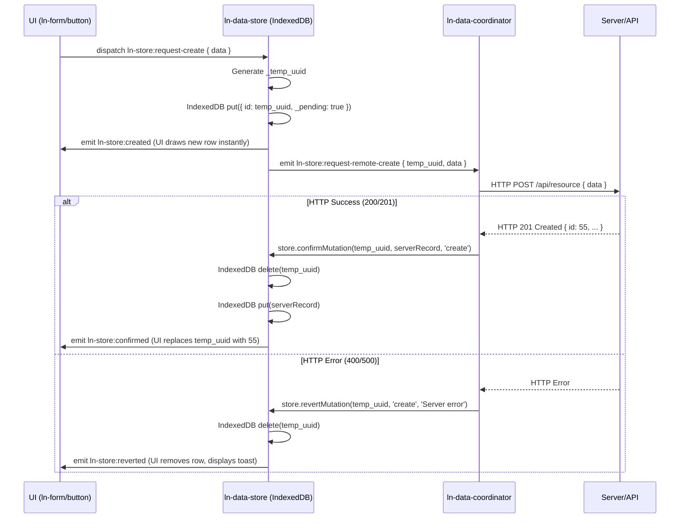

# 📦 ln-data-store
> **Класификација:** 🟢 Едноставна компонента / Локална База (Layer 1 - Data/Cache)

---

## 1. Заднинско дејство и одговорност
`ln-data-store` е компонента која делува како локална база на податоци (Local Database Cache), изградена врз нативната `IndexedDB` технологија. 

*   **Примарна Улога:** Обезбедува моќна офлајн поддршка и инстантни (оптимистички) UI мутации за апликацијата. Содржи in-memory query мотор за сортирање, филтрирање и полнотекстуално пребарување на податоците локално.
*   **Слепа за Мрежа (Network-Blind):** Има строга поделба на одговорностите. Оваа компонента не прави HTTP повици и не знае API рути. Врската со серверот се остварува исклучиво преку проектен координатор (најчесто `ln-data-coordinator`), со кој комуницира преку CustomEvents.
*   **Оптимистичко Зачувување (Optimistic Pipeline):** При налог за креирање, менување или бришење податоци, веднаш ја ажурира локалната IndexedDB база (користејќи генерирани `_temp_uuid` клучеви за нови записи и маркер `_pending: true`). Веднаш емитува настан кон UI-от (на пр. `ln-table`) за да се ажурира екранот инстантно, а потоа испраќа барање (`request-remote-...`) до координаторот за мрежна синхронизација во позадина.
*   **Rollback и Conflict Resolution:** Доколку мрежната синхронизација пропадне (пр. корисникот е офлајн или серверот враќа грешка), има вградени механизми за враќање на претходната состојба (`revertMutation`) со што се поништуваат промените.
*   **Енкрипција:** Поддржува криптографска енкрипција на податоците во мирување, искористувајќи го `ln-core` модулот.

---

## 2. Минимален HTML Маркап и Варијанти на Употреба

Се поставува како невидлив елемент (`display: none;` или `.hidden`) во HTML-от. Може да постојат повеќе складови (табели) на една страница.

```html
<!-- Конфигурација на податочен склад за Продукти -->
<div data-ln-data-store="products" 
     data-ln-data-store-indexes="status,category" 
     data-ln-data-store-search-fields="title,description,sku"
     data-ln-data-store-stale="300"
     id="products-store"
     class="hidden">
</div>

<!-- Втор склад за Корисници -->
<div data-ln-data-store="users" 
     data-ln-data-store-search-fields="first_name,last_name,email"
     id="users-store"
     class="hidden">
</div>
```

---

## 3. Декларативен API Договор (Атрибути и Настани)

| Атрибут | Тип | Опис |
| :--- | :--- | :--- |
| `data-ln-data-store` | `String` | Го иницира компонентот и го дефинира името на складот (Object Store-от во IndexedDB). |
| `data-ln-data-store-indexes` | `String` | Запирка-одделена листа на полиња врз кои треба да се креираат IndexedDB индекси при upgrade на шемата. |
| `data-ln-data-store-search-fields` | `String` | Запирка-одделена листа на текстуални полиња кои ќе бидат пребарувани при in-memory `getAll({ search: 'query' })`. |
| `data-ln-data-store-stale` | `Integer\|never` | Време во секунди пред податоците во складот да се сметаат за застарени (default 300) и да бараат background sync од координаторот. |

### DOM Барања кон Складот (Слуша)
*Обично овие се пуштаат од други UI компоненти како `ln-form` или `ln-table` (ако поддржува inline editing).*
| Настан | Payload `e.detail` | Опис |
| :--- | :--- | :--- |
| `ln-store:request-create` | `{ data: Object }` | Инструкција за оптимистичко креирање. Генерира temp UUID, зачувува локално и пушта remote-create. |
| `ln-store:request-update` | `{ id: ID, data: Object, expected_version: Int }` | Инструкција за оптимистичка измена. |
| `ln-store:request-delete` | `{ id: ID }` | Инструкција за оптимистичко бришење. |
| `ln-store:request-bulk-delete` | `{ ids: [ID] }` | Инструкција за масовно бришење. |

### Настани кон UI (Емитува - State Changed)
*Овие се набљудуваат од визуелните компоненти за реактивно прецртување.*
| Настан | Payload `e.detail` | Опис |
| :--- | :--- | :--- |
| `ln-store:created` | `{ store, record, tempId }` | Локално зачуван нов запис. |
| `ln-store:updated` | `{ store, record, previous }` | Локално изменет запис. |
| `ln-store:deleted` | `{ store, id \| ids }` | Локално избришан запис/и. |
| `ln-store:synced` | `{ store, added, deleted, changed }` | Серверска синхронизација успешно применета. |
| `ln-store:reverted` | `{ store, action, record, error }` | Откажана оптимистичка мутација бидејќи мрежата пропадна. |

### Настани кон Координаторот (Емитува - Network Requests)
*Овие ги слуша само координаторот (`ln-data-coordinator`).*
| Настан | Payload `e.detail` | Опис |
| :--- | :--- | :--- |
| `ln-store:request-remote-create` | `{ tempId, data }` | Барање да се HTTP POST-ира `data` и да се разреши `tempId`. |
| `ln-store:request-remote-update` | `{ id, data, expected_version }` | Барање за HTTP PATCH/PUT. |
| `ln-store:request-remote-delete` | `{ id }` | Барање за HTTP DELETE. |
| `ln-store:request-remote-sync` | `{ since: Timestamp }` | Барање за Delta Sync на промените од серверот. |

### Јавен JS API (преку `el.lnDataStore`)
*   **`getAll(options)`**: Враќа Promise со податоци `({ data, total, filtered })`. Поддржува `filters`, `search`, `sort`, `offset`, `limit` опции изведени преку in-memory query engine.
*   **`getById(id)`**: Враќа еден запис.
*   **`applySync(upsertedRecords, deletedIds, syncedAt)`**: Прима серверски payload и го рефлектира во базата.
*   **`confirmMutation(tempIdOrId, serverRecord, action)`**: Заменува привремен `_temp_uuid` со вистински серверски запис при успешна акција.
*   **`revertMutation(tempIdOrId, action, error)`**: Го поништува оптимистичкиот настан ако серверот одбие.

---

## 4. CSS Стилизирање и Поведенски Концепт
Ова е логичка (headless) компонента и нема визуелен приказ ниту CSS класи, освен примена на `.hidden` (или `display: none`) на родителскиот елемент, кој се користи исклучиво како Event Bus точка во DOM стеблото.

---

## 5. Пристапност (ARIA) и Чести Грешки
*   **Пристапност:** Нема визуелна репрезентација, па соодветно не бара ARIA атрибути освен што треба да е скриена со `aria-hidden="true"` или `.hidden` за да не биде присутна во фокус редоследот.
*   **Честа грешка 1:** Непоставување на `data-ln-data-store-search-fields`. Без овој атрибут, in-memory `getAll({ search: 'query' })` моторот нема да знае низ кои полиња да пребарува и секогаш ќе враќа празни резултати.
*   **Честа грешка 2:** Очекување дека компонентата сама ќе комуницира со API. Ако немате закачен координатор (`ln-data-coordinator`) кој ги слуша мрежните барања, податоците ќе останат исклучиво во локалната база со маркер `_pending: true` и никогаш нема да стигнат до серверот.
*   **Честа грешка 3:** `QuotaExceededError`. Се случува ако се обидувате да складирате масивни фајлови (пр. Base64 слики) во складот. Препорачана пракса е складот да се користи само за мета-податоци (JSON), а фајловите да имаат одвоена URL патека.

---

## 6. Дијаграм на Текот и Животен Циклус (Оптимистичко Креирање)



---

## 7. Поврзани Компоненти
*   **`ln-data-coordinator`**: Layer 2 медијатор кој го "оживува" складот поврзувајќи го со REST API. Ги пресретнува `ln-store:request-remote-*` настаните и ги преведува во HTTP повици.
*   **`ln-table` / `ln-list`**: Визуелни консументи. Ги читаат податоците од складот преку `store.getAll()` и ги набљудуваат локалните `ln-store:created/updated/deleted` настани за динамички да се прецртаат без да бараат целосно освежување на страницата.
