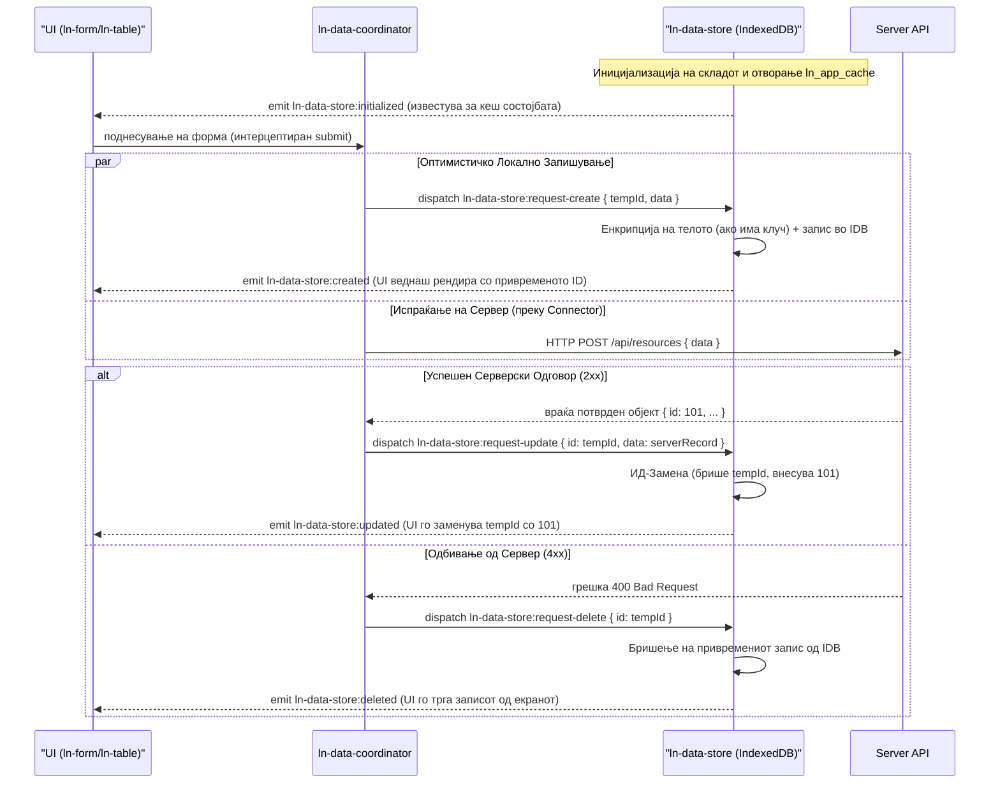

# 📦 ln-data-store
> **Класификација:** 🟢 Едноставна компонента / Локална База (Layer 1 - Data/Cache)

---

## 1. Заднинско дејство и одговорност
- **Краток опис:** `ln-data-store` е логичка (headless) компонента која служи како локална база на податоци (Database Cache Store) изградена врз стандардниот прелистувачки `IndexedDB`. Таа претставува чист клиентски кеш кој одржува записи локално, овозможува брзи in-memory пребарувања, филтрирања и сортирања, и поддржува оптимистички мутации на податоците во реално време.
- **Ортогоналност (Што компонентата НЕ прави):**
  - **Без мрежна комуникација:** Компонентата е целосно слепа за мрежата. Не содржи `fetch` логика, не разбира HTTP статусни кодови, рути или авторизациски токени. Сите мрежни активности се одговорност на `[ln-data-coordinator](./ln-data-coordinator.md)`.
  - **Без автоматско генерирање ID:** Компонентата не генерира привремени или дефинитивни идентификатори при создавање на нови записи. Создавачот на настанот за креирање е должен да обезбеди привремен идентификатор (`tempId`).
  - **Без визуелен интерфејс:** Таа не рендира никаков DOM маркап за корисникот и не управува со визуелен приказ.

---

## 2. Минимален HTML Маркап и Варијанти на Употреба

### Базен HTML маркап
Се дефинира како невизуелен локален склад за зачувување податоци:

```html
<div data-ln-data-store="documents"
     data-ln-data-store-indexes="status,department,updated_at"
     data-ln-data-store-search-fields="title,owner"
     data-ln-data-store-stale="300">
</div>
```

### Варијанти на употреба

#### Варијант 1: Склад со исклучено застарување (Cache Never Stale)
```html
<div data-ln-data-store="settings" data-ln-data-store-stale="never"></div>
```

#### Варијант 2: Заднински склад со координатор и конектор (Комплетна 3-Tier конфигурација)
```html
<ul data-ln-data-coordinator="tasks" hidden>
    <!-- Локален склад -->
    <li data-ln-data-store="tasks" 
        data-ln-data-store-indexes="due_date,priority"
        data-ln-data-store-search-fields="title,description">
    </li>
    <!-- Бекенд Конектор -->
    <li data-ln-api-connector 
        data-ln-api-base-url="/api" 
        data-ln-api-path="/tasks">
    </li>
</ul>
```

---

## 3. Декларативен API Договор (Атрибути и Настани)

### Атрибути

| Атрибут | Елемент | Тип / Вредности | Стандардно | Опис |
|---|---|---|---|---|
| `data-ln-data-store` | `div`/`li` | `String` | *Задолжително* | Името на складот во IndexedDB (алтернативно прифаќа и `data-ln-store`). |
| `data-ln-data-store-stale` | `div`/`li` | `Integer \| never \| -1` | `300` | Време во секунди пред податоците во складот да се сметаат за застарени (алтернативно `data-ln-store-stale`). |
| `data-ln-data-store-indexes` | `div`/`li` | `String` | `""` | Кома-одделена листа на IndexedDB индекси (алтернативно `data-ln-store-indexes`). |
| `data-ln-data-store-search-fields` | `div`/`li` | `String` | `""` | Кома-одделена листа на полиња во кои се пребарува преку in-memory query engine-от (алтернативно `data-ln-store-search-fields`). |

---

### Настани (Events API)

| Настан | Насока | Откажлив | Опис | `detail` Објект |
|---|---|---|---|---|
| `ln-data-store:request-create` | Слуша | Не | Оптимистичко создавање на запис. | `{ tempId: String, data: Object }` |
| `ln-data-store:request-update` | Слуша | Не | Оптимистичко ажурирање или замена на ID (rekey). | `{ id: ID, data: Object }` |
| `ln-data-store:request-delete` | Слуша | Не | Оптимистичко бришење на запис. | `{ id: ID }` |
| `ln-data-store:request-bulk-delete` | Слуша | Не | Оптимистичко масовно бришење на записи. | `{ ids: Array }` |
| `ln-data-store:initialized` | Емитува | Не | Сигнализира дека IndexedDB врската е воспоставена. | `{ store: String, hasCache: Boolean, lastSyncedAt: Number\|null, count: Number }` |
| `ln-data-store:ready` | Емитува | Не | Се емитува кога складот е подготвен со локални записи. | `{ store: String, count: Number, source: 'cache'\|'server' }` |
| `ln-data-store:loaded` | Емитува | Не | Се емитува по завршување на првата успешна синхронизација. | `{ store: String, count: Number }` |
| `ln-data-store:created` | Емитува | Не | Локално зачуван нов оптимистички запис. | `{ store: String, record: Object, tempId: String }` |
| `ln-data-store:updated` | Емитува | Не | Локално изменет запис (или извршена замена на ID). | `{ store: String, record: Object, previous: Object }` |
| `ln-data-store:deleted` | Емитува | Не | Бришење на запис или записи од складот. | `{ store: String, id: ID }` или `{ store: String, ids: Array }` |
| `ln-data-store:synced` | Емитува | Не | Успешно применети серверски делта промени. | `{ store: String, added: Number, deleted: Number, changed: Boolean }` |
| `ln-data-store:destroyed` | Емитува | Не | Складот е уништен и расчистен од DOM. | `{ store: String }` |
| `ln-data-store:quota-exceeded` | Емитува | Не | *Се диспачира на `document`* при надминување на квотата во базата. | `{ error: Error }` |

---

### Јавен JS API (достапен на `el.lnDataStore`)
- **`getAll(options)`**: Враќа `Promise` со објект `{ data, total, filtered }`. Пребарува in-memory со поддршка за `sort` (`{ field, direction }`), `filters` (`{ field: Array }`), `search` (`String`), `offset` и `limit`. Сортирањето користи `Intl.Collator` со `{ numeric: true, sensitivity: 'base' }` и ги позиционира `null`/`undefined` вредностите на крајот (или почетокот при опаѓачко).
- **`getById(id)`**: Враќа `Promise` со единечен запис (украсен со presenters) или `null`.
- **`count(filters)`**: Враќа `Promise` со бројот на записи (филтрирани или вкупни).
- **`aggregate(field, fn)`**: Извршува агрегација (`'count'`, `'sum'`, или `'avg'`).
- **`setPresenters(presenters)`**: Регистрира декоратори за виртуелни пресметани полиња (на пр. `{ computed: { display_name: r => r.first_name + ' ' + r.last_name } }`).
- **`applySync(upsertedRecords, deletedIds, syncedAt)`**: Применува серверски промени и ги зачувува мета-податоците.
- **`forceSync()`**: Диспачира `ln-data-store:request-remote-sync` за рачна синхронизација.
- **`fullReload()`**: Расчистува сè од IndexedDB складот и започнува нова синхронизација.
- **`destroy()`**: Извршува комплетно расчистување на слушателите и меморијата.

#### Глобални методи (на `window.lnDataStore`):
- **`window.lnDataStore.clearAll()`**: Ги расчистува сите регистрирани IndexedDB складови во `ln_app_cache`.
- **`window.lnDataStore.setStorageKey(key)`**: Ја поставува лозинката за рекордно шифрирање.

---

## 4. CSS Стилизирање и Поведенски Концепт
Како headless/логичка компонента, `ln-data-store` нема своја визуелна репрезентација и соодветно нема SCSS/CSS класи за стилизирање. Конструкцијата се користи чисто како Event Bus во DOM структурата. Примарниот HTML елемент се скрива со `display: none` или `.hidden` / `aria-hidden="true"`.

---

## 5. Пристапност (ARIA) и Чести Грешки
- **Пристапност:** Бидејќи елементот нема визуелна улога, тој мора секогаш да биде скриен за читачите на екран користејќи `aria-hidden="true"` или `hidden` атрибут, за да не учествува во навигацискиот фокус.
- **Честа грешка 1 (Недефинирани полиња за пребарување):** Пребарувањето локално со `getAll({ search: '...' })` ќе врати празни резултати ако не е дефиниран атрибутот `data-ln-data-store-search-fields`.
- **Честа грешка 2 (Необезбеден `tempId` при креирање):** Диспачирање на `ln-data-store:request-create` без привремен `tempId` во `e.detail`. Складот не го генерира сам; тој е одговорност на креаторот (на пр. координаторот).
- **Честа грешка 3 (Очекување на авто-rollback):** `ln-data-store` нема rollback логика. Секоја оптимистичка трансакција се запишува трајно во IndexedDB. Доколку серверскиот повик пропадне, координаторот е тој што мора да испрати обратно `request-delete` за да го избрише записот.
- **Честа грешка 4 (Енкрипција):** Кога се користи шифрирање преку `window.lnCore.setStorageKey(...)`, примарното клуч-поле `id` останува отворено во IndexedDB за да може базата да индексира и пребарува. Никогаш не смее да се ставаат сензитивни податоци директно во `id`.

---

## 6. Дијаграм на Текот и Животен Циклус



---

## 7. Поврзани Компоненти
- **`[ln-data-coordinator](./ln-data-coordinator.md)`**: Layer 2 медијатор кој го оркестрира текот на податоците помеѓу складот, конекторите и надворешните API повици.
- **`[ln-table](./ln-table.md)` / `[ln-list](./ln-list.md)`**: Визуелни компоненти што рендираат комплети со податоци и реагираат на локалните store промени за инстантно прецртување.
- **`[ln-form](./ln-form.md)`**: Претставува интерфејс кој испраќа промени во податоците кои ги слуша координаторот.
- **ln-core**: Локална збирка на помошни логики (како криптографски функции за енкрипција).
