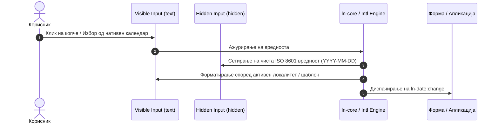

# 📅 ln-date

> **Класификација:** 🟢 Едноставна компонента (Simple Component)

---

## 1. Заднинско дејство и одговорност

`ln-date` е овозможувач за форматирање и внесување на датуми со свест за активниот локалитет (locale-aware date formatting and input handling) за нативни HTML `<input>` елементи. Имплементирана во [`js/ln-date/src/ln-date.js`](../../js/ln-date/src/ln-date.js), нејзината примарна одговорност е да овозможи пристапно и локализирано корисничко искуство при избор или рачно пишување на датуми, одржувајќи чисти ISO 8601 стрингови (`YYYY-MM-DD`) за обработка во веб-форми.

Основната одговорност на компонентата опфаќа:

* **Интелигентна DOM трансформација:** При иницијализација, го обвива нативниот инпут со контејнер `<span data-ln-date-field>`, го конвертира видливиот инпут во `type="text"`, креира скриено поле `<input type="hidden">` на кое го пренесува `name` атрибутот за испраќање форма, генерира скриен нативен избирач `<input type="date">` и додава копче со икона за отворање на календар.
* **Локализирано форматирање (Intl & Custom Tokens):** Го форматира датумот според активниот јазик (`lang` атрибутот) користејќи предефинирани клучни зборови (`short`, `medium`, `long`, со или без `datetime`) или сопствени шаблони со токени (`dd.MM.yyyy`, `yyyy-MM-dd`, `MMMM yyyy`, итн.).
* **Интелигентно рачно внесување (Typed Date Parsing on Blur):** Овозможува корисникот рачно да напише датум во видливото текстуално поле со автоматско препознавање на сепаратори (`.` Европски `dd.MM.yyyy`, `/` САД `MM/dd/yyyy`, `-` ISO/Стандарден) и соодветно стожерно пресметување на дводвоцифрени години (00–49 → 2000–2049, 50–99 → 1950–1999).
* **Синхронизација во два правци (2-Way Value Interception):** Ги пресретнува нативните `value` својства на видливото и скриеното поле за да обезбеди целосна конзистентност при програмски измени (`element.value = ...` или `element.lnDate.value = ...`).
* **Интеграција со нативен избирач (Native Browser Date Picker):** Овозможува активирање на нативниот календар на прелистувачот преку `showPicker()` API или `.click()` при клик на интегрираното копче.
* **Универзален Locale Fallback & HTML Dictionary Support:** Се интеграра со `lnCore.getLocaleFallback` и `buildDict` за автоматски и декларативен фалбек на имиња на месеци и денови доколку енџинот на прелистувачот нема нативна поддршка за бараниот локалитет.

> [!IMPORTANT]
> **Што `ln-date` НЕ прави (Orthogonality Doctrine):**
> * **НЕ гради сопствен подесен календарски поп-ап во JS/DOM:** За избор на датум се користи нативниот системски календар на прелистувачот/оперативниот систем (`input.showPicker()`).
> * **НЕ врши валидација на опсези и бизнис правила за форми:** Не проверува дали датумот е во минатото/иднината. Тоа е одговорност на [`ln-validate`](./ln-validate.md) и [`ln-form`](./ln-form.md).
> * **НЕ перзистира податоци во Storage:** За зачувување и обнова на вредностите се користи [`ln-persist`](./ln-persist.md) или [`ln-form`](./ln-form.md).
> * **НЕ халуцинира нестандардни атрибути:** Работи исклучиво преку декларативните атрибути дефинирани во нејзиниот API договор.

---

## 2. Минимален HTML Маркап и Варијанти на Употреба

### Базен HTML Маркап

```html
<div class="form-element">
    <label for="birthday">Датум на раѓање:</label>
    <input type="date" id="birthday" name="birthday" data-ln-date />
</div>
```

> [!NOTE]
> **Внатрешна DOM трансформација по иницијализација:**
> ```html
> <div class="form-element">
>     <label for="birthday">Датум на раѓање:</label>
>     <span data-ln-date-field>
>         <input type="text" id="birthday" data-ln-date />
>         <input type="hidden" name="birthday" />
>         <input type="date" tabindex="-1" style="position: absolute; opacity: 0; width: 0px; height: 0px; overflow: hidden; pointer-events: none;" />
>         <button type="button" aria-label="Open date picker">
>             <svg class="ln-icon" aria-hidden="true"><use href="#ln-calendar"></use></svg>
>         </button>
>     </span>
> </div>
> ```

---

### Варијанта 1: Форматирање со Предефинирани и Сопствени Формати

```html
<!-- Предефинирани формати -->
<input type="date" name="due_date" data-ln-date="short" />
<input type="date" name="created_at" data-ln-date="medium" />
<input type="date" name="event_date" data-ln-date="long" />

<!-- Формати со време -->
<input type="date" name="meeting" data-ln-date="medium datetime" />

<!-- Сопствен шаблон со токени -->
<input type="date" name="custom_date" data-ln-date="dd.MM.yyyy" />
```

---

### Варијанта 2: Декларативен HTML Речник за Преводи (`buildDict` & `<ul hidden>`)

За дефинирање на сопствени преводи или фалбеци за месеци и денови без JS код, се користи стандардниот Ashlar `buildDict` патерн:

```html
<ul hidden data-ln-date-dict="mk">
    <li data-ln-date-dict="months-long">јануари,февруари,март,април,мај,јуни,јули,август,септември,октомври,ноември,декември</li>
    <li data-ln-date-dict="months-short">јан,фев,мар,апр,мај,јун,јул,авг,септ,окт,ноем,дек</li>
</ul>
```

---

## 3. Декларативен API Договор (Атрибути и Настани)

### Декларативни HTML Атрибути

| Атрибут | Елементи | Тип | Стандардна вредност | Опис |
| :--- | :--- | :--- | :--- | :--- |
| `data-ln-date` | `<input>` | `String` | `"medium"` | Задава формат на приказ: `short`, `medium`, `long`, `short datetime`, `medium datetime`, `long datetime` или токен шаблон (`dd.MM.yyyy`). |

---

### Програмски JS Интерфејс (`element.lnDate`)

```javascript
const inputEl = document.querySelector('input[data-ln-date]');
const instance = inputEl.lnDate;

// Програмско земање и поставување на ISO 8601 вредноста
console.log(instance.value); // "2026-04-19"
instance.value = "2026-05-20";

// Ресетирање и уништување
instance.reset();
instance.destroy();
```

| Својство / Метод | Тип | Опис |
| :--- | :--- | :--- |
| `instance.value` | `String` | Гетер/Сетер за чиста ISO 8601 вредност (`YYYY-MM-DD`). |
| `instance.reset()` | `Function` | Ги празни сите внатрешни полиња и го враќа инпутот во почетна состојба. |
| `instance.destroy()` | `Function` | Ја отстранува DOM обвивката, ги враќа нативните атрибути и го избришува `.lnDate`. |

---

### Настани (Events API)

| Настан | Диспачиран од | Detail Податоци | Опис |
| :--- | :--- | :--- | :--- |
| `ln-date:change` | `<input>` | `{ value, date, originalEvent }` | Се диспачира при секоја промена на датумот (преку избирач, рачен внес или програмски). |

---

## 4. CSS Стилизирање и Поведенски Концепт

### Визуелно Стилизирање (SCSS / CSS)

```scss
[data-ln-date-field] {
    display: inline-flex;
    align-items: center;
    position: relative;

    input[type="text"] {
        padding-right: 2.25rem;
    }

    button {
        position: absolute;
        right: 0.5rem;
        background: transparent;
        border: none;
        cursor: pointer;
    }
}
```

---

### Поведенски Концепти и Оптимизации

1. **2-Way Value Binding & Interception:**
   Промените на `dom.value` на видливото или скриеното поле автоматски се синхронизираат преку `interceptValueProperty` од `ln-core`.

2. **Глобален Locale Fallback Registry (`lnCore` & `buildDict`):**
   Доколку `Intl.DateTimeFormat` во специфичен прелистувач ги враќа системските стандардни имиња наместо бараниот јазик, `ln-date` автоматски го консултира регистарот `lnCore.getLocaleFallback(locale)`. Ова овозможува сите јазици да работат конзистентно без хардкодирање во компонентата.

---

## 5. Пристапност (ARIA) и Чести Грешки

### ARIA & Пристапност

* **Поддршка за Screen Readers:** Копчето за избор на датум содржи `aria-label="Open date picker"`, а иконата содржи `aria-hidden="true"`.
* **Поврзување со Labels:** Видливото поле го задржува нативниот `id` атрибут, овозможувајќи сите `<label for="...">` референци да останат функционални.
* **Таб-навигација:** Скриениот нативен избирач е со `tabindex="-1"`, а скриеното поле е `type="hidden"`.

---

### Анти-патерни (Чести Грешки)

> [!CAUTION]
> **1. Примена на елемент кој не е `<input>`**
> `ln-date` е дизајнирана строго за HTML `<input>` елементи. Поставување на `data-ln-date` на `<div>` или `<span>` ќе резултира со предупредување во конзолата.

> [!WARNING]
> **2. Читање на `name` од видливото поле**
> По иницијализацијата, `name` атрибутот е префрлен на скриеното поле. Користете `serializeForm()` или `element.lnDate.value`.

---

## 6. Дијаграм на Текот и Животен Циклус



---

## 7. Поврзани Компоненти

* [`ln-time`](./ln-time.md) — Овозможувач за форматирање и релативизација на временски ознаки кај `<time>` елементи.
* [`ln-form`](./ln-form.md) — Контејнер за управување и серијализација на форми.
* [`ln-validate`](./ln-validate.md) — Систем за визуелна валидација на полиња во форми.
