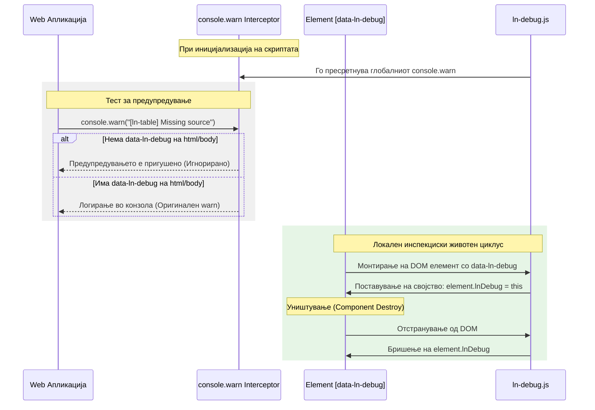

# 🛠️ ln-debug

> **Класификација:** 🟢 Едноставна компонента / Сервис (Layer 1 - Developer Tooling)

---

## 1. Заднинско дејство и одговорност

- **Краток опис:** Оваа компонента има тројна улога:
  1. **Глобално пригушување/овозможување на конзолни предупредувања (Global Warning Filter):** Стандардно ги пресретнува и пригушува сите развојни предупредувања кои започнуваат со `[ln-` или `[lnCore` со цел да се спречи загадување на конзолата во продукција. Кога `data-ln-debug` е активен на глобално ниво (на `<html>` или `<body>`), тој ги прикажува овие предупредувања.
  2. **Локален инспекциски шев (Developer Seam):** Кога е поставен на поединечен DOM елемент, го регистрира во DOM контекстот и ја закачува соодветната инстанца на компонентата во `element.lnDebug`, овозможувајќи лесна инспекција на состојбата преку конзолата.
  3. **Визуелна статичка анализа (Visual Linter):** Во комбинација со развојниот стилски лист `ln-ashlar-dev.css`, визуелно ги прикажува HTML грешките (пропуштени `id` атрибути, погрешно гнездење, невалидни асоцијации) директно во прелистувачот.
- **Ортогоналност (Што компонентата НЕ прави):**
  - НЕ менува DOM структура или содржина во продукција.
  - НЕ испраќа AJAX или какви било мрежни барања.
  - НЕ влијае на финалниот изглед на веб-страницата во продукција (CSS дебаг стиловите се физички отсутни).
  - НЕ фрла runtime грешки кои би го прекинале извршувањето на апликацијата.

---

## 2. Минимален HTML Маркап и Варијанти на Употреба

### Глобално овозможување на дебаг конзола и визуелен линтер
Се поставува како флег-атрибут директно на `<html>` или `<body>` елементот:

```html
<!DOCTYPE html>
<html lang="mk" data-ln-debug>
<head>
    <!-- Вклучување на развојниот CSS кој ги содржи визуелните дебаг правила -->
    <link rel="stylesheet" href="dist/ln-ashlar-dev.css" />
    <script src="dist/ln-ashlar.iife.js" defer></script>
</head>
<body>
    <!-- Сите грешки во обележувањето (на пр. input без id) ќе бидат визуелно означени -->
</body>
</html>
```

### Локално означување на елемент за инспекција во конзола
Се поставува на елементот кој развивачот сака да го означи за лесна инспекција:

```html
<!-- Означување на табела за лесно испитување на инстанцата во конзолата -->
<table data-ln-table="users" data-ln-debug id="users-debug-table">
    <!-- содржина -->
</table>
```

Пристап преку конзолата на прелистувачот:
```javascript
// Пристап до инстанцата на табелата преку нејзиниот дебаг мост
const tableInstance = document.getElementById('users-debug-table').lnTable;
console.log(tableInstance);
```

---

## 3. Декларативен API Договор (Атрибути и Настани)

### Атрибути

| Атрибут | Тип | Стандардна вредност | Опис |
| :--- | :--- | :--- | :--- |
| `data-ln-debug` (на `html` / `body`) | `Flag` | `/` | Глобално го овозможува прикажувањето на предупредувањата со префикс `[ln-` или `[lnCore` и го активира визуелниот CSS линтер. |
| `data-ln-debug` (на обичен елемент) | `Flag` | `/` | Го регистрира дебаг мостот на соодветниот елемент во `dom.lnDebug`. |

### Настани (Events API)
Компонентата не емитува ниту слуша сопствени собитија. Таа работи пасивно.

---

## 4. CSS Стилизирање и Поведенски Концепт

Визуелните правила за линтирање се целосно изолирани од продукција за да не влијаат врз перформансите или дизајнот на крајните корисници.

### Архитектура на дебаг стиловите:
1. **Модуларен придонес:** Секоја компонента ги дефинира своите визуелни правила во сопствена `*-dev.scss` датотека (на пр. `js/ln-toggle/ln-toggle-dev.scss`).
2. **Спојување при билд:** Преку агрегаторот `scss/ln-ashlar-dev.scss`, сите модуларни дебаг датотеки се компајлираат во посебен CSS фајл: `ln-ashlar-dev.css`. Овој фајл **не се увезува** во главниот `ln-ashlar.css`.
3. **Runtime изолација:** Сите правила се под селекторот `[data-ln-debug]`, со што се спречува несакано активирање дури и ако стилскиот лист е вклучен, сè додека не се додаде атрибутот на `html` или `body`.

### Визуелни индикатори на линтерот:
- **Критични структурни грешки** (на пр. `[data-ln-validate]` кој е изолиран надвор од форма): Се прикажуваат со црвена испрекината рамка и црвен дијагностички банер над елементот.
- **Инлајн предупредувања** (на пр. инпут без `id`, или празна `data-ln-search` референца): Се прикажуваат како инлајн текстуално предупредување со икона `⚠` веднаш по елементот.

---

## 5. Пристапност (ARIA) и Чести Грешки

- **ARIA & Тастатура:** CSS линтерот помага при развој да се детектираат ARIA пропусти (на пр. пропуштени `id` кај `data-ln-toggle` панели кои ја оневозможуваат синхронизацијата на `aria-expanded`).
- **Анти-патерни (Common Pitfalls):**
  - **Вклучување на `ln-ashlar-dev.css` во продукција:** Овој стилски лист содржи скапи `:not()` и `:has()` CSS селектори наменети исклучиво за локална анализа. Никогаш не смее да се вклучува во продукцискиот пакет.
  - **Очекување визуелни грешки без `data-ln-debug`:** Доколку не се постави атрибутот `data-ln-debug` на коренскиот елемент (`html`/`body`), визуелните грешки ќе останат скриени дури и ако дебаг стилот е вклучен во страницата.

---

## 6. Дијаграм на Текот и Животен Циклус



---

## 7. Поврзани Компоненти
- **Изворен код:** [`ln-debug.js` (Извор)](../../js/ln-debug/src/ln-debug.js) | [`ln-debug.js` (Дистрибуција)](../../js/ln-debug/ln-debug.js) | [Глобален дебаг стилски лист](../../scss/ln-ashlar-dev.scss)
- **Модуларни дебаг стилови:**
  - [ln-toggle-dev.scss](../../js/ln-toggle/ln-toggle-dev.scss)
  - [ln-table-dev.scss](../../js/ln-table/ln-table-dev.scss)
  - [ln-modal-dev.scss](../../js/ln-modal/ln-modal-dev.scss)
  - [ln-validate-dev.scss](../../js/ln-validate/ln-validate-dev.scss)
  - [ln-date-dev.scss](../../js/ln-date/ln-date-dev.scss)
  - [ln-tabs-dev.scss](../../js/ln-tabs/ln-tabs-dev.scss)
  - [ln-search-dev.scss](../../js/ln-search/ln-search-dev.scss)
  - [ln-filter-dev.scss](../../js/ln-filter/ln-filter-dev.scss)
  - [ln-tooltip-dev.scss](../../js/ln-tooltip/ln-tooltip-dev.scss)
- **`ln-core`**: Се потпира на глобалниот систем за регистрација на компоненти [`helpers.js` (Извор)](../../js/ln-core/helpers.js).
