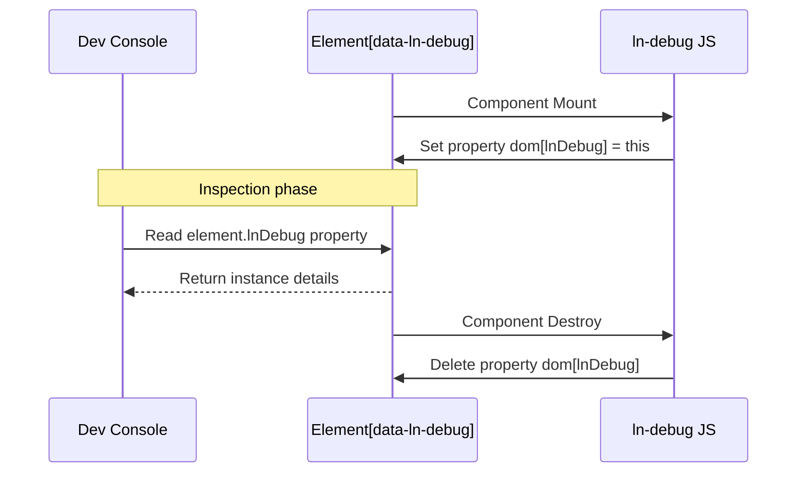

# 🛠️ ln-debug
> **Класификација:** 🟢 Едноставна компонента (Layer 1 - Developer Tooling / Inspector Seam)

---

## 1. Заднинско дејство и одговорност
`ln-debug` е минимална помошна компонента која служи како резервирана безбедна патека (seam/hook) за потребите на развој и дебагирање во прелистувачот.

*   **Главна Одговорност:** Обезбедува брз пристап до DOM елементите преку конзолата на прелистувачот. Секој елемент означен со `data-ln-debug` добива соодветна инстанца закачена на него (`element.lnDebug`), овозможувајќи им на развивачите полесно да ја испитаат неговата состојба, поврзаните компоненти или емитуваните настани во реално време за време на развојот.
*   **Изолација:** Не извршува никакво логичко или визуелно влијание врз корисничкиот интерфејс или мрежните барања.

---

## 2. Минимален HTML Маркап и Варијанти на Употреба

Се применува врз било кој елемент кој развивачот сака да го означи за лесна инспекција од конзолата.

```html
<!-- Означување на табела за лесно испитување на нејзината инстанца -->
<table data-ln-table="users" data-ln-debug id="users-debug-table">
    <!-- содржина -->
</table>
```

Развивачот во конзолата може лесно да пристапи до инстанцата:
```javascript
// Конзола на прелистувачот
const tableInstance = document.getElementById('users-debug-table').lnTable;
console.log(tableInstance); // приказ на инстанцата, методи и внатрешна состојба
```

---

## 3. Декларативен API Договор (Атрибути и Настани)

| Атрибут | Тип | Опис |
| :--- | :--- | :--- |
| `data-ln-debug` | `Flag` | Го активира дебаг мостот на соодветниот елемент. |

Компонентата нема свои специфични настани и не слуша мрежни промени во оваа фаза.

---

## 4. CSS Стилизирање и Поведенски Концепт
Ова е логичка компонента без визуелен кориснички интерфејс (headless component) и нема сопствени CSS класи или стилови.

---

## 5. Пристапност (ARIA) и Чести Грешки
*   **Пристапност:** Бидејќи компонентата не додава ниту менува елементи во DOM дрвото, таа нема никакво влијание врз пристапноста на страницата.
*   **Честа грешка:** Оставање на `data-ln-debug` атрибутот во продукциски средини (Production). Иако нема логичко влијание и е безбедно, се препорачува негово отстранување при градење на финалниот продукциски пакет со цел да се зачува изворниот HTML што е можно покомпактен.

---

## 6. Дијаграм на Текот и Животен Циклус



---

## 7. Поврзани Компоненти
*   **`ln-core`**: Се потпира на неговите системи за регистрација на компоненти (`registerComponent`).
