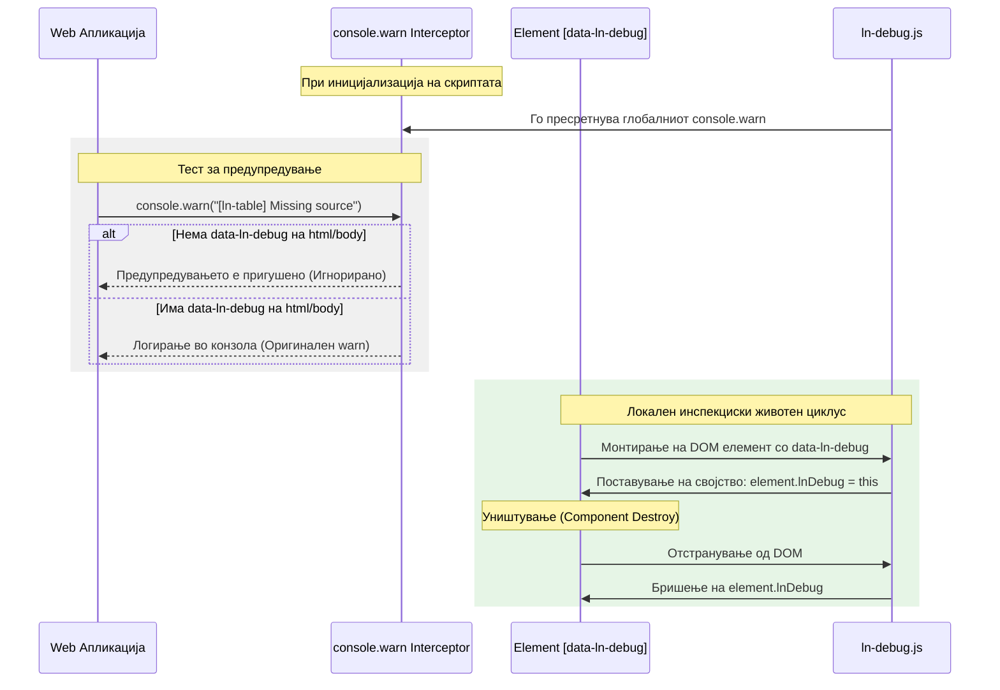

# 🛠️ ln-debug

> **Класификација:** 🟢 Едноставна компонента / Сервис (Layer 1 - Developer Tooling)

---

## 1. Заднинско дејство и одговорност

- **Краток опис:** Оваа компонента има двојна улога:
  1. **Глобално пригушување/овозможување на предупредувања (Global Warning Filter):** Стандардно ги пригушува сите развојни предупредувања во конзолата на прелистувачот кои започнуваат со `[ln-` или `[lnCore` со цел да се спречи загадување на конзолата во продукција. Кога `data-ln-debug` е активен на глобално ниво (на `<html>` или `<body>`), тој ги проследува овие предупредувања до конзолата.
  2. **Локален инспекциски шев (Developer Seam):** Кога е поставен на поединечен DOM елемент, го регистрира во DOM контекстот и ја закачува соодветната инстанца на компонентата на самиот елемент како `element.lnDebug`, овозможувајќи лесна инспекција на неговата состојба преку конзолата на прелистувачот.
- **Ортогоналност (Што компонентата НЕ прави):**
  - НЕ менува DOM структура или содржина.
  - НЕ испраќа AJAX или какви било мрежни барања.
  - НЕ влијае на финалниот изглед или CSS стилизирање на веб-страницата.
  - НЕ фрла грешки во продукциски средини.

---

## 2. Минимален HTML Маркап и Варијанти на Употреба

### Глобално овозможување на дебаг предупредувања во конзолата
Се поставува како флег-атрибут директно на `<html>` или `<body>` елементот:

```html
<!DOCTYPE html>
<html lang="mk" data-ln-debug>
<head>
    <!-- Предупредувањата во конзолата се сега видливи -->
</head>
<body>
</body>
</html>
```

### Локално означување на елемент за инспекција во конзола
Се поставува на елементот кој развивачот сака да го означи за лесна инспекција:

```html
<!-- Означување на табела за лесно испитување на инстанцата во конзолата -->
<table data-ln-table="users" data-ln-debug id="users-debug-table">
    <!-- содржина -->
</table>
```

Пристап преку конзолата на прелистувачот:
```javascript
// Пристап до инстанцата на табелата преку нејзиниот дебаг мост
const tableInstance = document.getElementById('users-debug-table').lnTable;
console.log(tableInstance);
```

---

## 3. Декларативен API Договор (Атрибути и Настани)

### Атрибути

| Атрибут | Тип | Стандардна вредност | Опис |
| :--- | :--- | :--- | :--- |
| `data-ln-debug` (на `html` / `body`) | `Flag` | `/` | Глобално го овозможува прикажувањето на предупредувањата со префикс `[ln-` или `[lnCore`. |
| `data-ln-debug` (на обичен елемент) | `Flag` | `/` | Го регистрира дебаг мостот на соодветниот елемент во `dom.lnDebug`. |

### Настани (Events API)
Компонентата не емитува ниту слуша сопствени собитија. Таа работи пасивно.

---

## 4. CSS Стилизирање и Поведенски Концепт
Ова е целосно логичка компонента без визуелен кориснички интерфејс (headless utility) и нема сопствени CSS класи, стилови или транзиции.

---

## 5. Пристапност (ARIA) и Чести Грешки

- **ARIA & Тастатура:** Бидејќи не влијае на DOM дрвото ниту на визуелните елементи, нема влијание врз пристапноста.
- **Анти-патерни (Common Pitfalls):**
  - **Погрешно очекување предупредувања:** Очекување дека дебаг предупредувањата ќе бидат видливи кога `data-ln-debug` е поставен само на произволен внатрешен елемент наместо на `<html>` или `<body>`. За глобален ефект на предупредувањата, мора да биде на root ниво (`html`/`body`).
  - **Заборавање во продукција:** Се препорачува отстранување на `data-ln-debug` во продукција за да се спречи активирање на дебаг излези и да се зачува HTML структурата чиста.

---

## 6. Дијаграм на Текот и Животен Циклус



---

## 7. Поврзани Компоненти
- **Изворен код:** [`ln-debug.js` (Извор)](../../js/ln-debug/src/ln-debug.js) | [`ln-debug.js` (Дистрибуција)](../../js/ln-debug/ln-debug.js)
- **`ln-core`**: Се потпира на глобалниот систем за регистрација на компоненти [`helpers.js` (Извор)](../../js/ln-core/helpers.js).
