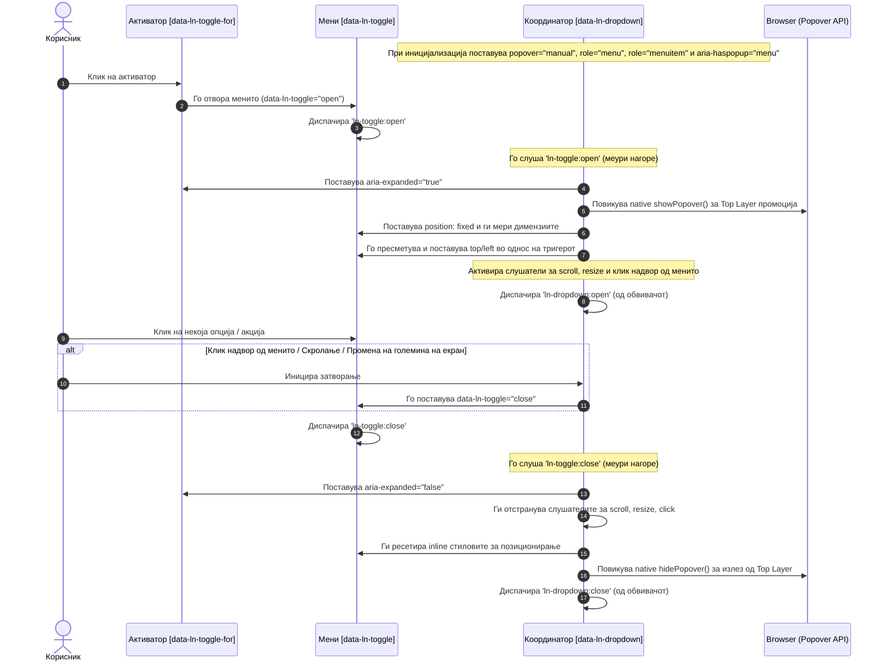

# 🔽 ln-dropdown

> **Класификација:** ⚙️ Координатор (Coordinator)

---

## 1. Заднинско дејство и одговорност

- **Краток опис:** `ln-dropdown` е координатор што управува со опаѓачки менија (dropdown menus). Се огласува на обвивачкиот DOM елемент со атрибутот `[data-ln-dropdown]`. Неговата одговорност е да го набљудува отворањето и затворањето на огласеното внатрешно мени (`ln-toggle`) и динамички да управува со телепортација во `<body>`, позиционирање под копчето-активатор, ARIA атрибути и чистење преку клик надвор или скролање.

- **Ортогоналност & Доктрина (Simple Components vs. Coordinators):**
  Согласно доктрината во `ln-ashlar`, компонентите се развиваат како изолирани градивни блокови, додека сложените меѓусебни однесувања се управуваат од надворешни координатори:
  * **[ln-toggle](ln-toggle.md)** (Едноставна компонента): Управува единствено со бинарната состојба на отвореност (`open` / `close`) на самото мени и ARIA атрибутот `aria-expanded` на тригерот. Таа е целосно несвесна за тоа каде се наоѓа менито на екранот, дали е отсечено од родителски контејнер со `overflow: hidden`, или како да се позиционира до некое копче.
  * **`ln-dropdown`** (Координатор): Не управува со сопствен визуелен приказ ниту директно со логика за промена на состојба. Неговата одговорност е да го прислушува настанот `ln-toggle:open` што меури нагоре од менито и да ги координира надворешните DOM и браузерски ресурси:
    1. Го извршува механизмот за **телепортација** преку `teleportToBody`, со што го извлекува менито од родителското DOM стебло и го прикачува на крајот од `<body>` за да го заштити од `overflow: hidden` и `z-index` ограничувања.
    2. Го постави `position: fixed` и ја пресметува точната координата во однос на копчето-активатор користејќи ги системските помошници `computePlacement` и `measureHidden`.
    3. Ажурира ARIA атрибути на тригерот (`aria-haspopup="menu"`, `aria-expanded="true/false"`) и менито (`role="menu"`, `role="menuitem"`).
    4. Активира привремени слушатели во позадина за клик надвор (`click`), скролање на прозорецот (`scroll` за репозиционирање) и промена на големината на прозорецот (`resize` за затворање).
    5. При затворање (`ln-toggle:close`), ги чисти сите слушатели и **го враќа менито на неговата оригинална DOM локација** користејќи го снимениот коментар-маркер `<!-- ln-teleport -->`.

> [!IMPORTANT]
> **Што `ln-dropdown` како Координатор НЕ прави (Orthogonality Doctrine):**
> * **НЕ управува директно со состојбата во JS меморија** — тој нема методи за отворање или затворање. Единствениот начин на комуникација е менување на HTML атрибутот `data-ln-toggle` на менито во `"open"` или `"close"`.
> * **НЕ содржи визуелни стилови за однесување `display: none / block`** — тие се дефинирани во SCSS правилата за `.open` класата и `data-ln-dropdown-menu`.
> * **НЕ ги остава менијата трајно во `<body>`** — при затворање, строго го зачувува оригиналниот DOM контекст и го враќа менито каде што било иницијално дефинирано.

---

## 2. Минимален HTML Маркап и Варијанти на Употреба

Со цел да се зачува принципот на **Separation of Concerns**, визуелното стилизирање се врши строго преку CSS класите `.dropdown-menu` и соодветните SCSS миксини, додека JavaScript логиката реагира исклучиво на функционалните `data-ln-*` атрибути.

### 2.1. Стандардно опаѓачко акциско мени (Каноничен маркап)

Овој пример го прикажува типичното поврзување на координаторот со неговите внатрешни примитиви:

```html
<!-- Координаторски контејнер -->
<div data-ln-dropdown>
    <!-- Активатор (Trigger) -->
    <button type="button" data-ln-toggle-for="options-menu" class="btn">
        Опции
        <svg class="ln-icon" aria-hidden="true"><use href="#ln-arrow-down"></use></svg>
    </button>
    
    <!-- Мени (State Primitive - Едноставна компонента) -->
    <ul id="options-menu" data-ln-toggle class="dropdown-menu">
        <li><a href="/profile">Профил</a></li>
        <li><a href="/settings">Поставки</a></li>
        <li><hr></li>
        <li>
            <form action="/logout" method="POST">
                <button type="submit" class="text-danger">Одјава</button>
            </form>
        </li>
    </ul>
</div>
```

---

### 2.2. Варијанта со активен/избран елемент (Theme / Language Picker)

Кога се користи опаѓачко мени за селектирање на единечна опција (како избор на тема или јазик), активниот елемент се означува преку нативниот атрибут `aria-current="true"`. Оваа состојба е автоматски стилизирана во придружните миксини за мени елементи.

```html
<div data-ln-dropdown>
    <button type="button" data-ln-toggle-for="lang-menu" class="btn-select">
        Македонски
        <svg class="ln-icon" aria-hidden="true"><use href="#ln-chevron-down"></use></svg>
    </button>
    <ul id="lang-menu" data-ln-toggle class="dropdown-menu">
        <li><button type="button" aria-current="true">Македонски</button></li>
        <li><button type="button">English</button></li>
        <li><button type="button">Deutsch</button></li>
    </ul>
</div>
```

---

### 2.3. Варијанта со аватар и корисничко мени

Менито може да содржи делители (`<hr>`) и различни типови на интерактивни елементи како линкови, копчиња и форми за праќање на `POST` барања (на пример, одјава).

```html
<div data-ln-dropdown>
    <button type="button" data-ln-toggle-for="account-menu" class="btn-avatar">
        
    </button>
    <ul id="account-menu" data-ln-toggle class="dropdown-menu">
        <li><a href="/profile">Мој Профил</a></li>
        <li><a href="/billing">Претплата</a></li>
        <li><hr></li>
        <li>
            <form action="/logout" method="POST">
                <button type="submit" class="text-danger">Одјави се</button>
            </form>
        </li>
    </ul>
</div>
```

---

## 3. Декларативен API Договор (Атрибути и Настани)

### 3.1. Атрибути API

| Атрибут | Се поставува на | Вредност / Тип | Опис |
|---|---|---|---|
| `data-ln-dropdown` | Родителски обвивач (`<div>`) | Празна вредност | Ја иницијализира инстанцата на координаторот на тој елемент. |
| `data-ln-toggle-for` | Копче-активатор (`<button>`) | `ID на менито` | Го означува целниот елемент што ќе го контролира копчето. |
| `data-ln-toggle` | Мени елемент (`<ul>`) | `"open"` \| `"close"` (или празно) | Го контролира статусот на отвореност на менито. |
| `popover` | Мени елемент (`<ul>`) | `"manual"` (автоматски од JS) | Го означува елементот како мануелен popover за нативна промоција во Top Layer. |
| `data-ln-dropdown-menu` | Мени елемент (`<ul>`) | Автоматски додаден од JS | Применува соодветни CSS селектори на менито. |
| `role="menu"` | Мени елемент (`<ul>`) | Автоматски додаден од JS | Поставува соодветна ARIA улога за пристапност на менито. |
| `role="menuitem"` | Директни деца на менито (`<li>`) | Автоматски додаден од JS | Поставува ARIA улога за секој елемент во менито. |
| `aria-haspopup` | Копче-активатор | `"menu"` (автоматски од JS) | Информира корисници на читачи на екран дека копчето отвора мени. |
| `aria-expanded` | Копче-активатор | `"true"` \| `"false"` (автоматски од JS) | Го рефлектира моменталниот статус на отвореност на менито. |

---

### 3.2. Настани (Events API)

Сите настани на координаторот се диспачираат од **главниот обвивачки елемент (`[data-ln-dropdown]`)** и меурат нагоре низ DOM-от (`bubbles: true`).

| Настан | Откажување (`Cancelable`) | Податоци во `event.detail` | Опис |
|---|:---:|---|---|
| `ln-dropdown:open` | Не | `{ target: menuElement }` | Се диспачира откако менито е промовирано во Top Layer преку `showPopover()`, позиционирано и прикажано. |
| `ln-dropdown:close` | Не | `{ target: menuElement }` | Се диспачира откако менито е сокриено преку `hidePopover()`, исчистено и сите слушатели се отстранети. |
| `ln-dropdown:destroyed` | Не | `{ target: wrapperElement }` | Се диспачира кога се повикува `.destroy()` методот на инстанцата за чистење на меморијата. |

#### Слушани настани (Incoming Events)

Координаторот ги прислушува следните настани кои меурат од внатрешниот `ln-toggle` мени елемент:
* `ln-toggle:open` — Покренува нативно прикажување преку `showPopover()`, позиционирање, ARIA ажурирање и додавање слушатели.
* `ln-toggle:close` — Покренува сокривање преку `hidePopover()`, отстранување на слушателите и ресетирање на inline стилови за позиционирање.

---

### 3.3. Програмско управување (JS API)

За разлика од едноставните компоненти, `ln-dropdown` како координатор нема сопствени императивни методи за отворање и затворање (како `.open()` или `.close()`). **Единствениот договор за состојба е HTML атрибутот `data-ln-toggle` на менито.**

Сите програмски интеракции се имплементирани во изворниот фајл [js/ln-dropdown/src/ln-dropdown.js](../../js/ln-dropdown/src/ln-dropdown.js).

#### Контрола на состојба преку атрибут
```js
const dropdown = document.querySelector('[data-ln-dropdown]');
const menu = dropdown.querySelector('[data-ln-toggle]');

// Отворање на менито (координаторот автоматски го телепортира и позиционира)
menu.setAttribute('data-ln-toggle', 'open');

// Затворање на менито
menu.setAttribute('data-ln-toggle', 'close');
```

#### Пристап до инстанцата и Уништување
При иницијализацијата, инстанцата на координаторот се закачува за родителскиот DOM елемент како сопственост `lnDropdown`:

```js
const dropdownEl = document.querySelector('[data-ln-dropdown]');
const instance = dropdownEl.lnDropdown;

// Чистење на координаторот и отстранување на сите слушатели во позадина
instance.destroy();
```

---

## 4. CSS Стилизирање и Поведенски Концепт

### 4.1. SCSS Миксини & Класи

Подолу се изворните SCSS миксини кои го овозможуваат визуелниот приказ на менито од [scss/config/mixins/_dropdown.scss](../../scss/config/mixins/_dropdown.scss):

```scss
/* scss/config/mixins/_dropdown.scss */
@mixin dropdown {
	@include relative;
}

@mixin menu-items {
	li {
		margin: 0;
		padding: 0;
	}

	form {
		margin: 0;
		padding: 0;
		display: contents;
	}

	a,
	button,
	input[type="submit"],
	input[type="reset"],
	input[type="button"] {
		@include w-full;
		@include flex;
		@include items-center;
		justify-content: flex-start;
		gap: var(--gap);
		@include text-left;
		@include text-sm;
		@include cursor-pointer;
		@include transition-fast;
		background: none;
		border: none;
		border-radius: 0;
		color: var(--color-fg);
		text-decoration: none;

		&:hover:not(:disabled),
		&:active:not(:disabled) {
			--color-bg: var(--bg-sunken);
			background: var(--color-bg);
			color: var(--color-fg);
		}

		&:focus {
			box-shadow: none;
		}

		&[aria-current="true"] {
			background: var(--color-accent-tint);
			color: var(--color-accent);
		}
	}

	a {
		--padding-y: var(--size-xs);
		--padding-x: var(--size-sm);
		padding: var(--padding-y) var(--padding-x);
	}

	:is(button, input[type="submit"], input[type="reset"], input[type="button"]) {
		--btn-padding-y: var(--size-xs);
		--btn-padding-x: var(--size-sm);
	}

	li + li {
		border-block-start: var(--border-block-start, none);
	}

	hr {
		border: none;
		border-block-start: var(--border-block-start, var(--border-width) solid var(--color-border));
		--margin-block: var(--size-xs);
		margin-block: var(--margin-block);
	}
}

@mixin dropdown-menu {
	@include floating-panel;
	@include absolute;
	right: 0;
	top: 100%;
	--margin-block: var(--size-xs);
	margin-top: var(--margin-block);
	--padding-y: var(--size-xs);
	padding-block: var(--padding-y);
	min-width: 10rem;

	@include menu-items;
}
```

#### Канонични компоненти класи ([scss/components/_dropdown.scss](../../scss/components/_dropdown.scss))

```scss
/* scss/components/_dropdown.scss */
@use '../config/mixins' as *;

[data-ln-dropdown] {
	@include dropdown;
}

[data-ln-dropdown-menu] {
	@include dropdown-menu;
}

@keyframes ln-dropdown-in {
	from {
		opacity: 0;
		transform: translateY(-4px) scale(0.98);
	}
	to {
		opacity: 1;
		transform: translateY(0) scale(1);
	}
}
```

---

### 4.2. Поведенски концепт: Top Layer промоција, Пресметка на позиција и Анимации

* **Top Layer промоција (Popover API)**: Со цел да се надминат ограничувањата на `overflow: hidden` кај родителите и проблеми со stacking контекст, менито се промовира во Top Layer преку нативното Popover API со атрибутот `popover="manual"`. Ова гарантира дека менито секогаш ќе се исцрта над секој друг елемент на страницата без да се напушти оригиналната DOM локација на елементот.
* **Динамичко позиционирање (`computePlacement`)**: Координаторот ги зема димензиите на копчето-активатор преку `getBoundingClientRect()` и на скриеното мени преку `measureHidden`, па ја пресметува позицијата преку помошникот `computePlacement` од [ln-core](../../js/ln-core/index.js). Претпочитаната позиција е `bottom-end` (позиционирано долу, десно порамнето со активаторот).
* **Растојание (Gap)**: Растојанието помеѓу менито и активаторот се чита динамички од CSS променливата `--size-xs` на `document.documentElement` (претворена во пиксели, односно `* 16`), со дифолт вредност од `4px` доколку променливата не е дефинирана.
* **Анимација и Состојби (`[data-ln-dropdown-menu]`)**:
  Контролата на визуелното појавување користи `display: none` по дифолт од [js/ln-dropdown/ln-dropdown.scss](../../js/ln-dropdown/ln-dropdown.scss). Кога класата `.open` е додадена од `ln-toggle`, менито станува `display: block` и се извршува keyframe анимацијата `ln-dropdown-in` (translate Y -4px → 0px, scale 0.98 → 1, opacity 0 → 1).

---

## 5. Пристапност (ARIA) и Чести Грешки

### 5.1. ARIA Стандарди & Тастатура

* **Копче-активатор (Trigger Button)**:
  - Автоматски добива `aria-haspopup="menu"`.
  - Динамички го менува `aria-expanded="true"` при отворање и `aria-expanded="false"` при затворање.
* **Мени контејнер (`<ul>`)**:
  - Добива `role="menu"`.
* **Мени ставка (`<li>`)**:
  - Сите директни деца добиваат `role="menuitem"`.
* **Избрана опција (Single-select)**:
  - За менија со единечен избор (тема, јазик), активната ставка се означува со `aria-current="true"`.
* **Навигација со тастатура**:
  - `Tab` го префрла фокусот низ интерактивните линкови/копчиња во менито.
  - `Esc` или клик надвор го затвора менито и го враќа фокусот.

---

### 5.2. Анти-патерни (Common Pitfalls)

> [!CAUTION]
> **Чести грешки кои треба да се избегнуваат:**
>
> 1. **Заборавање на `data-ln-dropdown` на родителскиот обвивач:**
>    Ако го изоставите `data-ln-dropdown` на родителскиот обвивач, менито сепак ќе се отвори преку `ln-toggle`, но **нема да има телепортација, позиционирање под тригерот, ниту затворање при клик надвор**.
>
> 2. **Рачно поставување `style="position: fixed"` во HTML:**
>    Не поставувајте рачно позиционирање во стиловите на HTML. Координаторот `ln-dropdown` сам се грижи за динамичко пресметување и применување на `position: fixed`, `top` и `left` координатите при телепортација.
>
> 3. **Користење на `ln-dropdown` за комплексни дијалози со форми:**
>    `ln-dropdown` е наменет за брзи менија и изборници кои се затвораат при клик надвор. За комплексни интерактивни дијалози со форми, внес на податоци или custom контрола на фокус, користете **[ln-popover](ln-popover.md)** или **[ln-modal](ln-modal.md)**.
>
> 4. **Обид за рачно повикување на JS методи `.open()` или `.close()`:**
>    Инстанцата `lnDropdown` е координатор и нема такви методи. Менувањето на состојбата се врши исклучиво преку промена на атрибутот `data-ln-toggle="open"` или `data-ln-toggle="close"` на самиот мени елемент.

---

## 6. Дијаграм на Текот и Животен Циклус

Следниот дијаграм ја прикажува интеракцијата и разменувањето на одговорности помеѓу корисникот, тригерот, едноставниот `ln-toggle` и координаторот `ln-dropdown`:



---

## 7. Поврзани Компоненти

* **[ln-toggle](ln-toggle.md)** — Основна бинарна примитива за контролирање состојби на видливост.
* **[ln-popover](ln-popover.md)** — Визуелно побогата лебдечка компонента со сопствено управување на позиција и содржина.
* **[ln-modal](ln-modal.md)** — Блокирачки дијалог контејнери со Focus Trap за навигација.
