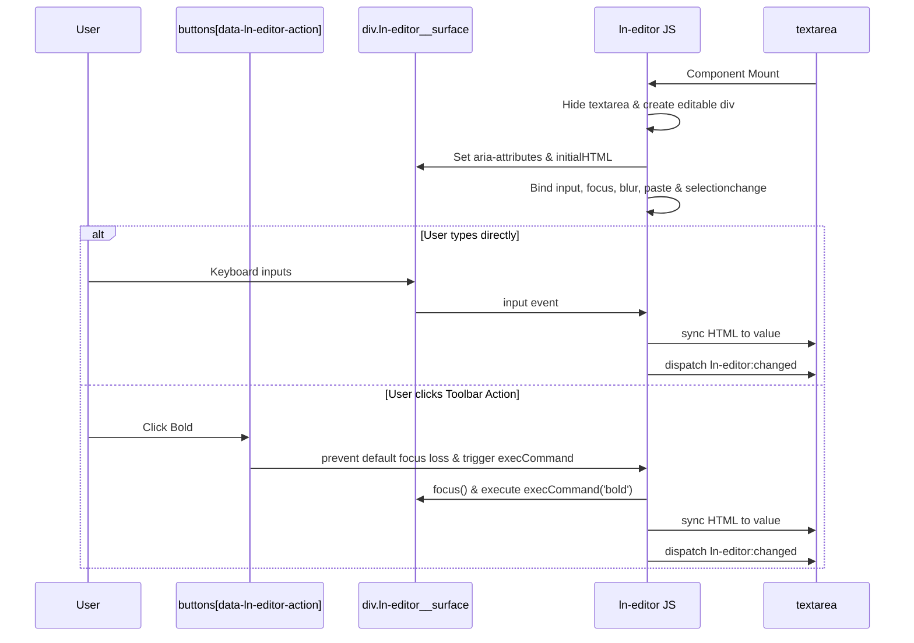

# 📝 ln-editor
> **Класификација:** 🟢 Едноставна компонента (Layer 1 - Rich Text Editor)

---

## 1. Заднинско дејство и одговорност
`ln-editor` е едноставна визуелна компонента која го трансформира стандардниот `<textarea>` во безбеден и пристапен WYSIWYG (What You See Is What You Get) богата текстуална површина.

*   **Главна Одговорност:** Сокрива постоечки `<textarea>` и генерира нова површина за уредување (`.ln-editor__surface`) означена со `contenteditable="true"`. Сите промени направени во оваа површина автоматски се запишуваат назад во сокриениот `<textarea>` со цел формата нативно да ги испрати податоците.
*   **Санитација при Вметнување (Paste Sanitization):** За спречување на XSS ранливости и кршење на дизајнот при копирање од надворешни извори (на пр. Word, други веб-сајтови), компонентата содржи сопствен рекурзивен чистач кој дозволува само предефинирани тагови (на пр. `p`, `strong`, `a`, `ul`, `li`, `h2`) и ги отстранува сите HTML атрибути освен `href` на линковите. На линковите автоматски им се додава `rel="noopener noreferrer"` од безбедносни причини.
*   **Координирање на Алатките (Toolbar State Synchronization):** Соодветно ги следи промените во селекцијата на текстот (`selectionchange`) и динамички ја додава класата `.ln-editor-active` на копчињата во менито (на пр. Bold, Italic) доколку курсорот во моментот се наоѓа на форматиран текст.
*   **Кратенки на тастатурата:** Поддржува нативни кратенки како Ctrl+B (задебелено), Ctrl+I (курзив), Ctrl+U (подвлечено) и Ctrl+K (вметнување линк).

---

## 2. Минимален HTML Маркап и Варијанти на Употреба

Потребно е да се дефинира обвиткувач кој го содржи навигациското мени со копчиња за акции (`data-ln-editor-action`) и оригиналниот `<textarea>`.

```html
<div data-ln-editor="blog_body" class="ln-editor">
    <!-- Лента со алатки (Toolbar) -->
    <nav class="ln-editor__toolbar">
        <button type="button" data-ln-editor-action="bold" title="Задебелено">B</button>
        <button type="button" data-ln-editor-action="italic" title="Курзив">I</button>
        <button type="button" data-ln-editor-action="underline" title="Подвлечено">U</button>
        <span class="divider"></span>
        <button type="button" data-ln-editor-action="heading-2" title="Наслов 2">H2</button>
        <button type="button" data-ln-editor-action="heading-3" title="Наслов 3">H3</button>
        <span class="divider"></span>
        <button type="button" data-ln-editor-action="ordered-list" title="Нумерирана листа">1.</button>
        <button type="button" data-ln-editor-action="unordered-list" title="Точкаста листа">•</button>
        <span class="divider"></span>
        <button type="button" data-ln-editor-action="link" title="Вметни линк">Линк</button>
        <button type="button" data-ln-editor-action="unlink" title="Отстрани линк">Скини линк</button>
        <button type="button" data-ln-editor-action="clear" title="Исчисти формат">Clear</button>
    </nav>

    <!-- Изворно текстуално поле -->
    <label for="post-content" id="post-content-label">Содржина:</label>
    <textarea id="post-content" name="content" placeholder="Напишете содржина..."></textarea>
</div>
```

---

## 3. Декларативен API Договор (Атрибути и Настани)

| Атрибут | Тип | Опис |
| :--- | :--- | :--- |
| `data-ln-editor` | `String` | Го активира компонентот врз контејнерот. Вредноста го означува уникатното име на инстанцата. |
| `data-ln-editor-action` | `String` | Се поставува на копчиња во менито. Извршува соодветна WYSIWYG наредба (пр. `bold`, `italic`, `underline`, `ordered-list`, `link`, `clear`). |

### DOM Барања (Слуша)
| Настан | Payload `e.detail` | Опис |
| :--- | :--- | :--- |
| `ln-editor:set-content` | `{ html: String }` | Програмски го поставува HTML-от на уредувачката површина и ја синхронизира формата. |

### Настани (Емитува)
| Настан | Payload `e.detail` | Опис |
| :--- | :--- | :--- |
| `ln-editor:before-change` | `{ action: String, target: Node }` | Се емитува пред да се изврши наредба од лентата со алатки. Може да биде откажан (`e.preventDefault()`). |
| `ln-editor:changed` | `{ html: String, target: Node }` | Се емитува при секоја измена на содржината од страна на корисникот. |
| `ln-editor:focus` / `blur` | `{ target: Node }` | Се емитува при фокус или напуштање на површината за уредување. |

---

## 4. CSS Стилизирање и Поведенски Концепт
Текстуалната површина ги прифаќа изгледот на стандардно поле во форма, додека изворната textarea се сокрива.

```scss
// SCSS стилизирање за богато уредување
.ln-editor {
    border: 1px solid var(--border-color, #cbd5e1);
    border-radius: 6px;
    background-color: #fff;
    
    // Сокриј го оригиналниот textarea
    textarea[data-ln-editor-source] {
        display: none !important;
    }

    // Лента со алатки
    .ln-editor__toolbar {
        display: flex;
        align-items: center;
        gap: 0.25rem;
        padding: 0.5rem;
        border-bottom: 1px solid var(--border-color, #cbd5e1);
        background-color: var(--color-gray-lightest, #f8fafc);
        
        button {
            border: 1px solid transparent;
            background: transparent;
            padding: 0.25rem 0.5rem;
            border-radius: 4px;
            cursor: pointer;
            
            &.ln-editor-active {
                background-color: var(--color-gray-light, #e2e8f0);
                border-color: var(--color-gray, #cbd5e1);
            }
        }
    }

    // Активна површина за уредување
    .ln-editor__surface {
        min-height: 150px;
        padding: 0.75rem;
        outline: none;
        
        // Placeholder ефект
        &[data-placeholder]:empty::before {
            content: attr(data-placeholder);
            color: var(--color-text-muted, #94a3b8);
            pointer-events: none;
        }
    }

    // Линкови внатре во уредникот
    .ln-editor__surface a {
        color: var(--color-primary, #3b82f6);
        text-decoration: underline;
    }

    // Скокачки прозорец за линкови (Link Popover)
    .ln-editor__link-popover {
        position: absolute;
        display: flex;
        gap: 0.25rem;
        padding: 0.5rem;
        background-color: #fff;
        border: 1px solid var(--border-color);
        box-shadow: 0 4px 6px -1px rgba(0,0,0,0.1);
        border-radius: 4px;
        z-index: 10;
        
        input {
            padding: 0.25rem;
            border: 1px solid var(--border-color);
            border-radius: 4px;
        }
    }
}
```

---

## 5. Пристапност (ARIA) и Чести Грешки
*   **Пристапност:** Динамички генерираниот `.ln-editor__surface` има `role="textbox"` и `aria-multiline="true"`. Дополнително, `ln-editor` ја презема референцата од постоечкиот `<label for="...">` во сопствен атрибут `aria-labelledby`, со што се овозможува целосно зачувување на семантиката на формата за корисниците со попреченост.
*   **Честа грешка 1:** Непоставување на `type="button"` на копчињата во менито. Доколку ги оставите без овој атрибут, кликнувањето на било кое копче во менито ќе ја испрати (submit) целата форма. (Иако JS повикува `e.preventDefault()`, соодветниот HTML е подобра пракса).
*   **Честа грешка 2:** Пастирање на сурови стилови од Word или надворешни едитори. Чистачот на компонентата целосно го санира ова, но развивачите понекогаш се обидуваат рачно да дозволат стилови. Препорачливо е стилизирањето на насловите и листите да се остави на глобалниот CSS во класата `.ln-editor__surface`.

---

## 6. Дијаграм на Текот и Животен Циклус



---

## 7. Поврзани Компоненти
*   **`ln-form`**: Ја обвиткува целата структура и ги испраќа податоците преземени од ажурираниот `<textarea>`.
*   **`ln-validate`**: Врши валидација на вредноста од сокриениот `<textarea>` при промена.
