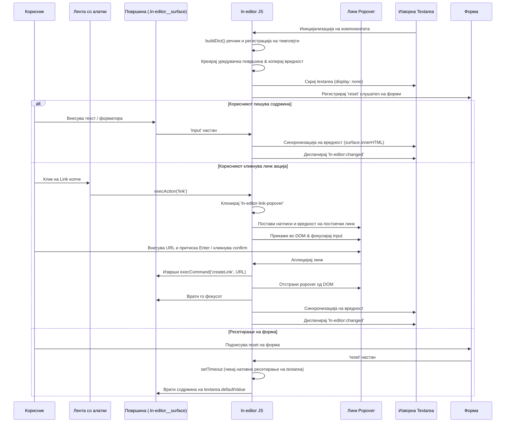

# 📝 ln-editor

> **Класификација:** 🟢 Едноставна компонента / Visual Editor Primitive (Layer 1 - Rich Text Editor)

---

## 1. Заднинско дејство и одговорност

`ln-editor` е изолиран примитив за богато текстуално уредување (лоциран во [`js/ln-editor/src/ln-editor.js`](../../js/ln-editor/src/ln-editor.js)) кој по пат на прогресивно подобрување (progressive enhancement) го обвиткува стандардниот `<textarea>` во WYSIWYG (`contenteditable`) површина за пишување. Неговата примарна одговорност е да обезбеди соодветна и богата корисничка интеракција при зачувување на целокупната функционалност на нативните HTML форми кога JavaScript не е вчитан.

> [!IMPORTANT]
> **Што `ln-editor` НЕ прави (Orthogonality Doctrine):**
> * **НЕ испраќа AJAX / HTTP барања** до серверот — тоа е должност на обвиткувачкиот координатор или компонентата `ln-ajax`/`ln-form`.
> * **НЕ отвора глобални модали, дијалози или тост-нотификации** — вметнувањето линкови се одвива исклучиво преку локално прикачен инлине popover.
> * **НЕ вчитува надворешни heavy-weight зависности** (на пр. Quill, CKEditor) — се потпира исклучиво на нативниот browser API (`execCommand` и `Selection`).
> * **НЕ дозволува внесување на несигурни стилови и скрипти** — санитацијата на пастираната содржина целосно ја чисти непосакуваната HTML структура.

---

## 2. Минимален HTML Маркап и Варијанти на Употреба

Компонентата бара контејнер со `data-ln-editor` во кој се наоѓа лента со алатки (`nav`) со дефинирани акции и оригинален `<textarea>`.

### Варијанта 1: Базен маркап со дифолтни вредности

```html
<div data-ln-editor="body_editor" class="ln-editor">
    <!-- Лента со алатки -->
    <nav class="ln-editor__toolbar">
        <ul>
            <li><button type="button" data-ln-editor-action="bold" aria-label="Bold">B</button></li>
            <li><button type="button" data-ln-editor-action="italic" aria-label="Italic">I</button></li>
            <li><button type="button" data-ln-editor-action="underline" aria-label="Underline">U</button></li>
            <li><button type="button" data-ln-editor-action="link" aria-label="Link">Линк</button></li>
        </ul>
    </nav>

    <!-- Изворен textarea -->
    <label for="post-body">Содржина:</label>
    <textarea id="post-body" name="body" placeholder="Напишете содржина..."></textarea>
</div>
```

### Варијанта 2: Конфигурирање на линк-прозорче преку директни атрибути

Оваа варијанта ги пренесува сите текстуални натписи на прозорчето за линк директно преку атрибути на контејнерот:

```html
<div data-ln-editor="comment_editor"
     data-ln-editor-link-placeholder="Внесете веб-адреса..."
     data-ln-editor-link-confirm="Примени"
     data-ln-editor-link-cancel="Откажи"
     class="ln-editor">
    <nav class="ln-editor__toolbar">
        <button type="button" data-ln-editor-action="bold">B</button>
        <button type="button" data-ln-editor-action="link">Линк</button>
    </nav>
    <textarea name="comment" placeholder="Внесете коментар..."></textarea>
</div>
```

### Варијанта 3: Локализација преку скриен речник (buildDict)

Доколку не се постават атрибути, компонентата ги чита вредностите од локален речник:

```html
<div data-ln-editor="translated_editor" class="ln-editor">
    <nav class="ln-editor__toolbar">
        <button type="button" data-ln-editor-action="bold">B</button>
        <button type="button" data-ln-editor-action="link">Линк</button>
    </nav>
    <textarea name="content"></textarea>

    <!-- Скриен речник за превод -->
    <ul hidden>
        <li data-ln-editor-dict="link-placeholder">Вметнете URL...</li>
        <li data-ln-editor-dict="link-confirm">Потврди</li>
        <li data-ln-editor-dict="link-cancel">Откажи</li>
    </ul>
</div>
```

### Варијанта 4: Сопствен (пребришан) темплејт за линк-прозорче

Развивачот може да го измени целокупниот изглед и структура на инлине popover-от за линк со дефинирање сопствен темплејт во рамки на контејнерот:

```html
<div data-ln-editor="custom_editor" class="ln-editor">
    <nav class="ln-editor__toolbar">
        <button type="button" data-ln-editor-action="link">Линк</button>
    </nav>
    <textarea name="content"></textarea>

    <!-- Сопствен HTML темплејт за линк-прозорчето -->
    <template data-ln-template="ln-editor-link-popover">
        <div class="ln-editor__link-popover custom-popover-theme">
            <input type="url" data-ln-attr="placeholder:placeholderText" class="custom-input" />
            <button type="button" data-ln-editor-action="confirm-link" data-ln-attr="aria-label:confirmLabel">✓</button>
            <button type="button" data-ln-editor-action="cancel-link" data-ln-attr="aria-label:cancelLabel">✗</button>
        </div>
    </template>
</div>
```

---

## 3. Декларативен API Договор (Атрибути и Настани)

### HTML Атрибути

| Атрибут | Опсег | Опис |
| :--- | :--- | :--- |
| `data-ln-editor` | Контејнер | Го активира компонентот. Вредноста е име на инстанцата. |
| `data-ln-editor-action` | Копче | Дефинира WYSIWYG наредба за извршување при клик. |
| `data-ln-editor-link-placeholder` | Контејнер | *(Опционално)* Приоритетен placeholder текст за полето за линк во popover-от. |
| `data-ln-editor-link-confirm` | Контејнер | *(Опционално)* Приоритетен текст за Confirm копчето во popover-от. |
| `data-ln-editor-link-cancel` | Контејнер | *(Опционално)* Приоритетен текст за Cancel копчето во popover-от. |
| `data-ln-editor-source` | Textarea | Се додава автоматски од JS врз оригиналниот `<textarea>` за соодветно сокривање. |

### Поддржани WYSIWYG Команди (`data-ln-editor-action`)

*   **Инлајн команди:** `bold`, `italic`, `underline`, `strikethrough`
*   **Блок команди (Автоматски се враќаат во `p` при повторен клик):** `heading-2`, `heading-3`, `heading-4`, `blockquote`, `code`, `paragraph`
*   **Листи:** `ordered-list`, `unordered-list`
*   **Специјални:** `link` (отвора popover), `unlink` (брише линк), `clear` (чисти форматирање)

---

### Настани (Events API)

#### Настани што ги слуша (Слушатели)
| Настан | Payload `e.detail` | Опис |
| :--- | :--- | :--- |
| `ln-editor:set-content` | `{ html: String }` | Програмски ја менува содржината на уредувачката површина и ја синхронизира вредноста во `<textarea>`. |

#### Настани што ги емитува (Емитува)
Сите настани се диспачираат со својството `{ bubbles: true }`.

| Настан | Payload `e.detail` | Опис |
| :--- | :--- | :--- |
| `ln-editor:before-change` | `{ action: String, target: Node }` | Се емитува пред извршување на WYSIWYG акција. Може да се откаже со `e.preventDefault()`. |
| `ln-editor:changed` | `{ html: String, target: Node }` | Се емитува при секоја измена на HTML содржината од страна на корисникот. |
| `ln-editor:focus` | `{ target: Node }` | Се емитува кога површината за пишување ќе добие фокус. |
| `ln-editor:blur` | `{ target: Node }` | Се емитува кога површината за пишување ќе го изгуби фокусот. |
| `ln-editor:destroyed` | `{ target: Node }` | Се емитува при уништување на инстанцата. |

---

### JavaScript Програмски API

До инстанцата може да се пристапи директно преку својството `lnEditor` на DOM контејнерот:

*   **`element.lnEditor.getHTML()`**: Го враќа моменталниот HTML од површината за пишување.
*   **`element.lnEditor.setHTML(html)`**: Програмски го поставува HTML кодот во површината за пишување и ја ажурира оригиналната `<textarea>`.
*   **`element.lnEditor.destroy()`**: Врши целосно расчистување на настаните, го отстранува креираното текстуално поле, ги чисти визуелните popover-и и ја враќа видливоста на изворниот `<textarea>`.

---

## 4. CSS Стилизирање и Поведенски Концепт

Компонентата го менаџира визуелниот слој преко соодветно структурирани класи:

*   **`.ln-editor`**: Главен контејнер кој ја обвиткува целата структура.
*   **`.ln-editor__toolbar`**: Обвиткувач на лентата со алатки.
*   **`.ln-editor__surface`**: Корисничката површина за пишување (`contenteditable`). Се содржи од стилови за `.prose` за форматирање на содржината.
*   **`.ln-editor__link-popover`**: Апсолутно позициониран инлајн обвиткувач на прозорчето за линк кој се прицврстува под лентата за алатки.
*   **`.ln-editor-active`**: Класа која автоматски се додава на активните копчиња во лентата (на пр. кога курсорот е над болдиран текст).

### Синхронизација на селекцијата и активните класи

Компонентата го слуша глобалниот `selectionchange` настан во рамки на документ-објектот. Кога селекцијата се наоѓа во рамки на површината за пишување (`.ln-editor__surface`), `ln-editor` повикува `document.queryCommandState()` за соодветните инлајн формати и врши траверзирање на DOM стеблото нагоре за да ги идентификува активните блок тагови (на пр. дали тековната селекција е во рамки на `H2`, `A`, или `BLOCKQUOTE`). Врз основа на тие информации се ажурира состојбата на алатките со додавање/бришење на класата `.ln-editor-active`.

---

## 5. Пристапност (ARIA) и Чести Грешки

### Пристапност (ARIA)

*   **`role="textbox"` & `aria-multiline="true"`**: Динамички генерираната површина за пишување ги содржи овие атрибути со цел да се претстави како повеќелиниско текстуално поле за екранските читачи.
*   **`aria-labelledby`**: Доколку во контејнерот постои соодветен `label` елемент наменет за оригиналната `<textarea>` (поврзан преку `for` атрибут), `ln-editor` го мапира неговото `id` директно на новото поле преку `aria-labelledby`.
*   **Пристапни копчиња**: Во инлајн popover-от, копчињата за потврда и затворање автоматски добиваат пристапни `aria-label` етикети соодветно земени од локализацијата или дифолтните вредности.
*   **Кратенки на тастатурата**: Поддржани се кратенките `Ctrl+B` (задебелено), `Ctrl+I` (курзив), `Ctrl+U` (подвлечено), како и `Ctrl+K` (за вметнување линк). За корисници со macOS се користи `Cmd` нативната поддршка.
*   **Ин интеракција со линк-прозорчето:** При клик на `Ctrl+K`, фокусот веднаш се пренасочува на текстуалното поле за линк. При притискање на `Enter` промените се зачувуваат, а при `Escape` уредникот се затвора без измени. Во двата случаи, фокусот автоматски се враќа назад во површината на уредувачот.

### Чести Грешки и Анти-патерни

*   **Изоставување на `type="button"` на копчињата во менито:** Доколку копчињата во менито немаат експлицитно `type="button"`, прелистувачите ги третираат како `type="submit"` и кликнувањето ќе предизвика поднесување (submit) на целата обвиткувачка форма.
*   **Директни DOM измени надвор од `execCommand` во JS код:** Директно менување на DOM-от на површината за пишување преку ad-hoc скрипти може да го скрши `undo`/`redo` стеблото на прелистувачот и да предизвика десинхронизација со `<textarea>`. Сите програмски измени треба да се вршат преку `ln-editor:set-content`.

---

## 6. Дијаграм на Текот и Животен Циклус



---

## 7. Поврзани Компоненти

*   **`ln-form`**: Ја обвиткува формата во која се наоѓа уредникот и го обработува испраќањето на финалната содржина преку нативниот синхронизиран `<textarea>`.
*   **`ln-validate`**: Врши валидација на изворниот `<textarea>` (на пр. `required` или `minlength`) по секоја промена и ресетирање емитувана од уредникот.
