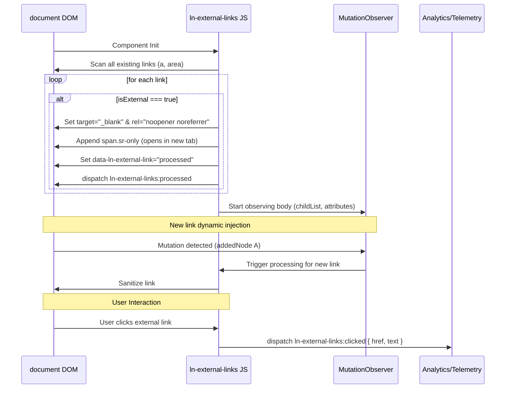

# 🌐 ln-external-links
> **Класификација:** 🟢 Едноставна компонента / Глобално однесување (Layer 1 - Security & Accessibility)

---

## 1. Заднинско дејство и одговорност
`ln-external-links` е едноставна помошна компонента која овозможува автоматско санирање, заштита и прилагодување на пристапноста за сите надворешни линкови (outbound links) на страницата.

*   **Главна Одговорност:** Го следи DOM-от и ги детектира сите `<a>` и `<area>` елементи чиј домаќин (`hostname`) се разликува од домаќинот на тековната веб-страница.
*   **Автоматско прилагодување на однесувањето:** На сите надворешни линкови автоматски им доделува `target="_blank"` за да се отворат во нов таб и додава безбедносни директиви во `rel` атрибутот (`noopener noreferrer`) со цел спречување на напади од типот "Reverse Tabnabbing".
*   **Пристапно известување (A11y Hint):** Во секој надворешен линк динамички додава скриен `<span>` елемент со класа `.sr-only` кој содржи текст `(opens in new tab)`. Ова овозможува корисниците на говорни софтвери (екрански читачи) да бидат соодветно известени пред напуштање на страницата во согласност со WCAG препораките.
*   **Динамичко следење (Mutation Observer):** Компонентата континуирано ја набљудува структурата на страницата. Доколку во DOM-от се додадат нови линкови (пр. преку AJAX или реактивни темплејти) или ако постоечки линк го промени својот `href` атрибут, тие веднаш се обработуваат.
*   **Аналитика и Мерење кликови (Telemetry):** Слуша кликови на глобално ниво. Доколку корисникот кликне на обработен надворешен линк, емитува настан `ln-external-links:clicked` што овозможува лесна интеграција со системи за веб аналитика (на пр. Google Analytics).
*   **Ортогоналност (Што компонентата НЕ прави):**
    *   **Без визуелни стилови:** Не додава визуелни индикатори (икони за надворешен линк) во самиот HTML маркап. Тоа е одговорност на SCSS/CSS слојот.
    *   **Без спречување навигација/интерстицијали:** Не блокира кликови ниту прикажува дијалози за потврда (како `ln-modal`); само нотифицира за кликовите преку настан.
    *   **Без рачно селектирање:** Не овозможува селективно рачно бирање кои линкови се надворешни, туку ги обработува сите по автоматизам врз база на споредба на `hostname`.


---

## 2. Минимален HTML Маркап и Варијанти на Употреба

Компонентата работи целосно автоматски врз сите линкови во `document.body` и не бара додавање на посебни атрибути за активација.

```html
<!-- Пред иницијализација (суров HTML) -->
<div class="footer-links">
    <a href="https://google.com">Google</a>
    <a href="/about-us">Внатрешен Линк</a>
</div>

<!-- По обработка од страна на ln-external-links -->
<div class="footer-links">
    <a href="https://google.com" 
       target="_blank" 
       rel="noopener noreferrer" 
       data-ln-external-link="processed">
       Google
       <span class="sr-only">(opens in new tab)</span>
    </a>
    
    <!-- Внатрешниот линк останува недопрен -->
    <a href="/about-us">Внатрешен Линк</a>
</div>
```

---

## 3. Декларативен API Договор (Атрибути и Настани)

| Атрибут | Тип | Опис |
| :--- | :--- | :--- |
| `data-ln-external-link` | `String` | Се додава автоматски од JS по завршување на обработката со вредност `processed` за да се спречи двојно обработување. |

### Настани (Емитува)
| Настан | Payload `e.detail` | Опис |
| :--- | :--- | :--- |
| `ln-external-links:processed` | `{ link: Node, href: String }` | Се емитува на самиот линк откако успешно ќе биде саниран и заштитен. |
| `ln-external-links:clicked` | `{ link: Node, href: String, text: String }` | Се емитува при секој клик на надворешен линк. Одлично за интеграција на аналитика во реално време. |

### Јавен JS API (преку `window.lnExternalLinks`)
*   **`process(container)`**: Рачно иницира обработка на сите линкови внатре во одреден DOM контејнер (опционално, доколку сакате да го забрзате процесот пред да реагира MutationObserver-от).

---

## 4. CSS Стилизирање и Поведенски Концепт
Единствениот визуелен дел е скриената лабела за пристапност, која се потпира на стандардната класа за визуелно скривање `.sr-only`:

```scss
// SCSS имплементација за скриени помошни пораки
.sr-only {
    position: absolute;
    width: 1px;
    height: 1px;
    padding: 0;
    margin: -1px;
    overflow: hidden;
    clip: rect(0, 0, 0, 0);
    white-space: nowrap;
    border: 0;
}
```

---

## 5. Пристапност (ARIA) и Чести Грешки
*   **Пристапност:** Вметнувањето на прилагодената лабела `(opens in new tab)` е во целосна согласност со WCAG стандардите. Дополнително, бидејќи линковите на корисниците со екрански читачи им ја најавуваат оваа промена, тие можат полесно да се снајдат при навигација назад (back navigation).
*   **Честа грешка 1:** Недодавање на соодветни стилови за класата `.sr-only` во глобалниот CSS. Доколку стиловите фалат, помошниот текст `(opens in new tab)` ќе се појави видливо до текстот на линкот и ќе го наруши визуелниот дизајн.
*   **Честа грешка 2:** Поставување на апсолутни линкови од сопствениот сајт кои содржат различен поддомен (на пр. `api.mysite.com` кога главниот сајт е `mysite.com`). Во овој случај, `ln-external-links` правилно ќе ги третира како надворешни бидејќи домаќинот се разликува. Доколку сакате да ги изземете од ова правило, прилагодете го условот во `_isExternalLink`.

---

## 6. Дијаграм на Текот и Животен Циклус



---

## 7. Поврзани Компоненти
*   **[`ln-link`](./ln-link.md)**: Овозможува примена на кликабилност на цели блокови. Доколку блокот содржи надворешен линк, `ln-external-links` дополнително ќе го заштити и санира соодветно.

