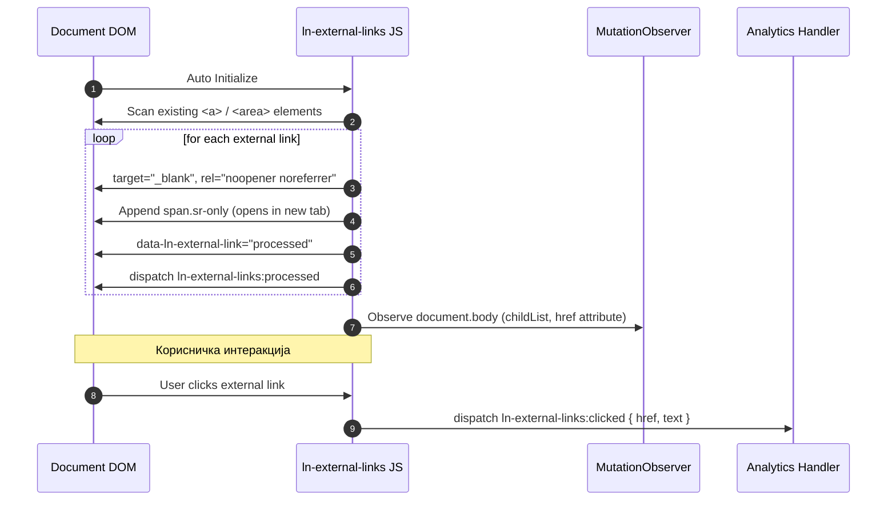

# 🌐 ln-external-links

> **Класификација:** 🟢 Едноставна компонента / Глобално однесување (Layer 1 - Security & Accessibility)  
> **Изворен код:** [`js/ln-external-links/src/ln-external-links.js`](../../js/ln-external-links/src/ln-external-links.js)

---

## 1. Заднинско дејство и одговорност

- **Краток опис:** `ln-external-links` е пасивна помошна компонента која овозможува автоматско санирање, безбедносна заштита и подобрување на пристапноста за сите надворешни линкови (outbound links) на страницата.
- **Главна одговорност:** Го набљудува DOM-от и ги детектира сите `<a>` и `<area>` елементи чиј `hostname` се разликува од тековниот `window.location.hostname`.
- **Безбедносна заштита (Reverse Tabnabbing Prevention):** На сите надворешни линкови автоматски им доделува `target="_blank"` и го дополнува атрибутот `rel` со `noopener noreferrer`.
- **Пристапно известување (A11y Hint):** Динамички вметнува скриен `<span>` со класа `.sr-only` и содржина `(opens in new tab)` во согласност со WCAG препораките.
- **Динамичко набљудување (MutationObserver):** Континуирано го следи `document.body` за ново-вметнати линкови преку AJAX или промени на `href` атрибути.
- **Телеметрија / Аналитика:** Слуша кликови на глобално ниво и емитува настан `ln-external-links:clicked` при клик на обработен надворешен линк.
- **Ортогоналност (Што компонентата НЕ прави):**
  - **НЕ додава визуелни стилови или икони:** Иконите за надворешен линк се одговорност на SCSS/CSS слојот.
  - **НЕ блокира навигација ниту прикажува дијалози:** Не отвора модални дијалози; само нотифицира за кликовите преку настани.

---

## 2. Минимален HTML Маркап и Варијанти на Употреба

Компонентата работи автоматски врз сите линкови во `document.body` и не бара рачна активација со атрибути.

```html
<!-- Пред иницијализација (суров HTML) -->
<div class="footer-links">
    <a href="https://google.com">Google</a>
    <a href="/about-us">Внатрешен линк</a>
</div>

<!-- По обработка од страна на ln-external-links -->
<div class="footer-links">
    <a href="https://google.com" 
       target="_blank" 
       rel="noopener noreferrer" 
       data-ln-external-link="processed">
       Google
       <span class="sr-only">(opens in new tab)</span>
    </a>
    
    <!-- Внатрешниот линк останува недопрен -->
    <a href="/about-us">Внатрешен линк</a>
</div>
```

---

## 3. Декларативен API Договор (Атрибути и Настани)

### Атрибути

| Атрибут | Елемент | Тип | Опис |
| :--- | :--- | :--- | :--- |
| `data-ln-external-link` | `<a>`, `<area>` | `String` | Се поставува автоматски на `processed` по завршување на обработката за спречување реиндексирање. |

### Настани (Events API)

| Настан | Target | Payload `e.detail` | Опис |
| :--- | :--- | :--- | :--- |
| `ln-external-links:processed` | `a, area` | `{ link: HTMLElement, href: String }` | Се емитува откако линкот ќе биде саниран и заштитен. |
| `ln-external-links:clicked` | `a, area` | `{ link: HTMLElement, href: String, text: String }` | Се емитува при секој клик на обработен надворешен линк (за аналитика). |

### Програмерски JS API (`window.lnExternalLinks`)

| Метод | Параметри | Опис |
| :--- | :--- | :--- |
| `window.lnExternalLinks.process` | `(container?: HTMLElement)` | Рачно започнува скенирање и санирање на линкови во одреден DOM контејнер. |

---

## 4. CSS Стилизирање и Поведенски Концепт

Компонентата додава само скриена поддршка за пристапност преку стандардната `.sr-only` класа:

```scss
// SCSS имплементација за скриени помошни пораки
.sr-only {
    position: absolute;
    width: 1px;
    height: 1px;
    padding: 0;
    margin: -1px;
    overflow: hidden;
    clip: rect(0, 0, 0, 0);
    white-space: nowrap;
    border: 0;
}
```

---

## 5. Пристапност (ARIA) и Чести Грешки

* **Пристапност:** Вметнувањето на скриената порака `(opens in new tab)` обезбедува машините за екранско читање навремено да го информираат корисникот пред отворање нов прозорец.
* **Честа грешка 1: Изоставување на `.sr-only` класата во CSS:** Доколку оваа класа не е дефинирана во CSS, помошниот текст `(opens in new tab)` ќе се појави визуелно покрај сите надворешни линкови.
* **Честа грешка 2: Поделити поддомени третирани како надворешни:** Апсолутни линкови кон друг поддомен (на пр. `api.mysite.com`) се третираат како надворешни бидејќи `hostname` не се совпаѓа.

---

## 6. Дијаграм на Текот и Животен Циклус



---

## 7. Поврзани Компоненти

- [`ln-link.md`](./ln-link.md) — Овозможува примена на кликабилност на цели блокови.
