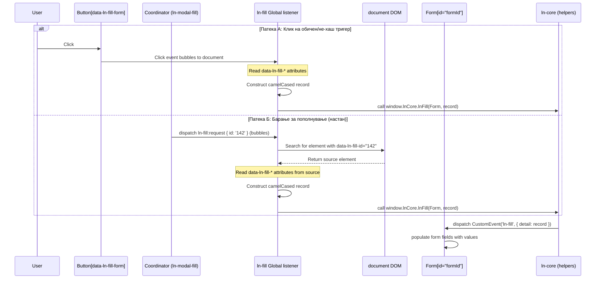

# 📝 ln-fill
> **Класификација:** 🟢 Едноставна компонента / Глобално однесување (Layer 1 - Form/Display Binder)

---

## 1. Заднинско дејство и одговорност
`ln-fill` не е класична изолирана DOM компонента, туку претставува декларативно глобално однесување (event delegation behavior) за брзо пополнување и чистење на форми.

*   **Главна Одговорност:** Слуша кликови на елементи со `data-ln-fill-form="formId"`, ги собира нивните `data-ln-fill-*` атрибути, ги мапира во camelCase објект (рекорд) и го испраќа тој рекорд до целната форма преку CustomEvent-от `ln-fill`.
*   **Слободен проток на кликови:** Компонентата намерно НЕ извршува `e.preventDefault()`. Ова овозможува истата интеракција (клик) истовремено да отвори дијалог (преку `data-ln-modal-for` од `ln-modal`) и да го пополни со податоци во еден чекор. Кликовите со `Ctrl`/`Meta` модификатор и средното глувче се игнорираат (резервирани за нативно однесување на прелистувачот).
*   **Исклучок за хаш-линкови (Превенција од двојно пополнување):** Ако кликнатиот елемент е линк со хаш дестинација (на пр. `href="#user-modal:142"`), `ln-fill` намерно го игнорира пополнувањето при клик. Наместо тоа, пополнувањето се делегира на `ln-modal-fill` координаторот кој по промената на URL-то ќе прати настан `ln-fill:request` кон соодветниот модал.
*   **Емитент кон Форми:** `ln-fill` го повикува `window.lnCore.lnFill(container, record)`, кој пак испраќа CustomEvent `ln-fill` до самата цел и сите нејзини потомци што соодветствуваат на `[data-ln-form]`.

---

## 2. Минимален HTML Маркап и Варијанти на Употреба

```html
<!-- Иницирање пополнување на форма при клик (на пр. во табела со акции) -->
<button 
    data-ln-fill-form="user-edit-form"
    data-ln-fill-id="142"
    data-ln-fill-name="Петар Петровски"
    data-ln-fill-role="admin"
    data-ln-fill-is-active="true"
    data-ln-modal-for="user-modal">
    Уреди Корисник
</button>

<!-- Целна форма која го слуша пополнувањето -->
<form id="user-edit-form" data-ln-form action="/api/users/update" method="post">
    <input type="hidden" name="id" />
    <input type="text" name="name" />
    <select name="role">
        <option value="admin">Администратор</option>
        <option value="user">Корисник</option>
    </select>
</form>
```
## 3. Декларативен API Договор (Атрибути и Настани)

| Атрибут | Тип | Опис |
| :--- | :--- | :--- |
| `data-ln-fill-form` | `String` | ID на целната форма што ќе биде пополнета при клик. |
| `data-ln-fill-id` | `String` | Уникатен идентификатор на записот нанесен на тригерот. Се користи при `ln-fill:request` настан за пронаоѓање на соодветниот извор на податоци во DOM. |
| `data-ln-fill-*` | `String` | Било кој атрибут со овој префикс (пр. `data-ln-fill-first-name`) ќе биде изваден и испратен како својство на рекордот во camelCase формат (пр. `firstName`). |

### DOM Барања и Настани (Слуша и Емитува)

| Настан | Насока | Payload `e.detail` | Опис |
| :--- | :--- | :--- | :--- |
| `ln-fill:request` | Слуша | `{ id: String\|null }` | Се слуша на `document`. Емитуван од координатори за тригерирање на пополнување (со вредност за `id`) или празнење/ресетирање (со `null`). |
| `ln-fill` | Емитува | `Record\|null` | Се испраќа кон целната форма. Payload-от содржи објект со вредности; `null` вредност предизвикува ресетирање. |

#### Специфични однесувања:
*   **Ресетирање (`detail = null`):** Формата се ресетира нативно (`form.reset()`).
*   **Прескокнување на вредности:** При пополнување, `null` или `undefined` вредности во рекордот се прескокнуваат (постојната содржина на тоа поле се зачувува).

---

## 4. CSS Стилизирање и Поведенски Концепт
Како логичко однесување, `ln-fill` не носи свои визуелни стилови и не се потпира на сопствени CSS класи.

---

## 5. Пристапност (ARIA) и Чести Грешки
*   **Пристапност:** Бидејќи `ln-fill` го менува DOM-от динамички (текстови, атрибути), доколку овие промени се од суштинско значење за корисникот на екрански читач, размислете за додавање на соодветни `aria-live="polite"` региони околу целните контејнери.
*   **Честа грешка 1:** Користење на резервирани клучни зборови како `data-ln-fill-form` или `data-ln-fill-store` за пренос на податоци. Овие се резервирани за инфраструктурни цели и нема да се појават во крајниот објект.
*   **Честа грешка 2:** Несовпаѓање меѓу името на атрибутот и името во дестинацијата. Имајте предвид дека `data-ln-fill-user-id` станува `userId` во JS, па целното поле во формата мора да има `name="userId"` (или соодветниот `data-ln-field="userId"`). Ако името на полето не може да се совпадне со клучот на рекордот, полето може да декларира `data-ln-fill-as="userId"` — тој клуч има предност пред `name` при мапирањето.
*   **Честа грешка 3:** Целна форма без `data-ln-form` атрибут. Fan-out диспечерот испраќа `ln-fill` само на елементи што одговараат на `[data-ln-form]` или `[data-ln-fillable]` — ако формата го нема атрибутот, настанот воопшто не се испраќа на неа (освен на евентуални fillable потомци) и кликот поминува без ефект.

---

## 6. Дијаграм на Текот и Животен Циклус



---

## 7. Поврзани Компоненти
*   **`ln-form`**: Најчестата дестинација за `ln-fill`. Ја пресретнува вредноста и ги пополнува инпутите соодветно.
*   **`ln-modal-fill`**: Координатор кој овозможува deep-linking и автоматско активирање на `ln-fill` преку URL хаш промени.
*   **`ln-modal`**: Често се наоѓа на истиот тригер (`data-ln-modal-for`) за да се овозможи истовремено отворање и пополнување на дијалог прозорец.
