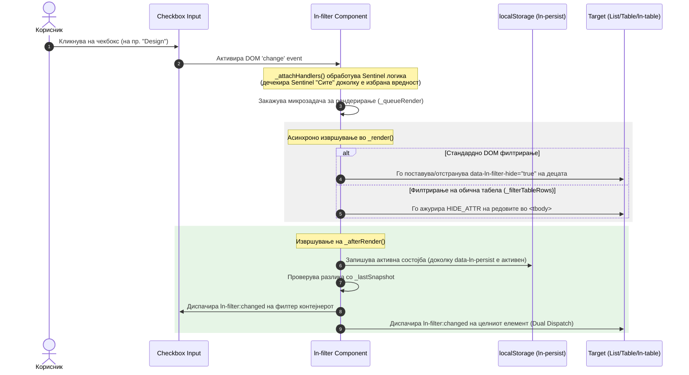

# 🎯 ln-filter

> **Класификација:** 🟢 Едноставна компонента (Примитив за филтрирање)

---

## 1. Заднинско дејство и одговорност

- **Краток опис:** Семантички, `ln-filter` претставува листа од чекбоксови (`<input type="checkbox">`) организирани во HTML контејнер. Овој нула-зависен, настански примитив (`Generic List & Table Filter Primitive`) управува со видливоста на елементи во листи или табели според нивните `data-*` атрибути или според содржината на ќелиите во табеларни колони.
- **Ортогоналност (Што компонентата НЕ прави):**
  - **НЕ управува со AJAX/API барања:** `ln-filter` работи исклучиво декларативно врз DOM елементи или емитува настани (`ln-filter:changed`).
  - **НЕ го менува сопствениот DOM состав на табелата при `ln-table` интеграција:** Кога се користи со `ln-table`, `ln-filter` емитува настани кон табелата, а самите табеларни трансформации ги извршува `ln-table`.
  - **НЕ применува директни `element.style.display` стилови во JS:** Наместо тоа, компонентата поставува/отстранува `data-ln-filter-hide="true"`, препуштајќи му го криењето на CSS слојот (`[data-ln-filter-hide="true"] { display: none !important; }`).
  - **НЕ додава бизнис логика за сортирање или пагинација:** Работи исклучиво како независен предикатор за филтрирање (OR логика за опции во иста категорија, AND логика помеѓу повеќе колони/категории).

---

## 2. Минимален HTML Маркап и Варијанти на Употреба

### 2.1. Основен HTML маркап (Филтрирање на листа според `data-*` атрибут)
Врзување на филтерот со листата преку нејзиниот `id` (`data-ln-filter="employees-list"`):

```html
<ul data-ln-filter="employees-list">
  <!-- Reset Sentinel ("Сите") -->
  <li>
    <label>
      <input type="checkbox" data-ln-filter-key="category" data-ln-filter-reset checked>
      Сите
    </label>
  </li>

  <!-- Вредности за филтрирање -->
  <li>
    <label>
      <input type="checkbox" data-ln-filter-key="category" data-ln-filter-value="design">
      Дизајн
    </label>
  </li>
  <li>
    <label>
      <input type="checkbox" data-ln-filter-key="category" data-ln-filter-value="dev">
      Развој
    </label>
  </li>
</ul>

<ul id="employees-list">
  <li data-category="design">Ана Петрова — UI Дизајнер</li>
  <li data-category="dev">Марко Николов — Дев</li>
</ul>
```

### 2.2. Филтрирање на обична HTML табела со авто-популација и Перзистенција (`data-ln-filter-col`)
Автоматски ги генерира сите уникатни вредности од колона 2 (0-based index) преку `<template>` и ги зачувува селекциите во `localStorage`:

```html
<ul id="dept-filter" data-ln-filter="users-table" data-ln-filter-col="2" data-ln-persist>
  <li>
    <label>
      <input type="checkbox" data-ln-filter-key="dept" data-ln-filter-reset checked>
      Сите оддели
    </label>
  </li>
  
  <!-- Темплејт за динамичко популирање на уникатните вредности -->
  <template>
    <li><label><input type="checkbox"> {{ text }}</label></li>
  </template>
</ul>

<table id="users-table">
  <thead>
    <tr><th>ID</th><th>Име</th><th>Оддел</th></tr>
  </thead>
  <tbody>
    <tr><td>1</td><td>Ана Петрова</td><td>Engineering</td></tr>
    <tr><td>2</td><td>Марко Николов</td><td>Design</td></tr>
  </tbody>
</table>
```

### 2.3. Композиција со Popover за колони во `ln-table`
При користење со `ln-table`, `ln-filter` не користи `data-ln-filter-col`, туку емитува настани кон табелата преку нејзиниот `id`:

```html
<!-- Насловот на колоната во ln-table -->
<th data-ln-table-sort="string" data-ln-table-filter-col="department">
  Оддел
  <button class="table-filter" type="button"
          data-ln-table-col-filter
          data-ln-popover-for="filter-dept-popover"
          aria-label="Филтрирај оддел">
    <svg class="ln-icon" aria-hidden="true"><use href="#ln-filter"></use></svg>
  </button>
</th>

<!-- Popover контејнер надвор од табелата -->
<div data-ln-popover id="filter-dept-popover">
  <input type="search" placeholder="Пребарај..."
         data-ln-search="filter-dept-list"
         data-ln-search-items="label"
         data-ln-search-debounce="0">

  <ul id="filter-dept-list" data-ln-filter="my-table">
    <li><label><input type="checkbox" data-ln-filter-key="department" data-ln-filter-reset checked> Сите</label></li>
    <li><label><input type="checkbox" data-ln-filter-key="department" data-ln-filter-value="Engineering"> Engineering</label></li>
    <li><label><input type="checkbox" data-ln-filter-key="department" data-ln-filter-value="Design"> Design</label></li>
  </ul>
</div>
```

---

## 3. Декларативен API Договор (Атрибути и Настани)

### 3.1. Декларативни Атрибути

| Атрибут | Елемент | Тип | Стандардна вредност | Опис |
| :--- | :--- | :--- | :--- | :--- |
| `data-ln-filter` | Контејнер-корен | `String` | *(Задолжително)* | ID на целниот контејнер (листа, табела или `ln-table`) чии елементи се филтрираат. |
| `data-ln-filter-key` | `<input type="checkbox">` | `String` | `null` | Името на клучот за филтрирање (соодветствува на `data-[key]` кај елементите-деца или името на колоната). |
| `data-ln-filter-value` | `<input type="checkbox">` | `String` | `""` | Вредноста за совпаѓање. Активните чекбоксови ги прикажуваат елементите со иста вредност. |
| `data-ln-filter-reset` | `<input type="checkbox">` | `Flag` | `false` | Означува Sentinel чекбокс ("Сите"). Кога е чекиран, ги дечекира сите конкретни вредности. |
| `data-ln-filter-col` | Контејнер-корен | `Number` | `null` | *(Опционо)* 0-базиран индекс на колона за директно филтрирање на редови од обична HTML табела. |
| `data-ln-persist` | Контејнер-корен | `Flag`/`String` | `false` | Перзистирање на активно избраните чекбоксови во `localStorage` (користи `id` или зададена вредност). |
| `data-ln-filter-hide` | Деца на целта | `Boolean` | `false` | *(Состојба)* Се поставува како `data-ln-filter-hide="true"` на сите скриени елементи кои не одговараат на филтерот. |
| `data-ln-filter-initialized` | Контејнер-корен | `Flag` | `false` | *(Внатрешна состојба)* Се поставува автоматски откако компонентата е иницијализирана. |

### 3.2. Настани (Events API)

`ln-filter` користи **двојно емитување (Dual Dispatch)**. Сите настани се диспачираат истовремено и на самиот контејнер со филтерот (`this.dom`) и на целниот елемент (`document.getElementById(targetId)`).

| Настан | Цел на емитување | Detail Пакетот (`event.detail`) | Опис |
| :--- | :--- | :--- | :--- |
| `ln-filter:changed` | Filter Root + Target Element | `{ key: string, values: string[] }` | Се емитува при секоја промена на селекцијата (содржани се сите моментално чекирани вредности). |
| `ln-filter:reset` | Filter Root + Target Element | `{}` | Се емитува исклучиво при транзиција во ресетирана состојба (кога претходно имало активни вредности, а сега е чекиран Sentinel-от). |

---

## 4. CSS Стилизирање и Поведенски Концепт

### 4.1. Функционални и Визуелни SCSS Стилизирања

1. **Функционално скривање (`ln-filter.scss`):**  
   Изворниот CSS правило-сет за криење елементи е дефиниран во [../../js/ln-filter/ln-filter.scss](../../js/ln-filter/ln-filter.scss):

   ```scss
   [data-ln-filter-hide="true"] {
   	display: none !important;
   }
   ```

2. **Визуелни варијанти за стилизирање на листи од филтер-чекбоксови (Pills, Chips, Outline):**  
   Системот обезбедува SCSS миксини во [../../scss/config/mixins/_form.scss](../../scss/config/mixins/_form.scss) и готови CSS класи во [../../scss/components/_form.scss](../../scss/components/_form.scss) за трансформација на обични чекбоксови во визуелни филтер-копчиња („pills“ / „chips“):

   | Класа | SCSS Миксин | Опис |
   | :--- | :--- | :--- |
   | `.pills` | `@include pills;` | Поврзана (joined) група од пополнети филтер-копчиња за `<ul>` со вградена радиус логика за прв/последен елемент. |
   | `.pills-outline` | `@include pills-outline;` | Поврзана (joined) група од контурни (outline) филтер-копчиња со прозрачна позадина и промена на граничната боја. |
   | `.pills-segmented` | `@include pills-segmented;` | Сегментирана контрола за компактен изглед на филтрите. |
   | `.pills-switch` | `@include pills-switch;` | Преклопнички стил за филтер листи. |
   | `.pill` | `@include pill;` | Самостојно пополнето филтер-копче / чип за еден `<label><input type="checkbox"></label>` (го крие нативниот `input` и применува `--color-accent` кога е чекиран). |
   | `.pill-outline` | `@include pill-outline;` | Самостојно контурно филтер-копче со видлив `input` индикатор и контурна рамка. |

   **Пример за употреба на Поврзани Филтер Копчиња (Joined Pills):**
   ```html
   <ul class="pills" data-ln-filter="products-list">
     <li>
       <label>
         <input type="checkbox" data-ln-filter-key="status" data-ln-filter-reset checked>
         Сите
       </label>
     </li>
     <li>
       <label>
         <input type="checkbox" data-ln-filter-key="status" data-ln-filter-value="active">
         Активни
       </label>
     </li>
     <li>
       <label>
         <input type="checkbox" data-ln-filter-key="status" data-ln-filter-value="archived">
         Архивирани
       </label>
     </li>
   </ul>
   ```

   **Пример за употреба на Контурни Филтер Копчиња (Outline Pills):**
   ```html
   <ul class="pills-outline" data-ln-filter="products-list">
     <li>
       <label>
         <input type="checkbox" data-ln-filter-key="status" data-ln-filter-reset checked>
         Сите
       </label>
     </li>
     <li>
       <label>
         <input type="checkbox" data-ln-filter-key="status" data-ln-filter-value="in-stock">
         На залиха
       </label>
     </li>
   </ul>
   ```

### 4.2. Поведенски Концепти и Логика на Sentinel
1. **Правила за Sentinel (Reset Checkbox):**
   - **Чекирање на Sentinel:** Доколку корисникот кликне на Sentinel чекбоксот (`data-ln-filter-reset`), сите други вредности автоматизираат и стануваат `checked = false`.
   - **Чекирање на конкретна вредност:** Се дечекира Sentinel-от.
   - **Чекирање на сите вредности (Collapse to Sentinel):** Доколку сите достапни чекбоксови на вредности се чекираат, компонентата автоматски ги дечекира нив и го чекира Sentinel-от ("Сите"), спречувајќи непотребно оптоварување на филтрирањето.
   - **Дечекирање на последната вредност:** Доколку корисникот ја дечекира последната активна вредност, компонентата автоматски го враќа Sentinel-от во чекирана состојба (не дозволува празна/недефинирана селекција).
2. **Бачирање и Перформанси:**
   - Извршувањето на филтрирањето е оптимизирано преку microtask batcher (`createBatcher` од `ln-core`), спречувајќи синхрони прерачунувања при повеќе последователни промени.
3. **Перзистенција:**
   - Кога е присутен атрибутот `data-ln-persist`, селекцијата се запишува во `localStorage` преку `persistSet('filter', dom, payload)` под клуч со формат `ln:filter:<path>:<id>`. При повторно вчитување, состојбата автоматски се реставрира преку `persistGet`.

---

## 5. Пристапност (ARIA) и Чести Грешки

### 5.1. ARIA и Тастатурна Навигација
- **Нативни контролни елементи:** `ln-filter` се потпира на стандардни `<input type="checkbox">` елементи. Навигацијата се одвива преку нативен `Tab` за фокусирање и `Space` за избор/деселекција.
- **Означување за читачи на екран:** Секој чекбокс треба да биде обвиен во `<label>` или да користи `aria-label` / `aria-labelledby`.
- **Семантика при користење во Popover:** Кога филтерот се наоѓа во Popover (на пр. за `ln-table` колони), копчето за отворање треба да користи `data-ln-popover-for="<id>"` и соодветен `aria-label="Филтрирај..."`.

### 5.2. Чести Грешки (Anti-Patterns)

> [!CAUTION]
> **1. Промена на `input.checked` преку JS без емитување на настан**
> Менувањето на `input.checked = true` од надворешна JS скрипта нема автоматски да го активира DOM `change` слушателот. Секогаш мора експлицитно да се диспачира `change` настан:
> ```javascript
> input.checked = true;
> input.dispatchEvent(new Event('change', { bubbles: true }));
> ```

> [!WARNING]
> **2. Недостасува `id` на елементот при користење на `data-ln-persist`**
> Клучот за перзистенција се базира на `id` на елементот или специфична вредност во `data-ln-persist="my-key"`. Доколку контејнерот нема ниту `id` ниту вредност во атрибутот, `ln-persist` ќе прикаже предупредување во конзолата и нема да ја зачува состојбата.

> [!IMPORTANT]
> **3. Неправилно користење на `data-ln-filter-col` кај `ln-table`**
> Атрибутот `data-ln-filter-col` (0-базиран индекс на колона) се користи **само** за обични HTML табели кои не ја користат компонентата `ln-table`. Кога филтрирате `ln-table`, користете `data-ln-filter="<tableId>"` на `<ul>` со `data-ln-filter-key="<columnName>"`, а `ln-table` сама ги мапира клучевите со колоните преку нејзиниот `data-ln-table-filter-col="<columnName>"`.

---

## 6. Дијаграм на Текот и Животен Циклус



---

## 7. Поврзани Компоненти

- [ln-table.md](./ln-table.md) — Табеларна компонента која слуша `ln-filter:changed` за поддршка на филтрирање по колони.
- [ln-search.md](./ln-search.md) — Примитив за пребарување кој работи ортогонално со `ln-filter` во исти листи или Popover контејнери.
- [ln-persist.md](./ln-persist.md) — Модул за перзистирање на состојбата на филтри во `localStorage`.
- [ln-popover.md](./ln-popover.md) — Поповер компонента која се користи како пренослив контејнер за филтри во заглавијата на табели.
- [ln-toggle.md](./ln-toggle.md) — Едноставна компонента за управување со состојби на преклопници.
