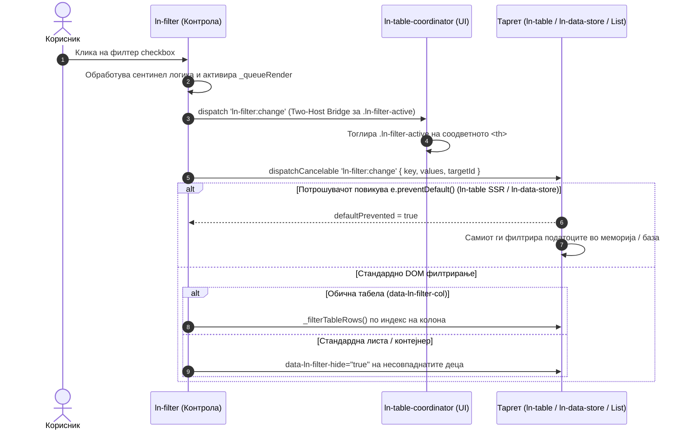

# 🎯 ln-filter

> **Класификација:** 🟢 Едноставна компонента / Филтерски примитив (Layer 1)

---

## 1. Заднинско дејство и одговорност
- **Краток опис:** `ln-filter` е декларативен, настански управуван примитив за филтрирање на листи и табели преку контролни инпути (checkboxes). Овозможува филтрирање по повеќе критериуми (OR логика за опции со ист клуч/колона, и AND логика помеѓу различни категории). Работи врз Two-Host Bridge архитектура, испраќајќи откажлив `ln-filter:change` настан со `{ bubbles: true }`.
- **Ортогоналност (Што компонентата НЕ прави):**
  - НЕ гребе податоци од табеларни ќелии за автоматско генерирање инпути — опциите се дефинираат во маркапот (Domain Enums / Server-Rendered / `ln-options`).
  - НЕ содржи директни референци или проверки за sibling компоненти (како `data-ln-table` или `ln-data-store`).
  - НЕ филтрира директно мемориски структури кога потрошувачот (`ln-table` во SSR режим или `ln-data-store`) повикува `e.preventDefault()`.
  - НЕ поставува inline стилови (`el.style.display = 'none'`) — поставува исклучиво `data-ln-filter-hide="true"`.
  - НЕ извршува директни мрежни повици (AJAX / Fetch).

---

## 2. Минимален HTML Маркап и Варијанти на Употреба

### 1. Канонски HTML Маркап (Филтрирање на Листа)
```html
<ul data-ln-filter="employees-list">
  <!-- Ресетирачки сентинел ("Сите") -->
  <li>
    <label>
      <input type="checkbox" data-ln-filter-key="category" data-ln-filter-reset checked>
      Сите
    </label>
  </li>

  <!-- Вредности за филтрирање -->
  <li>
    <label>
      <input type="checkbox" data-ln-filter-key="category" data-ln-filter-value="design">
      Дизајн
    </label>
  </li>
  <li>
    <label>
      <input type="checkbox" data-ln-filter-key="category" data-ln-filter-value="dev">
      Развој
    </label>
  </li>
</ul>

<ul id="employees-list">
  <li data-category="design">Ана Петрова — UI Дизајнер</li>
  <li data-category="dev">Марко Николов — Програмер</li>
</ul>
```

### 2. Филтрирање на Обична `<table>` по Колона (`data-ln-filter-col`)
За обични HTML табели, `data-ln-filter-col="N"` го овозможува филтрирањето на редовите во `<tbody>` по индекс на колона:
```html
<nav data-ln-filter="users-table" data-ln-filter-col="2">
  <ul>
    <li><label><input type="checkbox" data-ln-filter-key="dept" data-ln-filter-reset checked> Сите</label></li>
    <li><label><input type="checkbox" data-ln-filter-key="dept" data-ln-filter-value="Engineering"> Инженерство</label></li>
    <li><label><input type="checkbox" data-ln-filter-key="dept" data-ln-filter-value="Design"> Дизајн</label></li>
  </ul>
</nav>

<table id="users-table">
  <thead>
    <tr><th>ID</th><th>Име</th><th>Оддел</th></tr>
  </thead>
  <tbody>
    <tr><td>1</td><td>Ана Петрова</td><td>Engineering</td></tr>
    <tr><td>2</td><td>Марко Николов</td><td>Design</td></tr>
  </tbody>
</table>
```

### 3. Композиција во Поповер за Табела со Координатор
```html
<!-- Заглавие на табела со копче за поповер -->
<th data-ln-table-filter-col="department">
  Оддел
  <button type="button" class="table-filter"
          data-ln-table-col-filter
          data-ln-popover-for="filter-dept-popover"
          aria-label="Филтрирај оддел">
    <svg class="ln-icon" aria-hidden="true"><use href="#ln-icon-filter"></use></svg>
  </button>
</th>

<!-- Поповер панел -->
<div data-ln-popover id="filter-dept-popover">
  <ul id="filter-dept-list" data-ln-filter="users-table">
    <li><label><input type="checkbox" data-ln-filter-key="department" data-ln-filter-reset checked> Сите</label></li>
    <li><label><input type="checkbox" data-ln-filter-key="department" data-ln-filter-value="Engineering"> Инженерство</label></li>
    <li><label><input type="checkbox" data-ln-filter-key="department" data-ln-filter-value="Design"> Дизајн</label></li>
  </ul>
</div>
```

---

## 3. Декларативен API Договор (Атрибути и Настани)

### Атрибути

| Атрибут | Елемент | Стандардно | Опис |
| :--- | :--- | :--- | :--- |
| `data-ln-filter="targetId"` | Контролен контејнер (`<ul>` / `<nav>`) | — | Покажувач кон ID на целниот елемент (листа, табела или store). |
| `data-ln-filter-key="key"` | `<input type="checkbox">` | — | Клуч на полето (одговара на `data-[key]` кај децата или клуч за колона). |
| `data-ln-filter-value="val"` | `<input type="checkbox">` | `""` | Вредност за совпаѓање (OR логика за штиклирани опции со ист клуч). |
| `data-ln-filter-reset` | `<input type="checkbox">` | — | Ресетирачки сентинел („Сите“). Штиклирањето ги одштиклира останатите вредности. |
| `data-ln-filter-col="idx"` | Контролен контејнер | `null` | 0-базиран индекс на колона за филтрирање на обична HTML `<table>`. |
| `data-ln-persist` | Контролен контејнер | — | Овозможува складирање и враќање на филтерот во `localStorage`. |
| `data-ln-filter-hide="true"` | Деца / Редови на таргетот | — | Состојбен атрибут што го поставува компонентата за скривање на несовпаднатите елементи. |

### Настани (Events API)

| Настан | Елемент | Откажлив | `detail` Структура | Опис |
| :--- | :--- | :--- | :--- | :--- |
| `ln-filter:change` | Контрола & Таргет | Да (`preventDefault`) | `{ key: string, values: string[], targetId: string }` | Се емитува при секоја промена на филтрите. Потрошувачите (`ln-table` SSR или `ln-data-store`) повикуваат `preventDefault()` за да го исклучат стандардното DOM криење. |
| `ln-filter:reset` | Контрола & Таргет | Не | `{ targetId: string }` | Се емитува при транзиција од активен филтер назад кон сентинелот („Сите“). |

---

## 4. CSS Стилизирање и Поведенски Концепт
- **Скривање на несовпаднати ставки:**
  ```scss
  [data-ln-filter-hide="true"] {
    display: none !important;
  }
  ```
- **Сентинел Логика (Автоматска Координација):**
  1. **Штиклирање на сентинелот:** Ги одштиклира сите вредности во групата.
  2. **Штиклирање на вредност:** Го одштиклира сентинелот.
  3. **Колабирање кон сентинел:** Ако сите вредности во групата се штиклираат, тие се одштиклираат и се активира сентинелот („Сите“).
  4. **Заштита од празна состојба:** Ако се одштиклира и последната активна вредност, автоматски се активира сентинелот.
- **Микротаск Бачинг:** Промените се бачираат преку `createBatcher` (queueMicrotask) за спречување непотребни пресметки при брзи промени.

---

## 5. Пристапност (ARIA) и Чести Грешки
- **Семантички инпути:** Се користат стандардни `<input type="checkbox">` со поддршка за `Space` и `Tab`.
- **Етикетирање:** Секој инпут мора да биде обвиткан во `<label>` или да содржи соодветен `aria-label`.
- **Чести грешки (Анти-патерни):**
  - Не менувајте `input.checked` во JS без диспачирање на `change` настан (`input.dispatchEvent(new Event('change', { bubbles: true }))`).
  - Не користете `data-ln-filter-col` за `ln-table` компоненти — користете `data-ln-filter="tableId"` на листата и `data-ln-table-filter-col="fieldName"` на `<th>`.

---

## 6. Дијаграм на Текот и Животен Циклус


```mermaid
sequenceDiagram
    autonumber
    actor User as Корисник
    participant Filter as ln-filter (Контрола)
    participant Coord as ln-table-coordinator (UI)
    participant Target as Таргет (ln-table / ln-data-store / List)

    User->>Filter: Клика на филтер checkbox
    Filter->>Filter: Обработува сентинел логика и активира _queueRender
    Filter->>Coord: dispatch 'ln-filter:change' (Two-Host Bridge за .ln-filter-active)
    Coord->>Coord: Тоглира .ln-filter-active на соодветното <th>

    Filter->>Target: dispatchCancelable 'ln-filter:change' { key, values, targetId }

    alt Потрошувачот повикува e.preventDefault() (ln-table SSR / ln-data-store)
        Target-->>Filter: defaultPrevented = true
        Target->>Target: Самиот ги филтрира податоците во меморија / база
    else Стандардно DOM филтрирање
        alt Обична табела (data-ln-filter-col)
            Filter->>Target: _filterTableRows() по индекс на колона
        else Стандардна листа / контејнер
            Filter->>Target: data-ln-filter-hide="true" на несовпаднатите деца
        end
    end
```

---

## 7. Поврзани Компоненти
- [`ln-table.md`](./ln-table.md) — Табела која конзумира `ln-filter:change`.
- [`ln-table-coordinator.md`](./ln-table-coordinator.md) — Координатор кој управува со визуелниот `.ln-filter-active` индикатор.
- [`ln-search.md`](./ln-search.md) — Пребарувачки примитив кој работи ортогонално со `ln-filter`.
- [`ln-popover.md`](./ln-popover.md) — Поповер контејнер за сместување на филтерските менија.
- Изворен код: [`../../js/ln-filter/src/ln-filter.js`](../../js/ln-filter/src/ln-filter.js)
