# 📝 ln-form

> **Класификација:** 🟢 Едноставна компонента / Форм Координатор (Simple Component / Form Manipulator)

---

## 1. Заднинско дејство и одговорност

- **Краток опис:**
  `ln-form` е лесна примитива дефинирана во [`js/ln-form/src/ln-form.js`](../../js/ln-form/src/ln-form.js) (~100 линии) наменета за автоматизирање на HTML форми (`<form>`). Нејзината примарна улога е да овозможи лесно автоматско пополнување на полињата (Form Population) и RESTful рутирање при креирање или измена на записи (method spoofing).

- **Ортогоналност (Што компонентата НЕ прави):**
  - **НЕ стилизира елементи:** Изгледот на формите е одвоена грижа на SCSS (`scss/components/_form.scss`).
  - **НЕ контролира поднесување (Submit) по дифолт:** Нативниот submit тек останува непроменет, освен при користење на `data-ln-form-scope`, каде [`ln-data-coordinator`](./ln-data-coordinator.md) го презема асинхрониот тек на обработка.
  - **НЕ менаџира валидациска состојба:** За тоа е одговорен прелистувачот и компонентата [`ln-validate`](./ln-validate.md).

---

## 2. Минимален HTML Маркап и Варијанти на Употреба

### Базен HTML Маркап
Стандардна HTML5 форма проширена со декларативниот атрибут `data-ln-form`:

```html
<form id="user-form" data-ln-form action="/admin/users" method="POST">
    <div class="form-element">
        <label for="user-name">Корисничко име</label>
        <input id="user-name" name="username" type="text" required />
    </div>

    <ul class="form-actions">
        <li><button type="button" class="btn btn-ghost">Откажи</button></li>
        <li><button type="submit" class="btn btn-primary">Зачувај</button></li>
    </ul>
</form>
```

### Варијанти на Употреба

#### Пример 1: Чисто пополнување на форма (Populate Only)
Кога надворешен елемент диспачира `ln-fill` CustomEvent настан со податоци кон формата, `ln-form` ги разнесува податоците низ полињата. Без `data-ln-form-action-edit`, `action` and `method` на формата не се менуваат.

```html
<!-- Копче-тригер: диспачира ln-fill со { id: "42", username: "dalibor" } -->
<button type="button" 
        data-ln-fill-form="user-form"
        data-ln-fill-id="42"
        data-ln-fill-username="dalibor">
    Прикажи корисник
</button>

<!-- Форма за пополнување -->
<form id="user-form" data-ln-form action="/admin/users" method="POST">
    <input type="hidden" name="id" />
    <label for="username">Корисничко име</label>
    <input id="username" name="username" type="text" />
    <button type="submit">Зачувај</button>
</form>
```

#### Пример 2: RESTful рутирање за измена (Edit Mode со `:id` и method spoofing)
За форми кои поддржуваат режим на креирање и измена (Rails-style method spoofing), се користат атрибутите `data-ln-form-action-edit` и `data-ln-form-action-method`:

```html
<form id="user-form" data-ln-form action="/admin/users" method="POST"
      data-ln-form-action-edit="/admin/users/:id"
      data-ln-form-action-method="PUT">
    <input type="hidden" name="id" />
    <label for="email">Е-пошта</label>
    <input id="email" name="email" type="email" />
    <button type="submit" class="btn btn-primary">Зачувај</button>
</form>
```

- **Режим на измена (Edit Mode):** Кога ќе се прими `record` со `id` (пр. `42`), шаблонот `:id` во `action` се заменува со ID-то. Автоматски се креира и ажурира скриено поле `<input type="hidden" name="_method" value="PUT">` (или `PATCH`).
- **Режим на креирање (Create Mode):** При `reset` или `ln-fill` со вредност `null`, `action` се враќа на базниот (`/admin/users`), а вредноста на `_method` се брише (`""`).

| Состојба | Тригер | `form.action` | Скриено `<input name="_method">` |
| :--- | :--- | :--- | :--- |
| **Измена (Edit Mode)** | `ln-fill` со рекорд со соодветен `id` | Заменет: `/admin/users/42` | `value="PUT"` (или од `data-ln-form-action-method`) |
| **Креирање (New Mode)** | Иницијално / `reset` / `ln-fill` со `null` | Вратен на базен: `/admin/users` | `value=""` (избришан) |

---

## 3. Декларативен API Договор (Атрибути и Настани)

### HTML Атрибути

| Атрибут | Применливост | Тип | Стандардна вредност | Опис |
| :--- | :--- | :--- | :--- | :--- |
| `data-ln-form` | `<form>` | Флаг / ID | — | Иницира `ln-form` инстанца на формата. |
| `data-ln-form-action-edit` | `<form>` | `String` | — | Шаблон за RESTful измена. Доколку е празен, се додава `/${id}` на базниот `action`. Ако содржи `:id`, шаблонот се заменува со ID вредноста. |
| `data-ln-form-action-method` | `<form>` | `String` | `"PUT"` | HTTP верб за скриеното `<input name="_method">` поле во режим на измена. |
| `data-ln-fill-as` | Форм контрола | `String` | — | Опционален override за клучот на мапирање од рекордот, ако `name` на полето се разликува. |
| `data-ln-form-scope` | `<form>` | `String` | — | Врзува форма со `data-ln-data-coordinator`. Празна вредност = containment (најблизок предок). Именувана вредност = експлицитно рутирање кон тој координатор. |

#### Local-first Write Рутирање
Формите со `data-ln-form-scope` ги пресретнуваат нативните submit-и преку т.н. **литерален method gate**:
1. Ако постои `<input name="_method">` со вредност → тој метод се смета за ефективен.
2. Инаку → се користи вредноста на `method` атрибутот на формата.
3. Доколку методот е `POST`, `PUT` или `PATCH`, формата ја пренесува контролата кон `ln-data-coordinator` за асинхроно поднесување.

---

### Настани (Events API)

#### Примени Настани
- **`ln-fill`** (диспачиран кон `<form>`): Каноничен настан за пополнување. Доколку прими објект во `detail`, ги пополнува полињата и го применува REST режимот. Доколку е `null`, повикува нативен `reset`.
- **`reset`** (нативен настан): Го враќа `action` во базна состојба и ја празни вредноста на `_method`.

#### Емитувани Настани
- **`input`** (на секое пополнето текстуално или hidden поле): Се емитува по извршено пополнување.
- **`change`** (на секој пополнет `<select>`, `checkbox` или `radio`): Се емитува по извршено пополнување.
- **`ln-form:destroyed`** (`bubbles: true`): Се диспачира при уништување на инстанцата.

---

### JavaScript API (`form.lnForm`)

```javascript
const form = document.getElementById('user-form');
// Рачно пополнување со рекорд
form.lnForm.fill({ username: 'dalibor', role: 'admin', active: true }); 
// Уништување на инстанцата и чистење на евентите
form.lnForm.destroy(); 
```

---

## 4. CSS Стилизирање и Поведенски Концепт

### SCSS Миксини & Класи
- **Невизуелна компонента:** `ln-form` е чиста логичка примитива. Таа **не поседува сопствени SCSS миксини или класи**. Сите стилови за формите (layouts, inputs, spacing) се дефинирани одделно во глобалниот стилски систем (`scss/components/_form.scss`).

### Поведенски Концепт

- **Алгоритам за автоматско пополнување (`populateForm`):**
  При повикување на `.fill(data)`, се скенираат сите елементи со `name` или `data-ln-fill-as` и се применуваат следниве правила:
  - **Текст / Hidden / Textarea:** `el.value = record[key]`.
  - **Чекбоксови (`checkbox`):**
    - Ако вредноста е низа (Array), се селектира ако вредноста на чекбоксот е дел од низата.
    - Ако вредноста е String со запирки, се врши split по запирки за проверка.
    - За Boolean вредности, се штиклира доколку вредноста е `true`, `"1"`, `"true"`, или `"on"`.
  - **Радио копчиња (`radio`):** Се штиклира доколку вредноста е еднаква со String репрезентацијата на вредноста во рекордот.
  - **Повеќекратен избор (`select-multiple`):** Се селектираат опциите чии вредности се наоѓаат во низата од податоци.
  
  По завршување на пополнувањето, се емитуваат соодветни `input`/`change` настани за секое изменето поле со цел да се синхронизираат надворешните валидациски контроли како [`ln-validate`](./ln-validate.md).

---

## 5. Пристапност (ARIA) и Чести Грешки

### 5.1 Пристапност (ARIA)
Бидејќи `ln-form` се потпира на стандардни HTML елементи, се препорачуваат следниве HTML5 / ARIA практики:
- Секогаш поврзувајте ги контролите со соодветни лејбли користејќи ги атрибутите `for` на `<label>` и `id` на внесот.
- Користете `aria-describedby` за поврзување на полињата со нивните грешки или помошни пораки генерирани од [`ln-validate`](./ln-validate.md).

### 5.2 Чести Грешки (Anti-Patterns)

> [!WARNING]
> **1. Рачно менување на вредноста (`input.value`) без тригерирање на настани**
> Ако вредноста се смени директно во JS (`el.value = 'норма'`), реактивните компоненти (како `ln-validate`) нема да ја забележат промената. Секогаш користете ја функцијата `form.lnForm.fill(data)` или рачно диспачирајте соодветен `input`/`change` настан.

> [!WARNING]
> **2. Копчиња без експлицитен `type`**
> Секогаш поставувајте `type="button"` на копчињата наменети за откажување или затворање. Доколку нема експлицитен тип, прелистувачот ги третира како `type="submit"` што предизвикува непожелно поднесување на формата.

> [!NOTE]
> **3. Рачно внесување на `<input name="_method">` во HTML**
> Нема потреба од рачно додавање на ова скриено поле. `ln-form` автоматски го креира, ажурира и празни во зависност од состојбата (Edit vs Create).

---

## 6. Дијаграм на Текот и Животен Циклус

```mermaid
sequenceDiagram
    autonumber
    actor User as Корисник / Тригер
    participant Form as ln-form
    participant Input as Form Input/Select
    participant Coord as ln-data-coordinator

    Note over User, Form: Сценарио 1: Автоматско пополнување (Edit Mode)
    User->>Form: Event: ln-fill { record: { id: 42, username: 'dalibor' } }
    Form->>Form: Замена на action (/users/:id -> /users/42)
    Form->>Form: Креирање / ажурирање на <input name="_method" value="PUT">
    Form->>Input: Пополнување вредности во соодветни имиња
    Form->>Input: Диспачирање синтетички change/input настан

    Note over User, Form: Сценарио 2: Ресетирање (Create Mode)
    User->>Form: Клик на Reset / Event: ln-fill { null }
    Form->>Form: Враќање на базен action (/users)
    Form->>Form: Празнење на <input name="_method" value="">
```



---

## 7. Поврзани Компоненти

- [`ln-validate.md`](./ln-validate.md) — Додава реактивна валидација на полињата во форма.
- [`ln-data-coordinator.md`](./ln-data-coordinator.md) — Асинхроно го презема submit-от кај scoped формите.
- [`ln-modal.md`](./ln-modal.md) — Чест обвивач за формите на проектот.
- [`ln-table.md`](./ln-table.md) — Клик на акциско копче во табела обично диспачира `ln-fill` настан кон формата.
