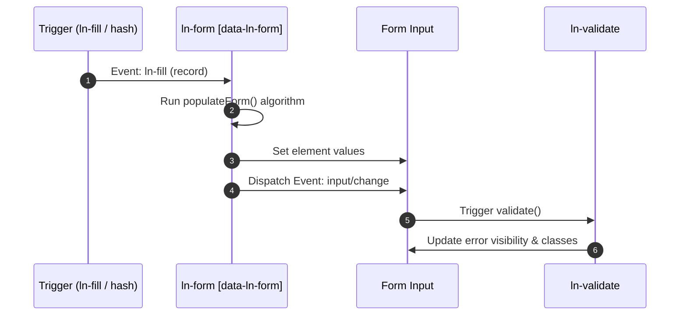

# 📝 ln-form

> **Класификација:** 🟢 Едноставна компонента / Форм Координатор (Simple Component / Form Coordinator)

---

## 1. Заднинско дејство и одговорност
- **Краток опис:**
  `ln-form` е лесна примитива дефинирана во [`js/ln-form/src/ln-form.js`](../../js/ln-form/src/ln-form.js) наменета за автоматизирање на HTML форми (`<form>`). Нејзината примарна улога е да овозможи лесно автоматско пополнување на полињата (Form Population) и RESTful рутирање при креирање или измена на записи (method spoofing).

- **Ортогоналност (Што компонентата НЕ прави):**
  - **Submit е целосно нативен:** `ln-form` воопшто не слуша `submit` и нема validation gate. Тоа е одговорност на [`ln-validate`](./ln-validate.md) и [`ln-data-coordinator`](./ln-data-coordinator.md).
  - **Не води валидациска состојба:** Се потпира на стандардните HTML5 Validity API и [`ln-validate`](./ln-validate.md).
  - **Не врши AJAX/мрежни повици:** Тоа е грижа на [`ln-data-coordinator`](./ln-data-coordinator.md) или [`ln-ajax`](./ln-ajax.md).

---

## 2. Минимален HTML Маркап и Варијанти на Употреба

### Базен HTML Маркап
```html
<form id="user-form" data-ln-form action="/admin/users" method="POST">
    <div class="form-element">
        <label for="user-name">Корисничко име</label>
        <input id="user-name" name="username" type="text" required />
    </div>
    <ul class="form-actions">
        <li><button type="button" class="btn btn-ghost">Откажи</button></li>
        <li><button type="submit" class="btn btn-primary">Зачувај</button></li>
    </ul>
</form>
```

### Варијанта 1: Форма со Автоматско Пополнување (Populate Only)
Кога надворешен елемент диспачира `ln-fill` CustomEvent кон формата, `ln-form` ги разнесува податоците низ полињата:
```html
<form id="user-form" data-ln-form action="/admin/users" method="POST">
    <input type="hidden" name="id" />
    <label for="username">Корисничко име</label>
    <input id="username" name="username" type="text" />
</form>
```

### Варијанта 2: RESTful измена (Edit Mode со `:id` и method spoofing)
За форми кои поддржуваат режим на креирање и измена, се користат `data-ln-form-action-edit` и `data-ln-form-action-method`:
```html
<form id="user-form" data-ln-form action="/admin/users" method="POST"
      data-ln-form-action-edit="/admin/users/:id"
      data-ln-form-action-method="PUT">
    <input type="hidden" name="id" />
    <label for="email">Е-пошта</label>
    <input id="email" name="email" type="email" />
</form>
```

---

## 3. Декларативен API Договор (Атрибути и Настани)

### HTML Атрибути
| Атрибут | Применливост | Тип | Стандардна вредност | Опис |
| :--- | :--- | :--- | :--- | :--- |
| `data-ln-form` | `<form>` | Флаг | — | Иницира `ln-form` инстанца на формата. |
| `data-ln-form-action-edit` | `<form>` | `String` | — | Шаблон за RESTful измена. Доколку е празен, се додава `/${id}` на базниот action. Шаблонот `:id` се заменува со ID-то. |
| `data-ln-form-action-method` | `<form>` | `String` | `"PUT"` | HTTP метод за скриеното `_method` поле во режим на измена. |
| `data-ln-fill-as` | Форм контрола | `String` | — | Мапирање од рекордот ако `name` на полето се разликува. |
| `data-ln-form-scope` | `<form>` | `String` | — | Врзува форма со соодветниот `data-ln-data-coordinator`. |

### JavaScript API (`form.lnForm`)
* **`form.lnForm.fill(data)`**: Рачно пополнување со објект.
* **`form.lnForm.destroy()`**: Уништување на инстанцата и чистење на настаните.

### Настани (Events API)
- **Слуша:**
  - `ln-fill` (диспачиран кон формата): Врши пополнување или `reset` ако е `null`.
  - `reset` (нативен): Враќа `action` во базна состојба и ја празни вредноста на `_method`.
- **Емитува:**
  - `input` / `change`: Се диспачираат на пополнетите полиња за реакција во `ln-validate`.
  - `ln-form:destroyed` (`bubbles: true`): Диспачиран при уништување.

---

## 4. CSS Стилизирање и Поведенски Концепт
- **Невизуелна примитива:** `ln-form` нема сопствени CSS класи. Стилизирањето е дефинирано во `scss/components/_form.scss` за HTML форми.
- **Алгоритам за пополнување (`populateForm`):**
  При пополнување со `.fill(data)`, се скенираат сите елементи со `name` или `data-ln-fill-as`:
  - *Текст / Hidden / Textarea:* `el.value = record[key]`.
  - *Чекбоксови:* Поддржува низи, стрингови со запирки, или Boolean вредности.
  - *Радио и Select-multiple:* Автоматски селектира соодветни вредности.
- **RESTful Method Spoofing:** Во режим на измена, се креира скриено `<input type="hidden" name="_method">` со вредноста од `data-ln-form-action-method` (на пр. `PUT`).

---

## 5. Пристапност (ARIA) и Чести Грешки
- **Пристапност:** `ln-form` не управува со фокус директно, тоа го прави `ln-validate` или `ln-modal`.
- **Анти-патерни:**
  > [!WARNING]
  > **1. Рачно менување на вредноста во JS без настани:**
  > Директното менување на `el.value = '...'` нема да го активира `ln-validate`. Секогаш користете `form.lnForm.fill(data)` или емитувајте `input`/`change` настани.
  
  > [!WARNING]
  > **2. Копчиња без тип:**
  > Секогаш дефинирајте `type="button"` за откажи/затвори копчињата за да спречите нативен submit.

---

## 6. Дијаграм на Текот и Животен Циклус



---

## 7. Поврзани Компоненти
- [`ln-validate.md`](./ln-validate.md) — Додава реактивна валидација.
- [`ln-data-coordinator.md`](./ln-data-coordinator.md) — Го презема submit-от кај scoped формите.
- [`ln-modal.md`](./ln-modal.md) — Обвивач за модални форми.
