# 📝 ln-form

> **Класификација:** 🟢 Едноставна компонента / Форм Координатор (Simple Component / Form Manipulator)

---

## 1. Заднинско дејство и одговорност

`ln-form` е ултра-лесна, подобрена примитива за управување со HTML форми (`<form>`). Имплементирана е во [`js/ln-form/src/ln-form.js`](../../js/ln-form/src/ln-form.js) (~100 линии) и стилизирана преку SCSS во [`scss/components/_form.scss`](../../scss/components/_form.scss).

Нејзините две главни одговорности се:
1. **Автоматско пополнување (Form Population)**: При пристигнување на `ln-fill` CustomEvent настан со податочен објект (`record`), `ln-form` ги мапира вредностите во соодветните полиња (`input`, `select`, `textarea`) според атрибутите `name` или `data-ln-fill-as`. По пополнувањето, емитува синтетички `input` односно `change` настани за синхронизација со реактивни слушатели.
2. **RESTful рутирање на акцијата (Create ⇄ Edit Routing)**: Кога е вклучен опционалниот атрибут `data-ln-form-action-edit`, при пополнување на рекорд со `id`, компонентата динамички го препишува `action` атрибутот на формата и инјектира/ажурира скриено `<input name="_method">` поле за Laravel REST method spoofing (на пр. `PUT` или `PATCH`). При `reset` или `null` рекорд, ги враќа атрибутите во првобитна состојба за креирање нов рекорд.

> [!IMPORTANT]
> **Што `ln-form` НЕ прави (Orthogonality Doctrine):**
> * **НЕ пресретнува `submit` настан, освен ако формата носи `data-ln-form-scope`** — Без овој атрибут, субмитот останува 100% нативен HTML: `ln-form` не слуша `submit` и не повикува `preventDefault()`. Доколку се бара AJAX пресретнување при испраќање, тоа е работа на посебна транспортна компонента (како [`ln-ajax`](../../js/ln-ajax/README.md)) која самата се закачува на `submit`. Со `data-ln-form-scope` присутен, `ln-form` **условно** пресретнува — само за POST/PUT/PATCH, никогаш за GET (види §3, „Local-first write рутирање“ подолу).
> * **НЕ серијализира податоци, освен за scoped форми** — Без `data-ln-form-scope` нема логика за собирање вредности во JSON/FormData, ниту `ln-form:submit-record` настан. Со атрибутот присутен, се користи постоечкиот `serializeForm()` од `ln-core` — суров, плиток JSON, без интерпретација.
> * **НЕ води валидациска состојба** — Валидацијата е одговорност на прелистувачот (HTML5 Constraint Validation) и компонентата [`ln-validate`](./ln-validate.md) за приказ на грешки. `ln-form` не ги оневозможува submit копчињата и не ги форсира грешките.
> * **НЕ одредува режим на мутација (create/update)** — Дури и во scoped режим, `ln-form` не толкува дали станува збор за создавање или измена на запис. Само го чита ефективниот HTTP метод и го проследува сурово; толкувањето е одговорност на приемачот (`ln-data-coordinator`). `ln-form` останува целосно „coordinator-blind" — не бара, не именува и не повикува координатор.

---

## 2. Минимален HTML Маркап и Варијанти на Употреба

### Базен HTML Маркап

Стандардна HTML5 форма проширена со декларативниот атрибут `data-ln-form`:

```html
<form id="user-form" data-ln-form action="/admin/users" method="POST">
    <div class="form-element">
        <label for="user-name">Корисничко име</label>
        <input id="user-name" name="username" type="text" required data-ln-validate />
        <ul data-ln-validate-errors>
            <li hidden data-ln-validate-error="required">Корисничкото име е задолжително</li>
        </ul>
    </div>

    <ul class="form-actions">
        <li><button type="button" class="btn btn-ghost">Откажи</button></li>
        <li><button type="submit" class="btn btn-primary">Зачувај</button></li>
    </ul>
</form>
```

> [!WARNING]
> Секогаш поставувајте `type="button"` на копчињата за откажување/затворање. Без овој атрибут, прелистувачот стандардно ги третира сите `<button>` внатре во `<form>` како `type="submit"` и ќе предизвика нативно испраќање на формата!

---

### Варијанти на Употреба

#### Варијанта 1: Чисто пополнување на форма (Populate Only)

Кога надворешен елемент (на пр. линк/копче во табела) диспачира `ln-fill` CustomEvent настан со податоци кон формата, `ln-form` ги разнесува податоците низ полињата. Без `data-ln-form-action-edit`, `action` и `method` на формата остануваат недопрени:

```html
<!-- Тригер: диспачира ln-fill со { id: "42", username: "dalibor", role: "admin", active: true } -->
<button type="button"
        class="btn btn-icon"
        data-ln-fill-form="user-form"
        data-ln-fill-id="42"
        data-ln-fill-username="dalibor"
        data-ln-fill-role="admin"
        data-ln-fill-active="true">
    Прикажи корисник
</button>

<!-- Форма за пополнување (action и method не се менуваат) -->
<form id="user-form" data-ln-form action="/admin/users" method="POST">
    <input type="hidden" name="id" />

    <label for="username">Корисничко име</label>
    <input id="username" name="username" type="text" />

    <label for="role">Улога</label>
    <select id="role" name="role">
        <option value="user">Обичен корисник</option>
        <option value="admin">Администратор</option>
    </select>

    <label>
        <input name="active" type="checkbox" value="true" /> Активен корисник
    </label>

    <button type="submit" class="btn btn-primary">Зачувај</button>
</form>
```

---

#### Варијанта 2: RESTful рутирање за измена (Edit URL со `:id` и `PUT` / `PATCH` метод)

За форми кои поддржуваат режим на креирање и измена (Laravel REST method spoofing), се користат атрибутите `data-ln-form-action-edit` и `data-ln-form-action-method`:

```html
<form id="user-form" 
      data-ln-form 
      action="/admin/users" 
      method="POST"
      data-ln-form-action-edit="/admin/users/:id"
      data-ln-form-action-method="PUT">
    
    <input type="hidden" name="id" />

    <label for="email">Е-пошта</label>
    <input id="email" name="email" type="email" />

    <button type="submit" class="btn btn-primary">Зачувај</button>
</form>
```

* **Режим на измена (Edit Mode - примен `record` со `id: 42`)**:
  * `action` се препишува во `/admin/users/42` (се заменува `:id` со `encodeURIComponent(42)`).
  * Се создава/ажурира скриено поле `<input type="hidden" name="_method" value="PUT">` (или `PATCH` ако е наведено во `data-ln-form-action-method`).
* **Режим на креирање (Create Mode - иницијално / `reset` / `ln-fill` со `null`)**:
  * `action` се враќа на базната вредност `/admin/users`.
  * Вредноста на скриеното поле `_method` се празни (`""`).

---

#### Варијанта 3: Базно RESTful рутирање (Без URL шаблон)

Доколку `data-ln-form-action-edit` е поставен без вредност (празен атрибут), `ln-form` автоматски додава `/${record.id}` на базниот `action` URL и стандардно поставува `_method="PUT"`:

```html
<!-- Базна акција = /admin/users; При пополнување со id=42 -> /admin/users/42 + _method=PUT -->
<form data-ln-form action="/admin/users" method="POST" data-ln-form-action-edit>
    <label for="email">Е-пошта</label>
    <input id="email" name="email" type="email" />

    <button type="submit" class="btn btn-primary">Зачувај</button>
</form>
```

| Состојба | Тригер | `form.action` | Скриено `<input name="_method">` |
| :--- | :--- | :--- | :--- |
| **Измена (Edit Mode)** | `ln-fill` со record со соодветен `id` (на пр. `42`) | Rewritten: `/admin/users/42` | `value="PUT"` (или од `data-ln-form-action-method`) |
| **Креирање (New Mode)** | Иницијално / `reset` настан / `ln-fill` со `null` | Restored: `/admin/users` (базна) | `value=""` (празно) |

---

## 3. Декларативен API Договор (Атрибути и Настани)

### HTML Атрибути

| Атрибут | Применливост | Тип | Стандардна вредност | Опис |
| :--- | :--- | :--- | :--- | :--- |
| `data-ln-form` | `<form>` | Флаг / ID | — | Иницијализира `ln-form` координатор врз формата. |
| `data-ln-form-action-edit` | `<form>` | `string` (опционален) | — | Овозможува RESTful рутирање. Доколку е празен, креира URL `baseAction + '/' + encodeURIComponent(id)`. Доколку содржи вредност, го заменува шаблонот `:id` со `encodeURIComponent(id)`. |
| `data-ln-form-action-method` | `<form>` | `string` | `"PUT"` | Декларира HTTP верб за скриеното `<input name="_method">` поле во режим на измена (на пр. `PUT`, `PATCH`, `DELETE`). Бара `data-ln-form-action-edit`. |
| `data-ln-fill-as` | Контроли (`input`, `select`, `textarea`) | `string` | — | Опционално премостување на клучот за мапирање од `record` доколку `name` атрибутот се разликува од името на својството во податоците. |
| `data-ln-form-scope` | `<form>` | `string` (опционален) | — | Опт-ин за local-first write рутирање (види подолу). Празна вредност = формата ѝ припаѓа на **најблиската предок** `[data-ln-data-coordinator]` (containment преку `closest()`). Именувана вредност (`data-ln-form-scope="documents"`) = експлицитен override — формата ѝ припаѓа на именуваниот координатор без разлика каде е во DOM. |

---

### Local-first Write Рутирање (`data-ln-form-scope`)

Форма со `data-ln-form-scope` станува декларативен влез во write pipeline-от на `ln-data-coordinator` (store → queue → connector), наместо чист нативен submit.

**Литерален "method gate"** — при секој `submit`, `ln-form` прво го пресметува ефективниот метод, **без никаков fallback освен читање на она што реално стои во DOM**:
1. Ако постои `<input name="_method">` со непразна вредност → тој метод (uppercased) е ефективен.
2. Инаку → атрибутот `method` на самата форма (uppercased).

Само доколку ефективниот метод е точно `POST`, `PUT` или `PATCH`, `ln-form` продолжува: повикува `preventDefault()`, го серијализира формата преку `serializeForm()` (плитко, сурово JSON — без интерпретација), го отстранува `_method` и `_token` од резултатот (транспортни детали, не се дел од записот), и диспачира `ln-form:submit-record`. **За секој друг ефективен метод (пр. `GET`, или форма без експлицитен `method` кај некои прелистувачи) — нема пресретнување, нема `preventDefault()`, ништо не се емитува; нативниот submit тече непроменето.** Ова е свесна одлука: GET-форма за пребарување вгнездена во координаторски subtree мора да продолжи да работи нативно.

Create наспроти update **не** го одредува `ln-form` — само го проследува методот сурово; толкувањето е на `ln-data-coordinator` (POST → create, PUT/PATCH → update, види [`ln-data-coordinator.md`](./ln-data-coordinator.md) §3).

---

### Настани (Events API)

#### Примени Настани (Received Events)

| Настан | Извор / Таргет | Детали (`event.detail`) | Опис и однесување |
| :--- | :--- | :--- | :--- |
| `ln-fill` | Диспачиран кон `<form>` | `record: Object \| null` | Каноничен настан за пополнување. Заштитено (`e.target === form`). Доколку `detail` содржи објект, извршува `fill(record)` и го применува REST режимот (`_applyActionMode(record)`). Доколку `detail` е `null`, активира нативен `form.reset()`. |
| `reset` | Нативен DOM настан | — | Се активира при клик на `type="reset"` копче или `form.reset()`. Повикува `_applyActionMode(null)` за враќање на базната акција и бришење на `_method`. |

#### Емитувани Настани (Emitted Events)

| Настан | Меурчиња (`bubbles`) | Payload | Опис |
| :--- | :--- | :--- | :--- |
| `input` | Да (`true`) | — | Диспачиран на секое пополнето текст поле, `textarea` или hidden input по извршување на `fill()`. |
| `change` | Да (`true`) | — | Диспачиран на секој пополнет `<select>`, `checkbox` или `radio` по извршување на `fill()`. |
| `ln-form:destroyed` | Да (`true`) | `{ target: HTMLElement }` | Се емитува кога формата се отстранува од DOM или се повикува `.destroy()`. |
| `ln-form:submit-record` | Да (`true`) | `{ scope, action, actionResolved, method, data, form, claimed }` | Диспачиран **само** на форми со `data-ln-form-scope`, единствено кога ефективниот метод е `POST`/`PUT`/`PATCH` (види §3). `scope`: вредноста на `data-ln-form-scope` или `null`. `action`: базниот ресурсен URL (`_baseAction` — истиот што `ln-form` веќе го чува за reset; single source of truth за мутацискиот endpoint). `actionResolved`: моменталниот `action` атрибут при submit (по евентуален `_applyActionMode` rewrite). `method`: ефективниот метод (uppercased). `data`: сурово нормализиран payload од `serializeForm()`, со `_method`/`_token` веќе отстранети. `form`: референца до `<form>` елементот. `claimed`: почнува `false`; приемачот (координаторот) го поставува на `true` **синхроно** во истиот dispatch циклус. |

> [!WARNING]
> **Незапросен настан — гласна грешка, не тивок fallback.** Веднаш по `dispatch()`, `ln-form` проверува дали `detail.claimed` е сè уште `false`. Ако е — испишува `console.warn('[ln-form] ln-form:submit-record was not claimed. ...')`. Нема повторен обид, нема тивко враќање на нативен submit — типично значи погрешно име во `data-ln-form-scope` или формата не е потомок на `[data-ln-data-coordinator]`.

---

### JavaScript API (`form.lnForm`)

Секој иницијализиран `<form data-ln-form>` елемент ја изложува својата инстанца директно преку својството `lnForm`:

```javascript
const form = document.getElementById('user-form');

// 1. Рачно пополнување на формата со објект (емитува синтетички input/change)
form.lnForm.fill({
    username: 'dalibor',
    role: 'admin',
    active: true
});

// 2. Уништување на инстанцата и чистење на слушателите
form.lnForm.destroy();
```

---

## 4. CSS Стилизирање и Поведенски Концепт

Визуелното стилизирање на форматите и контролите се управува преку SCSS во [`scss/components/_form.scss`](../../scss/components/_form.scss) и миксините дефинирани во модулот за конфигурација.

### SCSS Миксини и Класи

| SCSS Селектор / Миксин | Класа / Елемент | Опис |
| :--- | :--- | :--- |
| `@include form-input` | `input`, `textarea`, `select` | Основен стил за полиња (border, radius, focus-ring, padding). |
| `@include form-textarea` | `textarea` | Поддршка за вертикално менување големина и минимална висина. |
| `@include form-select` | `select` | Стилизирана стрелка и прилагоден приказ за падачки листи. |
| `@include form-checkbox` | `input[type="checkbox"]` | Прилагоден чекбокс со поддршка за фокус и штиклирање. |
| `@include form-radio` | `input[type="radio"]` | Прилагодено радио копче со кружна ознака. |
| `@include form-input-icon-group` | `label:has(> .ln-icon):has(...)` | Иконска група во внатрешноста на влезното поле. |
| `@include form-label` | `label:not(:has(> input))` | Стандардни етикети сместени над/до полето. |
| `@include pills` / `@include pill` | `.pills`, `.pill` | Сегментирани контроли и прекинувачи базирани врз radio/checkbox. |
| `@include form-actions` | `.form-actions` | Флексибилен контејнер за акциски копчиња (alignment, gap). |
| `@include form-validate-invalid` | `.ln-validate-invalid` | Визуелен црвен рамка/стил за невалидни полиња. |
| `@include form-validate-valid` | `.ln-validate-valid` | Зелен рамка/стил за потврдени валидни полиња. |

---

### Поведенски Концепти

#### 1. Алгоритам за Пополнување (`populateForm`)
Кога ќе се повикa `.fill(data)`, `ln-form` ги скенира сите елементи во формата што поседуваат `name` или `data-ln-fill-as`:
* **Обични влезни полиња (`text`, `email`, `number`, `hidden`, `textarea`)**: `el.value = record[key]`.
* **Чекбоксови (Checkboxes)**:
  * Ареј/Низа во податоците: Го штиклира чекбоксот доколку неговата `value` се наоѓа во низата.
  * Текст со запирки: Го дели стрингот по запирка и проверува совпаѓање.
  * Булова вредност (Boolean): Го штиклира доколку вредноста е `true`, `"1"`, `"true"`, `"on"`.
* **Радио копчиња (Radio buttons)**: `checked = (el.value === String(record[key]))`.
* **Повеќекратен избор (`select-multiple`)**: Селектира ги сите опции чии вредности се наоѓаат во пренесената низа.

По запишувањето на вредностите, за секое модифицирано поле се емитува синтетички настан (`change` за `SELECT`, `checkbox`, `radio`; `input` за останатите) за да се разбудат надворешните реактивни компоненти (како `ln-validate` или `ln-autoresize`).

#### 2. Динамичка RESTful Акција (`_applyActionMode`)
Доколку формата содржи `data-ln-form-action-edit`:
* Се проверува дали објектот содржи валиден `id` (различен од `null` или празен стринг).
* Автоматски се креира скриено поле `<input type="hidden" name="_method">` доколку не постои.
* При **Edit Mode** (`id` е присутен):
  * Доколку `data-ln-form-action-edit` содржи вредност со `:id`, истата се заменува со `encodeURIComponent(id)`.
  * Доколку е празен, се додава `/${encodeURIComponent(id)}` на базната акција.
  * Скриеното поле `_method` ја добива вредноста од `data-ln-form-action-method` (стандардно `PUT`).
* При **New/Create Mode** (`id` е `null` или при `reset`):
  * `action` се враќа на првичната `_baseAction`.
  * `_method` добива празна вредност `""` (стандарден `POST`).

---

## 5. Пристапност (ARIA) и Чести Грешки

### ARIA и Управување со Тастатура

* **Семантичко Поврзување**: Сите полиња треба да бидат поврзани со своите етикети преку нативните атрибути `for="input-id"` и `id="input-id"`, или да бидат обвиткани во родителски `<label>`.
* **Тастатурна Навигација**:
  * `Tab` / `Shift+Tab`: Мазно преминување низ сите влезни полиња и копчиња според природниот DOM редослед.
  * `Space`: Селектирање / одселектирање на чекбоксови и радио копчиња.
  * `Enter`: Автоматско активирање на нативниот `submit` на формата кога фокусот е во влезно поле.
* **Грешки и ARIA Поврзување**: При интеграција со [`ln-validate`](./ln-validate.md), невалидните полиња добиваат `aria-invalid="true"` и се поврзуваат со описните пораки за грешка преку `aria-describedby`.

---

### Чести грешки при употреба (Anti-Patterns)

> [!WARNING]
> **1. Директно менување на `input.value` во JS без емитување настан:**
> Поставувањето `input.value = 'нова вредност'` директно од JavaScript е невидливо за DOM настаните. Валидацијата ([`ln-validate`](./ln-validate.md)) и реактивните контроли нема да ја регистрираат промената. Секогаш користете `form.lnForm.fill(data)` или рачно емитувајте `input`/`change` CustomEvent.

> [!CAUTION]
> **2. Испуштање на `type="button"` на копчиња за откажување (Cancel):**
> Во HTML `<form>`, стандардниот `type` за сите `<button>` елементи е `submit`. Доколку копчето „Откажи“ нема експлицитен `type="button"` (или `type="reset"`), кликот неочекувано ќе ја испрати формата!

> [!WARNING]
> **3. Очекување дека `ln-form` емитува `submit` настан или пресретнува AJAX:**
> `ln-form` НЕ е транспортна компонента. Нема `ln-form:submit` настан и не повикува `preventDefault()`. Доколку сакате AJAX пресретнување при испраќање, искористете ја компонентата [`ln-ajax`](../../js/ln-ajax/README.md).

> [!NOTE]
> **4. Мануелно додавање на `<input name="_method">` при `data-ln-form-action-edit`:**
> `ln-form` автоматски го креира и одржува ова поле при пополнување и ресетирање. Нема потреба развивачот да пишува рачно `<input type="hidden" name="_method">` во HTML маркапот.

---

## 6. Дијаграм на Текот и Животен Циклус

Следниов дијаграм го прикажува комплетниот животен циклус на `ln-form`: од иницијализација, примање `ln-fill` настан, пополнување на полињата, REST модификација на `action`/`_method`, нативен submit, до ресетирање и деструкција.

```mermaid
sequenceDiagram
    autonumber
    actor Корисник
    participant Trigger as Тригер [data-ln-fill-*]
    participant Form as Форма [data-ln-form]
    participant Validate as ln-validate
    participant Server as Backend Сервер

    Note over Form: 1. Иницијализација преку registerComponent / MutationObserver
    Form->>Form: Складира _baseAction = form.getAttribute('action')

    Корисник->>Trigger: Клик на „Измени корисник“
    Trigger->>Form: CustomEvent 'ln-fill' { detail: record (id: 42) }
    
    rect rgb(240, 248, 255)
        Note over Form: 2. Пополнување (fill)
        Form->>Form: populateForm(dom, record)
        Form->>Validate: Емитува 'input' / 'change' на пополнетите полиња
        Validate->>Validate: Re-evaluates field validity
    end

    rect rgb(255, 245, 238)
        Note over Form: 3. REST Action Routing (_applyActionMode)
        Form->>Form: _ensureMethodInput() -> create/reuse <input name="_method">
        Form->>Form: action = "/admin/users/42"<br/>_method.value = "PUT"
    end

    Корисник->>Form: Клик на „Зачувај“ (submit button)
    Form->>Server: НАТИВЕН SUBMIT → POST /admin/users/42 (payload + _method=PUT)
    Server-->>Корисник: HTTP Redirect / Response

    opt Корисникот притиска „Reset“ или пристигнува ln-fill со null
        Корисник->>Form: Клик на type="reset" / ln-fill (null)
        Form->>Form: 'reset' event listener -> _applyActionMode(null)
        Form->>Form: action = "/admin/users" (_baseAction)<br/>_method.value = ""
    end

    opt Уништување на компонентата
        Form->>Form: form.lnForm.destroy()
        Form->>Form: Remove 'ln-fill' and 'reset' event listeners
        Form->>Form: dispatch CustomEvent 'ln-form:destroyed'
    end
```



---

## 7. Поврзани Компоненти

* [`ln-validate`](./ln-validate.md) — Валидација на ниво на полиња и опис на грешки кој реагира на `input`/`change` настаните од `ln-form`.
* [`ln-modal`](./ln-modal.md) — Модални дијалози во кои најчесто се сместени формите управувани од `ln-form`.
* [`ln-table`](./ln-table.md) — Табели со податоци чии редови и акциски копчиња емитуваат `ln-fill` кон `ln-form`.
* [`ln-fill`](../ln-fill/README.md) — Декларативен механизам за собирање податоци од `data-ln-fill-*` атрибути и диспачирање на `ln-fill` CustomEvent.
* [`ln-data-coordinator`](./ln-data-coordinator.md) — Приемникот на `ln-form:submit-record` за scoped форми; ги толкува `method`/`data` и ги рутира низ store → queue → connector write pipeline-от.
