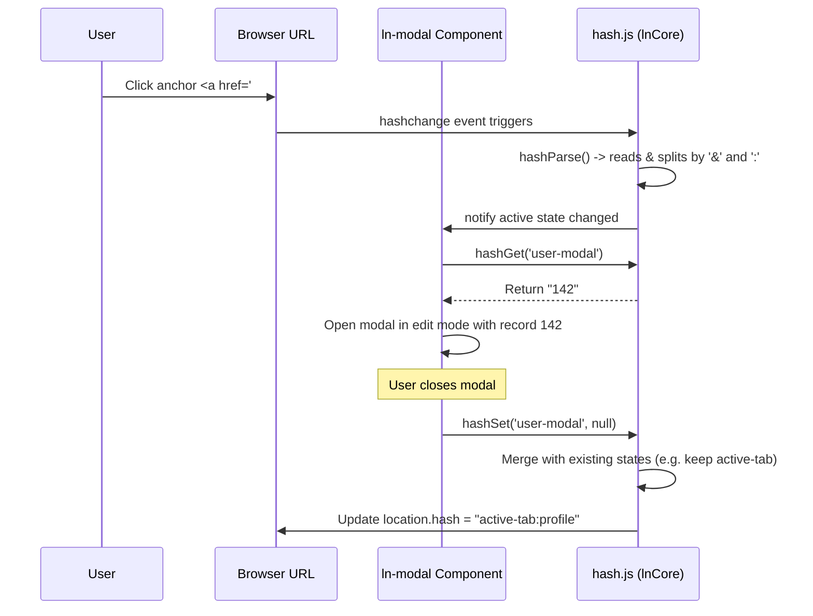

# 🔑 ln-hash (hash.js)
> **Класификација:** ⚛️ Core Утилит / Нискобуџетен примитив (Layer 3 - State Serialization Codec)

---

## 1. Заднинско дејство и одговорност
`hash.js` (интегриран како дел од `window.lnCore`) е кодек за серијализација на состојби во адресата на прелистувачот (URL Fragment / Hash). Тој овозможува зачувување на привремени интерфејсни состојби на независни компоненти во еден заеднички URL хаш.

*   **Главна Одговорност:** Овозможува зачувување на состојба во формат на именски простори (`#nsA:valA&nsB:valB`). Секоја изолирана компонента ракува строго со својот именски простор, игнорирајќи ги и зачувувајќи ги туѓите сегменти при запишување. Ова спречува конфликти каде една компонента би ја избришала состојбата на друга компонента (на пр. отворањето на модал не го ресетира активниот таб).
*   **Три-состоен модел на вредности (Three-State Model):**
    *   **Отсутно (Absent):** Доколку именскиот простор не е во URL-то, враќа `null` (на пр. модалот е затворен).
    *   **Присутно без вредност (Present, Empty):** Доколку се наоѓа само името во хашот (на пр. `#profile`), враќа празен стринг `''` (на пр. модалот е отворен во режим за Креирање нов запис).
    *   **Присутно со параметар (Present, Value):** Доколку содржи двоточка (на пр. `#profile:142`), ја враќа вредноста `142` (на пр. модалот е отворен во режим за Уредување на запис со ID 142).
*   **Спречување циклуси (Loop Prevention):** При запишување (`hashSet`), кодекот ја споредува финалната вредност со моменталната. Доколку се идентични, операцијата се прекинува за да се избегне бесконечно тригерирање на нативниот `hashchange` настан.
*   **Заштитен клик на хаш-линкови (Hash Link Guard):** Обезбедува заеднички пресретнувач на кликови (`hashLinkClick`). Доколку корисникот кликне на хаш линк со помошно копче (Middle click, Ctrl/Cmd+Click), тој дозволува нативен прелистувачки клик за отворање во нов таб. При обичен клик, повикува `e.preventDefault()` и ја остава контролата на соодветната компонента.

---

## 2. Минимален HTML Маркап и Варијанти на Употреба

Како логички кодек, нема сопствен HTML приказ. Се користи директно во JS кодот на компонентите или преку класични `href` линкови кои го следат соодветниот семантички формат.

```html
<!-- Линкови кои ја ажурираат состојбата на формата и модалот паралелно -->
<!-- Формат: #именскиПростор:вредност&другПростор:вредност -->
<a href="#user-modal:142&active-tab:profile">Уреди Профил на Петар</a>

<a href="#user-modal">Додади Нов Корисник</a>
```

Пример за употреба во JS компоненти:
```javascript
import { hashGet, hashSet } from '../ln-core/hash.js';

// Прочитај состојба
const userId = hashGet('user-modal'); // Враќа '142' (Edit) или '' (New) или null (Closed)

// Запиши состојба со зачувување на останатите
hashSet('active-tab', 'settings'); // URL станува: #user-modal:142&active-tab:settings
```

---

## 3. Декларативен API Договор (Атрибути и Настани)

Кодекот ги извезува следните функции во рамките на `window.lnCore`:

### `hashParse(str)`
*   `str` (String): Опционален хаш стринг за парсирање (по дефолт го користи тековниот `location.hash`).
*   **Враќа:** `Object` (клуч-вредност мапа од сите именски простори и нивните вредности).

### `hashGet(ns)`
*   `ns` (String): Именски простор кој се пребарува.
*   **Враќа:** `String | null | ""` (согласно три-состојниот модел).

### `hashSet(ns, value)`
*   `ns` (String): Именски простор кој се ажурира.
*   `value` (String | null): Новата вредност. Доколку се проследи `null` или `undefined`, именскиот простор целосно се брише од URL-то.

### `hashLinkClick(e)`
*   `e` (MouseEvent): Нативниот настан за клик на линк.
*   **Враќа:** `Boolean` (`true` ако навигацијата е пресретната со `preventDefault()`, `false` ако се работи за специјален клик и прелистувачот треба да отвори нов прозорец/таб).

---

## 4. CSS Стилизирање и Поведенски Концепт
Како чисто логички кодек (headless utility), `ln-hash` нема сопствени CSS стилови.

---

## 5. Пристапност (ARIA) и Чести Грешки
*   **Пристапност:** Благодарение на `hashLinkClick`, корисниците со асистивна технологија можат нативно да користат кратенки и помошни кликови на тастатурата за да отвораат делови од апликацијата во нови прозорци, бидејќи реалниот `href` содржи валидна патека во хашот.
*   **Честа грешка 1:** Рачно менување на адресата преку директен налог `location.hash = '#my-state'`. Ова е строго забрането бидејќи целосно ги пребришува состојбите на сите останати компоненти на страницата. Секогаш користете `hashSet('my-state', value)` за безбедно спојување (merge) со постоечката состојба.
*   **Честа грешка 2:** Неправилно декодирање на вредностите. `hashGet` автоматски врши `decodeURIComponent` врз вредноста, па затоа развивачот не треба рачно да го декодира резултатот.

---

## 6. Дијаграм на Текот и Животен Циклус



---

## 7. Поврзани Компоненти
*   **`ln-modal`**: Го користи кодекот за набљудување и зачувување на својот отворен/затворен статус со поддршка за deep-linking.
*   **`ln-tabs`**: Користи именски простори за складирање на активниот таб во URL адресата за зачувување на состојбата при Back/Forward.
*   **`ln-router`**: Внимателно ги игнорира хаш-промените изведени од овој кодек за да спречи ре-рендерирање на целата страница при едноставни интерфејсни интеракции.
