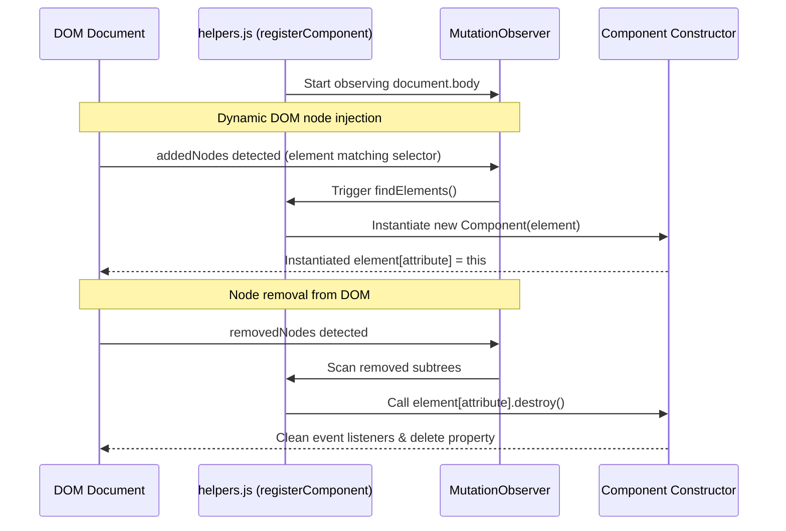

# 🛠️ ln-helpers (helpers.js)
> **Класификација:** ⚛️ Core Утилит / Заедничка библиотека (Layer 3 - Framework Core Primitives)

---

## 1. Заднинско дејство и одговорност
`helpers.js` (експортиран во `window.lnCore`) е централниот столб од помошни функции кој го дефинира функционалното однесување и животните циклуси на сите Layer 1 и Layer 2 компоненти во `ln-ashlar` архитектурата.

Скриптата обезбедува пет основни категории на примитиви:
*   **Менаџмент на животен циклус (`registerComponent`, `guardBody`, `findElements`):** Го олеснува иницирањето на компонентите преку автоматизиран `MutationObserver` на `body`. При додавање на елементи, ги повикува нивните конструктори, а при отстранување, автоматски го повикува методот `.destroy()` на соодветната инстанца за спречување на memory leaks.
*   **Декларативно пополнување и темплејти (`fill`, `fillTemplate`, `renderList`, `cloneTemplate`):** Овозможува исцртување на податоци во DOM-от без директно кодирање. Го поддржува `data-ln-field` за текстови, `data-ln-attr` за атрибути, `data-ln-show` за видливост и ги заменува `{{token}}` вредностите во текстуалните јазли.
*   **Серијализација и форми (`serializeForm`, `populateForm`, `readValue`):** Го поедноставува собирањето и истурањето на податоци во формите. `readValue` поддржува читање на реални сурови вредности (`data-ln-value`) независно од нивната форматирана текстуална репрезентација.
*   **Управување со настани (`dispatch`, `dispatchCancelable`, `shouldInterceptLink`):** Стандардизирани кратенки за испраќање CustomEvents кои меурат (bubble) во DOM дрвото.
*   **Пресретнување својства (`interceptValueProperty`):** Овозможува ре-дефинирање на нативните `value` својства на инпутите, овозможувајќи им на напредните компоненти (како `ln-number` или `ln-date`) да ги пресретнат и форматираат програмските промени (на пр. кога друга JS скрипта ќе напише `input.value = 100`).

---

## 2. Минимален HTML Маркап и Варијанти на Употреба

Бидејќи се работи за инфраструктурна помошна библиотека, таа се користи во сите JS фајлови на останатите компоненти.

```javascript
import { 
    registerComponent, 
    dispatch, 
    fill, 
    serializeForm 
} from '../ln-core/helpers.js';

// Пример за регистрација на нова едноставна компонента
const DOM_SELECTOR = 'data-ln-custom';
const DOM_ATTRIBUTE = 'lnCustom';

function _component(dom) {
    this.dom = dom;
    // Испрати настан
    dispatch(dom, 'ln-custom:init', { target: dom });
    return this;
}

_component.prototype.destroy = function () {
    delete this.dom[DOM_ATTRIBUTE];
};

// Регистрација
registerComponent(DOM_SELECTOR, DOM_ATTRIBUTE, _component, 'ln-custom');
```

---

## 3. Декларативен API Договор (Атрибути и Настани)

Скриптата ги извезува следните поважни функции:

### `registerComponent(selector, attribute, ComponentFn, componentTag, options)`
*   Врши регистрација и инсталира MutationObserver за следење на додадени/избришани јазли за автоматска инстанцијација и деструкција.

### `fill(root, data)`
*   Ги ажурира децата на `root` елементот:
    *   `data-ln-field="key"`: Го поставува `textContent = data[key]`.
    *   `data-ln-attr="src:avatarUrl"`: Го поставува атрибутот `src` на вредноста `data['avatarUrl']`.
    *   `data-ln-show="isActive"`: Ја додава/вади класата `hidden` според вистинитоста.
    *   `data-ln-class="error:hasError"`: Ја додава класата `error` во зависност од состојбата.

### `interceptValueProperty(dom, descriptor, { get, set })`
*   Го патчува нативниот getter/setter на `.value` за да може сопствени компоненти да реагираат на програмски измени.

### `serializeForm(form)`
*   Враќа чист JSON објект од вредностите на сите полиња кои содржат `name` атрибут во формата.

### `populateForm(form, data)`
*   Ги истура вредностите од `data` објектот во соодветните инпути според нивниот `name` атрибут.

---

## 4. CSS Стилизирање и Поведенски Концепт
Како чисто логичка компонента (helpers library), нема сопствени визуелни стилови. Единственото нешто на кое се потпира е глобалната класа `.hidden` за потребите на `data-ln-show`.

---

## 5. Пристапност (ARIA) и Чести Грешки
*   **Пристапност:** Сите помошници ги зачувуваат нативните семантики. На пример, при клонирање темплејти, `helpers.js` се грижи да ги задржи лејблите и ARIA својствата, а при деструкција го чисти DOM дрвото за да не дојде до забуна кај екранските читачи поради акумулирање на невидливи/сокриени дупликат елементи во меморијата.
*   **Честа грешка 1:** Непоставување на `name` атрибути на полињата во форма. Доколку развивачот ги користи `serializeForm` или `populateForm` за менаџмент со форми, овие методи целосно ќе ги игнорираат сите инпути кои немаат соодветен `name` атрибут.
*   **Честа грешка 2 (Duplicate IDs):** Клонирање темплејти кои содржат `id` атрибути во себе без притоа да се исчистат или променат. Тоа може да предизвика дуплирани идентификатори на иста страница што претставува сериозен ARIA прекршок.

---

## 6. Дијаграм на Текот и Животен Циклус (Автоматско управување на животен циклус)



---

## 7. Поврзани Компоненти
`helpers.js` е во срцето на целокупната платформа и сите компоненти и соработници (`ln-form`, `ln-table`, `ln-modal`, `ln-data-store` итн.) директно или индиректно се потпираат на неговите методи за нивна регистрација и функционалност.
