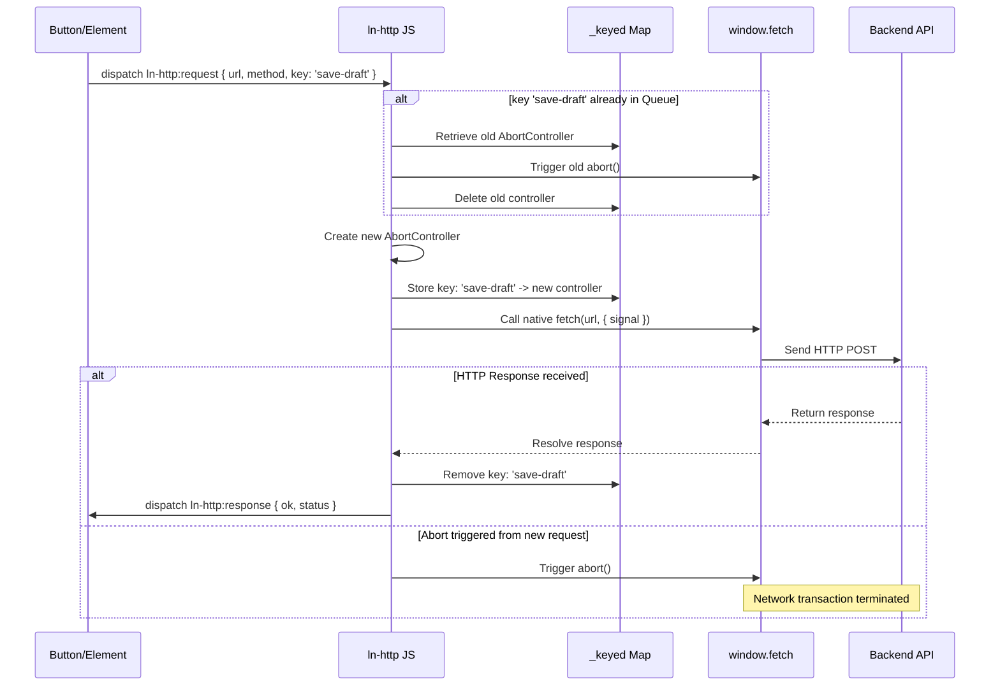

# 🌐 ln-http
> **Класификација:** 🟢 Едноставна компонента / Мрежен пресретнувач (Layer 1 - Network/Fetch Middleware)

---

## 1. Заднинско дејство и одговорност
`ln-http` е мрежен посредник (middleware) кој работи во позадина и го обвиткува глобалниот `window.fetch` за да обезбеди транспарентна заштита од паралелни мрежни барања, спречување на трки со податоци (race conditions) и дедупликација на повиците.

Компонентата работи преку две паралелни патеки:
*   **Патека А — Автоматско пресретнување на Fetch (GET/HEAD):** Транспарентно ги контролира сите нативни повици до `fetch()`. Доколку се испрати ново GET или HEAD барање до иста URL адреса додека претходното сè уште е во тек, претходното барање автоматски се откажува (`abort()`). Само последното барање стигнува до крај. Не-идемпотентните методи (POST, PUT, DELETE) никогаш не се откажуваат автоматски во оваа патека за да се спречи прекинување на мутации.
*   **Патека Б — Настански API со клуч (Било кој метод):** Го слуша глобалниот настан `ln-http:request`. Развивачите можат да дистрибуираат настан со експлицитен клуч (`key`). Доколку се детектира ново барање со ист клуч (без разлика на методот, вклучувајќи и POST), претходното веднаш се откажува. Ова е исклучително корисно за операции како зачувување на текст во реално време (autosave) или влечење и прераспоредување (drag-and-drop reordering) каде што само последната состојба мора да се запише во базата.

---

## 2. Минимален HTML Маркап и Варијанти на Употреба

Како мрежен посредник без визуелен интерфејс (headless), `ln-http` нема свој HTML маркап. Линковите и формите продолжуваат да го користат стандардниот `fetch`.

```javascript
// Пример за рачно испраќање дедуплицирано барање преку Патека Б (настански интерфејс)
const button = document.getElementById('save-button');

button.dispatchEvent(new CustomEvent('ln-http:request', {
    bubbles: true,
    detail: {
        url: '/api/posts/reorder',
        method: 'POST',
        body: JSON.stringify({ items: [1, 3, 2] }),
        key: 'reorder-action' // Сите наредни POST повици со овој клуч ќе го откажат претходниот
    }
}));

// Слушање на одговорот на истиот елемент
button.addEventListener('ln-http:response', function(e) {
    console.log('Зачувано успешно:', e.detail.ok);
});
button.addEventListener('ln-http:error', function(e) {
    console.error('Грешка при комуникација:', e.detail.error);
});
```

---

## 3. Декларативен API Договор (Атрибути и Настани)

Бидејќи нема DOM елементи, нема HTML атрибути. Конфигурацијата се врши преку објектот во настанот.

### DOM Барања (Слуша на ниво на document)
| Настан | Payload `e.detail` | Опис |
| :--- | :--- | :--- |
| `ln-http:request` | `{ url: String, method: String, body: any, signal: AbortSignal, key: String }` | Барање за извршување на дедуплициран HTTP повик. |

### Настани кон тригерот (Емитува на e.target)
| Настан | Payload `e.detail` | Опис |
| :--- | :--- | :--- |
| `ln-http:response` | `{ ok: Boolean, status: Integer, response: Response }` | Се емитува по завршување на барањето со оригиналниот одговор од прелистувачот. |
| `ln-http:error` | `{ ok: false, status: 0, error: Error }` | Се емитува при мрежна грешка или прекин (не се емитува за рачно откажани повици). |

### Јавен JS API (преку `window.lnHttp`)
*   **`cancel(url)`**: Ги откажува сите активни барања во Патека А кои се насочени кон дефинираниот URL.
*   **`cancelByKey(key)`**: Го откажува активното барање во Патека Б со дефинираниот клуч.
*   **`cancelAll()`**: Веднаш ги прекинува сите активни мрежни барања во двете патеки.
*   **`inflight`** (getter): Враќа низа од моментално активните барања со нивниот метод и URL за потребите на дебагирање.
*   **`destroy()`**: Го отстранува слушателот и го враќа оригиналниот нативен `window.fetch` во првобитна состојба.

---

## 4. CSS Стилизирање и Поведенски Концепт
Како чисто логичка компонента (headless middleware), `ln-http` нема визуелен приказ и нема сопствени CSS стилови.

---

## 5. Пристапност (ARIA) и Чести Грешки
*   **Пристапност:** Автоматското откажување на старите барања во позадина значително го подобрува искуството на корисниците со асистивна технологија. Наместо екранскиот читач да најавува повеќе последователни одговори кои се веќе застарени, тој ќе го најави само финалниот одговор од последното успешно барање.
*   **Честа грешка 1:** Очекување дека две симултани POST барања (на пр. за креирање корисници) автоматски ќе се дедуплицираат без клуч во Патека А. Бидејќи POST не е идемпотентна операција, тие ќе се извршат паралелно. Доколку сакате да спречите паралелни POST трансакции, задолжително користете го настанскиот модел со наведен `key` атрибут во Патека Б.
*   **Честа грешка 2:** Неправилно ракување со откажани мрежни повици во сопствените скрипти. Кога повик е откаран преку `AbortSignal`, `fetch` фрла нативна грешка `AbortError`. Компонентата `ln-http` во Патека Б намерно ги игнорира овие грешки за да не испраќа непотребни црвени пораки до корисникот, но доколку развивачот го користи нативниот `fetch()` обвиен во сопствен `try-catch`, тој мора да ја исклучи `AbortError` од блокот за прикажување грешки.

---

## 6. Дијаграм на Текот и Животен Циклус (Патека Б со Клуч)



---

## 7. Поврзани Компоненти
*   **`ln-ajax`**: Нејзините внатрешни `fetch` повици транспарентно поминуваат низ заштитниот слој на `ln-http` Патека А.
*   **`ln-api-queue`**: Управува со редица за офлајн поднесување во случаи на губење на мрежа, дејствувајќи по нивото на `ln-http`.
*   **`ln-data-coordinator`**: Го користи мрежниот интерфејс за синхронизација на локалните складови со серверот.
