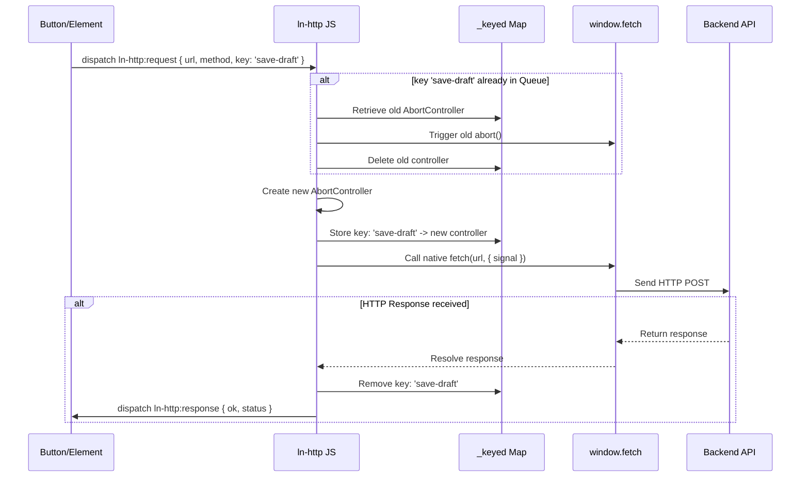

# 🌐 ln-http

> **Класификација:** 🟢 Едноставна компонента / Мрежен пресретнувач (Layer 1 - Network/Fetch Middleware)

---

## 1. Заднинско дејство и одговорност

`ln-http` е мрежен посредник (middleware) кој работи во позадина и го обвиткува глобалниот `window.fetch` за да обезбеди транспарентна заштита од паралелни мрежни барања, спречување на трки со податоци (race conditions) и дедупликација на повиците. Имплементирана е во [`js/ln-http/src/ln-http.js`](../../js/ln-http/src/ln-http.js) (~220 линии).

Компонентата работи преку две паралелни патеки:
*   **Патека А — Автоматско пресретнување на Fetch (GET/HEAD):** Транспарентно ги контролира сите нативни повици до `fetch()`. Доколку се испрати ново GET или HEAD барање до иста URL адреса додека претходното сè уште е во тек, претходното барање автоматски се откажува (`abort()`). Само последното барање стигнува до крај. Не-идемпотентните методи (POST, PUT, DELETE) никогаш не се откажуваат автоматски во оваа патека за да се спречи прекинување на мутации.
*   **Патека Б — Настански API со клуч (Било кој метод):** Го слуша глобалниот настан `ln-http:request`. Развивачите можат да дистрибуираат настан со експлицитен клуч (`key`). Доколку се детектира ново барање со ист клуч (без разлика на методот, вклучувајќи и POST), претходното веднаш се откажува. Ова е исклучително корисно за операции како зачувување на текст во реално време (autosave) или влечење и прераспоредување (drag-and-drop reordering) каде што само последната состојба мора да се запише во базата.

> [!IMPORTANT]
> **Што `ln-http` НЕ прави (Orthogonality Doctrine):**
> * **НЕ инјектира заглавија (Headers) или автентикација** — авторизациски токени, CSRF токени и слични мрежни заглавија се одговорност на повикувачот или соодветниот конектор.
> * **НЕ го обработува или парсира одговорот (JSON/HTML)** — враќа суров `Response` преку настанот. Ниту претпоставува тип на медиум, ниту го троши стримот на одговорот.
> * **НЕ врши повторно испраќање (Retry) или управување со тајмаут (Timeout)** — доколку се потребни мрежни тајмаути, тие мора да се контролираат преку надворешно проследен `AbortSignal`.
> * **НЕ користи DOM складиште или интерфејс** — нема сопствен DOM приказ и работи како headless middleware.

---

## 2. Минимален HTML Маркап и Варијанти на Употреба

Бидејќи `ln-http` е чисто логичка компонента (headless middleware) без визуелен кориснички интерфејс, таа нема свој сопствен HTML маркап во DOM дрвото. Сите компоненти во апликацијата продолжуваат да го користат стандардниот `fetch` или ја користат настанската комуникација преку кој било DOM елемент.

### Варијанти на употреба:

*   **Автоматско пресретнување преку нативен `fetch` (Патека А):**
    ```javascript
    // Две брзи последователни пребарувања. Првото автоматски се откажува.
    fetch('/api/search?q=a');
    fetch('/api/search?q=ab'); // Го откажува претходното GET барање
    ```

*   **Рачно дедуплицирање преку Настански API со клуч (Патека Б):**
    ```javascript
    const triggerEl = document.getElementById('save-button');
    
    // Испраќање барање
    triggerEl.dispatchEvent(new CustomEvent('ln-http:request', {
        bubbles: true, // Задолжително за да стигне до document
        detail: {
            url: '/api/posts/reorder',
            method: 'POST',
            body: JSON.stringify({ items: [1, 3, 2] }),
            key: 'reorder-action' // Истовремени повици со овој клуч ќе го откажат претходното барање
        }
    }));
    
    // Слушање за одговор на истиот елемент
    triggerEl.addEventListener('ln-http:response', function(e) {
        console.log('Успешен одговор:', e.detail.ok, e.detail.status);
    });
    
    triggerEl.addEventListener('ln-http:error', function(e) {
        console.error('Мрежна грешка:', e.detail.error);
    });
    ```

---

## 3. Декларативен API Договор (Атрибути и Настани)

Како headless компонента, `ln-http` нема сопствени HTML атрибути или ARIA атрибути на DOM елементи. Нејзиниот влезен API се дефинира целосно во објектот `detail` на настанот `ln-http:request`.

### Својства во Payload `e.detail` за `ln-http:request`:

| Својство | Тип | Стандардна вредност | Опис |
| :--- | :--- | :--- | :--- |
| `url` | `String` | *Задолжително* | Целната URL адреса за барањето. |
| `method` | `String` | `'GET'` (или `'POST'` ако има `body`) | HTTP методот (GET, POST, PUT, DELETE итн.). Автоматски се конвертира во големи букви. |
| `body` | `any` | `undefined` | Телото на барањето (JSON string, FormData, Blob итн.). |
| `key` | `String` | `undefined` | Единствен клуч за дедупликација во Патека Б. Доколку постои активно барање со овој клуч, тоа се откажува. |
| `signal` | `AbortSignal` | `undefined` | Надворешен `AbortSignal` кој се комбинира со внатрешниот AbortController. |

### DOM Барања (Слуша на ниво на `document`):

| Настан | Payload `e.detail` | Опис |
| :--- | :--- | :--- |
| `ln-http:request` | `{ url, method, body, key, signal }` | Иницира ново HTTP барање со возможност за дедупликација преку клуч. |

### Настани кон тригерот (Емитува на `e.target` од каде што почнало барањето):

| Настан | Payload `e.detail` | Опис |
| :--- | :--- | :--- |
| `ln-http:response` | `{ ok, status, response }` | Се емитува кога мрежното барање ќе заврши (без разлика на статусот, на пр. 200, 404, 500). `response` е оригиналниот `Response` објект. |
| `ln-http:error` | `{ ok: false, status: 0, error }` | Се емитува при мрежни грешки (DNS пад, CORS неуспех, исклучен мрежен кабел). Не се емитува за рачно или автоматски откажани барања (`AbortError`). |

### Јавен JS API (преку `window.lnHttp`):

| Метод / Својство | Параметри | Враќа | Опис |
| :--- | :--- | :--- | :--- |
| `cancel(url)` | `url: String` | `Boolean` | Ги откажува сите во тек барања од Патека А со тој URL. Враќа `true` ако имало откажување. |
| `cancelByKey(key)` | `key: String` | `Boolean` | Го откажува барањето од Патека Б со тој клуч. Враќа `true` ако имало откажување. |
| `cancelAll()` | *(нема)* | `void` | Ги откажува сите активни барања во двете патеки. |
| `inflight` | *(getter)* | `Array` | Snapshot листа од активните барања: `{ method, url }` за Патека А или `{ key }` за Патека Б. |
| `destroy()` | *(нема)* | `void` | Комплетно го рестартира интерцепторот, враќајќи го оригиналниот `window.fetch`. |

---

## 4. CSS Стилизирање и Поведенски Концепт

Бидејќи `ln-http` е чисто логичка компонента (headless middleware), нема сопствени CSS/SCSS датотеки, класи или стилски правила.

### Поведенски концепт:
*   **Интерцепција на fetch:** Го презапишува глобалниот `window.fetch` за време на иницијализацијата и чува референца до оригиналниот нативен `fetch`.
*   **Двојна патека на дедупликација:** Користи два изолирани `Map` контејнери (`_inflight` за URL-базирани GET/HEAD барања и `_keyed` за експлицитни клучеви во Патека Б).
*   **Спојување на AbortSignal-и:** Овозможува транспарентно поврзување на кориснички испратен `AbortSignal` со внатрешно менаџираниот `AbortController` за да се обезбеди правилно откажување од двете страни и ги чисти сите закачени слушатели по завршување на барањето за да спречи протекување на меморија (memory leaks).

---

## 5. Пристапност (ARIA) и Чести Грешки

Како headless компонента, нема директно влијание врз фокусот или HTML елементите. Сепак, спречувањето на трки со податоци во позадина придонесува за конзистентност на корисничкото искуство при користење на асистивни технологии (на пр. спречува екрански читачи да читаат застарени резултати од пребарување кои биле откажани во корист на новите).

### Анти-патерни (Common Pitfalls):
*   **Заборавање на `bubbles: true` при диспачирање на `ln-http:request`:** Патека Б се слуша исклучиво на глобално ниво (`document`). Доколку настанот се испрати без `bubbles: true`, тој никогаш нема да стигне до `ln-http` и барањето ќе пропадне без никаков одговор.
*   **Неправилно ракување со `AbortError`:** Кога `fetch` се прекинува преку `AbortController`, тој фрла нативна `AbortError`. Кај Патека Б, оваа грешка намерно се игнорира за да не се крева лажна паника, но ако развивачот директно користи `fetch` во свој код со `try-catch`, мора експлицитно да ја провери `err.name === 'AbortError'` и да ја игнорира за да избегне прикажување непотребни мрежни грешки на корисникот.
*   **Читање на `response` телото повеќе пати:** Во настанот `ln-http:response` се пренесува оригиналниот `Response` од прелистувачот. Тој претставува проток (stream) што може да се прочита (преку `.json()`, `.text()` итн.) само ЕДНАШ. Ако два слушатели на истата реакција се обидат да го парсираат телото, вториот ќе фрли `TypeError`.

---

## 6. Дијаграм на Текот и Животен Циклус



---

## 7. Поврзани Компоненти

*   `[ln-ajax](./ln-ajax.md)` — користи нативни `fetch` повици кои транспарентно поминуваат низ Патека А на `ln-http`.
*   `[ln-api-queue](./ln-api-queue.md)` — менаџира редица за офлајн барања кои се активираат во зависност од мрежната достапност утврдена по нивото на `ln-http`.
*   `[ln-data-coordinator](./ln-data-coordinator.md)` — се потпира на мрежниот слој на `ln-http` за синхронизација на локалните складови.
