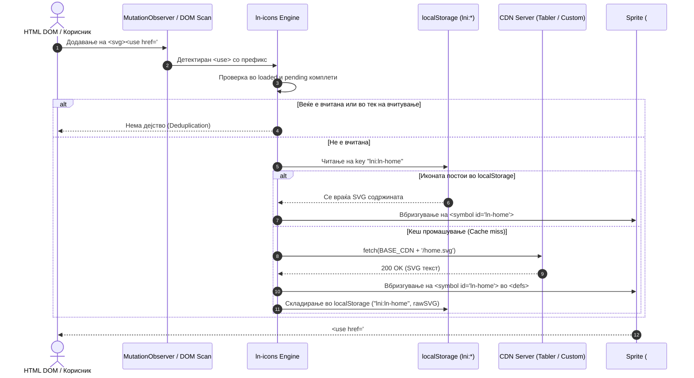

# 🎨 ln-icons

> **Класификација:** 🟢 Сервис / Асет Менаџер (SVG Sprite Loader Service)

---

## 1. Заднинско дејство и одговорност

`ln-icons` е ултра-ефикасен, локално-ориентиран **динамички генератор на SVG спрејтови по барање (On-Demand SVG Sprite Generator)** со нула надворешни JS зависности. Неговата имплементација се наоѓа во [`js/ln-icons/src/ln-icons.js`](../../js/ln-icons/src/ln-icons.js) (~170 линии), додека стилските дефиниции и димензиските класи се дефинирани во [`scss/config/_icons.scss`](../../scss/config/_icons.scss).

Наместо однапред да внесува илјадници векторски патеки во финалниот JS/CSS пакет или да бара сложени процеси на изградба (build steps), `ln-icons`:
1. **Декларативно ги пресретнува** `<use href="#ln-...">` и `<use href="#lnc-...">` елементите во DOM стеблото.
2. **Асинхроно ги презема** само побараните SVG векторски дефиниции од CDN мрежа.
3. **Ги зачувува локално во `localStorage`** за моментално вчитување при сите следни посети со нулта мрежна латенција.
4. **Динамички гради и вметнува глобален скриен спрајт** (`#ln-icons-sprite`) на самиот почеток од `<body>`, каде сите икони се претвораат во повторно употребливи `<symbol>` елементи.

> [!IMPORTANT]
> **Што `ln-icons` НЕ прави (Orthogonality Doctrine):**
> * **НЕ упатува бизнис логика и не управува со кориснички настани** — `ln-icons` е чисто технички сервис за управување со SVG ресурси.
> * **НЕ користи `createElement` синџири за генерирање на икони во JS** — иконите се декларираат стандардно во HTML преку `<svg class="ln-icon"><use href="#ln-..."></use></svg>`.
> * **НЕ врши форсирање на фиксни бои за стандардните икони** — ги користи прелистувачките својства за наследување на боја преку `stroke="currentColor"`.
> * **НЕ го блокира главното рендерирање** — сите барања се асинхрони, а кешираните икони од `localStorage` се вбризгуваат синхроно без мрежен повик.

---

## 2. Минимален HTML Маркап и Варијанти на Употреба

`ln-icons` овозможува исклучително чиста декларативна употреба преку нативната SVG `<use>` технологија.

---

### Варијанта 1: Базна Tabler Икона (`#ln-`)

Стандардна икона извлечена од Tabler Icons библиотеката. Го наследува `color` својството од родителот.

```html
<!-- Стандардна икона за почетна страница -->
<svg class="ln-icon" aria-hidden="true">
  <use href="#ln-home"></use>
</svg>
```

---

### Варијанта 2: Различни Големини (`.ln-icon--sm`, `.ln-icon--lg`, `.ln-icon--xl`)

Големината на иконата се контролира преку CSS модификаторски класи.

```html
<!-- Мала икона во копче (1rem) -->
<button type="button" class="btn btn-sm">
  <svg class="ln-icon ln-icon--sm" aria-hidden="true"><use href="#ln-plus"></use></svg>
  <span>Додај ставка</span>
</button>

<!-- Голема икона (1.5rem) -->
<svg class="ln-icon ln-icon--lg" aria-hidden="true"><use href="#ln-settings"></use></svg>

<!-- Екстра голема икона за празна состојба (4rem) -->
<svg class="ln-icon ln-icon--xl" aria-hidden="true"><use href="#ln-box"></use></svg>
```

---

### Варијанта 3: Прилагодена Корпоративна Икона (`#lnc-`)

Се користи за специфични брендирани или повеќебојни ресурси внесени преку прилагоден CDN (`LN_ICONS_CUSTOM_CDN`).

```html
<script>
  // Конфигурација пред вчитање на ln-ashlar
  window.LN_ICONS_CUSTOM_CDN = "https://cdn.mycompany.com/assets/icons";
</script>

<!-- Рендерирање на корпоративно PDF лого -->
<svg class="ln-icon" aria-hidden="true">
  <use href="#lnc-file-pdf"></use>
</svg>
```

---

### Варијанта 4: Динамична Промена на Икона и Тродимензионален Chevron (`.ln-chevron`)

За интерактивни состојби (како расклопување на мени или потврда на акција), атрибутот `href` може динамички да се менува, или да се користи ротација преку `.ln-chevron` и `[aria-expanded="true"]`.

```html
<!-- Копче со шеврон што се ротира за 180° кога родителот е проширен -->
<button type="button" data-ln-toggle-for="my-panel" aria-expanded="false">
  <span>Мени</span>
  <svg class="ln-icon ln-chevron" aria-hidden="true">
    <use href="#ln-chevron-down"></use>
  </svg>
</button>
```

---

## 3. Декларативен API Договор (Атрибути и Настани)

### HTML и SVG Атрибути

| Атрибут | Применливост | Тип / Дозволени вредности | Опис |
| :--- | :--- | :--- | :--- |
| `href` | `<use>` елемент | `#ln-{name}` \| `#lnc-{name}` | Префиксот `#ln-` пренасочува кон Tabler CDN, додека `#lnc-` користи прилагоден `LN_ICONS_CUSTOM_CDN`. |
| `class` | `<svg>` елемент | `ln-icon`, `ln-icon--sm`, `ln-icon--lg`, `ln-icon--xl`, `ln-chevron` | Големински и поведенски класи. Базната `ln-icon` постава димензија од `1.25rem`. |
| `aria-hidden` | `<svg>` елемент | `"true"` | Се препорачува за декоративни икони кои не треба да се читаат од читачи на екран. |

### Глобална Конфигурација (`window`)

Сите глобални поставки се дефинираат во `window` објектот пред да се иницијализира скриптата:

| Променлива | Стандардна вредност | Опис |
| :--- | :--- | :--- |
| `window.LN_ICONS_CDN` | `https://cdn.jsdelivr.net/npm/@tabler/icons@3.31.0/icons/outline` | Основен CDN URL за Tabler Icons векторски датотеки. |
| `window.LN_ICONS_CUSTOM_CDN` | `""` | Основен CDN URL за сопствени `#lnc-` SVG ресурси. Доколку е празен, `#lnc-` барањата се игнорираат. |

### Механизам на Кеширање (`localStorage`)

- **Клуч на икона:** `lni:{id}` (на пр. `lni:ln-home`).
- **Верзија на кеш:** `lni:v` со тековна верзија `'1'`. При промена на верзијата, сите икони со префикс `lni:` автоматски се чистат при следното вчитување.

### Настани (Events API)
`ln-icons` е пасивен мотор и не диспачира сопствени DOM настани. Тој користи `MutationObserver` кој ги следи:
* Додавањата на нови јазли во DOM стеблото (`childList`, `subtree`).
* Движењата и динамичките измени на атрибутот `href` кај `<use>` елементите.

---

## 4. CSS Стилизирање и Поведенски Концепт

Стилизирањето на иконите се управува преку [`scss/config/_icons.scss`](../../scss/config/_icons.scss).

### SCSS Дефиниции и Променливи

```scss
svg.ln-icon {
  display: inline-block;
  --icon-size: 1.25rem;   // Базна димензија
  width: var(--icon-size);
  height: var(--icon-size);
  flex-shrink: 0;
  vertical-align: middle;
}

svg.ln-icon.ln-icon--sm { --icon-size: 1rem; }
svg.ln-icon.ln-icon--lg { --icon-size: 1.5rem; }
svg.ln-icon.ln-icon--xl { --icon-size: 4rem; }
```

### Наследување на Боја (`currentColor`)
Базните Tabler икони користат `stroke="currentColor"`. Иконата автоматски ја зема бојата дефинирана со CSS својството `color` на нејзиниот родителски елемент (на пр. копче, линк или текст).

> [!NOTE]
> **Исклучок за повеќебојни икони:** Прилагодените икони за датотеки (како `lnc-file-pdf`, `lnc-file-doc`) содржат вградени фиксни бои во самиот SVG извор и не зависат од `currentColor`.

---

## 5. Пристапност (ARIA) и Чести Грешки

### Пристапност и ARIA Практики
- **Декоративни икони:** Секогаш додавајте `aria-hidden="true"` кога иконата се наоѓа до текст или внатре во копче со јасна ознака.
- **Интерактивни иконски копчиња:** Доколку копчето содржи САМО икона без текст, копчето МОРА да има `aria-label` атрибут (на пр. `<button aria-label="Бришење"><svg aria-hidden="true">...</svg></button>`).

### Чести грешки при употреба (Anti-Patterns)

> [!WARNING]
> **1. Испуштање на `ln-icon` класата:**
> Нативните `<svg>` елементи во прелистувачите стандардно се прошируваат до `100%` од ширината и висината на родителот. Доколку ја изоставите класата `ln-icon`, иконата ќе се рендерира во гигантска димензија.

> [!CAUTION]
> **2. Недефиниран `LN_ICONS_CUSTOM_CDN` за `#lnc-` икони:**
> Употребата на `#lnc-` икони без претходно поставување на `window.LN_ICONS_CUSTOM_CDN` ќе резултира со прекинување на барањето и празен простор на екранот.

> [!WARNING]
> **3. Обид за ставање SVG икона внатре во `<input type="checkbox">`:**
> `<input type="checkbox">` е заменет (replaced) DOM елемент и не може да содржи деца. За штиклирање кај checkbox елементи се користи CSS data URI од `_form.scss`.

---

## 6. Дијаграм на Текот и Животен Циклус

Следниов Mermaid дијаграм го прикажува комплетниот циклус од детекција на `<use>`, проверка на кеш, CDN преземање и вбризгување во глобалниот SVG спрајт:



---

## 7. Поврзани Компоненти

* [`ln-confirm`](./ln-confirm.md) — Динамички го менува `href` атрибутот на `<use>` при потврда на деструктивни дејства.
* [`ln-toggle`](./ln-toggle.md) — Автоматски управува со ротација на `.ln-chevron` кога панели се отвораат или затвораат.
* [`ln-toast`](./ln-toast.md) — Вметнува `#ln-x` икона за затворање на известувањата.
* [`ln-table`](./ln-table.md) — Користи `#ln-arrows-sort` икона за сортирање колони.
