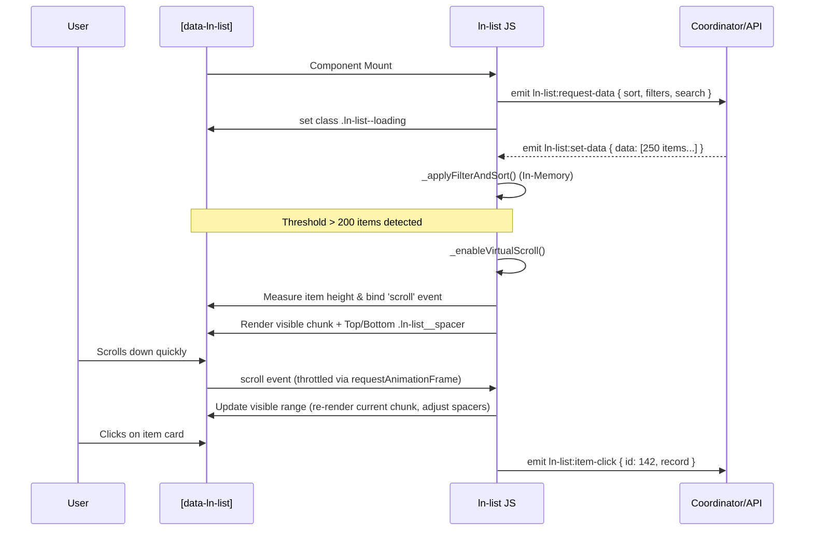

# 📋 ln-list
> **Класификација:** 🟡 Координаторска / Комплексна компонента (Layer 2 - List/Grid Rendering)

---

## 1. Заднинско дејство и одговорност
`ln-list` е робустна компонента која се користи за рендерирање на листи и мрежи (grids) од податоци. Слично на `ln-table`, таа овозможува две варијанти на употреба: Server-side rendering (SSR) и Data-driven (клиентско рендерирање преку JSON податоци користејќи `data-ln-list-source`).

*   **Virtual Scrolling:** Најголемата предност на `ln-list` е вградениот виртуелен скрол (се активира автоматски ако има над 200 елементи). Овозможува мазни перформанси при илјадници записи бидејќи рендерира само мал број DOM јазли (оние кои се видливи во моментот плус краток buffer) и симулира простор горе и долу со виртуелни `spacer` елементи.
*   **In-Memory Филтрирање:** Во Data-driven мод, поддржува нативно in-memory сортирање и пребарување на страната на клиентот преку `ln-search` и `ln-filter`, без дополнителни мрежни барања.
*   **Интерактивност:** Управува со селекција на елементи (checkbox), кликање на цели редови (`item-click`) и тригерирање на специфични акции преку вградени копчиња (`item-action`).

---

## 2. Минимален HTML Маркап и Варијанти на Употреба

```html
<!-- Data-driven листа (со виртуелен скрол и селекција) -->
<div data-ln-list="users_list" 
     data-ln-list-source="api/users" 
     data-ln-list-selectable>
     
    <!-- Контроли за пребарување и статистика -->
    <div class="list-controls">
        <input type="text" data-ln-search="users_list" placeholder="Пребарај..." />
        <div>
            Вкупно: <span data-ln-list-total></span> / 
            Прикажани: <span data-ln-list-filtered></span>
        </div>
    </div>

    <!-- Телото на листата (може да биде <ul> или <div>) -->
    <!-- За Grid layout, користете соодветни CSS класи врз овој елемент -->
    <ul class="list-body" data-ln-list-body></ul>

    <!-- Темплејт за поединечен ред (мора да има data-ln-template="{име}-row") -->
    <template data-ln-template="users_list-row">
        <!-- Главниот елемент мора да има data-ln-item -->
        <li class="user-card" data-ln-item>
            <input type="checkbox" data-ln-item-select />
            <strong data-ln-fill="name"></strong>
            <span data-ln-fill="email"></span>
            
            <!-- Акциско копче кое не тригерира глобален item-click -->
            <button data-ln-item-action="edit">Уреди</button>
        </li>
    </template>

    <!-- Темплејт за празна состојба -->
    <template data-ln-template="users_list-empty">
        <div class="empty-state">Нема пронајдено корисници.</div>
    </template>
</div>
```

---

## 3. Декларативен API Договор (Атрибути и Настани)

| Атрибут | Тип | Опис |
| :--- | :--- | :--- |
| `data-ln-list` | `String` | Уникатно име на компонентата. |
| `data-ln-list-source` | `String` | Го активира Data-Driven модот. Најчесто содржи API рута (како хинт за координаторот). |
| `data-ln-list-selectable` | `Flag` | Овозможува логика за селекција (ги набљудува `[data-ln-item-select]` checkbox-овите). |
| `data-ln-list-body` | `Flag` | Го означува контејнерот каде ќе се истураат рендерираните елементи. |
| `data-ln-item` | `Flag` | Го означува самиот ред/картичка. Мора да биде коренски елемент во темплејтот. |
| `data-ln-item-id` | `String` | ID на редот. JS го инјектира автоматски ако податокот има `id` property. |
| `data-ln-item-select` | `Flag` | Контролер (checkbox) за селектирање на дадениот ред. |
| `data-ln-item-action` | `String` | Копче внатре во редот кое емитува `item-action` наместо глобален `item-click`. |
| `data-ln-list-total` / `filtered` | `Flag` | Текстуални placeholder-и за статистика на бројки од листата. |

### DOM Барања кон Листата (Слуша)
| Настан | Payload `e.detail` | Опис |
| :--- | :--- | :--- |
| `ln-list:set-data` | `{ data: [], total: Int, filtered: Int }` | Ја полни листата со податоци, ги гаси loading состојбите и рендерира. |
| `ln-list:set-loading` | `{ loading: Boolean }` | Го менува визуелниот приказ при вчитување (додава/вади `ln-list--loading`). |
| `ln-search:change` | `{ term: String }` | Доаѓа од `ln-search`, тригерира инстантно in-memory пребарување и прецртување. |

### Настани кон UI (Емитува - Интеракции)
| Настан | Payload `e.detail` | Опис |
| :--- | :--- | :--- |
| `ln-list:request-data` | `{ list, sort, filters, search }` | Се емитува на почеток или при промена на параметри. Треба да се фати од мрежен координатор. |
| `ln-list:item-click` | `{ list, id, record }` | Се емитува при клик било каде во редот (игнорира кликови на линкови и копчиња). |
| `ln-list:item-action` | `{ list, id, action, record }` | Се емитува при клик специфично на елемент со `data-ln-item-action`. |
| `ln-list:select` | `{ list, selectedIds: Set, count: Int }` | Се емитува кога корисникот селектира/одселектира ред преку checkbox-от. |

---

## 4. CSS Стилизирање и Поведенски Концепт
За виртуелниот скрол да функционира исправно, потребно е редовите да имаат предвидлива висина. Системот динамички пресметува CSS Grid (доколку `.list-body` користи `display: grid`).

```scss
// Задолжителен контејнер со скрол (Virtual scroll слуша scroll настани на овој контејнер)
.list-body {
    position: relative;
    overflow-y: auto;
    max-height: 600px; // Важно за виртуелниот скрол!
    
    // Поддржува Grid!
    display: grid;
    grid-template-columns: repeat(auto-fill, minmax(200px, 1fr));
    gap: 1rem;
}

// Визуелен фидбек при селекција
[data-ln-item].ln-item-selected {
    border-color: var(--color-primary);
    background-color: var(--color-primary-light);
}

// Специјални класи за виртуелен скрол и лоудинг кои ги контролира JS-от
.ln-list__spacer {
    // Spacer-от е невидлив блок кој го држи местото на нерендерираните елементи
    pointer-events: none;
    visibility: hidden;
}

[data-ln-list].ln-list--loading {
    opacity: 0.6;
    pointer-events: none;
    transition: opacity 0.2s ease;
}
```

---

## 5. Пристапност (ARIA) и Чести Грешки
*   **Пристапност:** Треба да се има предвид дека при **Virtual Scrolling** (над 200 елементи), елементите кои се надвор од viewport-от физички се бришат од DOM дрвото. Ова значи дека екранските читачи нема да можат да ја прочитаат целата листа. Доколку листата е од критична важност за пристапност, претпочитајте класична пагинација (`ln-table`) наместо виртуелен скрол.
*   **Честа грешка 1 (Скрол Контејнер):** Виртуелниот скрол бара дефиниран `overflow-y: auto` и `max-height` на контејнерот или на самата страница. Ако нема ограничен контејнер, листата ќе се изрендерира како стотици метри висока празнина.
*   **Честа грешка 2 (Динамична висина на елементи):** Виртуелниот скрол претпоставува дека сите редови се горе-долу иста висина. Тој ја зема висината на првиот елемент и ја користи како референца за пресметување на позициите. Ако имате редови со драстично различна висина (пр. некои се 50px, некои 500px), скролањето ќе "скока" и нема да биде мазно.
*   **Честа грешка 3 (SSR без ID):** Во SSR варијанта, за селекцијата да работи правилно, секој ред мора да има `data-ln-item-id`. Во data-driven мод, ова се инјектира автоматски.

---

## 6. Дијаграм на Текот и Животен Циклус (Data-Driven + Virtual Scroll)



---

## 7. Поврзани Компоненти
*   **`ln-search`**: Го напојува in-memory пребарувањето (`ln-search:change`).
*   **`ln-filter`**: Може да се користи заедно со листата за детално DOM филтрирање на рендерираните елементи.
*   **`ln-table`**: Поконкретна алтернатива доколку податоците треба да се прикажат во стриктна табеларна (Row/Column) форма со пагинација.
*   **`ln-data-coordinator`**: Идеален слушач на `ln-list:request-data` за мрежно повлекување на иницијалните податоци.
