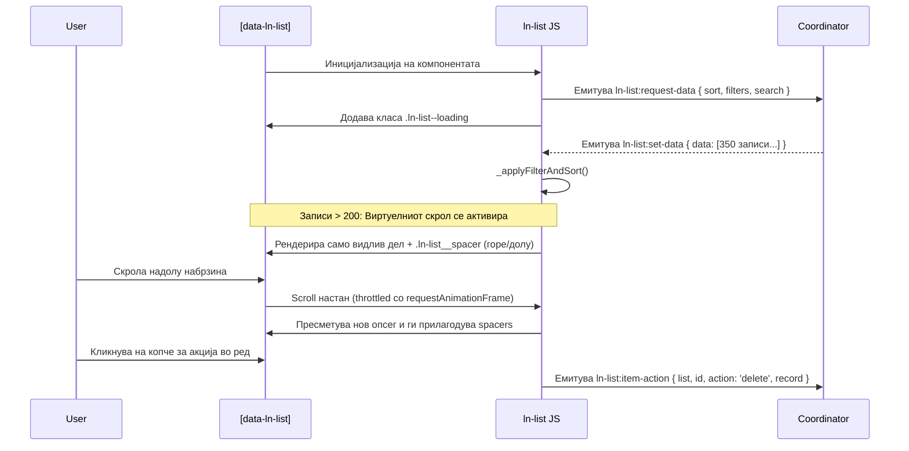

# 📋 ln-list

> **Класификација:** 🟢 Едноставна компонента / Презентер (Layer 1 - Presenter Component)

---

## 1. Заднинско дејство и одговорност

- **Краток опис:** `ln-list` е робустна презентерска компонента наменета за рендерирање на листи, картички, секции или мрежи од податоци. Поддржува две варијанти: Server-Side Rendering (SSR) и Data-driven (клиентско рендерирање преку JSON податоци користејќи `data-ln-list-source`). Вклучува напреден виртуелен скрол (се активира автоматски над 200 елементи), in-memory пребарување и филтрирање на клиентот, како и нативна поддршка за селекција.
- **Ортогоналност:**
  * *Што компонентата НЕ прави:*
    * Не прави директни мрежни (HTTP) повици за преземање податоци (ова се координира со `ln-data-coordinator` или други Layer 2 координатори преку настани).
    * Не зачувува локални состојби на серверот.
    * Не прикажува дијалози или toasts за потврда (на пр. акциските копчиња `item-action` само емитуваат настан, додека приказот на `ln-modal` за потврда го решава координатор).
    * Не чува хардкодирани јазични преводи.

---

## 2. Минимален HTML Маркап и Варијанти на Употреба

### Базен HTML маркап (SSR Мод)
Се користи кога серверот директно го испорачува крајниот HTML маркап за елементите. Во овој мод може да се користи `data-ln-list-field` за локално филтрирање и пребарување, како и fallback темплејт `template[data-ln-list-empty]` за празна состојба:

```html
<form role="search" onsubmit="return false;">
    <input type="search" data-ln-search="ssr-documents-list" placeholder="Пребарај...">
</form>

<ul id="ssr-documents-list" data-ln-list="ssr-documents">
    <li data-ln-item data-ln-item-id="1">
        <span data-ln-list-field="title">Документ А</span>
    </li>
    <li data-ln-item data-ln-item-id="2">
        <span data-ln-list-field="title">Документ Б</span>
    </li>
</ul>

<!-- Темплејт за празна состојба во SSR мод -->
<template data-ln-list-empty>
    <li class="empty-state">Листата е празна.</li>
</template>
```

### Варијанти на употреба (Data-Driven со виртуелен скрол и селекција)
Се користи за динамично рендерирање на JSON податоци преку HTML темплејти. Прикажана е употребата на глобален селектор (`data-ln-list-select-all`) и два начина за дефинирање на празна состојба:

```html
<div data-ln-list="users_list" 
     data-ln-list-source="api/users" 
     data-ln-list-selectable>
     
    <!-- Алатки за пребарување и статистика -->
    <div class="list-controls">
        <!-- Глобален чекбокс за селекција на сите редови -->
        <input type="checkbox" data-ln-list-select-all />
        
        <input type="text" data-ln-search="users_list" placeholder="Пребарај..." />
        
        <!-- Спанови за статистика -->
        <div>
            Вкупно: <span data-ln-list-total></span>
            <span class="hidden">
                (Прикажани: <span data-ln-list-filtered></span>)
            </span>
            <span class="hidden">
                (Селектирани: <span data-ln-list-selected></span>)
            </span>
        </div>
        
        <!-- Опционално копче за чистење на филтри -->
        <button type="button" data-ln-list-clear-all>Исчисти филтри</button>
    </div>

    <!-- Телото на листата (може да биде <ul>, <ol> или <div>) -->
    <ul class="list-body" data-ln-list-body></ul>

    <!-- Темплејт за поединечен ред (data-ln-template="{име}-row") -->
    <template data-ln-template="users_list-row">
        <!-- Коренот мора да има data-ln-item -->
        <li class="user-card" data-ln-item>
            <input type="checkbox" data-ln-item-select />
            <strong data-ln-fill="name" data-ln-list-field="name"></strong>
            <span data-ln-fill="email" data-ln-list-field="email"></span>
            
            <button type="button" data-ln-item-action="delete">Избриши</button>
        </li>
    </template>

    <!-- Опција А: Специфични темплејти по име за празна состојба во Data-Driven мод -->
    <template data-ln-template="users_list-empty">
        <div data-ln-empty-state="no-data">
            <svg class="ln-icon ln-icon--xl" aria-hidden="true"><use href="#ln-folder"></use></svg>
            <h3>Нема корисници</h3>
            <p>Додадете го вашиот прв корисник.</p>
        </div>
    </template>

    <template data-ln-template="users_list-empty-filtered">
        <div data-ln-empty-state="no-results">
            <svg class="ln-icon ln-icon--xl" aria-hidden="true"><use href="#ln-search"></use></svg>
            <h3>Нема совпаѓања</h3>
            <p>Обидете се со поинакво пребарување или исчистете ги филтрите.</p>
            <button type="button" data-ln-list-clear class="btn">Исчисти пребарување</button>
        </div>
    </template>

    <!-- Опција Б: Универзален fallback темплејт со data-ln-empty и data-ln-empty-when -->
    <!--
    <template data-ln-empty>
        <div>
            <div data-ln-empty-when="initial" class="empty-state">
                <h3>Нема податоци</h3>
                <p>Внесете ги вашите први податоци.</p>
            </div>
            <div data-ln-empty-when="search" class="empty-state">
                <h3>Нема резултати од пребарувањето</h3>
                <p>Обидете се со други клучни зборови.</p>
            </div>
        </div>
    </template>
    -->
</div>
```

---

## 3. Декларативен API Договор (Атрибути и Настани)

| Атрибут | Тип | Стандардна вредност | Опис |
| :--- | :--- | :--- | :--- |
| `data-ln-list` | `String` | `/` | Уникатно име на компонентата. |
| `data-ln-list-source` | `String` | `/` | Го активира Data-Driven модот. Содржи клуч или API патека. |
| `data-ln-list-selectable` | `Flag` | `/` | Овозможува логика за селекција (селектори `[data-ln-item-select]`). |
| `data-ln-list-body` | `Flag` | `/` | Ја означува целната обвивка каде се рендерираат редовите. |
| `data-ln-item` | `Flag` | `/` | Го означува самиот ред/картичка во рамки на темплејтот. |
| `data-ln-item-id` | `String` | `/` | ID на редот (се мапира автоматски од податоците во Data-driven). |
| `data-ln-item-select` | `Flag` | `/` | Checkbox лоциран во редот за означување на селекција. |
| `data-ln-list-select-all` | `Flag` | `/` | Глобален чекбокс лоциран во заглавието на листата за селекција на сите ставки одеднаш. |
| `data-ln-list-field` | `String` | `/` | Се поставува на внатрешен елемент во ред (како `<span>` или `<strong>`) за да го мапира неговиот текст во соодветното својство во во-меморискиот рекорд. Ова овозможува локално филтрирање, сортирање и пребарување врз хидрираните податоци. |
| `data-ln-item-action` | `String` | `/` | Вредноста го дефинира името на акцијата што се испраќа во настан. |
| `data-ln-list-total` | `Flag` | `/` | Елемент кој се ажурира со вкупниот број на елементи во листата. |
| `data-ln-list-filtered` | `Flag` | `/` | Елемент кој ја прикажува бројката на филтрирани/видливи елементи. |
| `data-ln-list-selected` | `Flag` | `/` | Елемент кој се ажурира со бројот на моментално селектирани елементи. |
| `data-ln-list-empty` | `Flag` | `/` | Ја означува `template[data-ln-list-empty]` за празна состојба во SSR мод. |
| `data-ln-empty` | `Flag` | `/` | Ја означува универзалната `template[data-ln-empty]` за празна состојба во Data-driven мод. |
| `data-ln-empty-when` | `String` | `/` | Се поставува на контејнери во `template[data-ln-empty]` со вредности `initial` или `search` за динамичен приказ соодветно на состојбата. |

### DOM Барања кон Листата (Слуша)

| Настан | Payload `e.detail` | Опис |
| :--- | :--- | :--- |
| `ln-list:set-data` | `{ data: [], total: Int, filtered: Int }` | Ја полни листата со податоци, ги гаси loading состојбите и рендерира. |
| `ln-list:set-loading` | `{ loading: Boolean }` | Ја вклучува или исклучува визуелната состојба за вчитување (`ln-list--loading`). |
| `ln-search:change` | `{ term: String }` | Доаѓа од `ln-search` компонентата, започнува in-memory пребарување. |

### Настани кон UI (Емитува - Интеракции)

| Настан | Payload `e.detail` | Опис |
| :--- | :--- | :--- |
| `ln-list:request-data` | `{ list, sort, filters, search }` | Се емитува на почеток или при промена на параметри за мрежен координатор. |
| `ln-list:ready` | `{ total: Int }` | Се емитува по завршување на иницијалното мапирање на SSR елементите. |
| `ln-list:rendered` | `{ list, total, visible }` | Се емитува откако елементите ќе бидат исцртани во DOM. |
| `ln-list:item-click` | `{ list, id, record }` | Се емитува при клик на ред (игнорира кликови на линкови и акциски копчиња). |
| `ln-list:item-action` | `{ list, id, action, record }` | Се емитува при клик на акциско копче со `data-ln-item-action`. |
| `ln-list:select` | `{ list, selectedIds: Set, count: Int }` | Се емитува при промена во селекцијата. |
| `ln-list:select-all` | `{ list, selected: Boolean }` | Се емитува кога ќе се смени глобалниот селектор (Select All). |
| `ln-list:search` | `{ list, query: String }` | Се емитува кога ќе се промени или изврши пребарување во листата. |
| `ln-list:empty` | `{ term: String, total: Int }` | Се емитува кога ќе се активира и рендерира празна состојба. |
| `ln-list:filter` | `{ term: String, matched: Int, total: Int }` | Се емитува при филтрирање во SSR мод. |
| `ln-list:clear-filters` | `{ list }` | Се емитува кога ќе се кликне копче за целосно бришење на филтри. |
| `ln-list:before-clear-search` | `{ list }` | Се емитува пред да се исчисти пребарувањето преку `[data-ln-list-clear]` (може да се откаже со `e.preventDefault()`). |

---

## 4. CSS Стилизирање и Поведенски Концепт

За правилно функционирање на виртуелниот скрол, редовите мора да имаат предвидлива висина. Доколку `.list-body` е со Grid приказ, скролерот го зема тоа предвид и користи специјален spacer.

```scss
// Задолжителен контејнер со скрол (Виртуелниот скрол го следи scroll настанот на овој контејнер)
.list-body {
    position: relative;
    overflow-y: auto;
    max-height: 600px; // Важно за виртуелниот скрол!
    
    display: grid;
    grid-template-columns: repeat(auto-fill, minmax(200px, 1fr));
    gap: 1rem;
}

// Визуелен фидбек при селектиран ред
[data-ln-item].ln-item-selected {
    border-color: var(--color-primary);
    background-color: var(--color-primary-light);
}

// Специјални класи за виртуелен скрол и лоудинг кои ги контролира JS-от
.ln-list__spacer {
    // Spacer-от е невидлив блок кој го држи местото на нерендерираните елементи во скролот
    pointer-events: none;
    visibility: hidden;
    grid-column: 1 / -1; // Осигурува дека spacer-от се шири низ цела мрежа во Grid мод
}

[data-ln-list].ln-list--loading {
    opacity: 0.6;
    pointer-events: none;
    transition: opacity 0.2s ease;
}
```

---

## 5. Пристапност (ARIA) и Чести Грешки

- **Пристапност при виртуелен скрол:** Бидејќи елементите надвор од viewport се физички отстранети од DOM дрвото во виртуелен скролер, screen-readers не можат да ги прочитаат сите записе наеднаш. За критични интерфејси каде пристапноста е примарен фактор, користете стандардна табела со пагинација (`ln-table`) наместо виртуелна листа.
- **Потврда за групни акции (Bulk Actions Gating):**
  * За дејства кои афектираат поединечни редови (на пр. бришење еден запис преку `item-action`), може да се користи директна или линиска потврда.
  * Доколку се прави групна акција (на пр. бришење на сите селектирани преку `selectedIds`), доктрината налага да се отвори дијалог за потврда (`ln-modal`), кој точно ќе ги прикаже ресурсите што се менуваат.
- **Честа грешка со скриени контејнери (Hidden Parent Gotcha):**
  * Ако `ln-list` е монтирана во неактивен таб или колапсибилно мени, нејзините димензии ќе бидат 0 и виртуелниот скролер ќе пресмета неточна висина на редот (паѓа на fallback вредност од `50px`).
  * *Решение:* При промена на видливоста на контејнерот, треба да се активира `window.dispatchEvent(new Event('resize'))` за да се пресметаат вистинските димензии.

---

## 6. Дијаграм на Текот и Животен Циклус



---

## 7. Поврзани Компоненти

- [ln-search](./ln-search.md): Му го испраќа филтрираното барање на пребарувањето (`ln-search:change`).
- [ln-filter](./ln-filter.md): Овозможува детален избор и редукција на прикажаните елементи.
- [ln-table](./ln-table.md): Пагинирана алтернатива наменета за чисти табеларни извештаи.
- [ln-data-coordinator](./ln-data-coordinator.md): Се користи за автоматско поврзување на настаните на листата со серверско API.

---
Изворна датотека на компонентата: [ln-list.js](../../js/ln-list/src/ln-list.js)
