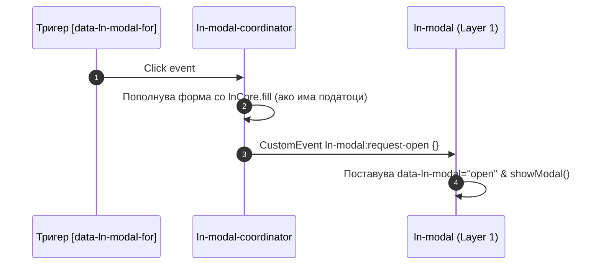

# 🎛️ ln-modal-coordinator

> **Класификација:** 🔵 Координатор (Layer 2)

---

## 1. Заднинско дејство и одговорност
- **Краток опис:** `ln-modal-coordinator` е централен координатор на ниво на документ кој управува со овозможување модали преку тригери `[data-ln-modal-for]`, URL hash рутирање (`#modalId`), авто-пополнување форми од тригер податоци (`lnCore.fill`) и автоматско затворање модали по успешно испраќање на форма (`ln-form:success`, `ln-ajax:success`).
- **Ортогоналност (Што компонентата НЕ прави):**
  - НЕ управува со нативниот `<dialog>` елемент ниту со атрибутот `data-ln-modal="open|close"` (тоа го прави `ln-modal`).
  - НЕ врши валидација на форми ниту мрежни повици (тоа го прават `ln-validate` / `ln-ajax`).

---

## 2. Минимален HTML Маркап и Варијанти на Употреба

```html
<!-- Тригер со датасет за пополнување -->
<button type="button" data-ln-modal-for="user-modal" data-ln-modal-id="42" data-ln-modal-name="Јане Дое">
  Уреди корисник
</button>

<dialog class="ln-modal" data-ln-modal id="user-modal">
  <form>
    <input name="name" data-ln-field="name">
    <button type="button" data-ln-modal-close>Откажи</button>
  </form>
</dialog>
```

---

## 3. Декларативен API Договор (Атрибути и Настани)

### Консумирани атрибути
| Атрибут | Елемент | Опис |
| :--- | :--- | :--- |
| `data-ln-modal-for="modalId"` | Тригер (`<button>`, `<a>`) | Го отвора/затвора модалот со `id="modalId"`. |
| `data-ln-modal-mode="edit\|new"` | Тригер (опционално) | Форсира режим на модалот (измена или ново). |
| `data-ln-modal-{field}` | Тригер | Податочни полиња кои се пренесуваат во модалната форма. |
| `<a href="#modalId">` | Сидро | Го отвора модалот преку hash навигација. |

### Настани (Events API)

#### Консумирани настани
| Настан | Извор | Опис |
| :--- | :--- | :--- |
| `click` | `document` | Пресретнува тригери `[data-ln-modal-for]` и `a[href^="#"]`. |
| `hashchange` | `window` | Го усогласува отворањето/затворањето на модалите со URL hash. |
| `ln-form:success` / `ln-ajax:success` | `document` | Го затвора модалот и ги ресетира формите во него. |

#### Диспачирани настани
| Настан | Цел | Детали (`detail`) | Опис |
| :--- | :--- | :--- | :--- |
| `ln-modal:request-open` | `[data-ln-modal]` | `{}` | Испраќа барање за отворање модал. |
| `ln-modal:request-close` | `[data-ln-modal]` | `{}` | Испраќа барање за затворање модал. |
| `ln-fill:request` | `[data-ln-modal]` | `{ id }` | Бара пополнување податоци во модалот. |

---

## 4. CSS Стилизирање и Поведенски Концепт
- **Zero-CSS Координатор:** Нема сопствени SCSS миксини или класи.
- **Hash синхронизација & Resume:** При нативен submit го чува pending флагот во `sessionStorage` и го чисти URL hash-от за поддршка на релоад без изгубена состојба.

---

## 5. Пристапност (ARIA) и Чести Грешки
- **ARIA:** Го препушта управувањето со фокус и `dialog` димензиите на `ln-modal`.
- **Анти-патерни:**
  - Не заборавајте дека модалот бара уникатен `id` за да функционира со координаторот.

---

## 6. Дијаграм на Текот и Животен Циклус



---

## 7. Поврзани Компоненти
- [`ln-modal`](./ln-modal.md) — Базен примитив за модали (Layer 1).
- [`ln-form`](./ln-form.md) — Компонента за форми и пополнување.
- Изворен код: [`../../js/ln-modal-coordinator/src/ln-modal-coordinator.js`](../../js/ln-modal-coordinator/src/ln-modal-coordinator.js)
