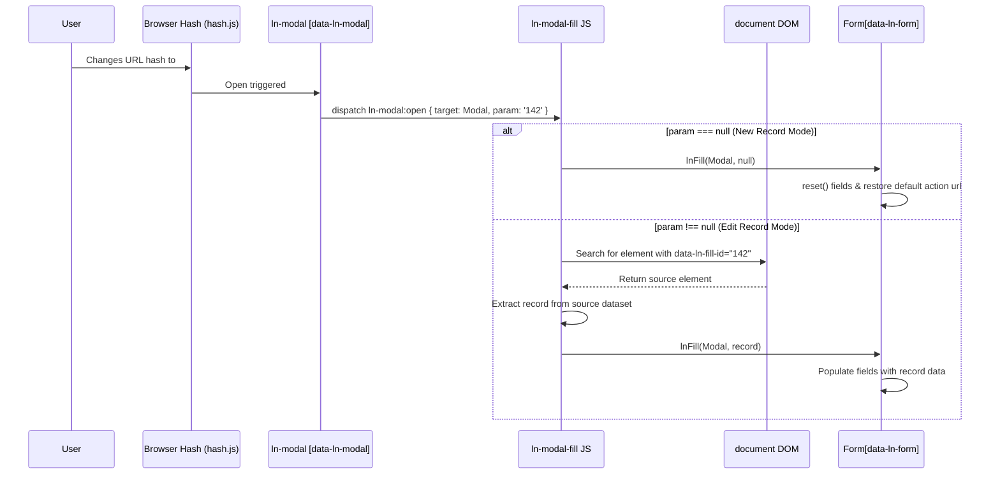

# 🔗 ln-modal-fill
> **Класификација:** ⚙️ Координатор (Layer 2 - Modal & Form Bridge)

---

## 1. Заднинско дејство и одговорност
`ln-modal-fill` ([изворен код](../../js/ln-modal-fill/src/ln-modal-fill.js)) е координатор на проектот кој служи како мост помеѓу системот за навигација преку хаш кај модалите ([ln-modal](./ln-modal.md) / `hash.js`) и декларативното пополнување форми ([ln-fill](./ln-fill.md)).

*   **Главна Одговорност:** Го слуша глобалниот настан `ln-modal:open` и врши програмско пополнување или празнење на формите во отворениот модал во зависност од модот на отворање (Креирање или Уредување).
*   **Нов Запис (New Mode):** Доколку модалот е отворен преку чист хаш (на пр. `#user-modal`, каде `param` е `null`), тоа означува нов запис. Координаторот испраќа сигнал за празнење (`lnFill(modal, null)`) за да ги исчисти сите стари вредности и да ја ресетира формата (вклучително и ресетирање на RESTful акциските рути кај `ln-form`).
*   **Уредување Запис (Edit Mode):** Доколку хашот содржи параметар (на пр. `#user-modal:142`, каде `param` е `142`), координаторот го пребарува DOM дрвото за изворен елемент кој ја содржи таа референца (`data-ln-fill-id="142"`). Откако ќе го пронајде, ги собира неговите `data-ln-fill-*` атрибути и ги инјектира во модалот без да симулира вистински клик на тригерот.
*   **Двосмисленост (Disambiguation):** Ако на страницата постојат повеќе елементи со иста вредност во `data-ln-fill-id`, тој го претпочита оној чиј `data-ln-fill-form` атрибут референцира форма која се наоѓа *внатре* во тековниот модал.

---

## 2. Минимален HTML Маркап и Варијанти на Употреба

```html
<!-- Тригер за Креирање (Нов корисник - чист хаш) -->
<a href="#user-modal" class="btn">Креирај Нов Корисник</a>

<!-- Извори на податоци во табела (Уредување - хаш со параметри) -->
<table>
    <tr>
        <td>Петар Петровски</td>
        <td>
            <a href="#user-modal:142" 
               data-ln-fill-id="142"
               data-ln-fill-form="user-form"
               data-ln-fill-name="Петар Петровски"
               data-ln-fill-email="petar@example.com">
               Уреди
            </a>
        </td>
    </tr>
</table>

<!-- Модален Прозорец со Форма -->
<div id="user-modal" data-ln-modal data-ln-modal-fill="true">
    <div class="modal-content">
        <form id="user-form" data-ln-form="api/users">
            <input type="hidden" name="id" />
            <input type="text" name="name" />
            <input type="email" name="email" />
        </form>
    </div>
</div>
```

---

## 3. Декларативен API Договор (Атрибути и Настани)

| Атрибут | Тип | Опис |
| :--- | :--- | :--- |
| `data-ln-fill-id` | `String` | Уникатен идентификатор на записот нанесен на тригерот. Ова мора да соодветствува на параметарот во хашот (на пр. `142` за `#modal:142`). |
| `data-ln-fill-form` | `String` | Се користи за прецизно лоцирање и поврзување кога повеќе форми на иста страница користат исти ID вредности. |

### DOM Барања и Настани (Слуша)
| Настан | Payload `e.detail` | Опис |
| :--- | :--- | :--- |
| `ln-modal:open` | `{ target: Node, param: String\|null }` | Се активира кога `ln-modal` компонентата ќе го отвори дијалогот. `param` ја носи вредноста на хаш параметарот. |

---

## 4. CSS Стилизирање и Поведенски Концепт
Како чисто логички координатор (Layer 2 Coordinator), `ln-modal-fill` нема своја визуелна репрезентација и не користи сопствени CSS класи. Целосно се потпира на стиловите на `ln-modal` и формите кои ги опслужува.

---

## 5. Пристапност (ARIA) и Чести Грешки
*   **Пристапност:** Бидејќи координаторот овозможува deep-linking (директно отворање преку URL хаш), осигурајте се дека модалот го фокусира првиот инпут во формата по успешното вчитување (Focus Trap на `ln-modal`), со цел корисниците на тастатура веднаш да знаат каде се наоѓа фокусот.
*   **Честа грешка 1:** Несовпаѓање меѓу хашот и вредноста на `data-ln-fill-id`. Ако одите на `#user-modal:142`, изворниот линк мора да има точна вредност `data-ln-fill-id="142"`. Доколку се разликуваат, формата нема да се пополни (deep-link-от ќе пропадне тивко).
*   **Честа грешка 2:** Непоставување на `data-ln-fill-form` кога користите исти ID-а во повеќе табели/складови на иста страница. Ова може да доведе до пополнување на погрешни податоци ако првиот најден елемент со тоа ID припаѓа на друг склад.

---

## 6. Дијаграм на Текот и Животен Циклус



---

## 7. Поврзани Компоненти
*   [ln-modal](./ln-modal.md): Го активира процесот испраќајќи го настанот `ln-modal:open` со соодветните хаш параметри.
*   [ln-fill](./ln-fill.md): Механизмот кој физички ги чита атрибутите од изворниот елемент и ги распределува по полињата.
*   [ln-form](./ln-form.md): Главниот примател на податоците кој ја врши распределбата во формите и го менува своето RESTful однесување врз основа на тоа дали се работи за креирање или измена.
