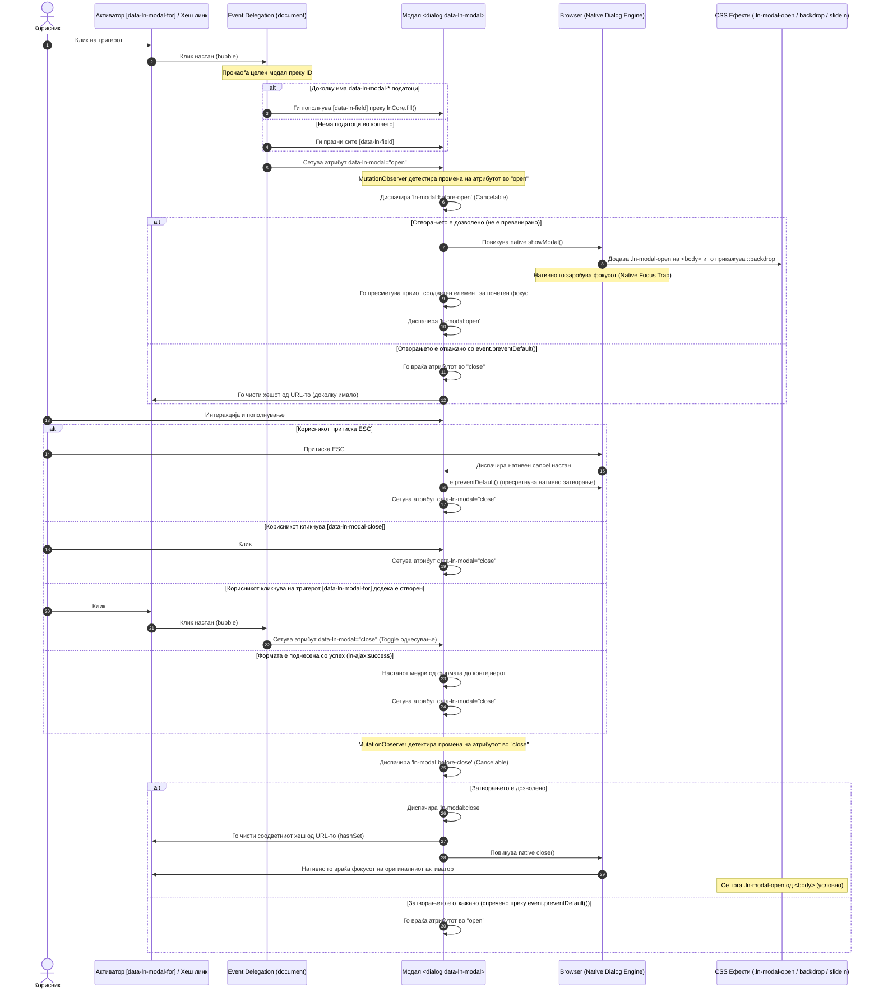

# 🪟 ln-modal
> **Класификација:** 🟢 Едноставна компонента (Simple Component)

---

## 1. Заднинско дејство и одговорност
- **Краток опис:** `ln-modal` е компонента за контрола на модални прозорци која се потпира на нативниот HTML `<dialog>` елемент. Таа управува со бинарната состојба (`open` / `close`) преку синхронизација на атрибути, иницирање на нативните `showModal()` и `close()` методи, фокус менаџмент и пристапност.
- **Ортогоналност (Што компонентата НЕ прави):**
  - **НЕ се позиционира или анимира преку JS** — се потпира на нативните механизми на прелистувачот и CSS транзиции (како анимацијата `ln-modal-slideIn` на формата и транзицијата на нативниот `::backdrop`).
  - **НЕ користи сопствен (рачен) focus trap во JS** — нативниот `<dialog>` кога се отвара со `showModal()` автоматски и нативно го заробува фокусот во рамките на дијалогот.
  - **НЕ имплементира сопствени ESC клуч слушатели за затворање** — прелистувачот нативно реагира на ESC и испраќа настан `cancel` кој компонентата само го пресретнува за правилна синхронизација.
  - **НЕ управува со бизнис логика** — не знае која форма е внатре, како се праќаат или зачувуваат податоците.
  - **НЕ се меша во валидацијата** — формата внатре користи `ln-validate` за проверка на внесот.
  - **НЕ бара дополнителни wrapper класи** — формата (`<form>`) е директно дете на модалниот контејнер `<dialog class="ln-modal" data-ln-modal>`.

---

## 2. Минимален HTML Маркап и Варијанти на Употреба

### 2.1. Базен HTML Маркап
Наједноставен приказ на модал за развивачите:

```html
<dialog class="ln-modal" data-ln-modal id="simple-modal">
    <form>
        <header>
            <h3>Наслов на модалот</h3>
            <button type="button" data-ln-modal-close aria-label="Затвори">&times;</button>
        </header>
        <main>
            <p>Содржина на модалниот прозорец...</p>
        </main>
        <footer>
            <button type="button" data-ln-modal-close>Затвори</button>
        </footer>
    </form>
</dialog>
```

---

### 2.2. Варијанти на употреба

#### Варијанта 1: Координација со `ln-modal-fill` и Хеш адресирање (Universal Hash Mode)
Секој модал кој содржи `id` е автоматски хеш-адресабилен преку URL-то (пр. `#user-modal:42`). Клик на линк со ваков формат се пресретнува, се поставува соодветниот хеш параметар, и преку координаторот `ln-modal-fill` автоматски се полни формата со соодветните податоци.

Прелистувачот овозможува затворање на модалот со `Back` копчето, како и автоматско воспоставување на состојбата (длабоко линкување) при директно вчитување на страницата или при нејзино освежување (reload/deep-link).

> [!IMPORTANT]
> **Правило за преклопување (Supersede Rule):**
> Доколку модалот е хеш-врзан (има дефинирано `id`), тогаш URL адресата и нејзиниот хеш параметар имаат апсолутен приоритет и ги препишуваат (supersede) сите останати инференци или режимски атрибути (`data-ln-modal-mode`).
> * Програмските тригери (копчиња со `data-ln-modal-for="user-modal"`) секогаш го отвораат модалот во режим **`new`** бидејќи во URL-то запишуваат чист, празен хеш `#user-modal`.
> * Режимот **`edit`** се постигнува исклучиво преку хеш линкови кои содржат вредност по дветочката (пр. `<a href="#user-modal:42">`).
> * Доколку модалот **нема** `id`, тој не учествува во хеш адресирањето и тогаш режимот се определува со вредноста на `data-ln-modal-mode` од самиот тригер.

```html
<!-- Тригер за нов корисник (обичен празен хеш) -->
<a href="#user-modal" class="btn">Нов корисник</a>

<!-- Тригер за уредување на постоечки корисник (хеш со вредност + податоци за пополнување) -->
<a href="#user-modal:42"
   data-ln-fill-id="42"
   data-ln-fill-form="user-form"
   data-ln-fill-name="Ада Ловлејс"
   data-ln-fill-role="Инженер">
   Уреди корисник #42
</a>

<!-- Хеш-врзан модал -->
<dialog class="ln-modal" data-ln-modal data-ln-modal-mode="new" id="user-modal">
    <form id="user-form" data-ln-form>
        <header>
            <h3 data-ln-fillable>
                <span data-ln-modal-when="new">Нов корисник</span>
                <span data-ln-modal-when="edit">Уреди — <span data-ln-field="name"></span></span>
            </h3>
            <button type="button" data-ln-modal-close aria-label="Затвори">&times;</button>
        </header>
        <main>
            <label>
                Име:
                <input name="name" type="text" autofocus />
            </label>
            <label>
                Улога:
                <input name="role" type="text" />
            </label>
        </main>
        <footer>
            <button type="button" data-ln-modal-close>Откажи</button>
            <button type="submit">Зачувај</button>
        </footer>
    </form>
</dialog>
```

---

#### Варијанта 2: Декларативни тригери преку `data-ln-modal-*` атрибути
Овој пристап користи директни копчиња со `data-ln-modal-for="id"`. Дополнително, сите атрибути од типот `data-ln-modal-<key>` на самото копче се мапираат во дисплеј полиња (`[data-ln-field]`) во модалот без потреба од комплексен JavaScript координатор.

```html
<!-- Активатор / Копче со податоци -->
<button data-ln-modal-for="info-modal"
        data-ln-modal-title="Детали за системот"
        data-ln-modal-message="Ова е приказ на декларативно пополнување на модалот.">
    Прикажи информации
</button>

<!-- Едноставен инфо модал -->
<dialog class="ln-modal" data-ln-modal id="info-modal">
    <form>
        <header>
            <!-- Ова поле ќе се пополни со вредноста од data-ln-modal-title -->
            <h3 data-ln-field="title">Наслов</h3>
            <button type="button" data-ln-modal-close>&times;</button>
        </header>
        <main>
            <!-- Ова поле ќе се пополни со вредноста од data-ln-modal-message -->
            <p data-ln-field="message">Порака...</p>
        </main>
        <footer>
            <button type="button" data-ln-modal-close>Затвори</button>
        </footer>
    </form>
</dialog>
```

> [!NOTE]
> Клик на кој било тригер со `data-ln-modal-for` има **toggle** однесување: ако модалот е затворен, кликот го отвора и ги пополнува податоците; ако модалот е веќе отворен, кликот го затвора. При отворање преку тригер без дополнителни `data-ln-modal-*` параметри, сите `[data-ln-field]` полиња внатре автоматски се празнат.

---

#### Варијанта 3: Координација со `ln-ajax` за автоматско затворање
Ако формата во модалот користи `data-ln-ajax` за испраќање на податоците, по успешно завршување на барањето се емитува настанот `ln-ajax:success`. Бидејќи овој настан меури нагоре низ DOM дрвото, `ln-modal` го пресретнува и автоматски ја затвора формата без потреба од дополнителен JS код во вашиот проект.

```html
<dialog class="ln-modal" data-ln-modal id="ajax-user-modal">
    <!-- Имплементирана AJAX форма -->
    <form action="/api/users" method="POST" data-ln-ajax>
        <header>
            <h3>Внеси корисник</h3>
            <button type="button" data-ln-modal-close>&times;</button>
        </header>
        <main>
            <label>Корисничко име: <input type="text" name="username" required /></label>
        </main>
        <footer>
            <button type="button" data-ln-modal-close>Откажи</button>
            <button type="submit">Испрати</button>
        </footer>
    </form>
</dialog>
```

---

### 2.3. Два независни простори на имиња (Namespaces)

При изградба на интерактивни форми во модалот, важно е да се прави разлика помеѓу двата независни системи на атрибути:

| Namespace | Префикс | Пополнуван од | Цел во модалот |
|---|---|---|---|
| **Модален приказ (Display)** | `data-ln-modal-*` | `window.lnCore.fill(modal, data)` | Ги пополнува статичните текстуални елементи означени со `[data-ln-field]` внатре во самиот модал (на пр. наслов, опис и сл.). |
| **Пополнување форма (Form Fill)** | `data-ln-fill-*` | `window.lnCore.lnFill(form, data)` | Ги пополнува интерактивните полиња во формата `[data-ln-form]` и означените `[data-ln-fillable]` елементи. |

Двата префикси може да се најдат истовремено на еден ист тригер (како што е прикажано во Варијанта 1). Тие се обработуваат независно од нивните соодветни DOM слушатели на клик.

---

## 3. Декларативен API Договор (Атрибути и Настани)

### 3.1. Атрибути

| Атрибут | Каде се поставува | Вредност / Тип | Опис |
|---|---|---|---|
| `data-ln-modal` | Модален контејнер | `"open"` \| `"close"` | Главен атрибут за контрола на состојбата на отвореност. Модалите без `id` атрибут не учествуваат во хеш адресирањето и не можат да се отворат преку хеш линкови во URL-то. |
| `data-ln-modal-for` | Активатор | `ID на модалот` | Го поврзува активаторот со соодветниот модал за негово отворање (или затворање доколку е веќе отворен). |
| `data-ln-modal-close` | Копче за затворање | Без вредност | Клик на кој било елемент со овој атрибут внатре во модалот ќе предизвика негово затворање. |
| `data-ln-modal-mode` | Модален контејнер | `"new"` \| `"edit"` | Ја определува состојбата на формата (нова или уредување). |
| `data-ln-modal-mode` | Активатор (тригер) | `"new"` \| `"edit"` | Опционално. Го поставува режимот на модалот при клик (работи само доколку модалот нема `id`). |
| `data-ln-modal-when` | Деца на модалот | `"new"` \| `"edit"` | Елементите со овој атрибут се прикажуваат само ако вредноста се совпаѓа со тековниот `data-ln-modal-mode` на модалот. |
| `data-ln-modal-<key>` | Активатор | Текст / Вредност | Декларативно ги пополнува соодветните дисплеј полиња `[data-ln-field="key"]` во модалот при отворање. |

---

### 3.2. Настани (Events API)

Сите настани меурат нагоре (`bubbles: true`). Во `event.detail` секогаш се наоѓаат дополнителни податоци за модалот.

| Настан | Откажување (`Cancelable`) | Податоци во `event.detail` | Опис |
|---|:---:|---|---|
| `ln-modal:before-open` | **Да** | `{ modalId, target }` | Се активира веднаш по промена на атрибутот во `"open"`, пред да се активираат стиловите и фокусот. |
| `ln-modal:open` | Не | `{ modalId, target }`<br>Опционално при хеш-врзување:<br>`{ modalId, target, hashNs, param }` | Се активира откако модалот е целосно отворен, телото е заклучено за скрол и фокусот е заробен. |
| `ln-modal:before-close` | **Да** | `{ modalId, target }` | Се активира веднаш по барање за затворање, давајќи му шанса на проектот да го прекине затворањето (`preventDefault()`). |
| `ln-modal:close` | Не | `{ modalId, target }` | Се емитува при затворање на модалот, пред чистење на хешот и враќање на фокусот. |
| `ln-modal:destroyed` | Не | `{ modalId, target }` | Се активира кога компонентата ќе се деструктуира и ќе ги исчисти сите свои слушатели. |

---

### 3.3. Програмско управување (JS API)

Иако `ln-modal` е главно декларативна компонента, таа овозможува и програмско управување преку DOM атрибути и инстанцата:

* **Промена на состојба**:
  ```js
  const modal = document.getElementById('user-modal');
  modal.setAttribute('data-ln-modal', 'open');  // Отворање
  modal.setAttribute('data-ln-modal', 'close'); // Затворање
  ```
* **Читање на состојба**:
  ```js
  if (modal.lnModal && modal.lnModal.isOpen) {
      console.log('Модалот е отворен!');
  }
  ```

---

## 4. CSS Стилизирање и Поведенски Концепт

### 4.1. Драјвер правила во SCSS
Визуелниот приказ, ресетирањето на UA стиловите на `<dialog>` и сокривањето/прикажувањето на модалот се управувани во [js/ln-modal/ln-modal.scss](../../js/ln-modal/ln-modal.scss):

```scss
/* js/ln-modal/ln-modal.scss */
[data-ln-modal] {
	background: transparent;
	border: none;
	padding: 0;
	margin: 0;
	width: 100%;
	height: 100%;
	max-width: none;
	max-height: none;
	color: inherit;
	overflow: visible;

	&[data-ln-modal="open"] {
		display: flex;
	}
}

body.ln-modal-open {
	overflow: hidden;
}

[data-ln-modal-when] {
	display: none;
}

[data-ln-modal-mode="new"] [data-ln-modal-when="new"],
[data-ln-modal-mode="edit"] [data-ln-modal-when="edit"] {
	display: inline;
}
```

---

### 4.2. Големина и Распоред (SCSS Mixins)
Наместо користење на класи како `.modal-lg` во маркапот, структурата и ширината на формата се конфигурираат во SCSS слојот преку наменски миксини дефинирани во [scss/config/mixins/_modal.scss](../../scss/config/mixins/_modal.scss):

| Mixin | Максимална ширина / Опис | Препорачана намена |
|---|---|---|
| `@include modal-overlay;` | Позиционирање во viewport и стилизирање на нативниот `::backdrop` со scrim боја и заматување | Го дефинира затемнувањето на позадината |
| `@include modal-panel;` | Grid (`auto 1fr auto`), max `600px`, `90vh`, shadow `var(--shadow-xl)` | Ги дефинира сенките, заобленоста и анимацијата `ln-modal-slideIn` |
| `@include modal-sm;` | `28rem` (~448px) | Едноставни потврди, кратки прашања |
| `@include modal-md;` | `32rem` (~512px) | Стандардни форми со 2-4 полиња |
| `@include modal-lg;` | `42rem` (~672px) | Сложени форми во колони, листи на податоци |
| `@include modal-xl;` | `48rem` (~768px) | Преглед на големи табели, детален преглед |

#### Пример за SCSS интеграција во проект
```scss
/* scss/components/_modal-custom.scss */
.ln-modal {
    @include modal-overlay;

    > form {
        @include modal-panel;
        @include modal-md;
    }

    &#large-settings-modal > form {
        @include modal-xl;
    }
}
```

---

## 5. Пристапност (ARIA) и Чести Грешки

### 5.1. ARIA и Управување со Фокусот
Управувањето со пристапноста ги следи нативните WCAG насоки овозможени од HTML5 `<dialog>` спецификацијата:

1. **Семантичка улога**: Прелистувачот нативно му доделува соодветни дијалог карактеристики на елементот `<dialog>`. За постара компатибилност, препорачливо е маркапот да содржи `role="dialog"` и `aria-modal="true"`.
2. **Пребарување на приоритет за фокус при отворање (JS инициран)**:
   При отворање, `ln-modal` го бара првиот соодветен елемент за фокус:
   - Прво го насочува фокусот кон елементот со атрибут `autofocus`.
   - Доколку таков не постои, го фокусира првото видливо внесно поле (`input:not([disabled]):not([type="hidden"])`, `textarea`, `select`).
   - Доколку нема внесни полиња, го фокусира првото овозможено копче или линк (`a[href]`, `button:not([disabled])`).
3. **Нативен Focus Trap**:
   - Бидејќи модалот се отвора со нативниот метод `showModal()`, прелистувачот **нативно го заробува фокусот**. Притискање на `Tab` или `Shift+Tab` циклично го движи фокусот само низ интерактивните елементи во дијалогот. Корисникот не може да пристапи до елементите во позадина.
4. **Нативно затворање со `Escape` клуч (`cancel` настан)**:
   - Прелистувачот нативно реагира на притискање на `Escape` и испраќа настан `cancel` до `<dialog>`. Компонентата го пресретнува овој настан преку `e.preventDefault()` за да спречи нативното затворање да ја заобиколи JS синхронизацијата на состојбите. Наместо тоа, го пренасочува затворањето преку поставување на `data-ln-modal="close"`, што гарантира уредно повикување на `before-close` настаните и чистење на URL хешот.
5. **Враќање на фокусот**:
   - По затворање, прелистувачот нативно го враќа фокусот на елементот што го иницирал отворањето на дијалогот.

---

### 5.2. Чести Грешки (Anti-Patterns)

> [!CAUTION]
> 1. **Не користи позитивни `tabindex` вредности (на пр. `tabindex="1"`)**: Позитивните `tabindex` вредности го нарушуваат редоследот на фокусот и се сметаат за анти-патерн во WCAG.
> 2. **Не додавај непотребни BEM обвивки во HTML**: Не креирај `.ln-modal__content` или `.ln-modal__dialog`. Формата (`<form>`) е директно дете на `.ln-modal` и ја добива целата стилизација преку `@include modal-panel;`.
> 3. **Не поставувај широчини или анимации во inline JS**: Сите димензии и транзиции треба да се дефинираат во SCSS преку миксините (`modal-md`, `modal-lg` итн.).
> 4. **Не ги мешај `data-ln-modal-*` и `data-ln-fill-*` атрибутите**: `data-ln-modal-*` служат за статичен текстуален приказ (`[data-ln-field]`), додека `data-ln-fill-*` се за пополнување интерактивни внесни полиња во форма (`[data-ln-form]`).

---

## 6. Дијаграм на Текот и Животен Циклус

Следниов Mermaid дијаграм го визуелизира животниот циклус од клик на активатор до отворање, фокус менаџмент и затворање преку ESC или AJAX настан:



---

## 7. Поврзани Компоненти
* **[ln-persist](./ln-persist.md)** — Системски помошник за перзистирање на состојби.
* **[ln-form](./ln-form.md)** — Автоматско пополнување и поднесување на форми.
* **[ln-modal-fill](../../js/ln-modal-fill/README.md)** — Координатор за пополнување на податоци при хеш-адресабилни модали.
* **[ln-validate](./ln-validate.md)** — Дезигниран систем за валидација на внес во форми.
* **[ln-toast](./ln-toast.md)** — Систем за тоаст известувања по акции во модалот.
* **[ln-confirm](./ln-confirm.md)** — За едноставни потврдни дијалози.
