# 🔢 ln-number

> **Класификација:** 🟢 Едноставна компонента (Simple Component)

---

## 1. Заднинско дејство и одговорност

`ln-number` е овозможувач за форматирање на бројчени полиња во реално време (locale-aware real-time number formatting) за нативни HTML `<input>` елементи. Имплементирана во [`js/ln-number/src/ln-number.js`](../../js/ln-number/src/ln-number.js), нејзината примарна одговорност е да овозможи мазно корисничко искуство при внесување на парични износи, количини и децимални броеви преку автоматско прикажување на сепаратори за илјади и децимали во согласност со активниот локалитет (`lang` атрибутот), додека истовремено ја одржува точноста на суровите бројчени податоци за испраќање во веб-форми и API повици.

Основната одговорност на компонентата опфаќа:

* **Интелигентна DOM трансформација:** При иницијализација, го конвертира видливото поле во `type="text"` со `inputmode="decimal"` и автоматски креира скриено поле `<input type="hidden">` на кое му го пренесува `name` атрибутот.
* **Локализирано форматирање во реално време:** Го следи внесот на корисникот и го форматира прикажаниот број според активниот јазик (на пример `1.234.567,89` за `mk` или `1,234,567.89` за `en-US`).
* **Синхронизација во два правци (2-Way Value Interception):** Ги пресретнува нативните `value` својства на видливото и скриеното поле за да обезбеди конзистентност при програмски измени (на пр. `populateForm()`, `element.value = ...` или `element.lnNumber.value = ...`).
* **Интелигентна контрола на курсорот:** Го одржува точната позиција на курсорот при пишување и брзо внесување цифри во средината на форматиран број.
* **Динамичка адаптација на локалитетот:** Преку глобален `MutationObserver` автоматски ги преформатира сите активни полиња кога се менува `<html lang>` атрибутот во живо.

> [!IMPORTANT]
> **Што `ln-number` НЕ прави (Orthogonality Doctrine):**
> * **НЕ врши комплексна валидација на форми:** Иако поддржува опционални ограничувања `data-ln-number-min` и `data-ln-number-max` при внесување, целосна валидација, прикажување пораки за грешки и блокада на форма е одговорност на [`ln-validate`](./ln-validate.md) и [`ln-form`](./ln-form.md).
> * **НЕ управува со кориснички CSS спинер копчиња (+/- increment/decrement):** Визуелниот изглед на полето е строго во надлежност на CSS и нативниот HTML маркап.
> * **НЕ перзистира податоци во LocalStorage / SessionStorage:** За зачувување и обнова на вредностите во прелистувачот се користи [`ln-persist`](./ln-persist.md) или [`ln-form`](./ln-form.md).
> * **НЕ халуцинира нестандардни атрибути:** Работи исклучиво преку официјалните декларативни атрибути дефинирани во нејзиниот API договор.

---

## 2. Минимален HTML Маркап и Варијанти на Употреба

### Базен HTML Маркап

```html
<div class="form-element">
    <label for="amount">Износ:</label>
    <input type="number" id="amount" name="amount" data-ln-number />
</div>
```

> [!NOTE]
> **Внатрешна DOM трансформација по иницијализација:**
> Кога `ln-number` се иницијализира врз горниот маркап, DOM структурата автоматски се трансформира во:
> ```html
> <div class="form-element">
>     <label for="amount">Износ:</label>
>     <input type="text" id="amount" data-ln-number inputmode="decimal" />
>     <input type="hidden" name="amount" />
> </div>
> ```
> Видливото поле го губи `name` атрибутот за да не испраќа форматирани стрингови (на пр. `"1.500,00"`) кон серверот, додека скриеното поле го презема `name="amount"` и ги содржи чистите бројчени податоци (на пр. `"1500"`).

---

### Варијанта 1: Форматирање со ограничување на децимални места

Се користи за финансии, ценовници или прецизни мерења каде што е потребен фиксен или ограничен број на децимали.

```html
<div class="form-element">
    <label for="price">Цена (со макс. 2 децимали):</label>
    <input type="number" id="price" name="price"
           data-ln-number
           data-ln-number-decimals="2" />
</div>
```

---

### Варијанта 2: Форматирање со опсег (Min / Max Ограничувања)

Ограничува внесување на броеви кои се помали од дефинираниот минимум или поголеми од максимумот.

```html
<div class="form-element">
    <label for="quantity">Количина (од 1 до 1.000.000):</label>
    <input type="number" id="quantity" name="quantity"
           data-ln-number
           data-ln-number-min="1"
           data-ln-number-max="1000000" />
</div>
```

---

### Варијанта 3: Почетно пополнета вредност (Pre-filled Value)

Кога HTML полето содржи почетна вредност во `value` атрибутот, `ln-number` автоматски ја парсира суровата вредност, го пополнува скриеното поле и го форматира видливото поле при полнење на страницата.

```html
<div class="form-element">
    <label for="budget">Буџет:</label>
    <input type="number" id="budget" name="budget" value="1500000"
           data-ln-number
           data-ln-number-decimals="2" />
</div>
```

---

### Варијанта 4: Интеграција со `ln-validate` за Задолжителни Полиња

`ln-number` совршено коегзистира со [`ln-validate`](./ln-validate.md). `required` атрибутот и флагот `data-ln-validate` остануваат на видливото поле.

```html
<div class="form-element">
    <label for="salary">Плата:</label>
    <input type="number" id="salary" name="salary"
           required
           data-ln-validate
           data-ln-number
           data-ln-number-decimals="2" />
    <ul data-ln-validate-errors>
        <li class="hidden" data-ln-validate-error="required">Полето за плата е задолжително</li>
    </ul>
</div>
```

---

### Варијанта 5: Автоматска интеграција во форми преку `ln-form`

При користење на [`ln-form`](./ln-form.md), функцијата `serializeForm()` автоматски го чита скриеното поле (кое го има атрибутот `name`), со што серверот добива чист `Number`. При повикување на `populateForm()`, таа ја менува вредноста на скриеното поле, што преку пресретнувачот (property descriptor setter) автоматски го ажурира и форматира видливото поле.

---

## 3. Декларативен API Договор (Атрибути и Настани)

### Табела со Атрибути

| Атрибут | Применлив на | Задолжителен | Тип / Стандардна вредност | Опис |
|---|---|---|---|---|
| `data-ln-number` | `<input>` | **Да** | Флаг (без вредност) | Го активира моторот за форматирање броеви врз инпутот. |
| `data-ln-number-decimals` | `<input>` | Не | `Number` / `null` | Максимален број на дозволени децимални места. Доколку не е наведен, ги зачувува внесените децимали од корисникот. |
| `data-ln-number-min` | `<input>` | Не | `Number` / `null` | Минимална дозволена бројчена вредност. Внесовите под овој праг се игнорираат при пишување. |
| `data-ln-number-max` | `<input>` | Не | `Number` / `null` | Максимална дозволена бројчена вредност. Внесовите над овој праг се игнорираат при пишување. |
| `data-ln-fill-as` | `<input>` | Не | `String` / `null` | Доколку е присутен на видливото поле, автоматски се пренесува и на креираното скриено поле за интеграција со соодветни системи за пополнување. |

---

### Јавен JavaScript API (`element.lnNumber`)

При иницијализација, компонентата се закачува директно на DOM елементот преку својството `element.lnNumber`.

```javascript
const inputEl = document.querySelector('[data-ln-number]');
const instance = inputEl.lnNumber;

// 1. Читање на суровата бројчена вредност (Number или NaN ако е празно)
console.log(instance.value); // Pl: 1234.56

// 2. Програмско поставување на вредност — автоматски го форматира приказот
instance.value = 1500000.75; 

// 3. Читање на форматираниот стринг од видливото поле
console.log(instance.formatted); // Pl: "1.500.000,75" (за lang="mk")

// 4. Уништување на инстанцата и реставрација на нативниот HTML
instance.destroy();
```

#### API Својства и Методи

| Својство / Метод | Тип | Опис |
|---|---|---|
| `value` | `Number` (Getter / Setter) | Враќа суров `Number` (или `NaN` доколку полето е празно). При сетување прифаќа број, го обновува скриеното поле и го форматира видливото поле. |
| `formatted` | `String` (Getter) | Го враќа форматираниот стринг што во моментот го гледа корисникот во видливото поле. |
| `destroy()` | `Function` | Ги отстранува event listeners (`input`, `paste`), го избришува скриеното поле, му го враќа `name` и `type="number"` на видливото поле и го брише `lnNumber` објектот. |

---

### Настани (Events API)

`ln-number` диспачира стандардни прилагодени CustomEvents со овозможено меурчење (`bubbles: true`).

| Име на настан | Меурчење (Bubbles) | Се откажува (Cancelable) | `event.detail` содржина | Опис |
|---|---|---|---|---|
| `ln-number:input` | **Да** | Не | `{ value: Number, formatted: String }` | Се емитува при секоја промена на вредноста од страна на корисникот или програмски. |
| `ln-number:destroyed` | **Да** | Не | `{ target: Element }` | Се емитува кога инстанцата ќе се уништи преку `.destroy()`. |

---

## 4. CSS Стилизирање и Поведенски Концепт

`ln-number` е примарно функционална JS компонента, но совршено се интегрира со стандардниот проектен CSS систем за формулари.

### Препорачани CSS Класи и Стилизирање

За визуелна конзистентност со типот на податоци, се препорачува десно порамнување на броевите во формулари:

```scss
/* Стандардни класи за полиња */
.form-element {
    display: flex;
    flex-direction: column;
    gap: var(--space-xs, 0.25rem);
}

.input {
    width: 100%;
    padding: 0.5rem 0.75rem;
    border: 1px solid var(--color-border, #ccc);
    border-radius: 4px;
    font-family: inherit;
    font-size: 1rem;
}

/* Десно порамнување за парични вредности и броеви */
input[data-ln-number] {
    text-align: right;
    font-variant-numeric: tabular-nums;
}
```

---

### Поведенски Концепти и Внатрешна Механика

#### 1. Пресретнување на својства (2-Way Value Binding & Property Interception)
За да се овозможи беспрекорна работа со други JS библиотеки, форми и нативен код, `ln-number` ги пресретнува нативните `value` getters и setters:
* На **скриеното поле** (`<input type="hidden">`), преку `Object.defineProperty`, овозможувајќи промената на `hidden.value` автоматски да го ажурира видливото поле со соодветно форматиран број.
* На **видливото поле** (`<input type="text">`), преку `interceptValueProperty` од `ln-core`, овозможувајќи промената на `dom.value` програмски да се конвертира и да го ажурира скриеното поле.

#### 2. Динамичко препознавање на локалитетот (Locale Awareness)
Компонентата го бара најблискиот преддок со атрибут `[lang]` (најчесто `<html lang="...">`) преку помошната функција `getLocale(dom)`. Доколку не пронајде, се враќа на `navigator.language`.
Сите `Intl.NumberFormat` објекти се кешираат во внатрешниот `_formatters` речник за максимални перформанси.
Дополнително, `_localeObserver()` поставива глобален `MutationObserver` на `document.documentElement` кој ги следи промените на `lang` атрибутот. Доколку корисникот го промени јазикот на апликацијата во живо, сите полиња со `data-ln-number` веднаш се преформатираат со соодветните нови сепаратори!

| Јазик (`lang`) | Прикажан формат за `1234567.89` |
|---|---|
| `mk` / `de` | `1.234.567,89` |
| `en-US` | `1,234,567.89` |
| `fr` | `1 234 567,89` |

#### 3. Зачувување на позицијата на курсорот (Smart Cursor Tracking)
При внесување или бришење на цифри во средината на форматиран број, промената на стрингот (додавање или отстранувања на сепаратори за илјади) може да го помести курсорот на крајот од полето. `ln-number` го спречува ова со следниов алгоритам:
1. Пред преформатирање, ги брои сите цифри од почетокот на полето до моменталната позиција на курсорот (`selectionStart`).
2. По нанесување на форматираниот стринг, го изминува новиот стринг и го поставува курсорот веднаш зад истата бројка цифри преку `dom.setSelectionRange()`.

#### 4. Ракување со специфични состојби при пишување во живо (Live Typing Edge Cases)
* **Минусен знак (`-`):** Ако корисникот внесе само `-`, полето го задржува знакот без да врати `NaN` или да го избрише, овозможувајќи внес на негативни броеви.
* **Траектен децимален сепаратор (`123.` или `123,`):** Доколку корисникот внесе точка или запета (во зависност од локалитетот), компонентата не го брише сепараторот агресивно, туку овозможува корисникот мазно да продолжи со пишување на децималите.
* **Траектни нули (`12.0` / `12.00`):** При пишување на нули по децималата, форматирањето ги задржува нулите додека корисникот пишува.
* **Ракување со залепен текст (`paste` настан):** При залепување текст (на пр. `" $1,234.50 USD "`), `paste` слушателот автоматски ги чисти сите небројчени знаци (освен соодветниот децимален и минусен знак), го нормализира бројот и го доделува на инстанцата.

---

## 5. Пристапност (ARIA) и Чести Грешки

### ARIA & Мобилна Пристапност

* **Поддршка за мобилни уреди (`inputmode="decimal"`):** При иницијализација, `ln-number` автоматски поставува `inputmode="decimal"` на видливото поле. Ова ги информира мобилните оперативни системи (iOS, Android) да ја покажат оптимизираната нумеричка тастатура со децимална точка/запета.
* **Поврзување со Скринер Софтвер:** Бидејќи видливото поле го зачувува нативниот `id` атрибут, сите `<label for="...">` референци остануваат 100% функционални.
* **Невидливост на скриеното поле:** Креираното `<input type="hidden">` поле нема фокус и е целосно игнорирано од Screen Readers и `Tab` навигацијата, што спречува двојно читање на вредностите.

---

### Анти-патерни (Чести Грешки)

> [!CAUTION]
> **1. Примена на елемент кој не е `<input>`**
> `ln-number` е дизајнирана строго за HTML `<input>` елементи. Поставување на `data-ln-number` на `<div data-ln-number>` или `<span data-ln-number>` ќе резултира со предупредување во конзолата (`[ln-number] Can only be applied to <input>...`) и иницијализацијата ќе прекине.

> [!WARNING]
> **2. Обид за читање на `name` атрибутот од видливото поле во сопствени JS скрипти**
> По иницијализацијата, `name` атрибутот е отстранет од видливото поле и префрлен на скриеното поле. Користете `serializeForm()`, `form.elements['name']` или `element.lnNumber.value` наместо мануелно читање на `visibleInput.name`.

> [!WARNING]
> **3. Форматирање на вредноста пред доделување преку JS API**
> При поставување вредност преку `element.lnNumber.value`, задолжително проследувајте суров чист `Number` (на пр. `1500.5`), а НЕ форматиран стринг (на пр. `"1.500,50"`).
> ```javascript
> // ❌ ПОГРЕШНО
> inputEl.lnNumber.value = "1.500,50";
>
> // ✅ ТОЧНО
> inputEl.lnNumber.value = 1500.50;
> ```

> [!NOTE]
> **4. Промена на `type="number"` на видливото поле по иницијализација**
> Браузерите не дозволуваат приказ на стрингови со запета/точка за илјади во нативни `<input type="number">` полиња. `ln-number` намерно го менува `type` во `text`. Не го враќајте мануелно `type` во `number`.

---

## 6. Дијаграм на Текот и Животен Циклус

```mermaid
sequenceDiagram
    autonumber
    actor User as Корисник
    participant DOM as Видливо Поле (<input type="text">)
    participant Engine as ln-number Engine
    participant Hidden as Скриено Поле (<input type="hidden">)
    participant App as Проектна Апликација

    Note over DOM, Engine: 1. Иницијализација
    App->>DOM: Додава data-ln-number
    Engine->>DOM: Чита name, id, value
    Engine->>DOM: Променува type="text", inputmode="decimal", отстранува name
    Engine->>Hidden: Креира <input type="hidden"> со name="amount" по DOM полето

    Note over User, Hidden: 2. Внесување вредност од корисник
    User->>DOM: Внесува цифри (на пр. "1234567")
    DOM->>Engine: Диспачира 'input' настан
    Engine->>Engine: Ги брои цифрите пред курсорот (Cursor Tracking)
    Engine->>Engine: Нормализира број и го форматира со Intl.NumberFormat
    Engine->>DOM: Го ажурира прикажаниот стринг ("1.234.567")
    Engine->>DOM: Ја реставрира позицијата на курсорот
    Engine->>Hidden: Ја запишува чистата вредност (1234567)
    Engine->>App: Диспачира CustomEvent 'ln-number:input' { value: 1234567, formatted: "1.234.567" }

    Note over App, Hidden: 3. Програмска измена или промена на локалитет
    App->>DOM: Поставува el.lnNumber.value = 5000
    Engine->>Hidden: Го поставува hidden.value = "5000"
    Engine->>DOM: Го ажурира видливиот приказ ("5.000")
    
    User->>DOM: Промена на <html lang="en-US">
    Engine->>DOM: MutationObserver детектира промена
    Engine->>DOM: Преформатира сите активни полиња во "5,000"

    Note over App, DOM: 4. Уништување на компонентата (.destroy())
    App->>Engine: Повикува el.lnNumber.destroy()
    Engine->>DOM: Враќа type="number" и name="amount"
    Engine->>Hidden: Го отстранува скриеното поле од DOM
    Engine->>App: Диспачира CustomEvent 'ln-number:destroyed'
```



---

## 7. Поврзани Компоненти

* 📋 [**ln-form**](./ln-form.md) — Координатор на ниво на форма кој автоматски работи со скриените полиња за серијализација (`serializeForm()`) и пополнување (`populateForm()`).
* ✅ [**ln-validate**](./ln-validate.md) — Компонента за валидација на полиња која поддржува `required`, `min` и `max` правила во комбинација со `ln-number`.
* 💾 [**ln-persist**](./ln-persist.md) — Сервис за автоматизирано зачувување и обнова на состојбата и внесените вредности во формулари.
