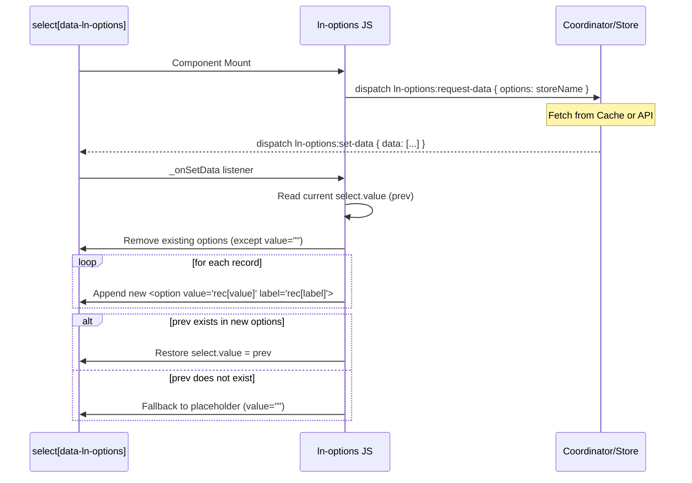

# 🗂️ ln-options
> **Класификација:** 🟢 Едноставна компонента (Layer 1 - Form Helper)

---

## 1. Заднинско дејство и одговорност
`ln-options` е едноставна помошна компонента наменета за динамичко пополнување на `<select>` елементи со опции добиени од одреден податочен склад (`ln-data-store`) или оддалечен сервер.

*   **Главна Одговорност:** Го слуша настанот за испорака на податоци `ln-options:set-data` и динамички ги прегенерира соодветните `<option>` елементи во DOM-от.
*   **Зачувување на Селекцијата (State Preservation):** Пред да започне со чистење и повторно генерирање на опциите, компонентата ја зачувува моментално избраната вредност (`dom.value`). Доколку таа вредност е присутна и во новото множество на податоци, истата автоматски се реставрира по завршување на процесот на реизградба.
*   **Филтрирање на Placeholder:** Секогаш ги задржува почетните опции кои немаат вредност (placeholder опции од типот `<option value="">Изберете...</option>`), а ги брише и заменува само оние со реална вредност.
*   **Комуникација преку Настани:** Компонентата е целосно изолирана и нема директна врска со HTTP клиенти или со базата. При иницијализација испраќа настан `ln-options:request-data` и чека координаторот на формата или базата да ја врати низата со податоци.

---

## 2. Минимален HTML Маркап и Варијанти на Употреба

```html
<!-- Стандардно поврзување со продавница (store) со id/name дефолти -->
<div class="form-element">
    <label for="user-select">Избери Корисник:</label>
    <select id="user-select" data-ln-options="users">
        <option value="">-- Изберете корисник --</option>
    </select>
</div>

<!-- Сопствено мапирање на вредност и етикета (value / label) -->
<div class="form-element">
    <label for="category-select">Категорија:</label>
    <select id="category-select" 
            data-ln-options="categories" 
            data-ln-options-value="code" 
            data-ln-options-label="title">
        <option value="">-- Сите категории --</option>
    </select>
</div>
```

---

## 3. Декларативен API Договор (Атрибути и Настани)

| Атрибут | Тип | Опис |
| :--- | :--- | :--- |
| `data-ln-options` | `String` | Го иницира компонентот врз `<select>` елемент и го означува името на складот (store name). |
| `data-ln-options-value` | `String` | Името на својството (property) од објектот кое ќе се искористи за `value` во `<option>` (default: `id`). |
| `data-ln-options-label` | `String` | Името на својството (property) од објектот кое ќе се искористи за текстуален приказ во `<option>` (default: `name`). |

### DOM Барања (Слуша)
| Настан | Payload `e.detail` | Опис |
| :--- | :--- | :--- |
| `ln-options:set-data` | `{ data: Array }` | Се активира кога координаторот ги испраќа податоците. Тоа ја иницира реизградбата на опциите. |

### Настани (Емитува)
| Настан | Payload `e.detail` | Опис |
| :--- | :--- | :--- |
| `ln-options:request-data` | `{ options: String }` | Се емитува веднаш при иницијализација на компонентата за да го извести координаторот кои податоци треба да се вчитаат. |

---

## 4. CSS Стилизирање и Поведенски Концепт
Ова е логичка компонента наменета исклучиво за менаџмент со опции во DOM-от и нема свои сопствени CSS класи. Изгледот на `<select>` елементот целосно се потпира на стандардните стилови за форми и инпути дефинирани во апликацијата.

---

## 5. Пристапност (ARIA) и Чести Грешки
*   **Пристапност:** Бидејќи `ln-options` генерира стандардни `<option>` тагови, пристапноста е нативно обезбедена од самиот прелистувач и екранските читачи.
*   **Честа грешка 1:** Непоставување на placeholder опција со празна вредност (`value=""`). Доколку секоја опција во HTML-от има вредност, таа ќе биде избришана при реизградба на опциите.
*   **Честа грешка 2:** Несовпаѓање на клучот за вредност (`data-ln-options-value`) со својствата на објектот во низата. На пример, ако објектите имаат својство `uuid`, а се користи стандардниот `id`, опциите ќе бидат генерирани со `value="undefined"`.

---

## 6. Дијаграм на Текот и Животен Циклус



---

## 7. Поврзани Компоненти
*   **`ln-data-store`**: Најчест извор на податоци кои се вчитани во координаторот и потоа се проследуваат до `ln-options`.
*   **`ln-form`**: Често го обвиткува `<select>` елементот и реагира на промени во неговата вредност за време на валидација и поднесување.
