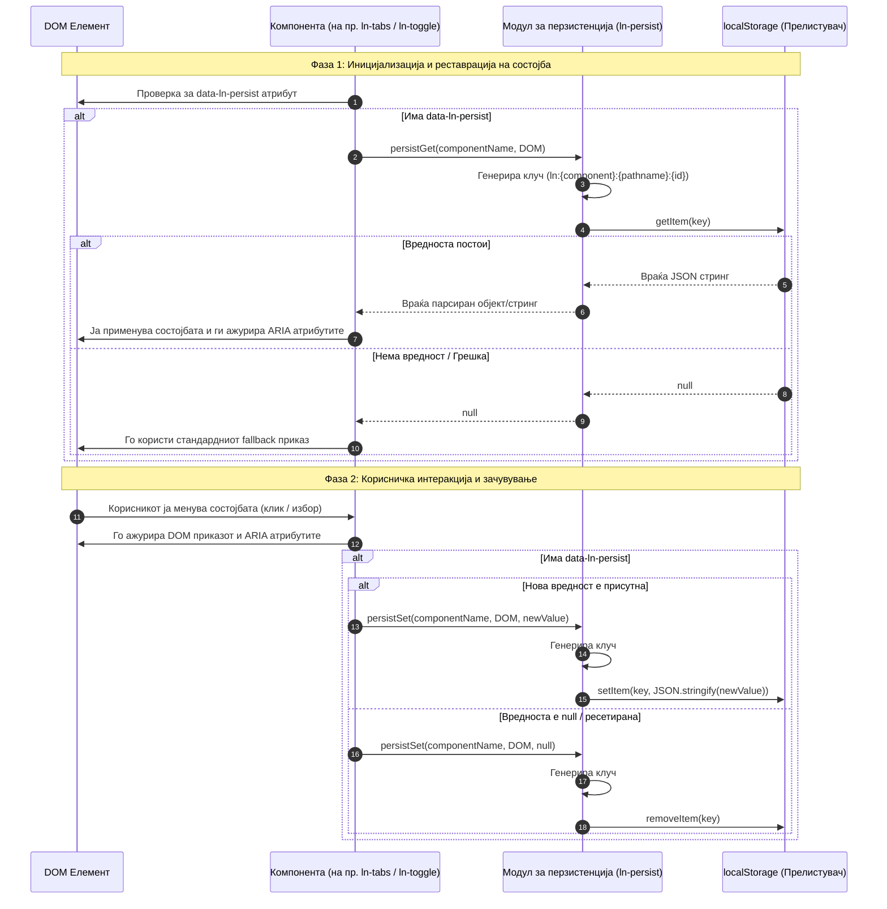

# 💾 ln-persist

> **Класификација:** ⚙️ Системски помошник / Модул за перзистенција (Persistence Utility Module)

---

## 1. Заднинско дејство и одговорност

`ln-persist` е централниот системски помошник во `ln-ashlar` за зачувување и синхронизација на корисничката состојба во локалното складиште на прелистувачот (`localStorage`). Имплементиран како извозен модул во [`js/ln-core/persist.js`](../../js/ln-core/persist.js), тој обезбедува стандардизиран функционален слој кој:

* **Апстрахира пристап до `localStorage`** — обезбедува безбедно серијализирање и парсирање на JSON вредности без ризик од уривање на скриптата.
* **Изолира простори со префикси (Namespacing)** — спречува конфликти на клучеви помеѓу различни компоненти (на пр. `toggle`, `tabs`, `filter`, `table-sort`).
* **Ги поврзува состојбите со URL патеката (Path-scoped persistence)** — стандардно ја користи URL патеката како дел од клучот за состојбата на филтри или табови да биде специфична за секоја страница.
* **Автоматски ракува со грешки** — тивко ги пресретнува и игнорира исклучоците кога `localStorage` е полн или оневозможен (пр. во приватен режим - Private Browsing).

> [!IMPORTANT]
> **Што `ln-persist` НЕ прави (Orthogonality Doctrine):**
> * **НЕ се иницијализира како DOM компонента** — не користи `MutationObserver` ниту се активира преку сопствени EventListener правила на DOM елементи. Тој е чисто сервисен модул во `ln-core` кој другите примитиви го повикуваат при нивната иницијализација или промена на состојба.
> * **НЕ управува со DOM или ARIA атрибути** — не додава/отстранува CSS класи ниту променува ARIA атрибути. Примитивите кои ја вчитале состојбата се одговорни за нејзино применување во DOM-от.
> * **НЕ користи `sessionStorage`** — работи строго со `localStorage` за долгорочно зачувување на состојбите низ сесии.
> * **НЕ прави автоматска синхронизација помеѓу отворени табови** — корисникот мора да ја превчита страницата или компонентите мора експлицитно да реагираат на настани доколку сакаат меѓу-табовска реактивност.
> * **НЕ се преклопува со `ln-autosave`** — `ln-autosave` е наменет за привремено зачувување на незачувани форми/текст и користи свој посебен префикс (`ln-autosave:`).

---

## 2. Минимален HTML Маркап и Варијанти на Употреба

`ln-persist` е овозможен со едноставно додавање на атрибутот `data-ln-persist` на соодветната компонента. Постојат две варијанти за дефинирање на идентификаторот за перзистенција:

1. **Имплицитна перзистенција преку ID**: Елементот мора да има дефинирано `id` (пр. `id="my-component"`). Логиката го користи тоа `id` како дел од клучот.
2. **Експлицитна перзистенција преку вредност на атрибутот**: Атрибутот содржи вредност (пр. `data-ln-persist="custom-key"`). Во овој случај, `id` на елементот не е задолжително бидејќи вредноста од атрибутот се користи како идентификатор.

### 2.1. Варијанта 1: Странично мени со перзистирање на состојба (`ln-toggle`)

Се користи за зачувување на бинарната состојба (`open` / `close`) на странично мени или колапсирачки панел.

```html
<!-- Активатор / Копче за контролирање -->
<button type="button" class="btn" data-ln-toggle-for="app-sidebar" aria-label="Тогл Мени">
    Сложи мени
</button>

<!-- Странично мени со овозможена перзистенција -->
<aside id="app-sidebar" data-ln-toggle="open" data-ln-persist class="sidebar">
    <nav>
        <ul>
            <li><a href="/dashboard">Почетна</a></li>
            <li><a href="/settings">Подесувања</a></li>
        </ul>
    </nav>
</aside>
```

---

### 2.2. Варијанта 2: Интеграција со Табови (`ln-tabs`)

Зачувување на активниот таб при сменување на секции (кога не се користи URL хаш навигација).

```html
<section id="settings-panel" data-ln-tabs data-ln-persist="user-settings-tab" data-ln-tabs-default="general">
    <div class="tabs-nav" role="tablist">
        <button type="button" role="tab" data-ln-tab-trigger="general">Општи</button>
        <button type="button" role="tab" data-ln-tab-trigger="security">Безбедност</button>
    </div>
    <div class="tabs-content">
        <div id="general" data-ln-tab-content role="tabpanel">Општи подесувања...</div>
        <div id="security" data-ln-tab-content role="tabpanel">Безбедносни подесувања...</div>
    </div>
</section>
```

---

### 2.3. Варијанта 3: Интеграција со Филтри (`ln-filter`)

Овозможува селектираните филтри во табела или листа да останат зачувани по опреснување на страницата.

```html
<nav id="user-role-filter" data-ln-filter="users-table" data-ln-filter-col="2" data-ln-persist>
    <label>
        <input type="checkbox" value="admin"> Админ
    </label>
    <label>
        <input type="checkbox" value="editor"> Уредник
    </label>
</nav>
```

---

### 2.4. Варијанта 4: Интеграција со Сортирање на Табели (`ln-table`)

Сортирањето на табелата (колона и насока `asc`/`desc`) се зачувува и реконструира при следната посета.

```html
<div data-ln-table id="users-table" data-ln-persist>
    <table>
        <thead>
            <tr>
                <th data-ln-table-sort="string">
                    Име <button type="button" data-ln-table-col-sort>↕</button>
                </th>
                <th data-ln-table-sort="number">
                    Поени <button type="button" data-ln-table-col-sort>↕</button>
                </th>
            </tr>
        </thead>
        <tbody>
            <!-- Редови -->
        </tbody>
    </table>
</div>
```

---

## 3. Декларативен API Договор (Атрибути и Настани)

### Атрибути во DOM Маркапот

| Атрибут | Применлив на | Вредности | Стандардна вредност | Опис |
| :--- | :--- | :--- | :--- | :--- |
| `data-ln-persist` | Сите поддржани примитиви (`ln-toggle`, `ln-tabs`, `ln-filter`, `[data-ln-table]`) | Празна вредност (булеан) или `string` клуч | _Нема (opt-in)_ | Го овозможува зачувувањето во `localStorage`. Ако е празен, го користи `id` на елементот. Доколку содржи вредност, таа се користи како експлицитен клуч. |
| `id` | HTML елементот | `string` | _Нема_ | Задолжителен кога `data-ln-persist` е празен/булеан флаг. |

---

### JavaScript Utility API (`js/ln-core/persist.js`)

Модулот ги извезува следните помошни функции кои ги користат компонентите:

```javascript
import { persistGet, persistSet, persistRemove, persistClear } from './ln-core';
```

#### `persistGet(component, el)`
Вчитува и десеријализира зачувана состојба од `localStorage`.
* **Параметри:**
  * `component` `(string)`: Името на компонентата (пр. `"toggle"`, `"tabs"`, `"filter"`, `"table-sort"`).
  * `el` `(HTMLElement)`: DOM елементот кој има атрибут `data-ln-persist` или `id`.
* **Враќа:** `any` — Парсираната вредност од `localStorage` (`JSON.parse`), или `null` доколку не постои или дојде до грешка.

#### `persistSet(component, el, value)`
Зачувува серијализирана состојба во `localStorage`.
* **Параметри:**
  * `component` `(string)`: Името на компонентата.
  * `el` `(HTMLElement)`: DOM елементот.
  * `value` `(any)`: Вредноста за зачувување (автоматски се претвора во JSON преку `JSON.stringify`). Доколку се испрати `null` или `undefined`, клучот автоматски се отстранува од `localStorage`.

#### `persistRemove(component, el)`
Експлицитно го брише зачуваниот клуч за дадениот елемент од `localStorage`.
* **Параметри:**
  * `component` `(string)`: Името на компонентата.
  * `el` `(HTMLElement)`: DOM елементот.

#### `persistClear(component)`
Глобално ги чисти сите перзистирани состојби за дадена компонента на сите патеки и идентификатори.
* **Параметри:**
  * `component` `(string)`: Името на компонентата чии клучеви треба да се избришат (пр. `"filter"`).

---

### Настани (Events API)

`ln-persist` работи тивко и **не диспачира сопствени DOM настани**. Настаните се одговорност на самите компоненти што го користат модулот:
* При реставрација или промена на состојба преку `ln-persist`, соодветните компоненти ги диспачираат нивните стандардни настани (на пр. `ln-toggle:change`, `ln-tabs:change`, `ln-filter:change`).

---

## 4. CSS Стилизирање и Поведенски Концепт

### CSS / Визуелна независност
`ln-persist` нема сопствени CSS класи или SCSS миксини. Тој функционира чисто како сервисен слој за податоци зад визуелните компоненти.

---

### Генерирање на Клучеви и Логика на Именување (Key Resolution Pattern)

Уникатноста на клучевите во `localStorage` е клучна за да се спречат конфликти. `ln-persist` користи строго дефиниран шаблон за генерирање клучеви.

#### Формат на клучот
```
ln:{component}:{pathname}:{identifier}
```

* **`ln:`** — Глобален фиксен префикс за сите клучеви на библиотеката `ln-ashlar`.
* **`{component}`** — Име на компонентата (пр. `toggle`, `tabs`, `filter`, `table-sort`).
* **`{pathname}`** — Патеката на страницата (`location.pathname.replace(/\/+$/, '').toLowerCase() || '/'`). Ова спречува состојбата на филтри или табови на една страница да влијае врз филтри со исто ID на друга страница.
* **`{identifier}`** — Вредноста од `data-ln-persist` доколку е внесена, или `id` атрибутот на елементот.

---

### Безбедност и Ракување со Исклучоци (Private Browsing & Storage Limits)

Имплементацијата на `ln-persist` е целосно заштитена со `try/catch` блокови за да спречи паѓање на JavaScript апликацијата во следните сценарија:

1. **Колачиња и LocalStorage се оневозможени:** Сите повици кон `getItem`, `setItem` и `removeItem` се обвиткани во блокада која при грешка тивко враќа `null` или излегува без фрлање исклучок.
2. **Приватен режим (Private Browsing):** Прелистувачите кои ограничуваат запишување во `localStorage` нема да предизвикаат JavaScript прекин во апликацијата.
3. **Надминат лимит на складирање (`QuotaExceededError`):** Доколку складиштето е преполно, запишувањето пропаѓа тивко.

---

## 5. Пристапност (ARIA) и Чести Грешки

### ARIA & Тастатура
* **Инвизибилност за асистивна технологија:** Модулот `ln-persist` работи чисто во меморијата/складиштето и нема директна интеракција со читачите на екранот.
* **Синхронизација на ARIA при реставрација:** Компонентите кои ја вчитале состојбата од `ln-persist` при иницијализација мора веднаш да ги ажурираат соодветните ARIA атрибути (`aria-expanded="true"`, `aria-selected="true"`) пред нивното прикажување, спречувајќи неусогласеност помеѓу визуелниот приказ и читачот на екран.

---

### Анти-патерни (Common Pitfalls)

> [!CAUTION]
> **1. Недостасува `id` и вредност во `data-ln-persist`:**
> Доколку елементот има празен `data-ln-persist` атрибут но му недостасува `id` атрибут, `ln-persist` ќе прикаже предупредување во конзолата: `[ln-persist] Element requires id or data-ln-persist="key"` и нема да зачува никаква состојба.
>
> **2. Истобирење на `data-ln-persist` со URL Hash кај Табови (`ln-tabs`):**
> Употребата на `data-ln-persist` на табови кои користат URL хаш навигација е меѓусебно исклучива. `ln-tabs` експлицитно го игнорира перзистирањето кога хаш навигацијата е активна за да се избегнат конфликти.
>
> **3. Очекување меѓу-странично пренесување при имплицитно `id`:**
> Бидејќи клучот ја содржи URL патеката (`{pathname}`), филтер со `id="status-filter"` на `/admin/users` нема да ги пренесе своите вредности на `/reports/users`. Доколку сакате глобално перзистирање низ сите страници, користете експлицитен клуч во атрибутот, на пр. `data-ln-persist="global-status-filter"`.

---

## 6. Дијаграм на Текот и Животен Циклус

Следниот Mermaid sequence diagram го опишува целосниот животен циклус на координација помеѓу DOM елементот, соодветната компонента, модулот `ln-persist` и `localStorage`:



---

## 7. Поврзани Компоненти

* [`ln-toggle`](./ln-toggle.md) — Основна бинарна компонента која користи `data-ln-persist` за памтење на отворена/затворена состојба.
* [`ln-tabs`](./ln-tabs.md) — Компонента за табови која го зачувува активниот таб преку `ln-persist` кога не се користи URL хаш.
* [`ln-table`](./ln-table.md) — Компонента за табели која ја перзистира колоната и насоката на сортирање.
* [`ln-filter`](./ln-filter.md) — Филтер компонента која ги складира селектираните вредности од чеклисти во `localStorage`.
* [`ln-accordion`](./ln-accordion.md) — Координатор кој овозможува перзистирање на поединечни панели преку `ln-toggle`.
* Изворен JS Модул: [`js/ln-core/persist.js`](../../js/ln-core/persist.js).
