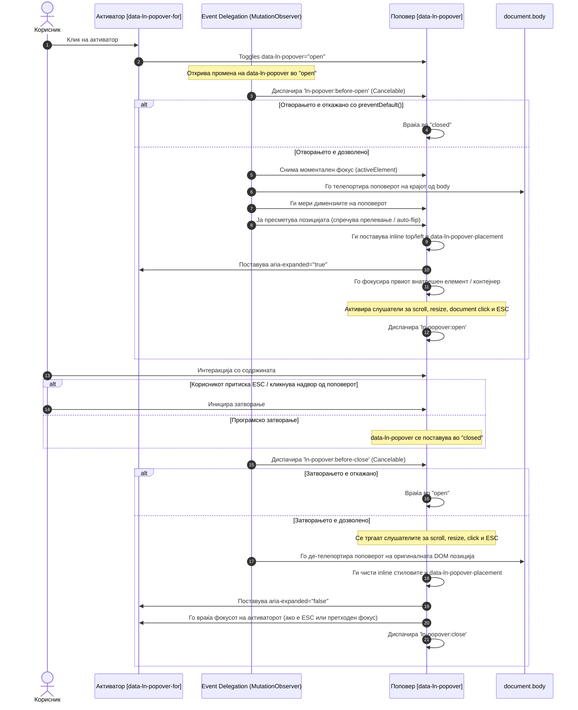

# 💬 ln-popover

> **Класификација:** 🟢 Едноставна компонента (Simple Component)

---

## 1. Заднинско дејство и одговорност

`ln-popover` е лесна лебдечка компонента наменета за приказ на богати, контекстуални содржини (како кориснички менија, брзи форми за внес, помошни текстуални картички или филтри за колони во табели) позиционирани во однос на активаторот (тригерот). Компонентата е изградена врз принципот на **ортогоналност**, делејќи ги јасно своите одговорности:

* **Состојба и позиционирање (JavaScript)**: Управува со бинарната состојба (`open` / `closed`) преку HTML атрибутот `data-ln-popover`. Се грижи за динамичко пресметување на позицијата (`position: fixed`) на екранот, автоматски ја превртува насоката (auto-flip) ако нема простор во претпочитаниот правец, управува со фокусот и ги затвора отворените поповери преку `ESC` клучот следејќи го LIFO (Last-In, First-Out) редоследот.
* **Структура и поврзување (HTML)**: Поврзувањето меѓу активаторот (`data-ln-popover-for="ID"`) и самиот поповер (`id="ID"`) се врши чисто декларативно преку DOM идентификатори. Ова овозможува тригерот и поповерот да живеат на сосем различни места во DOM дрвото пред да бидат иницијализирани.
* **Визуелен изглед и анимации (CSS/SCSS)**: Самиот поповер не содржи хардкодирани визуелни стилови. Целосниот изглед (сенки, рамки, фонтови) и транзицијата на појавување се дефинирани во CSS преку наменскиот SCSS миксин `@mixin popover` и анимацијата `ln-popover-fade`.

> [!IMPORTANT]
> **Што `ln-popover` НЕ прави (Orthogonality Doctrine):**
> * **НЕ го заробува фокусот (Focus Trap)** — за разлика од модалот, поповерот е disclosure патент. Притискање на `Tab` овозможува навигацијата да продолжи надвор од поповерот кон следниот интерактивен елемент на страницата.
> * **НЕ управува со бизнис логика** — не знае каква форма или филтри има внатре и не ги обработува нивните податоци.
> * **НЕ содржи инлајн стилови за изглед** — користи инлајн стилови исклучиво за физичките координати на позиционирање (`top` и `left`), додека секој друг визуелен параметар се дефинира преку SCSS.

---

## 2. Минимален HTML Маркап и Варијанти на Употреба

Како едноставна компонента, `ln-popover` е целосно изолирана и управува со својата визуелна состојба и позиционирање преку DOM атрибути, без да биде врзана за одреден тип на внатрешна содржина или надворешна бизнис логика.

### Варијанта 1: Основен поповер за кориснички профил (Trigger & Container Decoupling)
Ова е наједноставниот пример каде активаторот (тригерот) и контејнерот на поповерот се поврзани исклучиво преку `id`. Бидејќи тие се целосно независи во DOM структурата, активаторот може да се наоѓа на кое било место во заглавието или навигацијата, додека поповерот е дефиниран на друго место.

По отворањето, фокусот автоматски се пренесува на првиот интерактивен елемент внатре во поповерот (во овој случај линкот за „Поставки“), а секој клик надвор од поповерот или притискање на `ESC` го затвора и го враќа фокусот на активаторот.

#### HTML Маркап
```html
<!-- Активатор кој може да биде поставен на кое било место во DOM -->
<button type="button" class="btn" data-ln-popover-for="user-profile-popover" aria-label="Профил">
    
    <span>Администратор</span>
</button>

<!-- Поповер контејнер со сопствен ID (се позиционира стандардно под активаторот) -->
<div data-ln-popover id="user-profile-popover">
    <p>Најавени сте како <strong>admin@livenetworks.com</strong></p>
    <hr />
    <nav>
        <a href="/settings">Поставки на сметка</a>
        <a href="/logout" class="text-danger">Одјава</a>
    </nav>
</div>
```

---

### Варијанта 2: Поповер со претпочитана позиција и автоматско превртување (Auto-Flip)
Преку атрибутот `data-ln-popover-position` може да се конфигурира насоката на позиционирање во однос на активаторот. Се поддржуваат четирите основни насоки (`top`, `bottom`, `left`, `right`), како и нивните порамнети варијанти со суфикси (`top-start`, `top-end`, `bottom-start`, `bottom-end`, `left-start`, `left-end`, `right-start`, `right-end`). 

Дополнително, поповерот е свесен за границите на екранот. Ако при отворање нема доволно слободен простор во претпочитаниот правец, позиционирачкиот мотор автоматски го превртува (auto-flip) во спротивниот правец. Вредноста на тековната реална страна (без суфикс за порамнување) по пресметката се запишува во атрибутот `data-ln-popover-placement`.

#### HTML Маркап
```html
<!-- Активатор за поповер кој се отвора од десната страна -->
<button type="button" class="btn" data-ln-popover-for="actions-popover">
    Опции
</button>

<!-- Поповер со претпочитана десна позиција -->
<div data-ln-popover id="actions-popover" data-ln-popover-position="right">
    <ul>
        <li><button type="button">Копирај линк</button></li>
        <li><button type="button">Сподели</button></li>
        <li><button type="button">Избриши</button></li>
    </ul>
</div>
```

---

### Варијанта 3: Вгнездени поповери (Nested Popovers)
Отворањето на нов поповер `B` од внатрешноста на веќе отворен поповер `A` не го затвора претходниот. Двата поповери остануваат отворени истовремено. 

Системот ги следи во внатрешен LIFO стек на отворени поповери. Притискање на копчето `ESC` најпрво ќе го затвори најгорниот поповер (`B`), а со следното притискање ќе го затвори поповерот под него (`A`).

#### HTML Маркап
```html
<button class="btn" data-ln-popover-for="popover-a">Отвори Поповер А</button>

<!-- Прв поповер -->
<div data-ln-popover id="popover-a">
    <p>Ова е поповер А.</p>
    <button class="btn-sm" data-ln-popover-for="popover-b">Отвори Поповер Б од А</button>
</div>

<!-- Втор поповер (вгнезден визуелно или функционално) -->
<div data-ln-popover id="popover-b">
    <p>Ова е поповер Б. Затворете ме на ESC.</p>
</div>
```

---

## 3. Декларативен API Договор (Атрибути и Настани)

### Атрибути

| Атрибут | Каде се поставува | Вредност / Тип | Опис |
|---|---|---|---|
| `data-ln-popover` | Поповер контејнер | `"open"` \| `"closed"` (или празно) | Главен атрибут за контрола на состојбата на отвореност. |
| `data-ln-popover-for` | Активатор | `ID на поповерот` | Го мапира активаторот со соодветниот поповер за негово отворање или затворање (toggle однесување). |
| `data-ln-popover-position` | Поповер контејнер | `"top"` \| `"bottom"` \| `"left"` \| `"right"` (и суфикси `-start` / `-end`) | Претпочитана позиција за приказ во однос на активаторот (дифолт: `"bottom"`). |
| `data-ln-popover-placement` | Поповер контејнер | `"top"` \| `"bottom"` \| `"left"` \| `"right"` | Се поставува автоматски од страна на JS по пресметка на прелевањето и извршениот auto-flip, означувајќи ја чистата насока на тековниот приказ (без суфикс). |

---

### Настани (Events API)

Сите настани се диспачираат од самиот поповер елемент и меурат нагоре (`bubbles: true`).

| Настан | Откажување (`Cancelable`) | Податоци во `event.detail` | Опис |
|---|:---:|---|---|
| `ln-popover:before-open` | **Да** | `{ popoverId, target, trigger }` | Се активира веднаш по промената во `"open"`, пред телепортацијата и позиционирањето. `event.preventDefault()` го откажува отворањето. |
| `ln-popover:open` | Не | `{ popoverId, target, trigger }` | Се активира откако поповерот е позициониран, телепортиран и фокусот е пренесен внатре во него. |
| `ln-popover:before-close` | **Да** | `{ popoverId, target, trigger }` | Се активира пред почетокот на процесот на затворање. `event.preventDefault()` го спречува затворањето. |
| `ln-popover:close` | Не | `{ popoverId, target, trigger }` | Се диспачира откако поповерот е целосно затворен, вратен на почетна DOM позиција и фокусот е вратен на активаторот. |
| `ln-popover:destroyed` | Не | `{ popoverId, target }` | Се диспачира при деструктуирање на поповерот и чистење на неговите инстанци. |

---

### Програмско управување (JS API)

Контролата на состојбата на поповерот се врши декларативно преку DOM атрибути или преку методи на JS инстанцата (`popover.lnPopover`):

```js
const popover = document.getElementById('my-popover');

// 1. Декларативна промена преку DOM атрибут
popover.setAttribute('data-ln-popover', 'open');   // Го отвора поповерот
popover.setAttribute('data-ln-popover', 'closed'); // Го затвора поповерот

// 2. Програмски методи на JS инстанцата
popover.lnPopover.open(triggerElement); // Отвора со експлицитен тригер
popover.lnPopover.close();               // Затвора поповер
popover.lnPopover.toggle(triggerElement);// Менува состојба (open/close)

// 3. Проверка на состојба
if (popover.lnPopover && popover.lnPopover.isOpen) {
    console.log('Поповерот е отворен со тригер:', popover.lnPopover.trigger);
}

// 4. Уништување (destroy) и чистење на слушатели
popover.lnPopover.destroy();
```

> [!NOTE]
> **Фиксно растојание (Offset):** Растојанието (gap) помеѓу активаторот и отворениот поповер е хардкодирано во позиционирачкиот мотор на точно **8px** и не е конфигурабилно.

---

## 4. CSS Стилизирање и Поведенски Концепт

Раздвојувањето на визуелниот приказ и функционалноста е целосно испочитувано.

### 4.1. SCSS Миксин и Изворни Класи
Поповер контејнерите ги применуваат своите визуелни стилови преку `@mixin popover` дефиниран во [`../../scss/config/mixins/_popover.scss`](../../scss/config/mixins/_popover.scss) и се применуваат врз `[data-ln-popover]` во [`../../scss/components/_popover.scss`](../../scss/components/_popover.scss):

```scss
/* scss/components/_popover.scss */
[data-ln-popover] {
    @include popover;

    // Издигнување на z-index кога се отвора од внатрешноста на модал
    body:has(.ln-modal[data-ln-modal="open"]) > & {
        z-index: calc(var(--z-modal) + 10);
    }
}
```

Миксинот `@mixin popover` ги дефинира следните визуелни параметри:
* **Основен панел**: Го вклучува `@include floating-panel` за дефинирање на сенките и заобленоста (borders/shadows) и оневозможува фокус контури (`outline: none` на `:focus`).
* **Позиционирање**: Поставува `display: none` стандардно и `position: fixed` кога е активен (`&[data-ln-popover="open"]`).
* **Големина и растојанија**: Има дефинирано `min-width: 14rem`, максимална ширина `max-width: 24rem` и внатрешно растојание `padding: var(--padding-y) var(--padding-x)`.
* **Внатрешна структура (филтри)**: Обезбедува стилови за поповери со филтри:
  * Пребарување `> input[type="search"]` со целосна ширина и маргина.
  * Листа за селекција `> ul` која го користи `@include check-list-nav`, спречува фокусирање на скриените чекбоксови, но овозможува фокус контури на `label:has(> input:focus-visible)` за пристапност со тастатура.

Анимацијата на појавување е дефинирана преку `@keyframes ln-popover-fade`:
```scss
@keyframes ln-popover-fade {
    from { 
        opacity: 0; 
        transform: translateY(-4px); 
    }
    to { 
        opacity: 1; 
        transform: translateY(0); 
    }
}
```

---

### 4.2. Поведенски Концепт: Телепортација во `<body>` (Escape Clipping)
За да се спречи сечење (clipping) на поповерот од страна на родителски контејнери кои имаат `overflow: hidden`, `position: relative`, или специфични `z-index` и `transform` вредности, `ln-popover` користи механизам на **телепортација**:
1. На отворање, елементот физички се отстранува од својата тековна DOM локација и се прикачува на самиот крај на `<body>`.
2. На местото на оригиналната локација се остава коментар како маркер (`<!-- ln-teleport -->`).
3. При затворање, поповерот автоматски се враќа на својата првобитна локација во DOM дрвото.

---

### 4.3. Поведенски Концепт: Автоматско Пресметување на Позиција и Auto-Flip
Позиционирањето се врши динамички со помош на `computePlacement` функцијата од `ln-core`:
* Позицијата се пресметува во однос на `getBoundingClientRect()` на активаторот со додаден офсет од **8px**.
* Доколку во претпочитаниот правец нема доволно слободен простор во viewport-от, позиционирачкиот мотор го превртува поповерот во спротивна или прва слободна насока (сретнати редоследи: `bottom` ↔ `top`, `left` ↔ `right`).
* Реално доделената насока се доделува на атрибутот `data-ln-popover-placement`.
* Додека поповерот е отворен, активни се пасивни слушатели за `scroll` и `resize` на прозорецот кои моментално ги ажурираат `top` и `left` координатите.

---

## 5. Пристапност (ARIA) и Чести Грешки

### ARIA Поддршка и Навигација со Тастатура

* **Автоматска иницијализација**: При иницијализација, поповерот автоматски ги добива атрибутите `role="dialog"` и `tabindex="-1"`. Активаторот ги добива `aria-haspopup="dialog"`, `aria-expanded="false"`, и `aria-controls="ID"`.
* **Насочување на фокусот на отворање**: Фокусот автоматски се насочува кон првиот видлив интерактивен елемент во поповерот (пр. `input` поле или копче). Доколку нема таков елемент, се фокусира самиот поповер контејнер.
* **Навигација со тастатура (`Tab` & `ESC`)**:
  * `Tab` / `Shift+Tab`: Притискање на `Tab` се движи низ елементите во поповерот, а потоа продолжува надвор од него (нема focus trap).
  * `ESC`: Притискање на `ESC` го затвора најгорниот поповер од LIFO стекот.
* **Враќање на фокусот на затворање**: Фокусот се враќа на активаторот **само во следните два случаи**:
  1. Корисникот експлицитно го отворил поповерот и претходниот фокус (`_previousFocus`) бил на самиот активатор.
  2. Затворањето се случува преку `ESC` клучот додека фокусот бил во внатрешноста на поповерот.

> [!NOTE]
> При затворање со клик на друг интерактивен елемент на страницата (outside-click), фокусот **намерно не се враќа** на активаторот за да се зачува природниот тек на интеракцијата со новиот елемент.

---

### Анти-патерни и Чести Грешки (Common Pitfalls)

> [!CAUTION]
> 1. **Имплементирање на Focus Trap во поповер**: Поповерот е disclosure патент, а НЕ модал. Не ставајте рачни слушатели кои го блокираат `Tab` копчето унутар поповерот.
> 2. **Рачно поставање инлајн стилови за позиционирање**: Не поставувајте `style="top: ...; left: ..."` во HTML маркапот. Позицијата се пресметува динамички од JavaScript.
> 3. **Несовпаѓање на ID помеѓу тригер и поповер**: Вредноста во `data-ln-popover-for="abc"` мора точно да се совпаѓа со `id="abc"` на поповерот.
> 4. **Користење на `disabled` елементи како прв фокус**: Поповерот ги игнорира `disabled` копчињата и полињата при пренос на фокусот. Обезбедете барем еден достапен интерактивен елемент или дозволете му на самиот контејнер да го прими фокусот.

---

## 6. Дијаграм на Текот и Животен Циклус

Следниов дијаграм го прикажува комплетниот животен циклус на `ln-popover` од иницијацијата, позиционирањето во viewport-от, па сè до неговото затворање и враќање на фокусот.



---

## 7. Поврзани Компоненти

* **[ln-toggle](./ln-toggle.md)** — Основна бинарна примитива за контролирање состојби на видливост.
* **[ln-dropdown](./ln-dropdown.md)** — Мени координатор кој користи `ln-toggle` со автоматско затворање и телепортација.
* **[ln-modal](./ln-modal.md)** — Блокирачки дијалог контејнер за интерактивни форми со Focus Trap.
* **[ln-table](./ln-table.md)** — Компонента за табели која се интегрира со поповери за филтрирање колони.
* **[ln-search](./ln-search.md)** — Компонента за пребарување која често се користи внатре во филтер поповери.
* **[ln-toast](./ln-toast.md)** — Систем за известувања.
* **Изворен код:** [`../../js/ln-popover/src/ln-popover.js`](../../js/ln-popover/src/ln-popover.js)
