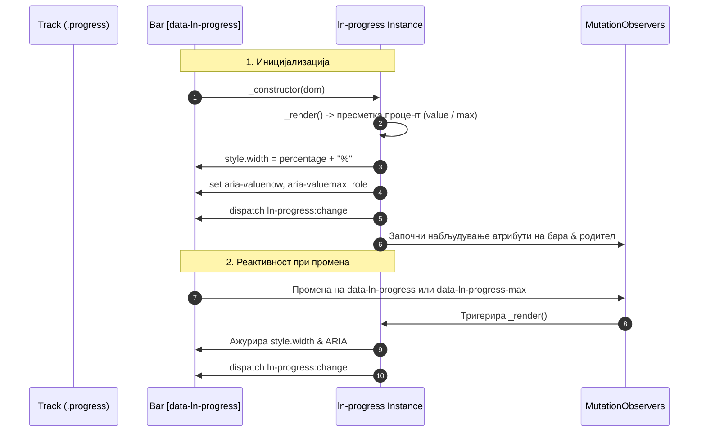

# ➖ ln-progress

> **Класификација:** 🟢 Едноставна компонента / Пасивен Векторски Рендерер (Layer 1 - Data Visualization)  
> **Изворен код:** [`js/ln-progress/src/ln-progress.js`](../../js/ln-progress/src/ln-progress.js)

---

## 1. Заднинско дејство и одговорност

- **Краток опис:** `ln-progress` е пасивна визуелна компонента (~85 линии JS) која овозможува приказ и реактивно ажурирање на линеарен прогрес (progress bar).
- **Декларативен принцип (Атрибутот е состојба):** Не постојат императивни методи за менување вредност (како `setValue()`). Корисникот го менува атрибутот `data-ln-progress="N"`, а внатрешниот `MutationObserver` автоматски ги пресметува ширината (`style.width = "%"`) и ARIA својствата.
- **Херархиска координација (Parent-Child Max Inheritance):** Поддржува поставување на `data-ln-progress-max` на родителскиот контејнер (`.progress`), овозможувајќи повеќе сегментирани (stacked) прогрес барови да споделуваат заеднички именител. Внатрешен `MutationObserver` ги следи промените на родителот.
- **Нативна ARIA рефлексија:** При секој рендер автоматски се поставуваат и одржуваат ARIA атрибутите: `role="progressbar"`, `aria-valuemin="0"`, `aria-valuemax` и `aria-valuenow` (стисната во опсегот `[0, max]`).
- **Само-иницијализација:** Автоматски се иницијализира преку `registerComponent` од [`ln-core`](../../js/ln-core/src/ln-core.js) над сите елементи што го содржат атрибутот `[data-ln-progress]`.
- **Ортогоналност (Што компонентата НЕ прави):**
  - **НЕ ги менува или ограничува DOM атрибутите:** Го менува само пресметаниот процент во `style.width`. Суровата вредност во `data-ln-progress` останува недопрена.
  - **НЕ управува со indeterminate / pulsing состојби:** За анимирани индикатори без дефиниран крај се користи [`@mixin loader`](../../scss/config/mixins/_loader.scss).
  - **НЕ врши тропање (throttling/debounce):** Секој упис на атрибутот веднаш тригерира рендер и настан.
  - **НЕ прикажува текстуален процент во DOM:** Се грижи исклучиво за ширината на обоената линија.

---

## 2. Минимален HTML Маркап и Варијанти на Употреба

```html
<!-- Базен HTML маркап: Стандарден линеарен прогрес -->
<div class="progress">
    <div data-ln-progress="75" class="success"></div>
</div>

<!-- Варијанта 1: Прилагоден максимум на ниво на бара -->
<div class="progress">
    <div data-ln-progress="7.5" data-ln-progress-max="10" class="warning"></div>
</div>

<!-- Варијанта 2: Сегментирани (stacked) барови со заеднички максимум на родителот -->
<div class="progress" data-ln-progress-max="7">
    <div data-ln-progress="4" class="success" aria-label="Завршени"></div>
    <div data-ln-progress="2" class="warning" aria-label="Во тек"></div>
    <div data-ln-progress="1" class="error" aria-label="На чекање"></div>
</div>
```

---

## 3. Декларативен API Договор (Атрибути и Настани)

### Атрибути

| Атрибут | Елемент | Тип | Стандардна вредност | Опис |
| :--- | :--- | :--- | :--- | :--- |
| `data-ln-progress` | Бара (`div`) | `Number / Float` | `0` | Тековна вредност на прогресот. Визуелната ширина се стиска во опсег `[0%, 100%]`. |
| `data-ln-progress-max` | Бара (`div`) | `Number / Float` | `100` | Максимална вредност (именител) за поединечната бара. |
| `data-ln-progress-max` | Обвиткувач (`.progress`) | `Number / Float` | — | Заеднички максимум за сите деца-барови. Има приоритет пред `data-ln-progress-max` на барата. |

#### Приоритет на разрешување на максимум (`max`):
1. `data-ln-progress-max` на родителскиот обвиткувач (доколку е валиден број > 0).
2. `data-ln-progress-max` на самата бара (доколку е валиден број > 0).
3. Стандардна вредност `100`.

### Настани (Events API)

| Настан | Payload `e.detail` | Опис |
| :--- | :--- | :--- |
| `ln-progress:change` | `{ target: HTMLElement, value: Number, max: Number, percentage: Number }` | Се емитува при иницијализација и при секоја промена на вредноста или максимумот. |

### Програмерски JS API (`el.lnProgress`)

| Својство / Метод | Тип | Опис |
| :--- | :--- | :--- |
| `el.lnProgress.dom` | `HTMLElement` | Референца кон DOM елементот. |
| `el.lnProgress.destroy()` | `Function` | Ги исклучува `MutationObserver` набљудувачите и ја отстранува `lnProgress` референцата. |

---

## 4. CSS Стилизирање и Поведенски Концепт

Визуелниот слој е одвоен од JS логиката преку SCSS миксини од дизајн системот:

```scss
// Примена на SCSS миксини
.progress {
    @include progress;
}

[data-ln-progress] {
    &.success { @include progress-success; }
    &.warning { @include progress-warning; }
    &.error   { @include progress-error; }
}
```

* **`@mixin progress`** ([`scss/config/mixins/_progress.scss`](../../scss/config/mixins/_progress.scss)): Го дефинира обвиткувачот (track) со висина, заоблени агли, позадина (`var(--bg-recessed)`) и flex приказ. Ја дефинира и глатката анимација на ширината (`transition: width var(--transition-base)`).
* **Статусни бои:** Класите `.success`, `.warning`, `.error` дефинираат HSL бои за различните состојби (во [`scss/components/_progress.scss`](../../scss/components/_progress.scss)).

---

## 5. Пристапност (ARIA) и Чести Грешки

* **Пристапност:** Автоматски се поставуваат `role="progressbar"`, `aria-valuenow`, `aria-valuemin` и `aria-valuemax`. Развивачот треба да додаде `aria-label` или `aria-labelledby` на барата за контекст на екрански читачи.
* **Честа грешка 1: Рачно поставување на `style="width: ..."` во HTML:** Внатрешниот `_render` веднаш го пребришува `style.width`. Вредноста мора да се дефинира преку `data-ln-progress`.
* **Честа грешка 2: Поставување на `data-ln-progress` на обвиткувачот:** Атрибутот `data-ln-progress` мора да се постави на внатрешната бара, додека обвиткувачот ја носи класата `.progress`.
* **Честа грешка 3: Изоставување на `data-ln-progress-max` кај сегментирани барови:** Доколку повеќе барови се стават во еден обвиткувач без максимум на родителот, сите користиат `max="100"` и нема пропорционално да го пополнат родителот.
* **Честа грешка 4: Очекување автоматска промена на бои според праг:** Компонентата не ги менува класите `.success`/`.warning` автоматски според вредноста; тоа е одговорност на надворешниот JS код.

---

## 6. Дијаграм на Текот и Животен Циклус



---

## 7. Поврзани Компоненти

- [`ln-circular-progress.md`](./ln-circular-progress.md) — Кружен прогрес индикатор за графикони и контролни табли.
- [`ln-stat.md`](./ln-stat.md) — Виџети за статистички приказ кои често содржат прогрес барови.
