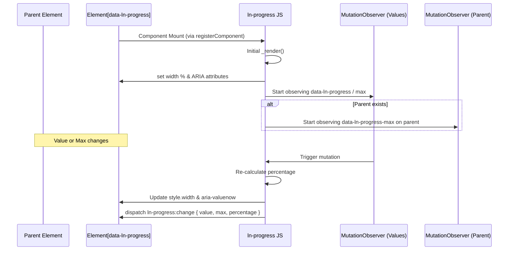

# ➖ ln-progress
> **Класификација:** 🟢 Едноставна компонента (Layer 1 - Data Visualization)

---

## 1. Заднинско дејство и одговорност
- **Краток опис:** `ln-progress` е едноставна визуелна компонента која се користи за приказ на линеарен прогрес (progress bar) на екранот.
- **Главна Одговорност:** Динамички ја менува ширината (`width` во проценти) на соодветниот прогрес елемент врз основа на моменталниот сооднос на вредноста и нејзиниот максимум.
- **Декларативно Врзување (Attribute Bridge):** Користи внатрешни `MutationObserver` механизми за да ги следи промените на атрибутите `data-ln-progress` и `data-ln-progress-max`.
- **Херархиска Координација (Parent-Child Inheritance):** Компонентата поддржува читање на максимум вредноста (`max`) директно од родителскиот контејнер (доколку има поставено `data-ln-progress-max` на него) и соодветно го следи родителот со `MutationObserver`.
- **Автоматска Пристапност (Native ARIA Reflection):** При секое рендерирање, компонентата нативно ги додава и ажурира ARIA својствата на елементот (`role="progressbar"`, `aria-valuenow`, `aria-valuemin`, `aria-valuemax`) со што ги олеснува најавите на екранските читачи без потреба од рачна интервенција на развивачот.
- **Само-иницијализација:** Регистрирана преку глобалниот `registerComponent` систем од `ln-core`, која го набљудува `document.body` и автоматски ги иницијализира/уништува елементите кои го содржат селекторот `[data-ln-progress]`.
- **Ортогоналност (Што компонентата НЕ прави):**
  * Не содржи бизнис логика за пресметување на напредокот или вредностите.
  * Не прикажува текстуален приказ на процентот во самиот DOM (за тоа се грижи корисничкиот HTML или `ln-circular-progress`).
  * Не управува со анимации за indeterminate состојби (shimmer/stripes) - за тоа се користи `@mixin loader`.
  * Не го стилизира директно надворешниот обвиткувач (track) освен што очекува соодветна структура за процентуално рендерирање.

---

## 2. Минимален HTML Маркап и Варијанти на Употреба

```html
<!-- Стандардна самостојна варијанта -->
<div class="progress">
    <div data-ln-progress="35" data-ln-progress-max="100" class="success"></div>
</div>

<!-- Родителска конфигурација (корисно кај групирани прогрес барови) -->
<div class="progress" data-ln-progress-max="150">
    <div data-ln-progress="75" class="warning"></div>
</div>
```

---

## 3. Декларативен API Договор (Атрибути и Настани)

| Атрибут | Тип | Опис |
| :--- | :--- | :--- |
| `data-ln-progress` | `Float` | Го активира компонентот. Ја означува тековната вредност на прогресот. |
| `data-ln-progress-max` | `Float` | Максималната можна вредност (може да биде поставен на самиот елемент или на неговиот родител. default: 100). |

### Настани (Емитува)
| Настан | Payload `e.detail` | Опис |
| :--- | :--- | :--- |
| `ln-progress:change` | `{ target: Node, value: Float, max: Float, percentage: Float }` | Се емитува при секоја промена на вредноста или максималната граница на прогресот. |

---

## 4. CSS Стилизирање и Поведенски Концепт
Како линеарен прогрес бар, потребен е родителски обвиткувач со позадина, додека прогрес елементот ја менува својата ширина.

```scss
// SCSS стилизирање преку миксини на дизајн системот
.progress {
    @include progress;
}

[data-ln-progress].success {
    @include progress-success;
}

[data-ln-progress].warning {
    @include progress-warning;
}

[data-ln-progress].error {
    @include progress-error;
}
```

* **`@mixin progress`** (во `scss/config/mixins/_progress.scss`): Го дефинира обвиткувачот (track) со соодветна висина, позадина (`var(--bg-recessed)`), заобленост и flex приказ за поддршка на сегментирани (stacked) барови. Исто така ја конфигурира анимацијата на ширината на внатрешните прогрес елементи (`transition: width var(--transition-base)`).
* **`@mixin progress-success` / `progress-warning` / `progress-error`**: Ги дефинираат соодветните HSL позадински бои на статусните барови.

---

## 5. Пристапност (ARIA) и Чести Грешки
*   **Пристапност:** Бидејќи `ln-progress` автоматски ги поставува атрибутите `role="progressbar"`, `aria-valuenow`, `aria-valuemin` и `aria-valuemax`, развивачот нема потреба дополнително да ги кодира овие ARIA својства во својот HTML. За најдобра практика, доколку прогресот е дел од некоја подолга операција, поставете `aria-label` или `aria-labelledby` за да ја објасните целта на прогресот.
*   **Честа грешка 1:** Ставање на `data-ln-progress` директно на обвиткувачот со позадина `.progress`. Ова ќе ја направи позадината да се скрати до соодветниот процент. Правилно е секогаш да имате надворешен обвиткувач `.progress`, а прогрес атрибутот да биде на внатрешниот обоен елемент.
*   **Честа грешка 2:** Непоставување на `data-ln-progress-max` на родителот пред иницијализацијата. *Забелешка:* Иако претходните верзии имаа такво ограничување, во актуелната верзија `_listenParent` го набљудува родителот за динамички промени во секое време, па доколку родителот го добие овој атрибут динамички подоцна, промената ќе биде соодветно рефлектирана.

---

## 6. Дијаграм на Текот и Животен Циклус



---

## 7. Поврзани Компоненти
*   **[`ln-circular-progress`](./ln-circular-progress.md)**: Кружен прогрес индикатор кој се користи за визуелизација во кружна форма (пр. кај графикони или контролни табли).
